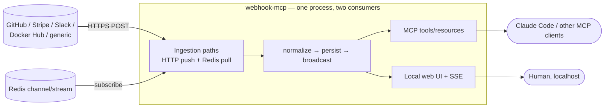

# ADR-000: Project Naming and Scope Confirmation

## Context and Problem Statement

This repository is being bootstrapped from a design-discussion handoff under the working name `webhook-mcp`, which the brief explicitly flagged as a placeholder to confirm or replace in this ADR. Before any specs or code are written, two things need to be pinned down so later documents (and the follow-up implementation session) have a stable foundation: **what is this project called**, and **what is in and out of scope** — both for the MVP as a whole and for *this* documentation-only session. What name best communicates the project's purpose while fitting the existing StumpCloud repo conventions, and what boundary keeps the MVP shippable?

## Decision Drivers

* **Convention fit.** StumpCloud repos for MCP servers already follow a `<domain>-mcp` pattern (e.g. `paperless-mcp`). A name that matches is instantly legible to anyone browsing the Gitea org.
* **Descriptiveness over cleverness.** The name should say what the thing is. This is a receiver for inbound webhooks exposed over MCP — a reader should not need a glossary.
* **Discoverability.** The name is typed into `git clone`, MCP client config, and search. Short, lowercase, hyphenated, no ambiguity with existing repos.
* **Scope legibility.** The brief is explicit that this is a *docs-only* session and that the MVP is deliberately narrow (single-node, receive-only). The naming ADR is the natural place to also ratify that boundary so it is not silently widened later.
* **Reversibility.** A rename is cheap now (no code, no published package, no MCP clients pointed at it) and expensive later. If a rename is going to happen, it happens here.

## Considered Options

* **Option 1 — `webhook-mcp` (keep the working name).**
* **Option 2 — a more evocative brand name** (e.g. `hooklog`, `inbound`, `catchall`, `relayd`, `hookpost`).
* **Option 3 — a scope-narrowing name** (e.g. `webhook-receiver-mcp`, `inbound-webhooks-mcp`).

## Decision Outcome

Chosen option: **"Option 1 — keep `webhook-mcp`"**, because it matches the established `<domain>-mcp` StumpCloud convention (`paperless-mcp`), states exactly what the project is (a webhook receiver exposed as an MCP server), and carries no cleverness tax. The evocative names (Option 2) trade legibility for personality this internal tool does not need, and the scope-narrowing names (Option 3) are longer without adding real information — "webhook" already implies inbound in this context, and "receiver" is redundant with what an MCP webhook server obviously does.

### Scope confirmation

This ADR also ratifies the scope the rest of the documents assume:

**In scope for the MVP** (realized across the next session's implementation):

* Receive and persist webhooks from at least two *signed* providers end-to-end (GitHub + one other) to prove the abstraction.
* Prove all three trust models: one signed provider, the generic/unverified endpoint (Docker Hub routed through it), and the Redis queue consumer (see [ADR-003](ADR-003-per-provider-ingestion-and-trust-model.md)).
* MCP tool surface exposing webhook history / detail / replay (see [ADR-005](ADR-005-mcp-tool-and-resource-contract.md)).
* A local-only, 4-screen web UI updating live via SSE.
* SQLite persistence, no external database (see [ADR-002](ADR-002-sqlite-persistence-and-retention.md)).

**Out of scope for the MVP:**

* Outbound webhook delivery/retries to other systems (the `replay` tool re-emits on demand; it is not a delivery scheduler).
* Multi-user auth / RBAC on the web UI — localhost-bound for now, behind Caddy `forward_auth` if ever exposed (see [ADR-001](ADR-001-web-stack-starlette-htmx-pico.md) and README).
* Horizontal scaling / multi-instance — single node, single process.
* Provider-side webhook management (registering/creating webhooks via provider APIs) — the MVP only receives what is pointed at it.

**In scope for *this* session (docs only):**

* The seven ADRs (ADR-000 … ADR-006).
* The three specs: `docs/specs/openapi.yaml`, `docs/specs/asyncapi.yaml`, `docs/specs/mcp-tools.md`.
* Repo + CI scaffolding (see [ADR-006](ADR-006-gitea-primary-github-mirror-and-ci.md)).

**Explicitly deferred to the follow-up session:** all application code under `app/` beyond empty `__init__.py` placeholders. Implementation is written *fresh from these documents* rather than the documents being retrofitted to code.

### Consequences

* Good, because the name needs no explanation and sorts naturally alongside `paperless-mcp` in the Gitea org.
* Good, because ratifying the MVP boundary here gives every downstream ADR and spec a single, citable scope statement.
* Good, because the rename question is closed — the next session will not waste cycles second-guessing the name.
* Neutral, because `webhook-mcp` is generic enough that a future public release might want a distinct brand; that is a cheap rename to make later if the project ever leaves the homelab.
* Bad, because "webhook" slightly undersells the Redis pull path (which is a queue consumer, not an HTTP webhook) — mitigated by treating Redis as a fourth *ingestion path* into the same pipeline, documented in [ADR-003](ADR-003-per-provider-ingestion-and-trust-model.md), not as a webhook provider.

### Confirmation

* The repo is created on Gitea as `joestump/webhook-mcp` (see [ADR-006](ADR-006-gitea-primary-github-mirror-and-ci.md)).
* Every subsequent ADR and spec in this session refers to the project as `webhook-mcp` and cites the scope statement above rather than re-deriving it.
* No file under `app/` beyond `__init__.py` placeholders exists at the end of this session.

## Pros and Cons of the Options

### Option 1: `webhook-mcp` (chosen)

* Good, because it matches the `<domain>-mcp` convention already used in the org.
* Good, because it is self-documenting: webhook + MCP server.
* Good, because it is short and unambiguous to type and search.
* Neutral, because it is generic — fine for an internal tool, less distinctive for a hypothetical public release.

### Option 2: Evocative brand name (`hooklog`, `relayd`, `catchall`, …)

* Good, because it is memorable and has personality.
* Bad, because it hides the "MCP server" half of the identity, which is the whole point of the project.
* Bad, because it breaks the `<domain>-mcp` convention, making the repo harder to place at a glance.
* Bad, because several candidates (`relayd`, `catchall`) imply *forwarding/relaying*, which is an explicit non-goal for the MVP.

### Option 3: Scope-narrowing name (`webhook-receiver-mcp`, `inbound-webhooks-mcp`)

* Good, because it is maximally explicit that this receives rather than sends.
* Bad, because it is longer to type without adding information the context does not already supply.
* Bad, because "receiver" is redundant — an inbound webhook MCP server is understood to receive.

## Architecture Diagram

## More Information

* Working name confirmed from the project brief §1 and the "rename if a better name lands during ADR-000" instruction.
* Scope statement consolidates brief §2 (goals/non-goals) and the §5/§13 "docs-only this session" instruction.
* Related decisions: [ADR-001](ADR-001-web-stack-starlette-htmx-pico.md) (stack), [ADR-003](ADR-003-per-provider-ingestion-and-trust-model.md) (trust models), [ADR-005](ADR-005-mcp-tool-and-resource-contract.md) (MCP surface), [ADR-006](ADR-006-gitea-primary-github-mirror-and-ci.md) (repo/CI).
