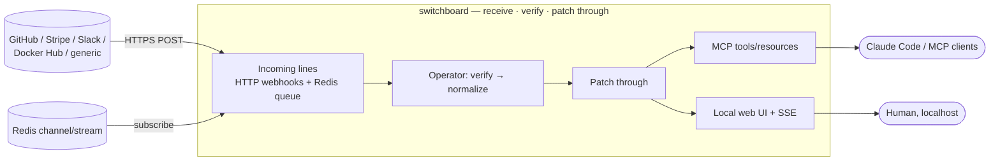

# ADR-000: Project Naming and Scope Confirmation

## Context and Problem Statement

Before the specs solidify around a name, two things need pinning down: **what this project is called**, and **what is in and out of scope**. `switchboard` began under the placeholder name `webhook-mcp`; this ADR settles the permanent name and ratifies the scope the rest of the documents assume. What name best captures what this system *is* — a hub that receives inbound lines from many sources and patches each one through to where it needs to go — while staying legible in the StumpCloud org?

## Decision Drivers

* **Name the metaphor, not the mechanism.** This system receives inbound connections (webhooks over HTTP, events off a Redis queue) from many sources, verifies them, and patches each through to its destinations (MCP clients, the web UI). That *is* a switchboard. A name that captures the metaphor communicates the whole architecture at a glance.
* **Accurate *and* memorable.** The best name is both. A purely descriptive name (`webhook-mcp`) is legible but forgettable; a purely evocative name risks hiding what the thing does. "Switchboard" is the rare name that is both precise and vivid.
* **The interface is not the identity.** MCP is *one* of the surfaces this exposes (the other is a web UI), and the ingestion side speaks HTTP webhooks *and* a Redis queue. Baking `-mcp` or `webhook` into the name overweights one facet of a multi-surface system.
* **Discoverability.** Short, lowercase, unambiguous — typed into `git clone`, MCP client config, and search.
* **Scope legibility.** The naming ADR is the natural place to also ratify the MVP/session boundary so it is not silently widened later.
* **Reversibility.** A rename is cheap now (fresh repo, no external consumers) and expensive later. If a rename happens, it happens here.

## Considered Options

* **Option 1 — `webhook-mcp` (keep the placeholder).**
* **Option 2 — `switchboard` (name the metaphor).**
* **Option 3 — a hyphenated descriptive name** (`webhook-receiver-mcp`, `inbound-webhooks-mcp`).

## Decision Outcome

Chosen option: **"Option 2 — `switchboard`."** An operator switchboard is precisely this system's job: many incoming lines arrive at one place, an operator verifies each caller, and patches the line through to its destination. Here the "lines" are webhooks and queue events, the "operator" is the per-provider verification and normalization layer ([ADR-003](ADR-003-per-provider-ingestion-and-trust-model.md)), and the "destinations" are the MCP tools/resources ([ADR-005](ADR-005-mcp-tool-and-resource-contract.md)) and the live web UI. The name is both accurate and memorable, which is rare enough to be worth choosing over the literal-but-forgettable placeholder.

This reverses the instinct to default to the `<domain>-mcp` convention (`paperless-mcp`): that convention optimizes for legibility, but `switchboard` delivers legibility *through* metaphor while also being distinctive. The `-mcp` suffix is dropped deliberately — MCP is one interface this project exposes, not its identity (it also serves a web UI and consumes a Redis queue). The descriptive hyphenated names (Option 3) are longer without adding information the metaphor doesn't already carry.

The metaphor also gives the project a coherent **visual identity**: the UI palette and docs-site theme draw on the era of manual telephone exchanges — brass, bakelite, operator-cream, oxblood, and patch-cable tones (see [ADR-001](ADR-001-web-stack-go-htmx-pico.md) and `static/tokens.css`).

### Scope confirmation

This ADR also ratifies the scope the rest of the documents assume:

**In scope for the MVP:**

* Receive and persist events from at least two *signed* providers end-to-end (GitHub + one other) to prove the abstraction.
* Prove all three trust models: one signed provider, the generic/unverified endpoint (Docker Hub routed through it), and the Redis queue consumer ([ADR-003](ADR-003-per-provider-ingestion-and-trust-model.md)).
* MCP tool surface exposing history / detail / replay ([ADR-005](ADR-005-mcp-tool-and-resource-contract.md)).
* A local-only, 4-screen web UI updating live via SSE.
* PostgreSQL persistence and retention ([ADR-002](ADR-002-postgres-persistence-and-retention.md)).

**Out of scope for the MVP:**

* Outbound webhook delivery/retries (the `replay` tool re-emits on demand; it is not a delivery scheduler).
* Multi-user auth / RBAC on the web UI — localhost-bound, behind Caddy `forward_auth` if ever exposed ([ADR-001](ADR-001-web-stack-go-htmx-pico.md)).
* Standing up PostgreSQL's own HA/replication — the app tier can run multiple instances against one PostgreSQL ([ADR-002](ADR-002-postgres-persistence-and-retention.md)), but operating Postgres in HA is deferred.
* Provider-side webhook management (registering webhooks via provider APIs).

**The canonical design record** is the ADRs (`docs/adr/`) and specs (`docs/specs/`) under `docs/`, plus the repo + CI scaffolding ([ADR-006](ADR-006-gitea-primary-github-mirror-and-ci.md)).

**Application code** is written *fresh from these documents*; there is none yet beyond empty `__init__.py` placeholders under `app/`.

### Consequences

* Good, because the name encodes the architecture — a reader who knows what a switchboard is already understands the system's shape.
* Good, because it is distinctive and memorable while remaining accurate, and it seeds a coherent visual identity (the throwback theme).
* Good, because dropping `-mcp` keeps the name honest about a multi-surface system (MCP + web UI + Redis).
* Neutral, because it breaks the `<domain>-mcp` naming convention used elsewhere in the org — an acceptable trade for a name this apt.
* Bad, because "switchboard" is a common word and could collide with other projects/namespaces — mitigated by it living under the `joestump/` namespace and being an internal tool.
* Bad, because a reader unfamiliar with manual telephone exchanges may not get the metaphor immediately — mitigated by the README's one-line framing.

### Confirmation

* The repo is `joestump/switchboard` on Gitea (primary) and GitHub (mirror) ([ADR-006](ADR-006-gitea-primary-github-mirror-and-ci.md)).
* Every subsequent ADR and spec refers to the project as `switchboard` and cites the scope statement above.
* The MCP server name, the resource URI scheme (`switchboard://`), the OpenBao secret path (`secret/switchboard/*`), and the distribution name are all `switchboard`.
* No file under `app/` beyond `__init__.py` placeholders exists at the end of this session.

## Pros and Cons of the Options

### Option 1: `webhook-mcp` (rejected)

* Good, because maximally descriptive and matches the `<domain>-mcp` convention.
* Good, because self-documenting at a glance.
* Bad, because forgettable, and it overweights the MCP interface while underselling the web UI and the Redis ingestion path.

### Option 2: `switchboard` (chosen)

* Good, because it names the metaphor — receive many lines, verify, patch each through — which *is* the architecture.
* Good, because accurate and memorable at once, and it grounds a distinctive visual identity.
* Good, because interface-agnostic: it does not privilege MCP over the UI or HTTP over the queue.
* Neutral, because it departs from the `-mcp` convention.
* Bad, because it is a common word (namespace-collision risk) — mitigated by the `joestump/` namespace.

### Option 3: `webhook-receiver-mcp` / `inbound-webhooks-mcp` (rejected)

* Good, because unambiguous that it receives.
* Bad, because longer without adding information, and still interface-biased toward webhooks/MCP.

## Architecture Diagram

## More Information

* The `webhook-mcp` working name is from the project brief §1; the "rename if a better name lands during ADR-000" instruction is honored here by choosing `switchboard`.
* Scope statement consolidates brief §2 (goals/non-goals) and the §5/§13 "docs-only this session" instruction.
* Visual identity (throwback switchboard-era palette): [ADR-001](ADR-001-web-stack-go-htmx-pico.md), `static/tokens.css`.
* Related decisions: [ADR-001](ADR-001-web-stack-go-htmx-pico.md), [ADR-003](ADR-003-per-provider-ingestion-and-trust-model.md), [ADR-005](ADR-005-mcp-tool-and-resource-contract.md), [ADR-006](ADR-006-gitea-primary-github-mirror-and-ci.md).
