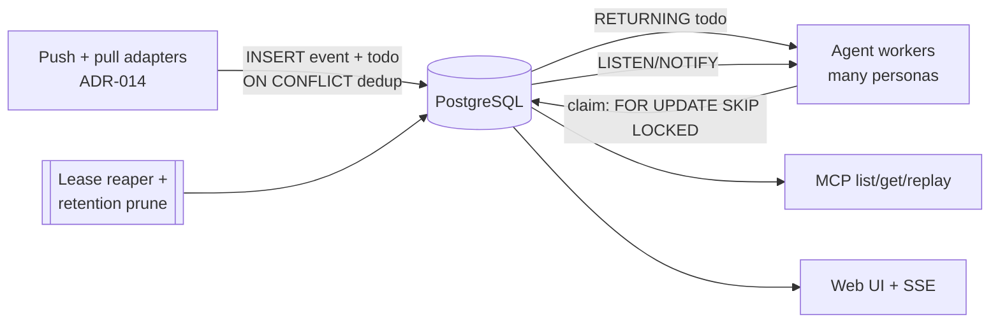

# ADR-002: PostgreSQL as the Persistence Layer — Schema, Queue Mechanics, and Retention

## Context and Problem Statement

`switchboard` is a **self-hosted, multi-tenant service** (one deployment serving many humans and agents): it verifies inbound events, turns them into a **durable todo work-queue** that many agent workers drain concurrently ([ADR-007](ADR-007-todos-as-core-primitive.md)), and holds the relational metadata behind that — human accounts, registered agents, vended endpoints, friend edges, routing rules — plus an event history the MCP tools (`list`/`get`/`replay`) and web UI read. The hot path is no longer an append-mostly log; it is a **concurrent job queue** (claim → lease → complete/retry) with competing consumers, at-least-once + idempotent dedup, and transactional coupling to ingestion (a pull adapter must store a todo before it acks its source, [ADR-014](ADR-014-ingestion-adapters-push-pull.md)). Redis appears in the architecture only as an *ingestion transport* (a queue the app consumes), never as the system of record ([ADR-003](ADR-003-per-provider-ingestion-and-trust-model.md)/[ADR-014](ADR-014-ingestion-adapters-push-pull.md)). What datastore serves a concurrent multi-worker queue and the tenant metadata correctly, gives the right claim primitive, and supports availability/HA when you want it — and what schema/retention strategy should the specs and code build against?

## Decision Drivers

* **Concurrent claimers, no herd.** Many agent personas drain the same pool queue at once. Claiming a work-item must be a true concurrent operation — one claimant per todo, others skip to the next — not a global write lock serializing every worker.
* **Transactional dedup and store-then-ack.** Idempotency-key dedup ([ADR-007](ADR-007-todos-as-core-primitive.md)) and the pull-adapter "store the todo, *then* ack the source" rule ([ADR-014](ADR-014-ingestion-adapters-push-pull.md)) both want an atomic upsert with a clear conflict outcome.
* **Availability, when you want it.** More than one app node and a real durability/failover story should be *possible* — not blocked by a single file on a single host. A minimal deploy is one binary + one Postgres; Postgres just doesn't cap you there.
* **Cheap queue scans.** "Give me the next pending todo on this queue" runs constantly; it must hit a small, hot index, not scan a table dominated by terminal rows.
* **In-DB wakeups.** A lightweight pub/sub inside the datastore lets a worker or the web UI be nudged on new work without polling, complementing the Channels push ([ADR-013](ADR-013-channels-push-delivery.md)) and the UI's SSE.
* **Rich column types.** JSON payloads/scopes and verb allowlists want first-class JSON and array types, and partial/expression indexes.
* **Config-injected secrets; minted secrets hashed here.** The datastore's connection string (DSN) is injected via environment/deployment config, never committed; no signing secret ever lands in an event row ([ADR-003](ADR-003-per-provider-ingestion-and-trust-model.md)); and switchboard-minted credentials/secrets are stored **hashed** in this database.
* **Bounded growth.** An always-on receiver plus a busy queue accrue rows forever unless terminal todos and old events are pruned.

## Considered Options

* **Storage engine:** **PostgreSQL** · SQLite · a dedicated broker (Kafka/NATS/RabbitMQ) in front of a relational store · Redis as the system-of-record.
* **Access layer:** raw SQL over `pgx` (a thin data-access module) · a heavy ORM.
* **Retention policy:** none · age-only · row-cap only · **hybrid age + row-cap** (with optional time-partitioning for the event log).

## Decision Outcome

Chosen options: **PostgreSQL**, accessed through **raw SQL over `pgx` (a thin data-access module, no heavy ORM)**, with **`FOR UPDATE SKIP LOCKED` for todo claims**, **`INSERT … ON CONFLICT` for idempotent dedup**, **partial indexes on the hot queue predicate**, optional **`LISTEN`/`NOTIFY` wakeups**, and a **hybrid retention policy (max-age *and* max-row cap)** enforced by a periodic pruning task.

- **PostgreSQL over SQLite:** SQLite is single-writer and single-node — every claim/heartbeat/complete/ingest serializes through one writer, and one file on one host is a SPOF with no shared app tier. For a *multi-tenant, multi-worker queue* that is the wrong shape. Postgres gives concurrent claimers via `SELECT … FOR UPDATE SKIP LOCKED` (the canonical durable-queue primitive), a multi-node app tier against one database, and HA via managed/streaming replication.
- **PostgreSQL over a dedicated broker:** a broker (Kafka/Temporal/etc.) splits the source of truth away from the durable todo that [ADR-007](ADR-007-todos-as-core-primitive.md) deliberately made authoritative, and re-implements lease/dead-letter/dedup that Postgres gives transactionally. `SKIP LOCKED` carries this workload well past its expected scale; a broker is deferred until Postgres demonstrably is not enough — explicitly **not** now.
- **PostgreSQL over Redis-as-ledger:** Redis is the ingestion *transport* ([ADR-014](ADR-014-ingestion-adapters-push-pull.md)); making it the ledger too would split the source of truth and conflate transport with storage.
- **Raw SQL over a heavy ORM:** a thin module of typed functions (`insert_event`, `claim_todo`, `complete_todo`, `create_todo`, `prune`, …) over `pgx` keeps the hot queries auditable and the dependency list short; the queue queries below are hand-tuned SQL, not ORM output.

### Queue mechanics (the hot path)

* **Claim — `FOR UPDATE SKIP LOCKED`.** Concurrent claimants each grab a *different* pending row; none blocks on another:

  ```sql
  UPDATE todos SET state='claimed', owner=$1,
         lease_expires_at = now() + $2::interval, attempt = attempt + 1, claimed_at = now()
  WHERE id = (
    SELECT id FROM todos
    WHERE queue = $3 AND state = 'pending' AND (assignee IS NULL OR assignee = $1)
    ORDER BY created_at
    FOR UPDATE SKIP LOCKED
    LIMIT 1)
  RETURNING *;
  ```
* **Dedup — `ON CONFLICT`.** A partial unique index on `(queue, idempotency_key)` over non-terminal rows makes create idempotent and gives the store-then-ack path ([ADR-014](ADR-014-ingestion-adapters-push-pull.md)) a clean outcome:

  ```sql
  INSERT INTO todos (queue, source, idempotency_key, …) VALUES (…)
  ON CONFLICT (queue, idempotency_key) WHERE state <> 'done' AND state <> 'failed'
  DO NOTHING RETURNING *;   -- empty ⇒ the existing todo already covers this delivery
  ```
* **Lease expiry — a reaper.** A periodic statement returns expired leases to `pending` (or dead-letters at the attempt cap), giving crash-safety ([ADR-007](ADR-007-todos-as-core-primitive.md)):

  ```sql
  UPDATE todos SET state = CASE WHEN attempt >= max_attempts THEN 'failed' ELSE 'pending' END,
         owner = NULL, lease_expires_at = NULL
  WHERE state = 'claimed' AND lease_expires_at < now();
  ```
* **Hot index.** `CREATE INDEX idx_todos_pending ON todos (queue, created_at) WHERE state = 'pending';` — the claim scan touches only live work, not the terminal backlog.
* **Wakeups (optional).** `NOTIFY todo_ready, '<queue>'` on insert lets an idle worker or the web UI be nudged instead of polling — complementary to Channels push ([ADR-013](ADR-013-channels-push-delivery.md)); the durable queue remains the source of truth, so a missed notify only costs latency.

### Schema sketch

A sketch to anchor the specs; the code session owns the final migration DDL. Timestamps are `timestamptz`.

```sql
-- Event log: one row per accepted delivery, across all trust modes (ADR-003).
CREATE TABLE events (
  id            bigint GENERATED ALWAYS AS IDENTITY PRIMARY KEY,
  source        text        NOT NULL,   -- adapter instance: 'github' | 'generic:<name>' | 'redis:<stream>' (ADR-014)
  family        text        NOT NULL,   -- 'webhook' | 'queue' (ADR-003)
  event_type    text,
  external_id   text,                   -- provider/message delivery id for dedupe; NULL if none
  trust_mode    text        NOT NULL,   -- 'signed' | 'token' | 'open' | 'queue' (ADR-003)
  verified      boolean     NOT NULL,
  verify_detail text,
  content_type  text,
  headers       jsonb,                  -- SANITIZED headers (signature/secret headers redacted, ADR-003/004)
  payload       bytea       NOT NULL,   -- raw body exactly as received
  payload_size  integer     NOT NULL,
  source_ip     inet,                   -- HTTP paths; NULL for pull adapters
  received_at   timestamptz NOT NULL DEFAULT now()
);
CREATE INDEX idx_events_source_time ON events (source, received_at DESC);
CREATE INDEX idx_events_type_time   ON events (event_type, received_at DESC);
CREATE UNIQUE INDEX idx_events_dedupe ON events (source, external_id) WHERE external_id IS NOT NULL;

-- Durable todo work-queue (ADR-007; full field list in docs/specs/todos.md).
CREATE TABLE todos (
  id               text PRIMARY KEY,          -- ULID/uuid
  queue            text        NOT NULL,
  source           text        NOT NULL,
  kind             text,
  title            text,
  payload_ref      text,                       -- e.g. 'event:<id>' or a blob key
  payload          jsonb,                      -- small inline payload for producers with no stored event
  idempotency_key  text        NOT NULL,
  assignee         text,                       -- persona/endpoint id; NULL ⇒ pool queue
  state            text        NOT NULL DEFAULT 'pending',  -- pending|claimed|done|failed
  owner            text,
  lease_expires_at timestamptz,
  attempt          integer     NOT NULL DEFAULT 0,
  max_attempts     integer     NOT NULL DEFAULT 5,
  result           jsonb,
  created_at       timestamptz NOT NULL DEFAULT now(),
  updated_at       timestamptz NOT NULL DEFAULT now(),
  claimed_at       timestamptz,
  completed_at     timestamptz
);
CREATE INDEX idx_todos_pending ON todos (queue, created_at) WHERE state = 'pending';
CREATE UNIQUE INDEX idx_todos_dedupe ON todos (queue, idempotency_key) WHERE state <> 'done' AND state <> 'failed';

-- Adapter registry (runtime enable/disable + NON-SECRET config; provider secrets are env/config-injected, never stored plaintext).
CREATE TABLE adapters (
  name       text PRIMARY KEY,             -- 'github' | 'generic:homelab' | 'redis:deploys'
  family     text NOT NULL,                -- 'webhook' | 'queue' (ADR-003; push=webhook, pull=queue per ADR-014)
  trust_mode text NOT NULL,                -- 'signed' | 'token' | 'open' | 'queue' (ADR-003)
  enabled    boolean NOT NULL DEFAULT true,
  config     jsonb,                        -- route path / stream name / signature scheme / secret-status flag
  created_at timestamptz NOT NULL DEFAULT now(),
  updated_at timestamptz NOT NULL DEFAULT now()
);

-- Typed app settings (retention, SSE reconnect, …).
CREATE TABLE settings ( key text PRIMARY KEY, value text NOT NULL );
```

The multi-tenant tables — human accounts, agents, vended endpoints (scope + webhook ceiling), and friend edges — are detailed in the [accounts-and-endpoints spec](../specs/accounts-and-endpoints.md); they live in this same database so a vended endpoint's scope, an agent's owner, and a todo's queue are joinable and enforced transactionally.

### Retention

Defaults seeded into `settings`: `retention_max_age_days = 30`, `retention_max_rows = 500000`, `sse_retry_ms = 3000`. A periodic pruning task deletes events/terminal todos older than the age limit, then trims oldest beyond the row cap, in one transaction. For a high-volume event log, **monthly `PARTITION BY RANGE (received_at)`** turns retention into a cheap `DROP PARTITION` instead of a bulk delete — recommended, left to the code session.

### Consequences

* Good, because `FOR UPDATE SKIP LOCKED` gives true concurrent claimers with no thundering herd — the queue scales with worker count, not against it.
* Good, because dedup, store-then-ack, and multi-row state transitions are all transactional and atomic.
* Good, because a multi-node app tier connects to one database, and HA comes from managed/streaming replication — the availability a serious deployment can want.
* Good, because partial/expression indexes keep the hot queue scan cheap regardless of terminal-row volume, and JSONB/array/`inet` types fit the data.
* Good, because `LISTEN`/`NOTIFY` offers in-DB wakeups without a second dependency.
* Neutral, because it is an operated service (a database to run/patch/back up) — expected for a service you run, and it doubles as the store for switchboard-minted credentials (hashed), so there is no separate secret-manager dependency.
* Bad, because raw SQL means hand-written queries with no compile-time schema check — mitigated by centralizing them in one small, tested data-access module.
* Bad, because raw payload rows can be large — mitigated by retention/partitioning and an optional payload-size cap (deferred).

### Confirmation

* Migrations create `events`, `todos`, `adapters`, `settings` (plus the account/endpoint tables) with the indexes above; a test asserts the schema, the partial dedupe indexes, and the pending-todo partial index.
* A concurrency test asserts N workers claiming one queue each get a distinct todo (no double-claim) and that `SKIP LOCKED` lets them run without blocking each other.
* Tests cover: event round-trip, idempotent create on a repeated `idempotency_key`, lease-expiry re-queue and dead-letter, and pruning by both age and row-cap.
* A test confirms persisted `headers` have signature/secret headers redacted (cross-checks [ADR-003](ADR-003-per-provider-ingestion-and-trust-model.md)).

## Pros and Cons of the Options

### PostgreSQL (chosen)

* Good, because concurrent claimers (`SKIP LOCKED`), transactional dedup/upsert, partial indexes, JSONB/arrays, `LISTEN`/`NOTIFY`, and a real HA/replication story.
* Good, because one database behind a multi-node app tier fits a multi-tenant service (many agents, one deployment).
* Bad, because it is a service to operate — accepted; it matches the hosted posture.

### SQLite (rejected)

* Good, because zero-ops and single-file for a single-node tool.
* Bad, because single-writer serializes the claim hot path, and single-node is a SPOF with no shared app tier — the wrong shape for a central multi-worker queue. No `SKIP LOCKED`; claims would serialize through `BEGIN IMMEDIATE`.

### Dedicated broker + relational store (rejected, for now)

* Good, because purpose-built queue throughput at large scale.
* Bad, because it splits the source of truth from the durable todo ([ADR-007](ADR-007-todos-as-core-primitive.md)) and re-implements lease/dead-letter/dedup Postgres gives transactionally; unjustified at this scale.

### Redis as system-of-record (rejected)

* Good, because already present as an ingestion transport.
* Bad, because it conflates transport with storage and splits the trust/durability boundary ([ADR-003](ADR-003-per-provider-ingestion-and-trust-model.md)/[ADR-014](ADR-014-ingestion-adapters-push-pull.md)).

### Retention: hybrid age + row-cap (chosen)

* Good, because it bounds both time and size; partitioning makes the event log's pruning near-free.
* Bad (age-only / row-cap-only / none), because each leaves either size or history unbounded.

## Architecture Diagram



## More Information

* Todo object and lifecycle this schema backs: [ADR-007](ADR-007-todos-as-core-primitive.md), [todos spec](../specs/todos.md).
* Store-then-ack coupling the transactional insert enables: [ADR-014](ADR-014-ingestion-adapters-push-pull.md), [ingestion-adapters spec](../specs/ingestion-adapters.md).
* Multi-tenant tables (accounts, endpoints, edges): [accounts-and-endpoints spec](../specs/accounts-and-endpoints.md).
* Trust columns and header redaction: [ADR-003](ADR-003-per-provider-ingestion-and-trust-model.md). Read surfaces: [ADR-005](ADR-005-mcp-tool-and-resource-contract.md).
* `pgx`: <https://github.com/jackc/pgx>. `SKIP LOCKED` queue pattern: <https://www.postgresql.org/docs/current/sql-select.html>. `LISTEN`/`NOTIFY`: <https://www.postgresql.org/docs/current/sql-notify.html>.
