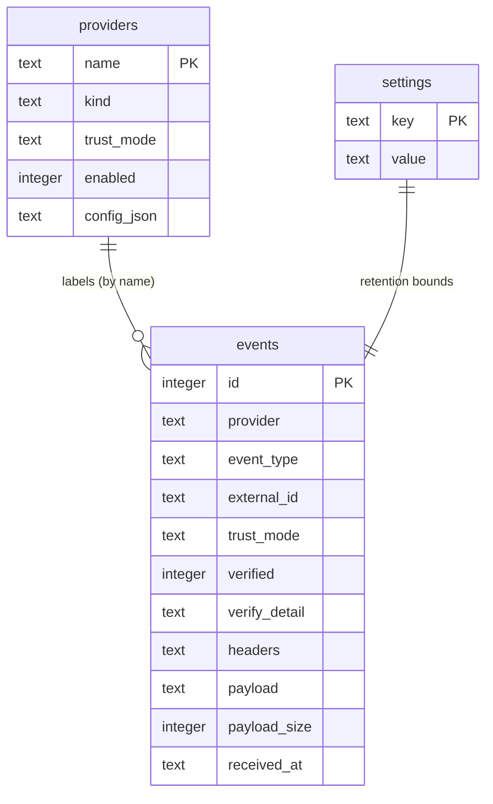
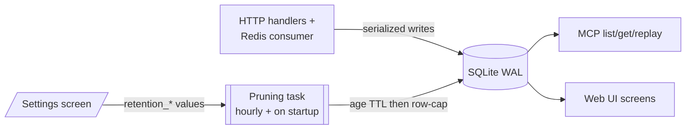

# ADR-002: SQLite as Sole Persistence Layer — Schema Sketch and Retention Strategy

## Context and Problem Statement

`webhook-mcp` must persist every accepted event durably so the MCP tools (`list`/`get`/`replay`) and the web UI can read history, and so a restart loses nothing. The brief mandates SQLite with *no external database dependency* (brief §2, §4) — the whole point is a single-node, single-process homelab tool that runs from one file. Redis appears in the architecture, but only as an *ingestion path* (a queue the app consumes from), never as the system of record (see [ADR-003](ADR-003-per-provider-ingestion-and-trust-model.md)). This ADR pins down the storage engine, a concrete-enough schema for the specs and the code session to build against, and a retention/pruning strategy so an always-on receiver does not grow unbounded. What schema captures a normalized event across all three trust models, and how do we bound growth without operator babysitting?

## Decision Drivers

* **No external DB.** Single-file storage, zero-ops, survives restarts, backs up with a file copy. Mandated by the brief.
* **Async, single process.** The store is accessed from an asyncio event loop (`aiosqlite`) shared by webhook handlers, the Redis consumer, MCP tools, SSE, and the pruning task. Concurrency correctness matters more than raw throughput.
* **One row shape for three trust models.** Signed HTTP, generic/unverified HTTP, and Redis-consumed events must all land in the same table so the pipeline (`normalize → persist → broadcast`) and the read surfaces are uniform. The *differences* (verified vs. unverified, HTTP vs. queue) are columns, not separate tables.
* **Queryability for the MCP tools and UI.** `list_webhook_events(provider?, event_type?, since?, limit?)` and the paginated log screen need indexed filters on provider, type, and time.
* **Idempotency.** Providers retry deliveries; the Redis path can redeliver. Storing the provider's delivery id lets us dedupe.
* **Bounded growth.** An always-on receiver accrues rows forever unless pruned. Retention must be configurable from the Settings screen (brief §6.4) and enforced automatically.
* **No secret leakage into storage.** Headers are persisted for the detail view, but signature values and secrets must be redacted before they hit disk (see [ADR-003](ADR-003-per-provider-ingestion-and-trust-model.md), [ADR-004](ADR-004-secrets-management-openbao-approle.md)).

## Considered Options

* **Storage engine:** SQLite via `aiosqlite` · PostgreSQL · Redis as system-of-record · flat JSON/NDJSON files.
* **ORM vs. raw SQL:** raw SQL + a thin async wrapper · SQLAlchemy (Core or ORM) · an async micro-ORM.
* **Retention policy:** none (unbounded) · age-based TTL only · row-cap only · **hybrid age + row-cap**.

## Decision Outcome

Chosen options: **SQLite via `aiosqlite`**, accessed through **raw SQL behind a thin async data-access module** (no ORM), with a **hybrid retention policy (max-age TTL *and* max-row cap, whichever bites first)** enforced by a periodic in-process pruning task and configurable from the Settings screen.

- **SQLite over Postgres/Redis/flat files:** Postgres reintroduces the external service the brief exists to avoid. Redis is intentionally *not* the system of record — it is an ingestion transport whose durability guarantees (especially pub/sub) are wrong for an audit log. Flat files give durability but not the indexed queries the list/filter surfaces need. SQLite is a single file, transactional, indexed, and ships with Python.
- **Raw SQL over an ORM:** at this scale (one table plus two tiny config tables) an ORM is more concept than payoff. A thin module exposing typed functions (`insert_event`, `list_events`, `get_event`, `prune`) keeps the query surface auditable and the dependency list short. This matches the brief's "simple, no ORM needed at this scale — raw SQL or a thin wrapper" (§11.2).
- **Hybrid retention:** age-only lets a burst blow past disk limits within the window; row-cap-only silently drops history during quiet periods even when there is plenty of room. Enforcing *both* — delete anything older than `retention_max_age_days`, then if still over `retention_max_rows` delete oldest until under — bounds both time and size predictably.

### SQLite pragmas and concurrency

The connection layer sets, at open time: `journal_mode=WAL` (concurrent readers alongside one writer), `foreign_keys=ON`, `busy_timeout=5000` (ms), and `synchronous=NORMAL` (safe under WAL, faster than FULL). Writes are funneled through a single serialized path so the multiple producers (HTTP handlers, Redis consumer) never contend as concurrent writers; readers (UI, MCP tools) run in parallel. A periodic `PRAGMA wal_checkpoint(TRUNCATE)` and an occasional `VACUUM` after large prunes keep the file from bloating.

### Schema sketch

This is a *sketch* to anchor the specs; the code session owns the final migration DDL. Timestamps are ISO-8601 UTC strings (SQLite has no native datetime; text sorts correctly and is human-readable in the UI).

```sql
-- The event log: one row per accepted event, across all three trust models.
CREATE TABLE events (
  id            INTEGER PRIMARY KEY AUTOINCREMENT,
  provider      TEXT    NOT NULL,   -- 'github' | 'stripe' | 'slack' | 'generic:<name>' | 'redis:<channel>'
  event_type    TEXT,               -- provider-declared type ('push', 'payment_intent.succeeded'); NULL if unknown
  external_id   TEXT,               -- provider delivery id (X-GitHub-Delivery, Stripe event id, …) for dedupe; NULL if none
  trust_mode    TEXT    NOT NULL,   -- 'signed' | 'unverified' | 'redis'  (see ADR-003)
  verified      INTEGER NOT NULL,   -- 0/1 — 1 ONLY for signed providers whose signature passed
  verify_detail TEXT,               -- human string: 'hmac-sha256 ok' | 'unverified by design' | 'redis acl: <user>'
  content_type  TEXT,
  headers       TEXT,               -- JSON object of SANITIZED request headers (signature/secret headers redacted)
  payload       TEXT    NOT NULL,   -- raw body exactly as received
  payload_size  INTEGER NOT NULL,   -- bytes of the raw body
  source_ip     TEXT,               -- remote address for HTTP paths; NULL for redis
  received_at   TEXT    NOT NULL    -- ISO-8601 UTC, e.g. '2026-07-05T18:03:21.442Z'
);

CREATE INDEX idx_events_provider_time ON events (provider, received_at DESC);
CREATE INDEX idx_events_type_time     ON events (event_type, received_at DESC);
CREATE INDEX idx_events_received_at   ON events (received_at DESC);
-- Idempotency: at most one row per (provider, delivery id) when the provider supplies one.
CREATE UNIQUE INDEX idx_events_dedupe ON events (provider, external_id) WHERE external_id IS NOT NULL;

-- Provider registry: runtime-mutable enable/disable + NON-SECRET config. Secrets live in OpenBao (ADR-004), never here.
CREATE TABLE providers (
  name        TEXT PRIMARY KEY,     -- 'github' | 'generic:homelab' | 'redis:deploys'
  kind        TEXT NOT NULL,        -- 'signed' | 'generic' | 'redis'
  trust_mode  TEXT NOT NULL,        -- 'signed' | 'unverified' | 'redis'
  enabled     INTEGER NOT NULL DEFAULT 1,
  config_json TEXT,                 -- non-secret: route path, redis channel, signature scheme id, secret-status flag
  created_at  TEXT NOT NULL,
  updated_at  TEXT NOT NULL
);

-- App settings as a typed key/value table (retention + SSE reconnect, brief §6.4).
CREATE TABLE settings (
  key   TEXT PRIMARY KEY,  -- 'retention_max_age_days' | 'retention_max_rows' | 'sse_retry_ms' | …
  value TEXT NOT NULL
);
```

Rationale for notable columns: `trust_mode` + `verified` + `verify_detail` together make the trust story of every row explicit and displayable, so the UI never has to *infer* whether an event was signed (see [ADR-003](ADR-003-per-provider-ingestion-and-trust-model.md)). `external_id` + the partial unique index give idempotency without forcing a synthetic key on providers that send none. `headers` is stored sanitized so the detail view is useful without leaking secrets. `payload` is stored raw so `replay_webhook_event` can re-emit byte-for-byte (see [ADR-005](ADR-005-mcp-tool-and-resource-contract.md)).

### Retention defaults and enforcement

Defaults seeded into `settings`: `retention_max_age_days = 30`, `retention_max_rows = 50000`, `sse_retry_ms = 3000`. The pruning task runs on startup and then on an interval (e.g. hourly): it deletes rows older than the age limit, then deletes the oldest rows beyond the row cap, in one transaction; a `VACUUM` runs opportunistically after a large delete. All three values are editable from the Settings screen and take effect on the next prune cycle.

### Consequences

* Good, because the entire datastore is one file — copy it to back up, delete it to reset, no service to run.
* Good, because one `events` table serves all three trust models and both read surfaces, keeping the pipeline and specs uniform.
* Good, because indexed filters make the MCP `list` tool and the log screen fast within homelab volumes.
* Good, because hybrid retention bounds both age and size, so the file cannot grow without limit and the operator controls the ceiling from the UI.
* Bad, because SQLite is single-writer — mitigated by WAL + a serialized write path; acceptable because a homelab webhook receiver is not write-bound.
* Bad, because raw SQL means hand-written queries with no compile-time schema checking — mitigated by centralizing them in one small, tested data-access module.
* Bad, because storing raw payloads can accumulate large rows (e.g. big GitHub pushes) — mitigated by retention and, if needed later, a payload-size cap that truncates-with-flag (deferred; noted as an open question).

### Confirmation

* Migrations create `events`, `providers`, and `settings` with the indexes above; a test asserts the schema and the partial unique dedupe index.
* Tests cover: event persistence round-trip, dedupe on repeated `(provider, external_id)`, and pruning by both age and row-cap.
* A test confirms persisted `headers` have signature/secret headers redacted (cross-checks [ADR-003](ADR-003-per-provider-ingestion-and-trust-model.md)).
* WAL mode and `foreign_keys=ON` are asserted on a fresh connection.

## Pros and Cons of the Options

### SQLite via `aiosqlite` (chosen)

* Good, because single-file, transactional, indexed, bundled with Python, zero-ops.
* Good, because `aiosqlite` fits the asyncio event loop the rest of the app already runs on.
* Neutral, because single-writer — irrelevant at homelab write volumes with a serialized writer.
* Bad, because no built-in retention — we implement pruning ourselves (small, testable).

### PostgreSQL (rejected)

* Good, because concurrent writers, richer types, mature tooling.
* Bad, because it reintroduces the external service dependency the brief explicitly forbids, for a single-node tool that does not need it.

### Redis as system-of-record (rejected)

* Good, because already present as an ingestion transport.
* Bad, because pub/sub is fire-and-forget and even streams are the wrong durability/query model for an auditable event log; conflating transport with storage muddies the trust boundary in [ADR-003](ADR-003-per-provider-ingestion-and-trust-model.md).

### Flat JSON/NDJSON files (rejected)

* Good, because trivially durable and greppable.
* Bad, because no indexed queries for provider/type/time filters; we would end up reimplementing a database badly.

### Raw SQL + thin wrapper (chosen) vs. ORM (rejected)

* Good (raw SQL), because minimal dependencies and fully auditable queries at a three-table scale.
* Bad (ORM), because it adds concepts and a dependency for a schema small enough to hold in your head; the brief calls out "no ORM needed at this scale."

### Retention: hybrid age + row-cap (chosen)

* Good, because it bounds both time and size; neither a burst nor a quiet period defeats it.
* Bad (age-only), because a spike can exceed disk within the window.
* Bad (row-cap-only), because it discards history during quiet periods even with room to spare.
* Bad (none), because unbounded growth on an always-on receiver is a latent outage.

## Architecture Diagram





## More Information

* SQLite mandate and "no ORM at this scale" from brief §2, §4, §11.2. Retention/settings surface from brief §6.4.
* `aiosqlite`: <https://github.com/omnilib/aiosqlite>. SQLite WAL: <https://www.sqlite.org/wal.html>.
* The schema here is a sketch; final DDL and migration mechanism (raw SQL migration files applied on startup) are owned by the code session per brief §11.2.
* Open question deferred to the code session: whether to cap individual `payload` size (truncate-with-flag) for pathologically large bodies. Not required for MVP.
* Related: [ADR-003](ADR-003-per-provider-ingestion-and-trust-model.md) (what `trust_mode`/`verified` mean and the header-redaction rule), [ADR-005](ADR-005-mcp-tool-and-resource-contract.md) (the tools reading this table).
