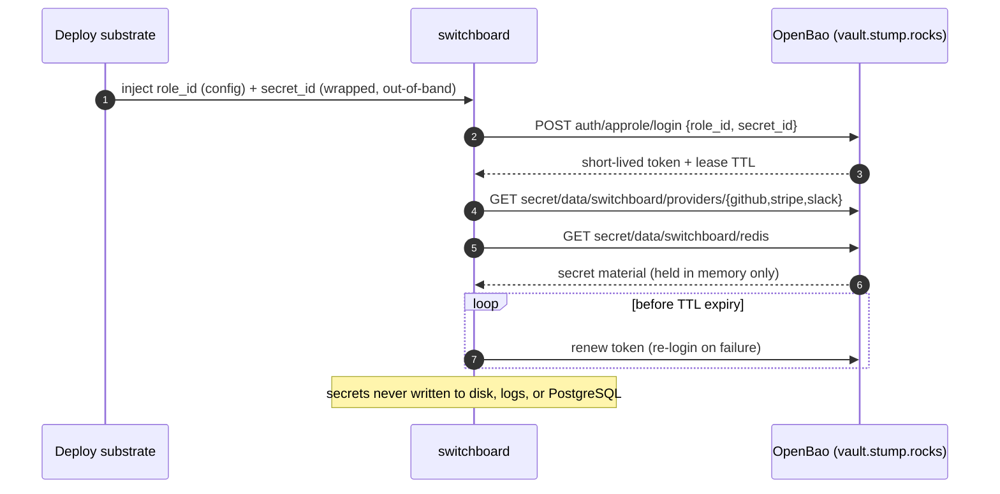

# ADR-004: Secrets Management via OpenBao AppRole

## Context and Problem Statement

`switchboard` needs several secrets at runtime: the HMAC signing secrets for each signed provider (GitHub, Stripe, Slack — see [ADR-003](ADR-003-per-provider-ingestion-and-trust-model.md)), the shared tokens for any generic endpoints, the Redis connection URL/password for the pull adapter ([ADR-014](ADR-014-ingestion-adapters-push-pull.md)), and the **PostgreSQL** connection string ([ADR-002](ADR-002-postgres-persistence-and-retention.md)). The brief is explicit that these must come from **OpenBao** (`vault.stump.rocks`) via **AppRole**, not from `.env` files or hardcoded config (§8). This is also the StumpCloud house pattern — services authenticate to OpenBao as machines, not with long-lived human tokens. How does a single-process service authenticate to OpenBao without a bootstrap secret that is itself a `.env` secret, fetch its per-provider secrets, keep them off disk, and re-authenticate as tokens expire?

## Decision Drivers

* **No secrets in the repo, config, or a committed `.env`.** Secrets are fetched at runtime from OpenBao. The repo contains *paths and role references*, never secret material.
* **Machine identity, not a human token.** A service should authenticate as itself (AppRole) with a scoped policy, so its access can be rotated/revoked independently of any person.
* **Least privilege.** The service's policy grants read on only its own KV path (`secret/switchboard/*`), nothing else.
* **Secrets stay in memory.** Fetched secrets are held in process memory only; they are never written to disk, never logged, and never persisted to PostgreSQL ([ADR-002](ADR-002-postgres-persistence-and-retention.md) stores only a non-secret "configured / missing / none-by-design" status).
* **Token lifecycle.** The AppRole login yields a short-lived token; the app must renew or re-login before expiry so long-running ingestion never stalls on an expired token.
* **Homelab-consistent.** Uses the same `vault.stump.rocks` + AppRole flow the rest of StumpCloud uses, so operational knowledge transfers.

## Considered Options

* **(A) `.env` file / environment variables** holding the raw secrets.
* **(B) Hardcoded config** committed to the repo.
* **(C) OpenBao with a direct long-lived token** (`VAULT_TOKEN`) mounted into the process.
* **(D) OpenBao AppRole** — the service logs in with a RoleID + SecretID, gets a short-lived token, and reads its KV path. *(chosen)*
* **(E) OS/container secret store** (Docker/Podman secrets, systemd credentials).

## Decision Outcome

Chosen option: **"(D) OpenBao AppRole."** The service authenticates to `vault.stump.rocks` using an **AppRole** (`role_id` + `secret_id`), receives a short-lived Vault token, and reads its secrets from a KV v2 mount under `secret/switchboard/*`. This is the only option that gives machine identity, a scoped policy, rotation/revocation independent of humans, and no committed secret material — and it matches the established StumpCloud pattern.

### AppRole flow

1. **Config (non-secret):** `VAULT_ADDR=https://vault.stump.rocks`, the AppRole mount path, and the `role_id` live in ordinary config/env — `role_id` is a non-secret identifier, safe to commit to deployment config (not to the repo).
2. **Bootstrap credential (the one secret that must arrive out-of-band):** the `secret_id`. It is delivered to the process by the deployment substrate — a tightly-permissioned file, a systemd credential, or (preferred) a **response-wrapped** SecretID that the app unwraps once on startup. It is read once into memory and never written back to disk.
3. **Login:** `POST auth/approle/login` with `{role_id, secret_id}` → a short-lived client token (+ lease TTL).
4. **Read:** `GET secret/data/switchboard/...` for each needed secret (KV v2). Secrets are cached in memory keyed by provider.
5. **Renew / re-login:** a background task renews the token before its TTL, and re-runs AppRole login if renewal fails or the max-TTL is reached. Ingestion never blocks on an expired token.

### Secret layout (KV v2 under `secret/switchboard/`)

| Path | Keys | Consumer |
|------|------|----------|
| `secret/switchboard/providers/github` | `hmac_secret` | GitHub signature verification ([ADR-003](ADR-003-per-provider-ingestion-and-trust-model.md)) |
| `secret/switchboard/providers/stripe` | `signing_secret` | Stripe signature verification |
| `secret/switchboard/providers/slack` | `signing_secret` | Slack signature verification |
| `secret/switchboard/generic/<name>` | `token` | Generic-webhook shared-secret token — caller auth ([ADR-003](ADR-003-per-provider-ingestion-and-trust-model.md)) |
| `secret/switchboard/redis` | `url` (may embed password), optional `ca_cert` | Redis pull-adapter connection ([ADR-014](ADR-014-ingestion-adapters-push-pull.md)) |
| `secret/switchboard/postgres` | `dsn` (may embed password), optional `ca_cert` | PostgreSQL connection ([ADR-002](ADR-002-postgres-persistence-and-retention.md)) |

The Vault **policy** for the AppRole grants `read` on `secret/data/switchboard/*` and `secret/metadata/switchboard/*` and nothing else.

### Provider secret-status in the UI

The Provider Config screen (brief §6.3) shows each provider's secret status as **configured / missing / none-by-design** — derived from whether the corresponding OpenBao read succeeded — and **never displays the secret itself**. "none-by-design" is the correct status for `generic`/`redis` providers that have no HMAC secret. This status is computed at runtime from OpenBao, not stored.

### Local development

Production and homelab always use OpenBao. For local development/testing without a Vault reachable, the code session MAY implement a **loud, explicitly-opt-in** dev override (e.g. only active when `WEBHOOK_MCP_DEV_SECRETS=1` is set) that reads secrets from the developer's environment, logging a prominent warning on every startup that secrets are NOT coming from OpenBao. This escape hatch is off by default, never the production path, and documented in the README as dev-only. It is deferred to the code session; the MVP's canonical mechanism is AppRole.

### Consequences

* Good, because no secret material is ever committed; the repo holds only paths and a (non-secret) role reference.
* Good, because the service has its own scoped identity — its access is rotated/revoked without touching anyone's personal Vault token.
* Good, because least-privilege policy confines the blast radius of a compromised token to `secret/switchboard/*`.
* Good, because secrets live only in memory and are excluded from logs and PostgreSQL, so a leaked log or a stolen DB file contains no signing secrets.
* Bad, because there is still one bootstrap secret (the SecretID) that must reach the process out-of-band — mitigated by response-wrapping and tight file permissions; this is inherent to any machine-auth scheme.
* Bad, because it adds an OpenBao dependency to run the service — accepted, since it is already core StumpCloud infrastructure and the dev override covers laptop testing.
* Bad, because token renewal is one more background task to get right — mitigated by re-login-on-failure and covered by the brief's testing requirements.

### Confirmation

* The repo contains no secret values; a Gitleaks CI job ([ADR-006](ADR-006-gitea-primary-github-mirror-and-ci.md)) scans every push and fails on secret material.
* A startup integration test (against a dev/test Vault or a mock) asserts AppRole login → read of `secret/switchboard/providers/github` succeeds and populates the in-memory secret cache.
* A test asserts that no secret value appears in logs or in any persisted `events.headers`/DB row.
* A test asserts the Provider Config surface reports `configured`/`missing`/`none-by-design` without ever returning the secret value.
* The AppRole policy is documented (in `stumpcloud/ansible` provisioning) as read-only on `secret/switchboard/*`.

## Pros and Cons of the Options

### (D) OpenBao AppRole (chosen)

* Good, because machine identity + scoped policy + rotation/revocation independent of humans.
* Good, because no committed secrets; only paths and a non-secret RoleID.
* Good, because it is the existing StumpCloud pattern — operationally familiar.
* Bad, because one bootstrap SecretID must be delivered out-of-band (mitigated by response-wrapping).

### (A) `.env` / environment variables (rejected)

* Good, because trivially simple.
* Bad, because raw secrets sit in a file or the process environment, easy to leak via logs, backups, or a committed `.env`; explicitly forbidden by the brief.

### (B) Hardcoded config (rejected)

* Bad, because secrets in the repo are the worst case — leaked to everyone with clone access forever. Non-starter.

### (C) OpenBao with a direct long-lived token (rejected)

* Good, because simpler than AppRole (no login round-trip).
* Bad, because a long-lived `VAULT_TOKEN` is a durable bearer secret tied to no rotating identity; if leaked it is valid until manually revoked, and it is often a human's token with broader scope than the service needs.

### (E) OS/container secret store (rejected as primary)

* Good, because integrates with the deployment substrate and keeps secrets off the repo.
* Bad, because it fragments secret management away from OpenBao (the house system of record), loses centralized rotation/audit, and still needs a per-platform mechanism. May *carry* the SecretID (as in the chosen flow) but is not the source of truth for the provider secrets themselves.

## Architecture Diagram

## More Information

* OpenBao/Vault AppRole is the StumpCloud standard for service auth against `vault.stump.rocks`. Provisioning of the AppRole + policy lives in `stumpcloud/ansible`.
* Secret consumers and their trust roles are defined in [ADR-003](ADR-003-per-provider-ingestion-and-trust-model.md).
* CI secret-scanning (Gitleaks) that backstops "no secrets in the repo" is defined in [ADR-006](ADR-006-gitea-primary-github-mirror-and-ci.md).
* Related memory: laptop OpenBao writes require `~/.vault-token` semantics; this service uses AppRole rather than a personal token, sidestepping that class of issue.
