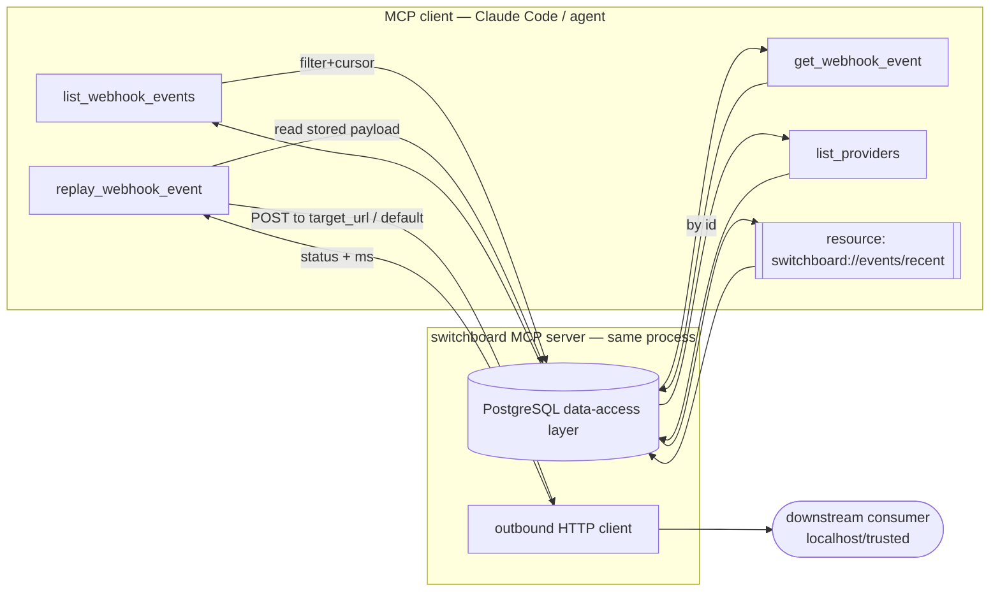

# ADR-005: MCP Tool and Resource Contract Shape

## Context and Problem Statement

`switchboard` exposes its stored events to MCP clients (Claude Code and other agents) through the official `mcp` Python SDK, running as a server mounted in the same Starlette process as the web UI ([ADR-001](ADR-001-web-stack-starlette-htmx-pico.md)) and reading the same PostgreSQL layer ([ADR-002](ADR-002-postgres-persistence-and-retention.md)). The brief fixes the minimum tool set — `list_webhook_events`, `get_webhook_event`, `replay_webhook_event`, `list_providers` — plus a resource stream of recent events (§7). This ADR pins the *shape* of that contract: naming, input/output schemas at a design level, pagination and filtering semantics, how the one side-effecting tool (`replay`) is made safe, and the tools-vs-resources split. The exact JSON schemas live in `docs/specs/mcp-tools.md`; this ADR records the decisions that spec must reflect. What contract makes the event log queryable and replayable by an agent while staying honest about trust ([ADR-003](ADR-003-per-provider-ingestion-and-trust-model.md)) and safe about outbound side effects?

## Decision Drivers

* **Shape parity with the DB and UI.** An MCP `event` object should be the same normalized shape the web UI renders and the `events` table stores, so the three surfaces never drift.
* **Trust is part of every payload.** Every event returned over MCP carries its `trust_mode` / `verified` / `verify_detail` — an agent must be able to tell a signed event from an unverified one, just like the UI ([ADR-003](ADR-003-per-provider-ingestion-and-trust-model.md)).
* **Cheap list, full detail on demand.** `list` returns compact summaries (no full payload/headers) for fast scans and small context; `get` returns the complete record. This keeps agent context lean.
* **Deterministic pagination.** Filtering by provider/type/time with a stable order and a cursor so an agent can page without duplicates or gaps.
* **Replay is the one dangerous verb.** It performs an outbound HTTP POST. It must be explicit about its target, constrained, and never a hidden side effect of reading.
* **SDK-idiomatic.** Tool names, input schemas, and structured output follow `mcp` Python SDK conventions; resources use the SDK's resource/URI model.
* **Secrets never cross the boundary.** MCP responses contain sanitized headers only ([ADR-002](ADR-002-postgres-persistence-and-retention.md)/[ADR-004](ADR-004-secrets-management-openbao-approle.md)) — no signing secrets, no raw signature header values.

## Considered Options

* **Surface split:** (A) tools only; (B) **tools + a read-only resource for recent events** *(chosen)*; (C) resources-only.
* **`list` payload weight:** (A) return full events; (B) **return compact summaries, full record via `get`** *(chosen)*.
* **Pagination:** (A) `limit` only; (B) **`limit` + `since` + opaque `cursor`** with stable ordering *(chosen)*; (C) numeric offset pages.
* **Replay target:** (A) required explicit `target_url` every call; (B) **optional `target_url`, else a configured default replay target; error if neither** *(chosen)*; (C) replay back to the originating provider.
* **Output typing:** (A) free-form text/JSON blobs; (B) **SDK structured output with declared schemas** *(chosen)*.

## Decision Outcome

Chosen: **tools + a recent-events resource (B)**, **compact `list` summaries with full `get` detail (B)**, **`limit` + `since` + opaque `cursor` pagination (B)**, **optional `target_url` with a configured default and a hard error if neither is set (B)**, and **SDK structured output with declared schemas (B)**.

### Tools (MVP)

| Tool | Inputs | Returns | Side effects |
|------|--------|---------|--------------|
| `list_webhook_events` | `provider?`, `event_type?`, `since?` (ISO-8601 or event id), `limit?` (default 50, max 200), `cursor?` | `{ events: EventSummary[], next_cursor?: string }` | none (read) |
| `get_webhook_event` | `id` (required) | `EventDetail` (full: sanitized headers, raw payload, verification result) | none (read) |
| `replay_webhook_event` | `id` (required), `target_url?` | `{ status, target_url, response_status, response_ms }` | **outbound HTTP POST** |
| `list_providers` | — | `{ providers: ProviderStatus[] }` | none (read) |

* **`EventSummary`** (compact, for `list`): `id`, `provider`, `event_type`, `trust_mode`, `verified`, `payload_size`, `received_at`. No payload, no headers — keeps agent context small.
* **`EventDetail`** (full, for `get`): all summary fields plus `verify_detail`, sanitized `headers` (object), raw `payload`, `content_type`, `source_ip`, `external_id`.
* **`ProviderStatus`**: `name`, `kind` (`signed`/`generic`/`redis`), `trust_mode`, `enabled`, `secret_status` (`configured`/`missing`/`none-by-design`), and the route path or Redis channel. Never the secret value ([ADR-004](ADR-004-secrets-management-openbao-approle.md)).

Every event object includes `trust_mode` + `verified` + `verify_detail` so an agent can distinguish a signed, verified event from an unverified/Redis one — the MCP surface is held to the same honesty bar as the UI ([ADR-003](ADR-003-per-provider-ingestion-and-trust-model.md)).

### Pagination and filtering

`list_webhook_events` orders by `received_at DESC, id DESC` (stable). `since` accepts either an ISO-8601 timestamp or an event id and bounds the lower edge. `cursor` is an **opaque** token encoding the last `(received_at, id)` seen; when the result set is truncated at `limit`, a `next_cursor` is returned. Cursors are preferred over numeric offset because new events arriving between pages would otherwise shift offsets and cause duplicates/gaps. `limit` defaults to 50 and is capped at 200 to bound response size.

### Replay safety

`replay_webhook_event` is the only tool with side effects, and the contract makes that explicit:

* It re-POSTs the **stored raw payload** and a replay-safe subset of headers to a target — for exercising a downstream consumer under local development, per the brief.
* `target_url` is optional; if omitted it falls back to a configured **default replay target** (a `settings` value, [ADR-002](ADR-002-postgres-persistence-and-retention.md)). If neither is provided, the tool returns a clear error rather than guessing.
* It does **not** replay back to the originating provider — providers are senders, not receivers; that option is nonsensical and rejected.
* For the MVP the target is expected to be localhost/trusted-network; the tool validates the URL scheme (`http`/`https`) and the code session SHOULD constrain targets (e.g. an allowlist or localhost-only default) to avoid turning the tool into an SSRF primitive. This constraint is noted as an implementation requirement.
* The response reports what happened (`target_url`, downstream `response_status`, elapsed `response_ms`) so the agent gets feedback, and the replay attempt itself is logged.

### Resource

Recent events are also exposed as a **read-only MCP resource** (e.g. URI `switchboard://events/recent`), returning the same `EventSummary` shape as `list`. This lets clients that model context as resources subscribe to "recent events" without a tool call. It is strictly read-only; all mutation/replay stays in tools. Whether the SDK's resource-subscription/update mechanism is wired for push is left to the code session; the MVP guarantees at least a pull-able recent-events resource.

### Structured output

Tools declare input JSON Schemas and return SDK structured output with the `EventSummary`/`EventDetail`/`ProviderStatus` shapes above, so clients get typed, validated results rather than parsing free-form text. The authoritative schemas live in `docs/specs/mcp-tools.md` and are kept in sync with this ADR and the `events` schema ([ADR-002](ADR-002-postgres-persistence-and-retention.md)).

### Consequences

* Good, because `list`/`get`/`replay`/`list_providers` map directly onto the DB layer and the UI's needs — one normalized event shape across all three surfaces.
* Good, because compact summaries keep agent context small while `get` still offers full fidelity.
* Good, because cursor pagination is correct under concurrent inserts (an always-on receiver).
* Good, because trust metadata travels with every event, so agents cannot mistake unverified data for signed.
* Good, because `replay` is the single, clearly-marked side-effecting verb with an explicit target and no back-to-provider footgun.
* Bad, because summary/detail split means two round-trips when an agent wants full payloads for many events — acceptable; the common case is scan-then-drill-down.
* Bad, because `replay` is inherently an outbound-request tool that needs SSRF-conscious constraints — mitigated by scheme validation, a localhost/trusted default, and a noted allowlist requirement for the code session.

### Confirmation

* `docs/specs/mcp-tools.md` documents exact input/output JSON Schemas matching the shapes above; a test asserts tool responses validate against them.
* Tests cover: `list` filtering by provider/type/since, cursor round-trip (no duplicate/gap across pages), `get` returning full sanitized detail, `list_providers` reporting correct `secret_status`, and `replay` posting the stored payload to a target and reporting the downstream status.
* A test asserts every event object over MCP includes `trust_mode`/`verified`/`verify_detail` and that no secret/full-signature value is present.
* A test asserts `replay` with neither `target_url` nor a configured default returns an error rather than performing a request.

## Pros and Cons of the Options

### Surface: tools + recent-events resource (chosen) vs. tools-only vs. resources-only

* Good (tools + resource), because tools cover query/detail/replay while the resource gives resource-modeling clients a pull-able "recent events" without a tool call.
* Bad (tools-only), because it ignores the brief's explicit "expose recent events as a resource stream, not just tools."
* Bad (resources-only), because replay and parameterized filtering are naturally tools, not resources.

### `list` weight: summaries (chosen) vs. full events

* Good (summaries), because it keeps agent context lean and lists fast.
* Bad (full events), because returning every payload/headers blob on a broad list floods context and is slow.

### Pagination: cursor (chosen) vs. offset vs. limit-only

* Good (cursor), because it is stable under concurrent inserts.
* Bad (offset), because new rows shift offsets → duplicates/gaps between pages.
* Bad (limit-only), because it cannot page beyond the first window.

### Replay target: optional + configured default (chosen) vs. always-required vs. back-to-provider

* Good (optional + default), because ergonomic for the common "replay to my local consumer" case while still explicit.
* Bad (always-required), because it is tedious when a stable dev target exists.
* Bad (back-to-provider), because providers do not receive webhooks; the option is meaningless and a footgun.

### Output: structured (chosen) vs. free-form

* Good (structured), because clients get typed, validated results and the contract is enforceable.
* Bad (free-form), because it pushes parsing and drift risk onto every client.

## Architecture Diagram

## More Information

* Minimum tool set and the recent-events resource are from brief §7. MCP Python SDK: <https://github.com/modelcontextprotocol/python-sdk>; MCP spec: <https://modelcontextprotocol.io/>.
* Event shape and trust fields derive from [ADR-002](ADR-002-postgres-persistence-and-retention.md) (schema) and [ADR-003](ADR-003-per-provider-ingestion-and-trust-model.md) (trust semantics).
* Exact schemas: `docs/specs/mcp-tools.md` (this session). The AsyncAPI SSE contract (`docs/specs/asyncapi.yaml`) shares the same `EventSummary` shape for the UI's live stream.
* `replay` SSRF constraints (scheme validation, localhost/trusted default, allowlist) are flagged here as a code-session implementation requirement.
