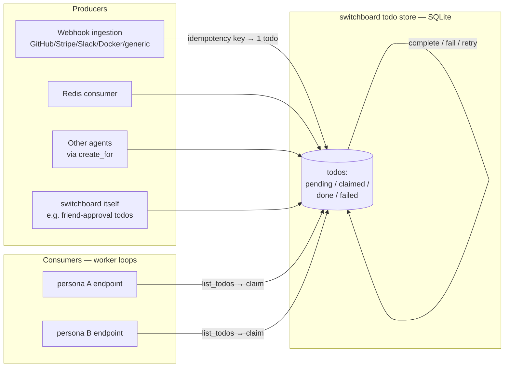

# ADR-007: Todos as the Core Primitive (not a message inbox)

## Context and Problem Statement

ADR-000–006 defined switchboard's MVP as a **webhook event store**: receive, verify, persist, and expose events to MCP clients and a web UI ([ADR-005](ADR-005-mcp-tool-and-resource-contract.md)). That model answers *"what happened?"* but not *"what still needs doing, by whom, and did it get done?"* An agent that reads an event stream has no durable notion of ownership, completion, or retry — if it crashes mid-work the event has already been read, and nothing re-surfaces it.

This ADR establishes the primitive the agent-facing layer of switchboard is built on. The question is: **what is the core object an agent interacts with — a message it reads once, or a durable unit of work with a lifecycle?** Inbound webhooks are at-least-once and duplicate-prone; agents are unreliable workers that crash, restart, and run concurrently; MCP has no server→client push. The primitive has to be correct under all three of those facts.

## Decision Drivers

* **Work outlives a read.** An agent handing off, crashing, or timing out must not silently drop the work. The object has to persist until it is explicitly completed, and a crash must leave it re-claimable.
* **At-least-once ingestion demands dedup.** Webhook deliveries retry; the same GitHub delivery can arrive twice ([ADR-003](ADR-003-per-provider-ingestion-and-trust-model.md)). Two deliveries of the same event must collapse into **one** unit of work, not two.
* **Concurrency without double-processing.** Multiple agents (or multiple personas of one agent, [ADR-009](ADR-009-personas-as-scoped-agent-cards.md)) may drain the same queue. Exactly one must own a given item at a time.
* **The MCP tool model can't push; the primitive must be pullable.** MCP request/response has no server-initiated notify on the tool surface, so whatever primitive we choose must be **pullable** — an agent drains its own list on its own loop. *(Later refinement: [ADR-013](ADR-013-channels-push-delivery.md) adds a real push path via the MCP-based Claude Code Channels capability. It does **not** overturn this decision — Channels delivery is best-effort/lossy, so it rides on top of the durable pull queue as a notify layer, never replacing it.)*
* **Ownership and accountability are first-class.** Every unit of work should carry who it is for (an assignee or a pool/topic) so it can be routed, and — via [ADR-008](ADR-008-human-principal-vended-endpoints.md) — traced to a human owner.
* **Producers are decoupled from consumers.** Webhooks, the Redis consumer, other agents, and switchboard itself all create work; agents consume it. The primitive is the contract between them.

## Considered Options

* **(A) Message / inbox** — the object is a message that is delivered and read; read-once or read-with-offset (Redis pub/sub, a Kafka-style log, an email-like inbox).
* **(B) Push / event-driven** — switchboard pushes work to agents as it arrives (webhooks-out, websockets, MCP notifications).
* **(C) Durable todo / work-item** — the object is a **todo** with an explicit lifecycle (`pending → claimed → done | failed → retry`), claimed under a lease, completed with an ack, deduplicated by an idempotency key. *(chosen)*

## Decision Outcome

Chosen option: **"(C) durable todo/work-item."** Switchboard's core agent-facing object is a **todo**: a durable work-item with a lifecycle, an owner (assignee or pool/topic queue), an idempotency key, and lease/ack semantics. Inbound webhooks are **producers** of todos, not the primitive itself. Agents are **consumers** that drain their list on a worker loop. This is the only option that is simultaneously crash-safe, dedup-correct, concurrency-safe, and compatible with MCP's pull-only reality.

### Lifecycle

```
                 claim (lease)        complete
   ┌─────────┐  ───────────────▶ ┌─────────┐ ─────────▶ ┌──────┐
   │ pending │                   │ claimed │            │ done │
   └─────────┘  ◀─────────────── └─────────┘ ─────────▶ ┌──────┐
        ▲        lease expiry /        │       fail      │failed│
        │        release (crash-safe)  │                 └──────┘
        │                              │                    │
        └──────────────── retry ◀──────┴────────────────────┘
                    (attempt++ , back to pending)
```

* **pending** — created and unclaimed; visible to any consumer whose scope covers its queue.
* **claimed** — a consumer holds a **lease** (owner + expiry). Others cannot claim it. If the lease expires (the worker crashed or hung), the todo returns to **pending** and is re-claimable — this is the crash-safety guarantee.
* **done** — the consumer **acked** completion. Terminal; persists as an audit record subject to retention ([ADR-002](ADR-002-postgres-persistence-and-retention.md)).
* **failed** — the consumer reported failure (or attempts were exhausted). Terminal unless retried.
* **retry** — a failed/expired todo re-enters **pending** with an incremented attempt count, up to a max; beyond the max it stays **failed** (a dead-letter state).

### Mechanics

* **Claim / lease.** Claiming is atomic and sets `owner` + `lease_expires_at`. A lease has a TTL; the owner may extend (heartbeat) or it expires. Expiry ⇒ re-claimable. This prevents two consumers from processing one todo at once *and* prevents a crashed consumer from stranding it.
* **Ack / complete.** A todo persists until explicitly `complete`d or `fail`ed. There is no "read = consumed." A crash between claim and complete leaves the todo re-claimable once the lease lapses — **at-least-once processing**, which is why handlers should be idempotent.
* **Idempotency keys.** Every producer supplies (or switchboard derives) an idempotency key — for webhooks, the provider delivery id (`X-GitHub-Delivery`, Stripe event `id`, etc., see [ADR-003](ADR-003-per-provider-ingestion-and-trust-model.md)). Creating a todo with a key that already exists in a non-terminal state is a **no-op that returns the existing todo**, collapsing duplicate deliveries into one work-item.
* **Assignee vs. pool/topic queues.** A todo targets either a specific **assignee** (a persona/endpoint) or a **pool/topic queue** that many consumers drain competitively. Direct assignment is point-to-point; pool queues are work-sharing.

### Relationship to the event store (ADR-005)

The event log and the todo model are complementary, not competing: **an event is a record of what arrived; a todo is a unit of work derived from it.** A verified GitHub push is stored as an event (ADR-002/003) *and* fans out to one or more todos via routing rules ([ingestion-adapters spec](../specs/ingestion-adapters.md)). The `list/get/replay` event tools of [ADR-005](ADR-005-mcp-tool-and-resource-contract.md) remain the audit/history surface; the todo tools ([agent-mcp-tools spec](../specs/agent-mcp-tools.md)) are the work surface. See **Open questions** for the one unresolved seam.

### Consequences

* Good, because work survives crashes: an un-acked todo whose lease lapses is re-claimed, so nothing is silently lost.
* Good, because at-least-once webhook delivery is deduplicated into a single todo by idempotency key.
* Good, because concurrent consumers are safe: the lease guarantees single-ownership while claimed.
* Good, because the pull model is correct-by-design against MCP's lack of push — no delivery infrastructure to build or fail.
* Good, because producers (webhooks, Redis, agents, switchboard itself) and consumers are decoupled through one durable contract.
* Bad, because at-least-once means handlers **must** be idempotent; exactly-once is not offered (it is not achievable end-to-end). Documented as a handler requirement.
* Bad, because leases add a time dimension (TTL tuning, clock assumptions) a plain inbox would not have — the cost of crash-safety.
* Bad, because polling has latency and load characteristics push would not; mitigated by long-poll/backoff in the worker loop, by acceptable scale, and — where a harness supports it — by a Channels notify that wakes the consumer immediately while the durable queue stays the ledger ([ADR-013](ADR-013-channels-push-delivery.md)).

### Confirmation

* The [todos spec](../specs/todos.md) defines the object schema and state-machine transitions; tests assert every transition (claim, lease-expiry re-claim, complete, fail, retry, dead-letter).
* A test asserts that creating two todos with the same idempotency key yields **one** todo (the second returns the first).
* A test asserts a claimed-but-not-completed todo becomes re-claimable after lease expiry, and that a second claimant cannot claim it *before* expiry.
* A test asserts a webhook delivery produces a todo (producer relationship) and that a duplicate delivery does not produce a second.

## Pros and Cons of the Options

### (A) Message / inbox (rejected)

* Good, because simple: deliver, read, done.
* Bad, because read-once loses the work on a crash between read and completion — no re-surfacing.
* Bad, because it has no native dedup; at-least-once deliveries become duplicate messages.
* Bad, because it has no ownership/lease, so concurrent consumers double-process.

### (B) Push / event-driven (rejected)

* Good, because lowest latency when it works.
* Bad, because **MCP cannot push** — this is architecturally impossible over the primary agent interface without bolting on a second out-of-band channel.
* Bad, because push shifts delivery-reliability and retry burden onto switchboard (the exact scheduler complexity ADR-000 scoped out).

### (C) Durable todo / work-item (chosen)

* Good, because lifecycle + lease + ack give crash-safety and single-ownership.
* Good, because idempotency keys give dedup for at-least-once ingestion.
* Good, because pull fits MCP with zero delivery infrastructure.
* Bad, because it requires idempotent handlers and lease tuning — accepted as inherent to correct at-least-once work queues.

## Architecture Diagram



## More Information

* Object schema + full state machine: [todos spec](../specs/todos.md).
* The MCP verbs that drive the lifecycle (`list_todos`, `claim`, `complete`, `fail`, `create_for`): [agent-mcp-tools spec](../specs/agent-mcp-tools.md).
* How push (webhook) and pull (queue) adapters become todos — routing rules, idempotency-key derivation, and the pull-side store-then-ack coupling: [ingestion-adapters spec](../specs/ingestion-adapters.md), [ADR-014](ADR-014-ingestion-adapters-push-pull.md), [ADR-003](ADR-003-per-provider-ingestion-and-trust-model.md).
* Ownership tracing to a human, and per-agent scoping of which queues an endpoint may drain: [ADR-008](ADR-008-human-principal-vended-endpoints.md).
* **Open question — event/todo seam:** whether the ADR-005 event tools and the todo tools remain two surfaces indefinitely, or whether events become a pure sub-record of todos, is left to confirm with Joe. Recorded in [docs/README.md](../README.md) open-questions.
