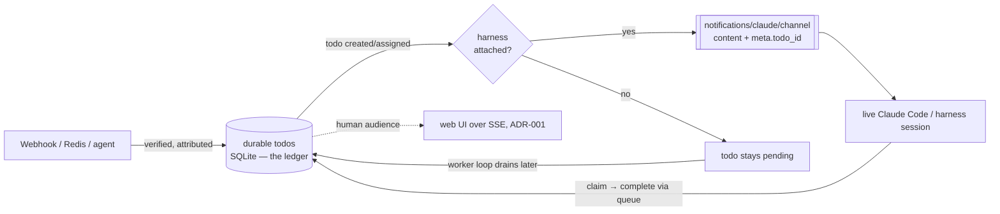

# ADR-013: Push Delivery via Claude Code Channels (notify layer over the durable todo queue)

## Context and Problem Statement

[ADR-007](ADR-007-todos-as-core-primitive.md) chose a **durable, pull-based** todo primitive, and one of its stated reasons was that *"MCP has no server→client push,"* so agents drain their list on a worker loop. That is true of the MCP request/response tool model — but it is not the whole story. **[Claude Code Channels](https://code.claude.com/docs/en/channels-reference)** is an open extension built directly on MCP that adds exactly a server→client push: a *channel* is an MCP server that declares the `claude/channel` experimental capability, and Claude Code (which spawns it as a stdio subprocess) registers a listener; the server pushes events by emitting a `notifications/claude/channel` JSON-RPC notification, which arrives in the live session wrapped in a `<channel source="…">…</channel>` tag.

This gives switchboard a real push path **into a live Claude Code session** — and, because it is defined on MCP, into other harnesses that implement the same capability. It also unifies the two "switchboard" efforts: a webhook **receiver + durable queue** and a webhook-to-session **channel relay** are one system, not two. The question this ADR answers: **how do Channels and the durable pull-based todo queue relate — does push become the delivery mechanism, and does adopting it overturn ADR-007?**

## Decision Drivers

* **Durability must survive an offline session.** The Channels reference is explicit that delivery is **best-effort and unacknowledged**: `notifications/claude/channel` resolves when *written to the transport*, not when Claude processes it, and *"if the session hasn't loaded your server as a channel, or the organization policy blocks it, events are dropped silently with no error."* Push therefore **cannot** be the system of record.
* **Remove polling latency when a session is live.** When a harness *is* attached, work should arrive immediately, not on the next poll tick.
* **Reuse the vended endpoint.** A channel *is* an MCP server; the per-agent vended MCP endpoint ([ADR-008](ADR-008-human-principal-vended-endpoints.md)) is the natural place to carry the `claude/channel` capability — one transport, not a bolt-on.
* **Keep attribution + injection safety.** The reference warns an ungated channel is a prompt-injection vector and to gate on **sender** identity. Switchboard already verifies every inbound event per source ([ADR-003](ADR-003-per-provider-ingestion-and-trust-model.md)) and attributes it to a human ([ADR-008](ADR-008-human-principal-vended-endpoints.md)) before it becomes a todo — that verification *is* the gate.
* **Two-way is available and maps onto our model.** Channels supports a **reply tool** (Claude → back over the channel) and **permission relay** (`claude/channel/permission`: Claude Code forwards tool-approval prompts to the channel, which returns an allow/deny verdict). These map onto todo completion and human consent (friend approvals, [ADR-010](ADR-010-a2a-discovery-human-vended-friending.md)).
* **Open + multi-harness.** Built on MCP; not a Claude-Code-only lock-in.

## Considered Options

* **(A) Channels as the system of record** — push the event straight into the session and treat that as delivery (the raw-relay prototype pattern). No durable queue.
* **(B) Pull-only** — keep [ADR-007](ADR-007-todos-as-core-primitive.md) exactly as written; ignore the now-available push path.
* **(C) Channels as a push-**notify** layer over the durable todo queue** — the todo remains the ledger; when a todo is created/assigned to a consumer whose harness is attached, switchboard emits a `notifications/claude/channel` **wake** carrying the todo id + a summary; the agent still **claims/completes via the durable queue**. Offline session ⇒ the todo waits to be pulled; nothing is lost. *(chosen)*

## Decision Outcome

Chosen option: **"(C) Channels as a notify layer over the durable queue."** This **revises the framing** of [ADR-007](ADR-007-todos-as-core-primitive.md) — push *is* possible now, via Channels — **without overturning its decision**: durability still requires the queue; Channels is a best-effort ergonomics layer on top, never the ledger.

> **Push tells the agent "you have work." The durable todo *is* the work.** Delivery is the queue; Channels is the doorbell.

### Mechanics (grounded in the standard)

* **The vended endpoint declares `claude/channel`.** The same MCP endpoint that exposes the todo/webhook/friending verbs ([agent-mcp-tools spec](../specs/agent-mcp-tools.md)) advertises `capabilities.experimental['claude/channel'] = {}`, so when the harness spawns it the push listener is registered. Because Channels requires a **local stdio subprocess**, the endpoint runs as a thin local channel adapter that authenticates to central switchboard with the vended credential ([ADR-008](ADR-008-human-principal-vended-endpoints.md)) and bridges both directions (pull + server-push). The exact adapter/auth shape is a code-session detail (see [channel-delivery spec](../specs/channel-delivery.md) and Open questions).
* **Notify shape.** On todo create/assign to a channel-attached consumer, emit `notifications/claude/channel` with `content` = a legible one-line summary (e.g. *"switchboard: todo #4213 on `reviews` — PR #482 opened in joestump/switchboard"*) and `meta` = routing identifiers (`todo_id`, `queue`, `kind`, `source`). Per the standard, `meta` keys must be identifiers (letters/digits/underscore) — hyphenated keys are silently dropped — so switchboard uses snake_case keys.
* **Lossy by design ⇒ degrade to pull.** Because Channels drops events when no session is attached, the todo simply stays `pending` and the worker loop ([ADR-007](ADR-007-todos-as-core-primitive.md)) drains it when the harness returns. **Push never gates correctness.** Notify is at-least-once; duplicates are harmless (idempotency-key dedup + idempotent `claim`).
* **Two-way (optional).** Expose a **reply tool** so a chat-sourced todo can be answered inline, and/or opt into **permission relay** so a human can approve/deny a consent prompt — e.g. a friend approval ([ADR-010](ADR-010-a2a-discovery-human-vended-friending.md)) or a scoped tool use — from their own channel, applying the first verdict to arrive. Consent still lands as a durable approval-todo; relay is the fast path, not a bypass of human vending.
* **Attribution is the sender gate.** Only **verified, human-attributed** todos are ever pushed; switchboard's per-source verification ([ADR-003](ADR-003-per-provider-ingestion-and-trust-model.md)) satisfies the reference's "gate on sender" requirement. The prototype's hardening — rejecting payloads containing a `</channel>` break, and withholding secret values behind a fetchable `secret-ref` — is retained.
* **Symmetry with the human UI.** Humans are pushed via the web UI's SSE ([ADR-001](ADR-001-web-stack-starlette-htmx-pico.md)); agents/harnesses are pushed via Channels. **Two audiences, two push transports, one durable ledger** ([ADR-002](ADR-002-postgres-persistence-and-retention.md)).

### Consequences

* Good, because it delivers push ergonomics (no polling lag) **and** preserves ADR-007 durability — the lossy transport is backed by the durable queue, so an offline session loses nothing.
* Good, because it reuses the vended MCP endpoint as the channel — one transport, one credential, one scope.
* Good, because it unifies the receiver/queue and the channel relay into a single system and product.
* Good, because two-way reply + permission relay give a clean path for inline replies and remote human consent that still route through durable todos.
* Good, because it is MCP-based and multi-harness; harnesses without Channels simply fall back to pull.
* Bad, because switchboard must run a per-harness local channel adapter and track session liveness — accepted; the adapter is thin and the fallback is automatic.
* Bad, because Channels is a **research preview** with real gates (Claude Code v2.1.80+, permission relay v2.1.81+, Anthropic auth via claude.ai/Console — **not** Bedrock/Vertex/Foundry, org `channelsEnabled`, allowlist / `--dangerously-load-development-channels`). Documented as an operational constraint, not a design flaw.
* Bad, because two-way channels widen the injection surface — mitigated by the existing verification/attribution gate and the standard's sender-allowlist guidance.

### Confirmation

* The [channel-delivery spec](../specs/channel-delivery.md) defines the binding, the todo→notification mapping, delivery semantics, and the two-way (reply/permission) mapping.
* A test asserts a created/assigned todo to a channel-attached consumer emits exactly one `notifications/claude/channel` whose `meta.todo_id` matches, and that `meta` keys are identifier-safe.
* A test asserts that with **no** attached session the todo remains `pending` and is later drained by pull — **no loss** (push failure is non-fatal).
* A test asserts duplicate notifies do not cause double-processing (dedup + idempotent claim).
* A test asserts only verified, human-attributed todos are eligible to push, and that a payload containing `</channel>` is rejected upstream.

## Pros and Cons of the Options

### (A) Channels as the system of record (rejected)

* Good, because simplest and lowest-latency — push the event, done.
* Bad, because delivery is **lossy and unacknowledged** by the standard's own definition: a closed session, an unloaded channel, or an org policy block drops the event silently. Work would vanish — the exact failure [ADR-007](ADR-007-todos-as-core-primitive.md) exists to prevent.
* Bad, because no dedup, lease, or ownership — the primitive regresses to a fire-and-forget message.

### (B) Pull-only (rejected)

* Good, because durable and dead-simple; no session-liveness handling.
* Bad, because it forfeits a real, now-available push path and pays polling latency/cost on every idle drain, even when a session is attached and ready.

### (C) Notify layer over the durable queue (chosen)

* Good, because push ergonomics with zero durability loss; the queue is the floor, Channels is the accelerator.
* Bad, because it maintains both paths (a channel adapter + the queue) — accepted as the cost of "fast *and* safe."

## Architecture Diagram

## More Information

* The durable primitive this layers on, and the "MCP can't push" framing it revises: [ADR-007](ADR-007-todos-as-core-primitive.md).
* The vended endpoint that carries the `claude/channel` capability: [ADR-008](ADR-008-human-principal-vended-endpoints.md).
* Human consent that permission-relay accelerates (still durable todos): [ADR-010](ADR-010-a2a-discovery-human-vended-friending.md).
* The human-side push analogue (SSE web UI): [ADR-001](ADR-001-web-stack-starlette-htmx-pico.md).
* Delivery contract, message mapping, two-way + limits: [channel-delivery spec](../specs/channel-delivery.md).
* Claude Code Channels reference: <https://code.claude.com/docs/en/channels-reference>. MCP: <https://modelcontextprotocol.io/>.
