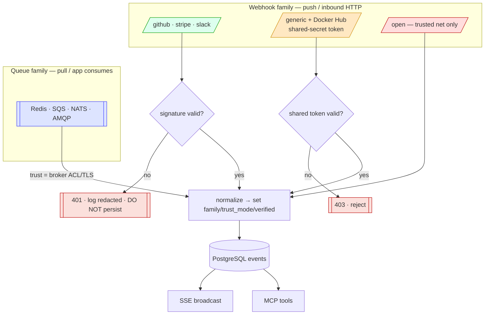

# ADR-0003: Ingestion Provider Types & Trust Model (webhooks vs. queues)

## Context and Problem Statement

`switchboard` ingests events through **two provider families**, and they have fundamentally different security stories:

1. **Webhooks (push)** — inbound HTTP. A webhook *type* either **can be cryptographically validated** (GitHub, Stripe, Slack each sign with a *different* HMAC scheme) or **cannot** (Docker Hub and homelab/self-hosted senders ship no signing scheme).
2. **Queues (pull)** — the app *consumes* from a broker (Redis is the reference; SQS, NATS, AMQP later, [ADR-0014](ADR-0014-ingestion-adapters-push-pull.md)). There is no HTTP request and no per-message signature at all; the trust boundary is the broker connection.

A single "verify if you can, otherwise trust it" approach would silently launder unverified payloads as if they were authenticated. The system must make each event's trust level **explicit, per-type, enforced, and shown** in the UI and API, so a human never has to guess whether an event was authenticated. Two questions this ADR must answer crisply: **for a webhook type that can't be signed, what is the auth pattern** (a shared secret? a password?), and **what actually protects a queue** when there is no signature to check?

## Decision Drivers

* **Honesty over convenience.** Every event's trust level is visible and accurate. Never present an unverified payload as signed.
* **Enforcement for signed.** For a webhook *declared* signed, verification is mandatory: a missing/failed signature is a 401 and the payload is **not persisted** (only the rejection is logged).
* **A real answer for unsigned webhooks.** Docker Hub and homelab senders can't sign. Rather than a vague "unverified," they get an explicit, named pattern — a **shared-secret token** — that is honestly weaker than signing and labeled as such.
* **Queues have no signature; the connection is the boundary.** For pull adapters the security control is *who may publish to the queue* — broker auth/ACL (+ TLS). That must be documented, not implied.
* **One pipeline, many front doors.** However an event arrives, it flows through the same `verify → normalize → persist → broadcast → expose` path; the trust level is metadata on the event, not a fork in the pipeline.
* **Replay resistance where the scheme allows.** Stripe and Slack sign a timestamp; enforce a freshness window. GitHub does not; don't pretend to. A shared-secret token has *no* replay resistance — say so.
* **No secret leakage.** Signature headers, bearer tokens, and secrets are never logged in full or persisted (cross-ref [ADR-0002](ADR-0002-postgres-persistence-and-retention.md)).

## Considered Options

* **Trust taxonomy:** (A) single best-effort `verified` boolean; (B) **two families (`webhook`/`queue`) with an explicit, ordered webhook trust level (`signed` / `token` / `open`) and queue-trust = connection** *(chosen)*; (C) treat everything as generic and push all trust to the network.
* **Unsigned webhook auth:** (A) nothing (open by default); (B) **a configured shared-secret token the caller presents (bearer header preferred, URL token fallback), default-required for unsigned types** *(chosen)*; (C) fabricate an HMAC scheme the provider doesn't have.
* **Queue trust:** (A) require an app-level HMAC envelope on every message; (B) **rely on the broker connection's auth/ACL (+ TLS) and document it** *(chosen)*.
* **Rejected signed payloads:** (A) persist flagged `verified=0`; (B) **reject with 401 and do not persist** *(chosen)*.

## Decision Outcome

Two provider families, an ordered webhook trust level, and connection-trust for queues. Every provider declares a **`family`** (`webhook` | `queue`) and a **`trust_mode`**; the mode is stored on every event ([ADR-0002](ADR-0002-postgres-persistence-and-retention.md): `trust_mode` + `verified` + `verify_detail`) and shown everywhere.

| `family` | `trust_mode` | What it means | `verified` |
|----------|--------------|---------------|-----------|
| `webhook` | **`signed`** | HMAC over the raw body verified against a secret (GitHub/Stripe/Slack). Integrity + authenticity (+ replay window where the scheme signs a timestamp). | `true` |
| `webhook` | **`token`** | A configured **shared-secret** the caller presents. Authenticates the *caller*, **not** the body. | `false` |
| `webhook` | **`open`** | No check at all. Trusted-network only, **off by default**. | `false` |
| `queue` | **`queue`** | No per-message check; trust is the broker connection (auth/ACL + TLS). | `false` |

Only `signed` sets `verified=true`. `token` is a real tier between `signed` and `open` — an agent or human must be able to tell it apart from both.

## Webhook family (push)

### `signed` — cryptographic verification (mandatory)

A missing, malformed, or failing signature returns **HTTP 401** and the payload is **not written to the database**; only a redacted rejection line is logged (provider, event type if known, reason, source IP — never the secret or full signature). A verified request persists with `verified=true` and `verify_detail` like `hmac-sha256 ok`. Comparisons use a constant-time compare (`hmac.Equal` from `crypto/hmac`). The raw body is read and verified **before** any parsing (a re-serialize would change the bytes and break the HMAC).

| Provider | Header(s) | Scheme | Replay window |
|----------|-----------|--------|---------------|
| GitHub | `X-Hub-Signature-256` | HMAC-SHA256 over raw body, `sha256=` prefix | n/a (no signed timestamp) |
| Stripe | `Stripe-Signature` | `t=` timestamp + `v1=` HMAC-SHA256 over `"{t}.{body}"` | reject if `|now − t|` > tolerance (default 300s) |
| Slack | `X-Slack-Signature`, `X-Slack-Request-Timestamp` | `v0=` HMAC-SHA256 over `"v0:{ts}:{body}"` | reject if `|now − ts|` > tolerance (default 300s) |

### `token` — shared-secret authentication (the pattern for unsigned webhooks)

For webhook types with **no signing scheme** — Docker Hub, homelab/self-hosted tooling — switchboard requires a **shared secret** the caller presents on every request. This is the answer to "can they set a password?": yes, a token, with a clear caveat about what it does and doesn't buy.

* **How it's presented.** Preferred: an HTTP header — `Authorization: Bearer <token>` (or a dedicated `X-Switchboard-Token`). Fallback: a **URL token** (`/webhooks/generic/{name}?token=…`) for senders that can *only* be configured with a URL (Docker Hub is exactly this). The comparison is constant-time; the token is injected via environment/config, never committed.
* **What it proves — and doesn't.** A shared-secret token authenticates the **caller** (they know the secret) but does **not** verify the **body**: unlike HMAC signing it cannot detect a tampered payload, and because the same token rides every request it offers **no replay protection**. It is therefore a **distinct, weaker tier** than `signed`, labeled `token` and never shown as signed. `verify_detail` reads e.g. `token ok (caller authenticated; body not verified)`.
* **Default-on for unsigned types.** An unsigned webhook provider **requires** a token by default and is **disabled until one is set** — so a homelab endpoint isn't silently world-writable. Rotating the token is a config change (a new value in the environment/config).

### `open` — no verification (explicit, discouraged)

For senders that genuinely cannot present any secret, an operator may *explicitly* set a provider to `open`: no check, accepted as `trust_mode=open`, `verified=false`, `verify_detail='open — no verification'`, labeled plainly. It is **off by default**, appropriate **only** on an already-isolated network (behind Caddy `forward_auth` / segmentation), and the loudest-labeled tier. Prefer `token`; reach for `open` only when a token is impossible.

> Docker Hub is a `webhook` of trust `token` (URL token) — routed through the generic endpoint, never a fabricated "signed Docker Hub" adapter. Inventing verification a provider doesn't offer would undermine the `signed` badge for every other provider.

## Queue family (pull)

A pull adapter *consumes* from a broker and feeds messages into the same pipeline ([ADR-0014](ADR-0014-ingestion-adapters-push-pull.md)). There is **no HTTP request and no signature**, so HTTP-style verification does not apply. Queue *types*:

| Queue type | Status | Trust boundary |
|------------|--------|----------------|
| **Redis** (streams/lists/pub-sub) | reference | connection auth (`requirepass`/ACL user) + TLS |
| **SQS / NATS / AMQP** | later | the broker's IAM/auth + TLS |

The security control is **who is allowed to publish** to the consumed queue — enforced by the broker's ACL, not by switchboard. Events carry `family='queue'`, `trust_mode='queue'`, `verified=false`, and `verify_detail` naming the broker/ACL identity (e.g. `redis acl: deploy-bot`). The connection secret (URL/DSN/credentials) is injected via environment/config like any other. The pull-side **store-then-ack** coupling and the pub/sub-vs-stream decision live in [ADR-0014](ADR-0014-ingestion-adapters-push-pull.md).

## Cross-cutting rules (all types)

* **Header/token sanitization before persist.** Signature/secret-bearing values (`X-Hub-Signature-256`, `Stripe-Signature`, `X-Slack-Signature`, `Authorization`, any `?token=`) are redacted to `«redacted»` before `headers` is written. Full signatures/tokens are never logged.
* **Disabled providers reject fast.** A provider toggled off returns 404/403 without processing.
* **Same downstream pipeline.** Regardless of family, accepted events normalize to the common shape, persist, broadcast over SSE, and become visible to the MCP tools ([ADR-0005](ADR-0005-mcp-tool-and-resource-contract.md)).

## Consequences

* Good, because the two families and the ordered webhook trust level (`signed` > `token` > `open`) make every event's trust story explicit — nothing is laundered into looking authenticated.
* Good, because unsigned webhooks get a **named, honest** auth pattern (a shared-secret `token`) instead of a hand-wave, and the caveat (caller-auth, not body-integrity, no replay protection) is on the record.
* Good, because signed webhooks fail closed (401, no persist) — a forged signature can't inject a stored event.
* Good, because queues' real boundary (the broker connection/ACL) is documented, so operators know what protects a channel.
* Good, because one pipeline with trust-as-metadata keeps code, schema, and specs uniform across every front door.
* Bad, because operators must understand four trust values rather than "webhooks are secure" — mitigated by prominent UI labeling and this ADR.
* Bad, because `open` is a genuine foot-gun off a trusted network — mitigated by default-off, explicit opt-in, the loudest label, and the localhost/Caddy posture ([ADR-0001](ADR-0001-web-stack-go-htmx-pico.md)).

## Confirmation

* For each signed provider: a valid signature persists with `verified=true`; an invalid/missing one returns 401 and writes **no** event row.
* Stripe/Slack tests assert a stale timestamp (outside tolerance) is rejected even with an otherwise-valid HMAC.
* A test asserts an unsigned (`token`) provider **rejects** a request with a missing/wrong token (403) and **cannot be enabled** without a token configured; a correct token persists with `trust_mode='token'`, `verified=false`.
* A test asserts an `open` provider does not exist until explicitly created and is labeled `open` in API and UI.
* A test asserts queue-ingested events carry `family='queue'`, `trust_mode='queue'`, `verified=false`.
* A test asserts persisted `headers` have signature/secret/token values redacted and logs contain none in full. HMAC comparisons use `hmac.Equal` (`crypto/hmac`), checked by a lint/grep for `==` on signature bytes.

## Pros and Cons of the Options

### Trust taxonomy: two families + ordered webhook level (chosen) vs. best-effort boolean vs. all-generic

* Good (chosen), because each provider's trust story is declared, enforced, and rendered honestly, and `signed`/`token`/`open` are visibly distinct.
* Bad (best-effort boolean), because "verify if a secret happens to be set" silently downgrades a signed provider on misconfiguration and blurs signed/token/open into one ambiguous flag.
* Bad (all-generic), because it throws away real cryptographic verification GitHub/Stripe/Slack *do* provide.

### Unsigned webhook auth: shared-secret token (chosen) vs. open-by-default vs. fake HMAC

* Good (token), because it gives unsigned senders a real, honest auth story with a clear caveat, and is default-required so nothing is silently open.
* Bad (open-by-default), because it makes every homelab endpoint world-writable unless someone remembers to lock it.
* Bad (fake HMAC), because fabricating verification a provider doesn't offer is a lie encoded in the trust UI.

### Queue trust: connection ACL/TLS (chosen) vs. app-level HMAC envelope

* Good (ACL/TLS), because it matches how brokers actually gate publishers and imposes no message format.
* Bad (app HMAC), because it invents an envelope every publisher must adopt and reimplements what broker ACLs already provide.

### Rejected signed payloads: 401 + no persist (chosen) vs. persist flagged unverified

* Good (401 + no persist), because it fails closed; forged payloads never enter the store.
* Bad (persist flagged), because it lets an attacker fill the log with unauthenticated rows and muddies the audit trail.

## Architecture Diagram

## More Information

* Adapter model this aligns with (push=webhook, pull=queue) and the pull-side ack coupling: [ADR-0014](ADR-0014-ingestion-adapters-push-pull.md), [ingestion-adapters spec](../specs/ingestion-adapters.md).
* Signature references: GitHub <https://docs.github.com/en/webhooks/using-webhooks/validating-webhook-deliveries>, Stripe <https://docs.stripe.com/webhooks#verify-events>, Slack <https://api.slack.com/authentication/verifying-requests-from-slack>, Docker Hub (no native signing) <https://docs.docker.com/docker-hub/webhooks/>.
* Queue trust references: `go-redis` <https://github.com/redis/go-redis>, Redis ACL <https://redis.io/docs/latest/operate/oss_and_stack/management/security/acl/>.
* Secret sourcing: HMAC secrets, shared-secret tokens, and queue DSNs are injected via environment/config (never committed). Storage of `family`/`trust_mode`/`verified`/`verify_detail` + redaction: [ADR-0002](ADR-0002-postgres-persistence-and-retention.md).
* Realized by the push/pull adapters (`internal/adapters/{github,stripe,slack,generic,redis}.go`) in the code session; this ADR governs the ingestion half of `docs/specs/openapi.yaml`.
