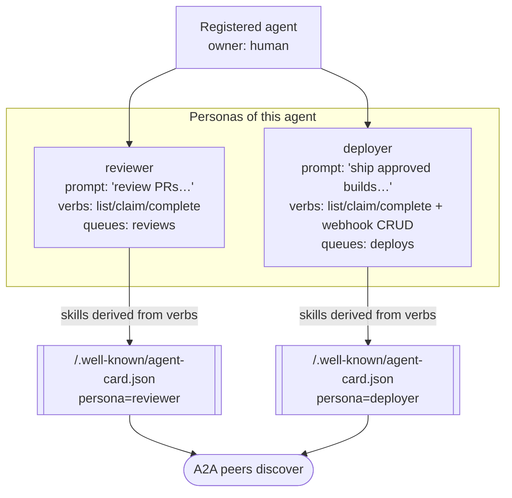

# ADR-0009: Personas as Scoped Agent Cards

## Context and Problem Statement

[ADR-0008](ADR-0008-human-principal-vended-endpoints.md) gives each registered agent a vended MCP endpoint scoped to a set of queues and verbs. But a single agent runtime is often used for several *different jobs* — the same base model might act as a code **reviewer** in one context and a **deployer** in another. Those jobs want different system prompts, advertise different skills, and — critically — should carry **different access**. Granting one broad endpoint that can do everything violates least privilege; registering a separate agent per job duplicates the runtime and loses the "same agent, different hats" relationship.

This ADR decides how a single agent presents multiple scoped faces, and how those faces are advertised to peers for the A2A discovery layer ([ADR-0010](ADR-0010-a2a-discovery-human-vended-friending.md)).

## Decision Drivers

* **Least privilege per job.** A reviewer persona should not be able to deploy; a deployer persona should not need review tooling. Scope should follow the job, not the runtime.
* **Richer interaction *and* tighter scoping at once.** Personas let one agent hold several specialized roles (richer) while each role carries only the access it needs (tighter) — the two goals reinforce rather than fight.
* **Human authors intent; the system enforces capability.** A human writes each persona's system prompt (its behavior/intent). The persona's *advertised* capabilities must be **derived from what is actually vended**, so a persona can never claim a skill it cannot perform.
* **Discoverability needs a standard shape.** Personas must be advertisable to other agents in an interoperable format, not a switchboard-proprietary blob.
* **Truth in advertising.** What a persona says it can do and what it can actually do must be the same set, by construction — no drift, no lying.

## Considered Options

* **(A) One endpoint per agent, no personas** — a single broad grant; behavior differences handled entirely in the client.
* **(B) A separate registered agent per job** — duplicate the runtime for each role.
* **(C) Personas: one agent → many personas, each = base runtime + human-authored prompt + a subset of the agent's vended verbs, advertised as an A2A Agent Card** whose skills are derived from the vended subset. *(chosen)*

## Decision Outcome

Chosen option: **"(C) personas as scoped Agent Cards."**

### What a persona is

A **persona** is a named, scoped face of a single registered agent, composed of exactly three things:

1. **Base agent runtime** — the underlying registered agent ([ADR-0008](ADR-0008-human-principal-vended-endpoints.md)).
2. **A human-authored system prompt** — the persona's intent/behavior, written by the owning human.
3. **A subset of that agent's vended tools/verbs** — the persona's capability slice. This subset is **the unit of capability scoping.**

One agent has many personas. A "reviewer" persona and a "deployer" persona of the *same* agent carry **different access**: reviewer might have `list_todos`/`claim`/`complete` on the `reviews` queue; deployer might have those plus webhook verbs on the `deploys` queue. Same runtime, different hats, different powers.

### Derivation rule (skills follow capability)

A persona's **advertised skills are derived from what is actually vended to it** — never hand-declared independently. If a verb or queue is not in the persona's subset, the persona cannot advertise a skill that would require it. This makes "what it says it does" ≡ "what it can do" a structural invariant, not a review checklist. The human authors the *prompt*; the system computes the *skills* from the grant.

### Expressed as A2A Agent Cards

Each persona is published as an **[A2A](https://a2a-protocol.org/) Agent Card** served at the well-known path **`/.well-known/agent-card.json`** (per-persona; see the [personas-and-agent-cards spec](../openspec/specs/personas/spec.md) for how multiple personas map to well-known URLs). The Agent Card is the interoperable, standard-shaped advertisement other agents discover during friending ([ADR-0010](ADR-0010-a2a-discovery-human-vended-friending.md)). Its `skills` array is the derived set above; its identity/provenance ties back to the owning human.

### Consequences

* Good, because least privilege and rich multi-role interaction are achieved together — each job gets its own minimal grant.
* Good, because the derivation rule makes over-advertisement impossible: a persona physically cannot claim a skill outside its vended subset.
* Good, because Agent Cards are a standard (A2A) shape, so personas are discoverable by any A2A-speaking peer, not just switchboard clients.
* Good, because humans control behavior (the prompt) while the system controls capability (the subset) — a clean split of authorship.
* Bad, because persona proliferation is possible (many personas per agent) and must be managed/audited — mitigated because each persona's power is bounded and visible via its card.
* Bad, because deriving skills from vended verbs requires a mapping from verb→advertised-skill that must be maintained — captured in the personas spec.

### Confirmation

* The [personas-and-agent-cards spec](../openspec/specs/personas/spec.md) defines the persona record (agent + prompt + verb subset), the verb→skill derivation, and the Agent Card mapping + well-known endpoint(s).
* A test asserts a persona's advertised `skills` are a function of its vended verb subset — adding/removing a verb changes the card; a skill requiring an ungranted verb never appears.
* A test asserts two personas of one agent enforce their *own* scopes independently (reviewer denied deploy verbs, and vice-versa).
* A test asserts `/.well-known/agent-card.json` serves a schema-valid A2A Agent Card for a persona.

## Pros and Cons of the Options

### (A) One broad endpoint, no personas (rejected)

* Good, because simplest.
* Bad, because it forces one grant to cover every job the agent does — the opposite of least privilege.
* Bad, because behavior differences live only in the client, invisible and unscoped to switchboard.

### (B) Separate registered agent per job (rejected)

* Good, because each job is independently scoped.
* Bad, because it duplicates the runtime and severs the "same agent, different roles" relationship (shared owner, shared identity chain).
* Bad, because it multiplies agent registrations and their credentials for what is one actor.

### (C) Personas as scoped Agent Cards (chosen)

* Good, because one actor, many minimal-scope faces, each advertised in a standard shape.
* Good, because advertised capability is derived from real capability — no drift.
* Bad, because persona/skill-mapping management overhead — accepted and specified.

## Architecture Diagram

## More Information

* Personas are the discoverable units in the friending flow: [ADR-0010](ADR-0010-a2a-discovery-human-vended-friending.md).
* The vended-verb pool a persona draws its subset from: [ADR-0008](ADR-0008-human-principal-vended-endpoints.md).
* A2A Agent Card format and the `agent-card.json` well-known convention: <https://a2a-protocol.org/> and the [personas-and-agent-cards spec](../openspec/specs/personas/spec.md).
