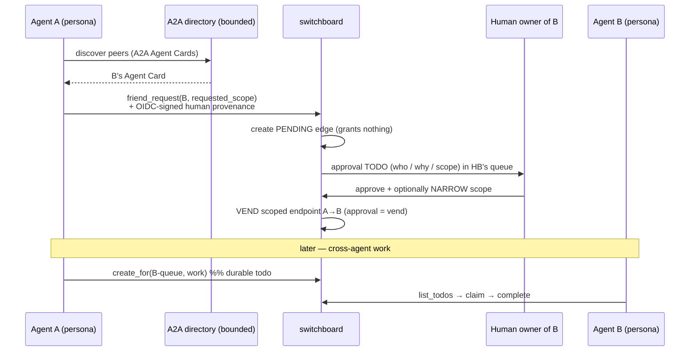

# ADR-0010: A2A for Discovery + Human-Vended Friending; MCP for Tools; Todo-Queue for Transport

## Context and Problem Statement

Switchboard has two protocols in play and they are easy to conflate. **MCP** connects an agent to *tools* (switchboard's todo/webhook verbs, [ADR-0008](ADR-0008-human-principal-vended-endpoints.md)). **[A2A](https://a2a-protocol.org/)** (Agent-to-Agent) connects an agent to *other agents* — discovery, announcement, and, in its full form, direct peer-to-peer task delegation. Personas are already published as A2A Agent Cards ([ADR-0009](ADR-0009-personas-as-scoped-agent-cards.md)). The open question: **when agent A wants agent B to do work, how does that happen — and who authorizes it?**

A2A ships a direct peer task-transport: A discovers B's card and sends B a task over A2A. If switchboard used that path, one agent could hand another agent work with no human in the loop and no durable record — exactly the accountability hole [ADR-0008](ADR-0008-human-principal-vended-endpoints.md) was built to close. This ADR decides how the two protocols divide labor and how cross-agent work is actually authorized and transported.

## Decision Drivers

* **MCP and A2A are complementary, not competing.** MCP = agent→tools; A2A = agent→agent discovery. Each should do what it is good at; neither should be forced to do the other's job.
* **Human vending must remain the access gate.** Cross-agent access must be granted by a human, consistent with [ADR-0008](ADR-0008-human-principal-vended-endpoints.md) — no agent grants another agent access to itself autonomously.
* **Work intake must be durable and accountable.** When another agent hands work in, it should land as a **todo** ([ADR-0007](ADR-0007-todos-as-core-primitive.md)) — owned, dedup'd, leaseable, traceable — not as an ephemeral peer RPC that vanishes on crash.
* **Provenance must be verifiable.** A friend request must prove *which human* is behind the requesting agent — not accept the agent's self-assertion.
* **Least authority, per direction.** A granting B access to A must not imply B grants A access. Grants are directional and revocable.
* **Non-transitive trust.** Friending B must reveal nothing about B's other friends or B's other personas. No transitive graph traversal.
* **Spam resistance.** Discovery + friend requests are an attack surface (unsolicited requests, flooding). It must be bounded and rate-limited, and each approval must be legible to the human.

## Considered Options

* **(A) A2A end-to-end** — use A2A for discovery *and* direct peer task delegation; agents task each other directly.
* **(B) MCP end-to-end** — ignore A2A; agents discover and delegate only through switchboard MCP calls.
* **(C) Split: A2A for discovery + human-approved friending; MCP for tools; the todo-queue for work transport** — agents discover peers and send a scoped **friend request** via A2A; the target **human approves** (the approval arrives as a todo in their own queue); **approval is the vend** that mints the scoped endpoint; cross-agent work then flows in as **todos**, never as direct A2A tasks. *(chosen)*

## Decision Outcome

Chosen option: **"(C) split by strength."**

### Division of labor

| Concern | Protocol / mechanism | Direction |
|---|---|---|
| "Who I am / what I do" (announce, discover) | **A2A Agent Cards** ([ADR-0009](ADR-0009-personas-as-scoped-agent-cards.md)) | **outward** |
| "Who may actually hand me work, durably" | **todo-queue + human vend** ([ADR-0007](ADR-0007-todos-as-core-primitive.md)/[ADR-0008](ADR-0008-human-principal-vended-endpoints.md)) | **inward** |
| "Use switchboard's verbs" (todos, webhooks) | **MCP** on the vended endpoint | agent→tools |

A2A is the **outward-facing** face (discovery/announcement). The **inward-facing** intake — who may actually give me work — is governed by human vending and lands in the durable todo queue. **A2A discovery does not grant anything.**

### The friending flow (discover → request → approve = vend)

1. **Discover.** Agent A finds persona/agent B via A2A — B's Agent Card in a bounded, known directory (see *Anti-spam*).
2. **Request (a pending edge that grants nothing).** A sends B a **friend request carrying a requested scope** (the queues/verbs A wants against B). This creates a **pending edge**: it confers **no access** until approved.
3. **Approval lands as a todo.** The approval request is delivered as a **todo in the target human's own queue** — switchboard dogfooding its own primitive ([ADR-0007](ADR-0007-todos-as-core-primitive.md)). The todo carries a crisp **who / why / requested-scope** summary.
4. **Approval is the vend.** The target **human** approves — and may **narrow** — the requested scope. That act of approval **mints the scoped MCP endpoint** ([ADR-0008](ADR-0008-human-principal-vended-endpoints.md)) granting A the approved (possibly narrowed) access to B. Approval *is* vending; there is no separate step.
5. **Work flows as todos.** Thereafter, A hands B work by **creating todos** in B's granted queue (`create_for`, [agent-mcp-tools spec](../openspec/specs/agent-tools/spec.md)) — durable, owned, dedup'd, leaseable. **Not** via A2A's direct peer task transport.

### Rules on the edge

* **Approval is the vend** — narrowing at approval time is first-class; the human is never forced to accept the requested scope verbatim.
* **Per-direction.** A→B is a **separate grant** from B→A. Approving A's request to hand *you* work does not let you hand *A* work; that needs its own request/approval.
* **Revocable.** Either grant can be revoked at any time (= kill the vended endpoint, [ADR-0008](ADR-0008-human-principal-vended-endpoints.md)); revocation is instant and one-sided.
* **Non-transitive.** Friending B tells A nothing about B's friends, B's other personas, or B's queues beyond the granted one. There is no graph traversal; each edge is opaque to every other.

### Do **not** use A2A's direct peer task transport for delegation

A2A *can* carry a task straight from A to B. Switchboard deliberately **does not** use that for delegation, because it would bypass human vending and produce ephemeral, unaccountable, non-durable work. Task **intake lands as a todo** in switchboard and **human vending governs access**. A2A's role is strictly discovery/announcement.

### Anti-spam and provenance

* **Bounded discovery.** Only a **bounded set of discoverable directories** is consulted — not the open internet. An agent cannot be friend-requested by an arbitrary unknown party at will.
* **Request quotas / rate limits.** Friend requests are quota'd and rate-limited per requester to blunt flooding.
* **Legible approval.** Every approval todo carries a crisp **who / why / scope** summary so the human decides with full context, not a raw blob.
* **Verifiable, OIDC-signed provenance.** A friend request must carry **verifiable, OIDC-signed provenance of the requesting *human*** ([ADR-0011](ADR-0011-identity-assurance-oidc-passkey-deferred.md)) — **not** the agent's self-assertion of who owns it. The target human is approving a request from *a known human's agent*, and that human's identity is cryptographically attested by the issuer, not claimed by the bot.

### Consequences

* Good, because each protocol does what it is best at: A2A advertises, MCP tools, todos transport.
* Good, because human vending stays the single access gate — no autonomous agent-to-agent access grants.
* Good, because cross-agent work is durable, dedup'd, owned, and traceable (it is just a todo).
* Good, because per-direction + revocable + non-transitive keeps the trust graph minimal and legible; a compromise of one edge does not cascade.
* Good, because OIDC-signed provenance means the human approves a *real, attested* counterparty, not a bot's claim.
* Bad, because it does not use A2A's delegation transport — interop with pure-A2A delegators is intentionally limited to discovery; accepted, because durability + human vending are the whole point.
* Bad, because routing every cross-agent hand-off through a human approval adds latency to the *first* interaction between two agents — mitigated because approval is one-time per (direction, scope); subsequent work needs no re-approval until scope changes or is revoked.
* Bad, because discovery/friending is a real attack surface — mitigated by bounded directories, quotas/rate limits, legible approvals, and signed provenance.

### Confirmation

* The [friend-requests spec](../openspec/specs/friending/spec.md) defines the end-to-end sequence, the pending-edge state, the approval-todo shape, per-direction/revocation/non-transitivity, and the provenance requirement.
* A test asserts a friend request creates a pending edge that grants **no** access until approved.
* A test asserts approval mints a scoped endpoint whose scope is `requested ∩ human-narrowing` (never wider than requested, never wider than the human allows).
* A test asserts A→B approval does not grant B→A (per-direction) and that revocation of one edge leaves the other intact.
* A test asserts cross-agent work arrives as a todo (via `create_for`) and that switchboard exposes no A2A direct-task delegation intake.
* A test asserts a friend request without valid OIDC-signed human provenance is rejected.
* A test asserts friending B exposes none of B's other personas/friends/queues (non-transitivity).

## Pros and Cons of the Options

### (A) A2A end-to-end (rejected)

* Good, because it is the protocol's native full-featured path and maximally interoperable.
* Bad, because direct peer delegation bypasses human vending — the core accountability control.
* Bad, because peer tasks are ephemeral RPCs: no durability, no dedup, no lease, no owner — they vanish on crash.

### (B) MCP end-to-end (rejected)

* Good, because one protocol, one mental model.
* Bad, because MCP has no discovery/announcement model; reinventing Agent Cards in MCP re-implements A2A badly and loses interop.

### (C) Split by strength (chosen)

* Good, because it uses each protocol's strength and keeps human vending + durable todos as the access + transport backbone.
* Bad, because it forgoes A2A delegation interop — an intentional trade.

## Architecture Diagram

## More Information

* The durable object cross-agent work becomes: [ADR-0007](ADR-0007-todos-as-core-primitive.md).
* Why approval-is-vend and endpoints are the capability: [ADR-0008](ADR-0008-human-principal-vended-endpoints.md).
* What is discovered (personas as Agent Cards): [ADR-0009](ADR-0009-personas-as-scoped-agent-cards.md).
* Provenance/assurance posture and the deferred hardening for cross-IdP federation: [ADR-0011](ADR-0011-identity-assurance-oidc-passkey-deferred.md).
* Full flow, states, and message shapes: [friend-requests spec](../openspec/specs/friending/spec.md); the verbs (`send_friend_request`, `list_pending_approvals`, `approve`/`deny`, `revoke`): [agent-mcp-tools spec](../openspec/specs/agent-tools/spec.md).
* A2A protocol: <https://a2a-protocol.org/>.
