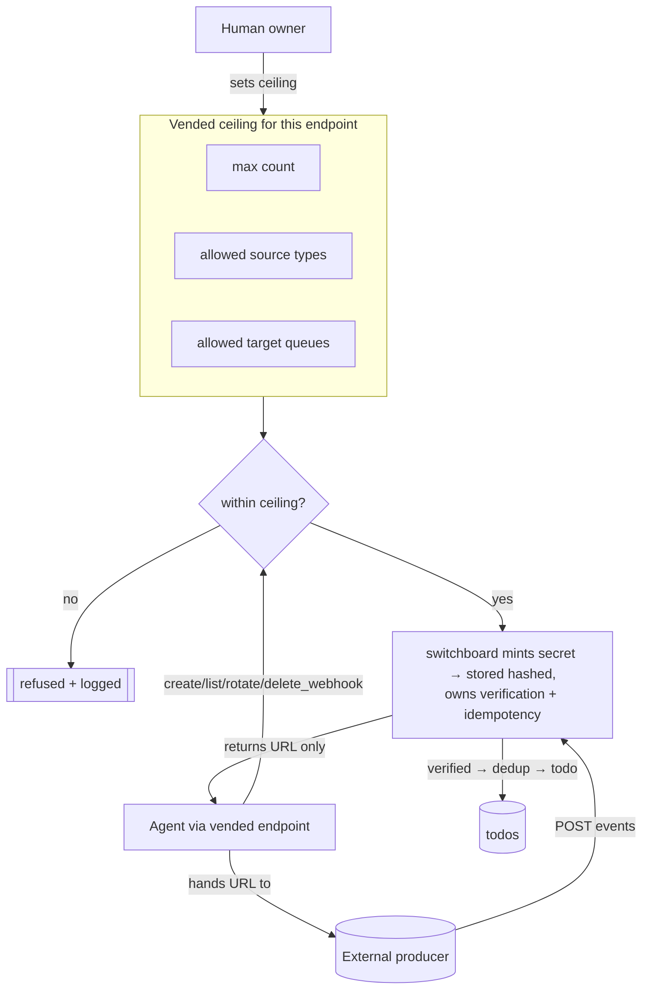

# ADR-0012: Agents Self-Manage Their Own Webhooks (within a vended ceiling)

## Context and Problem Statement

An agent's job frequently *is* to wire up an inbound source: "watch this GitHub repo," "receive Stripe events for this account," "take deploy pings from this homelab service." Under [ADR-0007](ADR-0007-todos-as-core-primitive.md) those inbound events become todos the agent then drains. But **who creates the webhook** that produces them? If every new webhook requires a human to hand-edit switchboard config, agents cannot self-serve their own work sources and the human becomes a bottleneck for routine ops. Conversely, if agents can create arbitrary webhooks of any type pointed at any queue, they escape the least-privilege boundary [ADR-0008](ADR-0008-human-principal-vended-endpoints.md) draws.

This ADR decides how webhook lifecycle management is divided between agents and humans.

## Decision Drivers

* **Agents own ops; humans own policy.** Creating/rotating/deleting a webhook is routine operational work an agent should do itself. *Deciding the limits* — how many, which source types, which target queue — is policy a human sets.
* **Least privilege still holds.** Self-management must operate strictly **within a ceiling** the human vended, not as an open door.
* **Switchboard owns verification and idempotency.** The trust model ([ADR-0003](ADR-0003-per-provider-ingestion-and-trust-model.md)) and dedup ([ADR-0007](ADR-0007-todos-as-core-primitive.md)) are switchboard's job, not the agent's — an agent must not be able to weaken verification or forge idempotency behavior.
* **Secrets stay with switchboard.** The signing secret for a created webhook is minted by switchboard and stored **hashed** in PostgreSQL ([ADR-0002](ADR-0002-postgres-persistence-and-retention.md)); the agent gets only the URL to hand to the producer, never the secret material.
* **No new trust holes.** A self-managed webhook is exactly as trustworthy as any other webhook of its type — self-management changes *who created it*, not *how it is verified*.

## Considered Options

* **(A) Humans manage all webhooks** — every webhook is created via human/config action; agents only consume.
* **(B) Agents manage webhooks with no ceiling** — the vended endpoint can create any webhook of any type to any queue.
* **(C) Agents self-manage webhooks within a human-vended ceiling** — the vended endpoint includes webhook CRUD verbs bounded by a per-agent ceiling (max count, allowed source types, allowed target queue); switchboard mints the secret and owns verification + idempotency; the agent receives only the URL. *(chosen)*

## Decision Outcome

Chosen option: **"(C) agents self-manage within a vended ceiling."** This can be read as a corollary of [ADR-0008](ADR-0008-human-principal-vended-endpoints.md) (webhook verbs are part of the vended scope) and [ADR-0007](ADR-0007-todos-as-core-primitive.md) (webhooks are todo producers); it is recorded separately because the human/agent responsibility split is a decision in its own right.

### The split — humans own policy, agents own ops

**The vended MCP endpoint includes webhook CRUD verbs** — `create_webhook`, `list_webhooks`, `rotate_webhook`, `delete_webhook` ([agent-mcp-tools spec](../specs/agent-mcp-tools.md)) — that operate **within the human's vended ceiling**:

| The ceiling (human sets, per agent/endpoint) | The ops (agent does, within the ceiling) |
|---|---|
| **max webhook count** | create up to the max |
| **allowed source types** (e.g. `github`, `generic`; not `stripe`) | create only allowed types |
| **allowed target queue(s)** | route created webhooks only to granted queues |

An agent can stand up, rotate, and tear down its own webhooks all day — but only of the types, up to the count, and pointed at the queues its human permitted.

### Switchboard's non-negotiable ownership

* **Switchboard mints the signing secret** for each created webhook and stores it **hashed in PostgreSQL** ([ADR-0002](ADR-0002-postgres-persistence-and-retention.md)). The **agent never sees or stores the secret.**
* **Switchboard owns verification.** A created signed-type webhook is verified exactly as [ADR-0003](ADR-0003-per-provider-ingestion-and-trust-model.md) mandates — the agent cannot downgrade a `signed` webhook to `token`/`open`, cannot disable signature checks, cannot alter trust mode. A generic-type webhook remains `token` (or `open`).
* **Switchboard owns idempotency.** Dedup of at-least-once deliveries into one todo ([ADR-0007](ADR-0007-todos-as-core-primitive.md)) is switchboard's behavior, not the agent's.
* **The agent receives the URL to hand to the producer** (and, for a signed type, arranges for the producer to be configured with the secret out-of-band via switchboard, never by the agent copying it). Create returns the ingest URL; `rotate` issues a new secret/URL and retires the old.

### Consequences

* Good, because agents self-serve routine webhook ops without a human in the loop for every wire-up — the human bottleneck is gone for the common case.
* Good, because least privilege holds: the ceiling caps count, types, and target queues per agent.
* Good, because trust integrity is preserved — switchboard still verifies and dedups; self-management cannot open a trust hole ([ADR-0003](ADR-0003-per-provider-ingestion-and-trust-model.md)).
* Good, because secrets never leave switchboard — the agent handles URLs, not signing keys.
* Bad, because the ceiling is another policy surface to define, store, and enforce per endpoint — captured in the [accounts-and-endpoints spec](../specs/accounts-and-endpoints.md).
* Bad, because an agent could churn webhooks (create/rotate/delete) noisily within its ceiling — mitigated by count caps, rate limits, and the fact that all such actions are logged and attributable to the owning human ([ADR-0008](ADR-0008-human-principal-vended-endpoints.md)).

### Confirmation

* The [agent-mcp-tools spec](../specs/agent-mcp-tools.md) defines the four webhook verbs and their ceiling-bounded behavior; the [accounts-and-endpoints spec](../specs/accounts-and-endpoints.md) defines the ceiling fields.
* A test asserts `create_webhook` is refused beyond `max` count, for a disallowed source type, or targeting an ungranted queue.
* A test asserts the created webhook's signing secret is stored (hashed) by switchboard and is **never** returned to the agent; `create`/`rotate` return only the URL.
* A test asserts a self-created `signed`-type webhook is verified per [ADR-0003](ADR-0003-per-provider-ingestion-and-trust-model.md) and its trust mode cannot be altered by the agent.
* A test asserts duplicate deliveries to a self-created webhook dedup into one todo ([ADR-0007](ADR-0007-todos-as-core-primitive.md)).

## Pros and Cons of the Options

### (A) Humans manage all webhooks (rejected)

* Good, because tightest control — nothing is created without a human.
* Bad, because the human is a bottleneck for routine wire-ups, defeating the point of self-serving agents.

### (B) Agents manage webhooks with no ceiling (rejected)

* Good, because maximally autonomous.
* Bad, because it escapes least privilege: an agent could create any-type webhooks to any queue, an obvious escalation and abuse surface.

### (C) Self-manage within a vended ceiling (chosen)

* Good, because it gets agent autonomy for ops while humans retain policy and switchboard retains verification/idempotency/secrets.
* Bad, because it adds a ceiling policy surface — accepted and specified.

## Architecture Diagram

## More Information

* Webhooks as todo producers, and idempotency-key dedup: [ADR-0007](ADR-0007-todos-as-core-primitive.md).
* Verification per source type (what switchboard enforces regardless of who created the webhook): [ADR-0003](ADR-0003-per-provider-ingestion-and-trust-model.md) and the [ingestion-adapters spec](../specs/ingestion-adapters.md). Webhooks are the **push** family of the adapter model ([ADR-0014](ADR-0014-ingestion-adapters-push-pull.md)); agent self-management of **pull** (queue) adapters is a natural future extension of this ceiling, not covered here.
* The vended endpoint and scope this extends: [ADR-0008](ADR-0008-human-principal-vended-endpoints.md).
* Where minted secrets are stored (hashed): [ADR-0002](ADR-0002-postgres-persistence-and-retention.md).
* Verb signatures + the ceiling fields: [agent-mcp-tools spec](../specs/agent-mcp-tools.md), [accounts-and-endpoints spec](../specs/accounts-and-endpoints.md).
