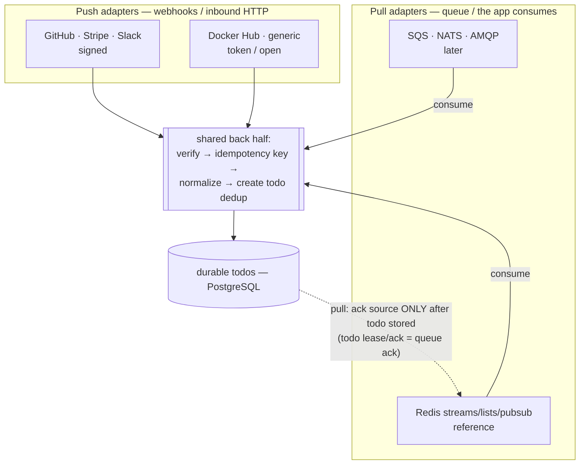

# ADR-0014: Ingestion Adapters — Push (webhook) and Pull (queue) Families

> **Superseded 2026-09-21, with the shared-receiver removal.** The pull family — the Redis reference adapter, the adapter runner,
> `SWITCHBOARD_REDIS_URL`, and the `adapters` table (dropped by migration 0021) — and the
> operator-configured push receivers were removed. Self-managed webhooks
> ([ADR-0012](ADR-0012-agents-self-manage-webhooks.md), `POST /webhooks/w/{token}`) are the only
> ingestion surface: instance-wide ingestion belongs to no tenant, so it cannot name the endpoint that
> owns the todos it mints ([ADR-0022](ADR-0022-endpoint-scoped-todo-ownership.md)).

## Context and Problem Statement

Switchboard's ingestion has been described source-by-source: [ADR-0003](ADR-0003-per-provider-ingestion-and-trust-model.md) fixes the trust model (webhook `signed`/`token`/`open`, plus `queue` for pull sources) and the (former) webhook-ingestion spec listed Redis alongside GitHub/Stripe/Slack/Docker Hub/generic as if it were "just another webhook source." But **Redis is not a webhook.** There is no inbound HTTP request and no signature; the app *consumes* from a queue (a **pull** transport), and a queue carries its own **ack / redelivery** semantics that HTTP webhooks simply do not have. Flattening Redis into a "sources" list hides a real structural difference — and it does not generalize to the other queues we will want next (SQS, NATS, AMQP).

This ADR generalizes ingestion into **adapters** with two families — **push** (webhooks) and **pull** (queues) — that share one normalization contract into the durable todo queue ([ADR-0007](ADR-0007-todos-as-core-primitive.md)), and it pins the one mechanic the pull family needs and the push family does not: **coupling the source ack to the todo.**

## Decision Drivers

* **One contract, many transports.** Every adapter — push or pull — must verify (per its transport), derive an idempotency key, normalize, and create a todo. The todo contract (**at-least-once + idempotent dedup**, [ADR-0007](ADR-0007-todos-as-core-primitive.md)) is identical regardless of how the delivery arrived.
* **Honesty about transport shape.** A webhook is *push* (inbound HTTP, verified by signature/token at receive). A queue is *pull* (the app consumes; trust is the connection's ACL/TLS; the source has its own ack/redelivery). Modeling them as one flat list obscures the pull-side ack coupling.
* **Extensibility.** The pull family must extend to SQS / NATS / AMQP without re-deciding the model — Redis is the *reference* implementation, not a special case.
* **No work lost at the transport boundary.** For a pull adapter, the source message must **not** be ack'd/removed until the resulting todo is durably stored — otherwise a crash between "consumed" and "todo persisted" loses the message with no redelivery. The todo's durability must *become* the queue's ack.

## Considered Options

* **(A) Keep the flat "sources" list** — webhooks and Redis as peer sources under three trust modes.
* **(B) Ingestion adapters with two families** — **push** (webhook) + **pull** (queue), sharing verification/idempotency/normalization → todos; **Redis = the reference pull adapter**; the source ack coupled to the todo. *(chosen)*
* **(C) Two separate ingestion subsystems** — webhooks and queues as wholly independent pipelines with no shared contract.

## Decision Outcome

Chosen option: **"(B) ingestion adapters, push and pull families."**

**Implementation status (partial):** the push family (webhook adapters — GitHub, Stripe, Slack, Docker Hub, generic) is implemented (`internal/ingest/`). The pull family (Redis reference adapter and the store-then-ack coupling described below) is **not yet implemented** in code as of this writing — no `internal/adapters` or Redis consumer exists. The decision recorded here — the two-family model and the ack-coupling mechanic — is accepted; only the pull-family build-out remains outstanding.

### The model

An **ingestion adapter** turns an external delivery into a todo. Two families share the **same back half** — `verify → derive idempotency key → normalize → create todo (dedup) → persist event for history` ([webhook-ingestion spec](../openspec/specs/webhook-ingestion/spec.md), [queue-adapters spec](../openspec/specs/queue-adapters/spec.md)) — and differ only in the **front half** (the transport):

| Family | Transport | Members | Verified by | Trust ([ADR-0003](ADR-0003-per-provider-ingestion-and-trust-model.md)) |
|--------|-----------|---------|-------------|-------|
| **Push (webhooks)** | inbound HTTP | GitHub, Stripe, Slack | HMAC signature at receive | `signed` |
| | | Docker Hub, generic | shared-secret token (header or `?token=`), required by default | `token` / `open` |
| **Pull (queue adapters)** | the app consumes a queue | **Redis (lists / streams / pub-sub) — reference**; SQS / NATS / AMQP later | the connection itself (ACL / TLS) | `redis` (queue) |

**Redis is reclassified** from "a webhook source / a third trust-mode sibling" to **"the reference *pull* adapter."** Its trust mode (`queue` — trust = connection ACL/TLS) from [ADR-0003](ADR-0003-per-provider-ingestion-and-trust-model.md) is unchanged; what changes is the framing — it is a transport *family*, not an HTTP source, and its family generalizes.

### The ack-coupling mechanic (what pull needs and push does not)

* **Push (webhook):** the "ack" is the HTTP response. A non-2xx makes the *sender* retry — that is where at-least-once comes from — and idempotency dedup collapses the retries. There is no source-side message to remove.
* **Pull (queue): the source ack is coupled to the todo.** On consume, switchboard creates and **durably stores the todo first**, and only **then** acks/removes the source message. Concretely:
  1. Consume a message → derive the idempotency key **from the source message id** (e.g. a stream entry id) → create the todo (dedup) → todo is durably in PostgreSQL ([ADR-0002](ADR-0002-postgres-persistence-and-retention.md)).
  2. **Then** ack the source (stream consumer-group `XACK`; remove from the processing list; etc.).
  3. A crash **between** consume and todo-store leaves the source message **un-acked** ⇒ it is **redelivered** ⇒ dedup (idempotency key = source message id) collapses it ⇒ **no duplicate todo, no lost message.**

The result: **the todo's durability (and thereafter its lease/ack, [ADR-0007](ADR-0007-todos-as-core-primitive.md)) *is* the queue's ack.** The queue hands durability off to the todo store at the moment of durable storage; the todo lifecycle owns the work from there. This yields **at-least-once + idempotent dedup — the same contract as webhooks, a different transport.**

**Ack-on-store vs. ack-on-complete.** Acking once the todo is durably stored is the floor and the recommended default (todo durability is the durability boundary). A pull adapter *may* instead defer the source ack until the todo is **completed**, for stronger end-to-end coupling at the cost of holding source redelivery state longer. Recorded as an **open question** (default: ack-on-store).

### Transport modes for the reference (Redis)

* **Streams + consumer groups** (`XREADGROUP` … `XACK`) — per-message ack + redelivery on restart; **preferred** for durable work. This decides [ADR-0003](ADR-0003-per-provider-ingestion-and-trust-model.md)'s deferred "pub/sub vs. consumer-group stream" sub-decision in favor of an ack-capable mode.
* **Reliable list** (`BRPOPLPUSH` onto a processing list, `LREM` after the todo is stored) — a list-based reliable-queue pattern with the same store-then-ack coupling.
* **Pub/sub** — fire-and-forget, **no redelivery**; safe only where message loss is acceptable. Documented as such and **not** recommended for durable work.

### Consequences

* Good, because one normalization/idempotency/todo contract serves every transport — push or pull — so the two families cannot drift.
* Good, because the model is honest about the push/pull distinction instead of hiding the pull-side ack coupling.
* Good, because it extends to SQS/NATS/AMQP by adding a pull adapter, with no model change — Redis is a reference, not a special case.
* Good, because store-then-ack means **no work is lost at the transport boundary**: a crash mid-ingest redelivers and dedups to exactly one todo.
* Bad, because each pull transport must map its own ack/redelivery primitive (`XACK`, list `LREM`, SQS visibility timeout, NATS ack, AMQP `basic.ack`) — inherent to supporting real queues; captured per-adapter in the spec.
* Bad, because pub/sub-style sources cannot guarantee delivery — accepted and documented; ack-capable modes are preferred for durable work.

### Confirmation

* The [webhook-ingestion spec](../openspec/specs/webhook-ingestion/spec.md) and [queue-adapters spec](../openspec/specs/queue-adapters/spec.md) define the shared contract, the push family (sources + verification), the pull family (Redis reference + ack coupling), and the routing rules.
* A test asserts a pull adapter that crashes **after consume but before todo-store** redelivers and dedups to **one** todo — no loss, no duplicate.
* A test asserts the source message is **not** ack'd/removed until the todo is durably stored.
* A test asserts a push delivery and a pull delivery of "the same logical event" produce the **identical** todo shape ([todos spec](../openspec/specs/todo-queue/spec.md)).

## Pros and Cons of the Options

### (A) Flat "sources" list (rejected)

* Good, because simplest to describe — one list.
* Bad, because it models a pull queue as an HTTP source, hiding the ack/redelivery coupling that pull *requires* and push does not.
* Bad, because it does not generalize: adding SQS/NATS/AMQP would keep bolting queues onto a "webhook sources" list.

### (B) Push + pull adapter families (chosen)

* Good, because shared normalization + a per-family transport contract; honest, extensible, loss-free at the boundary.
* Bad, because per-pull-transport ack mapping — accepted as intrinsic.

### (C) Two separate subsystems (rejected)

* Good, because each pipeline is unconstrained by the other.
* Bad, because it duplicates verification, idempotency, and normalization, inviting drift between how a webhook and a queue message become a todo — the exact single-contract property (B) preserves.

## Architecture Diagram

## More Information

* Trust modes & per-source verification (authoritative): [ADR-0003](ADR-0003-per-provider-ingestion-and-trust-model.md).
* The durable todo, dedup, and lease/ack the adapters normalize into: [ADR-0007](ADR-0007-todos-as-core-primitive.md), [todos spec](../openspec/specs/todo-queue/spec.md).
* Agent-managed webhooks are the push family under a ceiling: [ADR-0012](ADR-0012-agents-self-manage-webhooks.md).
* Full adapter contract, per-family detail, routing rules: [webhook-ingestion spec](../openspec/specs/webhook-ingestion/spec.md) (push), [queue-adapters spec](../openspec/specs/queue-adapters/spec.md) (pull).
* Secrets: webhook signing secrets and queue connection URLs are injected via environment/config; switchboard-minted secrets are stored hashed in PostgreSQL ([ADR-0002](ADR-0002-postgres-persistence-and-retention.md)).
