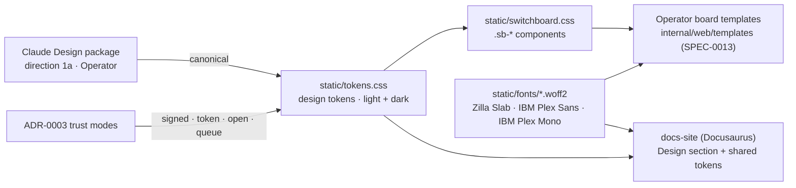

# ADR-0016: Adopt the "Operator" (Brass & Bakelite) Design Language; Hand-Rolled Token CSS Replaces Pico.css

## Context and Problem Statement

The high-fidelity Claude Design "hero journey" package explored two visual directions for switchboard's
human surface — **1a "Operator"** (warm parchment, brass, oxblood; switchboard-era telephony) and **1b
"Console"** (dark, dense dev-tool) — and built out direction 1a into a complete five-view operator
board (Board, Todos, Endpoints, Personas, Friends) with modals, a todo detail drawer, and live-feed
components. Meanwhile, the shipped UI has drifted from [ADR-0001](ADR-0001-web-stack-go-htmx-pico.md):
Pico.css was never vendored or linked — templates are styled by an inline `<style>` block plus a
`tokens.css` that overrides `--pico-*` variables for a Pico that is not served. Which design language is
canonical, and what CSS architecture implements it — do we retrofit Pico.css as ADR-0001 assumed, or
own a small hand-rolled design-token layer?

## Decision Drivers

* The approved designs are **component-heavy and highly custom** (stat tiles, live feed rows, lease
  progress bars, chip pickers, drawers, toasts) — far beyond what classless styling of semantic HTML
  produces out of the box.
* ADR-0001's constraints still hold: no Node build, no CDN, everything vendored and embedded via
  `embed.FS`, strict same-origin CSP, server-rendered HTML + HTMX + SSE.
* One visual identity must serve **two surfaces**: the operator board (web UI) and the Docusaurus docs
  site, which already shares `static/tokens.css`.
* The UI-as-built already diverged from Pico (audit: no Pico vendored, no HTMX, inline CSS); the
  cheapest honest path forward should be recorded, not papered over.
* Trust modes (`signed`/`token`/`open`/`queue`, [ADR-0003](ADR-0003-per-provider-ingestion-and-trust-model.md))
  are first-class UI vocabulary and need stable, documented color tokens.

## Considered Options

* **(A) Retrofit Pico.css as ADR-0001 specified** — vendor Pico, keep `tokens.css` as a `--pico-*`
  override, add custom component CSS on top for everything the designs need.
* **(B) Adopt the 1a "Operator" language with a hand-rolled design-token stylesheet** — expand
  `tokens.css` into a small owned design system (tokens + component classes), drop the Pico dependency
  that never shipped, vendor the three design typefaces as woff2.
* **(C) Adopt direction 1b "Console"** — the dark dev-tool direction, with either CSS architecture.

## Decision Outcome

Chosen option: **"(B) Operator language + hand-rolled token CSS"**, because the designs are the
product decision (direction 1a was selected and fully built out in the design package), and a small
owned CSS layer implements them with less total weight than Pico-plus-heavy-overrides. This **amends
ADR-0001's CSS choice only**: router, templating, HTMX + `htmx-ext-sse`, inline SVG icons, and
`embed.FS` embedding are unchanged.

The design language, canonically:

* **Typography** — **Zilla Slab** (500/600/700) for display/headings; **IBM Plex Sans** (400/500/600)
  for body/UI; **IBM Plex Mono** (400/500/600) for ids, metadata, micro-labels (uppercase, letter-spaced).
  All three are OFL-licensed and MUST be **vendored as woff2 under `static/fonts/` and embedded** —
  no Google Fonts CDN (CSP is same-origin; the UI works offline).
* **Palette (light, "operator-cream", default)** — canvas `#EFE6D2`, panel `#FAF4E6`, raised
  `#F6EFDE→#F0E7D3`, borders `#E7DAC0`/`#E1D3B6`, ink `#241C15`/`#2B2118`, muted `#8A7C64`/`#A2937A`,
  brand oxblood `#7A2B24` (primary actions, links, ids; hover `#9A3B2E`), brass `#B0863B`/`#C9A24B`,
  copper `#C2603A`, input bg `#FBF6EA`, code bg `#EFE1C2`.
* **Trust & status tokens** — signed `#235C33` on `#DCE9D9`; token `#7A5310` on `#F0E4C6`; open
  `#7A2B24` on `#EEDAD3`; queue `#1F5570` on `#D7E5EC`; status dots: pending `#3A7CA5`, claimed/lease
  `#C9902A`, done `#2F9E44`, failed `#B0554B`, neutral/done-text `#6B6455`. These replace the current
  `--sb-trust-*` names (`unverified`/`redis`/`rejected` → `token`/`queue`/`open`) to match ADR-0003
  vocabulary exactly.
* **Dark variant ("bakelite")** — retained as the secondary theme derived from the existing bakelite
  material tokens; the docs site and UI default to light to match the approved designs. Direction 1b
  "Console" is recorded in the Design docs as the road not taken, not as the dark theme.
* **Shape & motion** — radii: cards 10–12px, modals 14px, buttons 7–9px, pills 999px; `ringPulse`
  (verify/lease dots), `livePulse` (LIVE indicator), `fadeUp` (modal/drawer/toast entrance); soft
  long-throw shadows (`rgba(20,15,8,…)`).
* **Iconography & logo** — inline SVG (`currentColor`) stays per ADR-0001; the mark is three
  brass-outlined jack rings joined by a copper patch-cord arc.
* **Voice** — switchboard-era operator metaphor in microcopy: middot-separated lowercase mono taglines
  (`many lines in · each verified · patched through`), verbs "vend", "patch through", "claim under lease".
* **CSS architecture** — `static/tokens.css` becomes pure design tokens (custom properties, both
  themes); a new `static/switchboard.css` holds the component classes (`.sb-*`) used by templates.
  The docs site consumes the same tokens. The `--pico-*` variable block is deleted.

### Consequences

* Good, because the shipped UI and the design record stop contradicting each other (Pico was never
  served), and the CSS we maintain is exactly the CSS the designs need.
* Good, because both surfaces (operator board, docs site) share one documented token vocabulary,
  including trust/status colors that now match ADR-0003 terms.
* Good, because vendored woff2 fonts keep the strict CSP and offline properties of ADR-0001.
* Bad, because we own every component style ourselves — no framework gives us tables/forms "for free",
  and the `.sb-*` layer must be kept accessible (WCAG 2.1 AA contrast on both themes) by hand.
* Bad, because renaming trust tokens (`--sb-trust-unverified` → `--sb-trust-token`, etc.) touches the
  docs site styling and any templates using the old names — a small one-time migration.
* Neutral, because SPEC-0012's "classless Pico styling" requirement is superseded by SPEC-0013
  (Operator Board), which pins the token/component approach; SPEC-0012's security, error-handling,
  SSE, and accessibility requirements are unchanged.

### Confirmation

`static/tokens.css` contains the palette above with both themes and no `--pico-*` variables; Pico.css
is absent from `static/` and `go.mod`-adjacent vendoring; `static/fonts/` carries the three families as
woff2 with OFL license files; templates reference only `.sb-*` classes and semantic elements; the docs
site imports the same tokens; `/sdd:check internal/web static` traces cleanly to this ADR and SPEC-0013.

## Pros and Cons of the Options

### (A) Retrofit Pico.css + overrides

Vendor Pico as ADR-0001 planned; layer component CSS on top.

* Good, because it honors the letter of ADR-0001 without an amending decision.
* Good, because classless defaults style plain semantic pages (login, error pages) with zero effort.
* Bad, because the operator board's components (feed rows, stat tiles, drawers, chip pickers, lease
  bars) get no help from Pico — the custom layer must be written anyway, now *plus* override wrestling
  against Pico's opinions (forms, tables, buttons).
* Bad, because it adds a dependency the running product has proven it does not need.

### (B) Operator language + hand-rolled token CSS (chosen)

Expand `tokens.css` into owned tokens + a `.sb-*` component layer implementing direction 1a.

* Good, because total CSS is smaller and every rule is intentional; nothing fights the designs.
* Good, because it matches what is actually shipped today (inline CSS, no Pico) — lowest-drift path.
* Good, because the token layer doubles as the documented design language for the docs site's Design
  section.
* Neutral, because it is more upfront CSS authoring than (A) for plain pages, less for custom ones.
* Bad, because there is no community-maintained baseline; a11y and cross-browser polish are on us.

### (C) Direction 1b "Console"

The dark dev-tool direction (Space Grotesk, `#0E1116` surfaces, amber `#E7A94A`).

* Good, because dense and technical suits a developer audience.
* Bad, because the design package built out 1a, not 1b — choosing 1b discards the completed
  five-view high-fidelity work and re-opens design.
* Bad, because it abandons the switchboard-era identity (brass/bakelite/operator) already committed
  in `tokens.css` and the project's naming ([ADR-0000](ADR-0000-project-naming-and-scope.md)).

## Architecture Diagram

## More Information

* Source designs: `Switchboard hero journey design.zip` — `Switchboard Hero Board.dc.html` (directions
  1a/1b) and `Switchboard.dc.html` (full 1a build-out). The distilled brief lives with the Design
  section of the docs site.
* Amends the CSS layer of [ADR-0001](ADR-0001-web-stack-go-htmx-pico.md); all other stack choices stand.
* Trust vocabulary: [ADR-0003](ADR-0003-per-provider-ingestion-and-trust-model.md).
* Realized by SPEC-0013 (Operator Board); the docs-site Design section documents the language itself.
