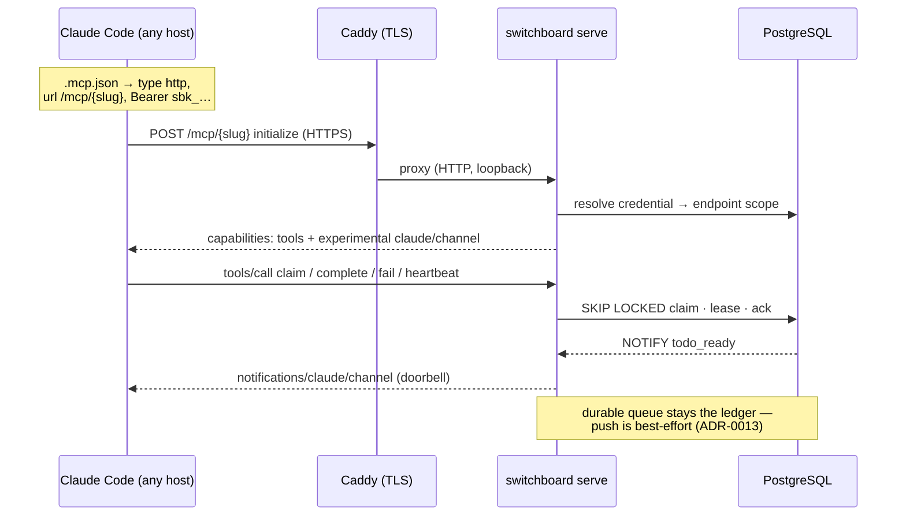

# ADR-0017: Vended MCP Endpoints Served Exclusively over Streamable HTTP/S (Retire the Local stdio Adapter)

## Context and Problem Statement

[ADR-0013](ADR-0013-channels-push-delivery.md) deliberately left the MCP/Channels transport open —
"HTTP-direct vs. local stdio adapter" — and the MVP implementation committed to the adapter path:
`switchboard channel` is a hand-rolled stdio JSON-RPC subprocess (`internal/channel/adapter.go`) that
proxies tool calls to a bespoke REST API (`/agent/*`) and re-emits `/agent/stream` SSE as channel
notifications. Every agent host must therefore have the switchboard **binary on PATH**, configured via
a generated `.mcp.json` that spawns it. For a centralized, multi-tenant service this is exactly
backwards: it distributes a client binary to gain what MCP already standardizes — a remote server over
**Streamable HTTP**. How should agents connect to their vended endpoints ([ADR-0008](ADR-0008-human-principal-vended-endpoints.md))
so that possession of a URL + credential is sufficient, with no local binary at all?

## Decision Drivers

* **Centralized service semantics** — switchboard is one deployed service (StumpCloud); agents live on
  many hosts. Client-side binaries mean distribution, version skew, and per-host setup friction.
* **The vended capability should be self-contained** — ADR-0008 defines the grant as "(a) an endpoint
  URL and (b) a credential." Today a third, undeclared component (the binary) is required to exercise it.
* **MCP already specifies the remote transport** — Streamable HTTP is the standard remote transport;
  Claude Code consumes HTTP MCP servers natively (`"type": "http"` + headers in `.mcp.json`).
* **One protocol surface to secure and test** — the bespoke `/agent/*` REST API exists only to feed the
  stdio proxy; it duplicates auth, rate limiting, and error mapping alongside the future MCP surface.
* **Push must survive** — Channels notifications ([ADR-0013](ADR-0013-channels-push-delivery.md)) are
  the doorbell; whatever transport wins must still deliver `notifications/claude/channel`.
* Hand-rolled protocol code (`protocolVer 2024-11-05`, manual framing) is a liability the official
  **Go MCP SDK** (`modelcontextprotocol/go-sdk`, [ADR-0005](ADR-0005-mcp-tool-and-resource-contract.md))
  already carries for us.

## Considered Options

* **(A) Keep the local stdio adapter** (status quo): binary on PATH bridging stdio ↔ REST.
* **(B) Streamable HTTP only** — the central Go server mounts MCP at per-endpoint HTTPS URLs; the
  stdio adapter, its subcommand, and the `/agent/*` REST proxy surface are retired.
* **(C) Dual transport** — serve Streamable HTTP *and* keep the stdio adapter as a compatibility shim.

## Decision Outcome

Chosen option: **"(B) Streamable HTTP only."** The vended endpoint URL *is* the MCP URL; an agent
connects with URL + bearer credential and nothing else. This resolves ADR-0013's open transport
question in favor of HTTP-direct and **removes the local-binary requirement entirely**.

Mechanics:

* **Server** — the central Go binary mounts an MCP server (official **Go MCP SDK**) at
  **`/mcp/{endpoint}`**, where `{endpoint}` is the per-vend slug minted at vend time (matching the
  approved designs: `https://<host>/mcp/<slug>-<rand>`). The handler resolves the **`Authorization:
  Bearer sbk_…`** credential to a vended endpoint row, verifies it matches the path's endpoint, and
  injects the endpoint's scope (queues + verb allowlist) into the session. URL and credential are
  **both** required; the URL alone is not a secret.
* **Tools** — the agent-facing verbs ([SPEC-0006](../openspec/specs/agent-tools/spec.md)) are served as
  MCP tools over this transport (`list_todos`, `claim`, `complete`, `fail`, plus `heartbeat`, which the
  store already supports but the adapter never exposed). Scope enforcement stays at the boundary,
  exactly as the REST layer does today.
* **Push** — the session advertises `capabilities.experimental["claude/channel"]`; todo-ready
  notifications are emitted as `notifications/claude/channel` on the Streamable HTTP stream. Push stays
  lossy-by-design; the durable queue remains the ledger and pull (`list_todos`) remains correct on its
  own ([ADR-0013](ADR-0013-channels-push-delivery.md) unchanged in substance).
* **Wiring** — the vended page and MCP docs emit HTTP wiring only:
  `{"mcpServers":{"switchboard":{"type":"http","url":"https://…/mcp/<slug>","headers":{"Authorization":"Bearer <credential>"}}}}`.
* **TLS** — HTTPS terminates at the standard StumpCloud reverse proxy (plain Caddy `reverse_proxy`, per
  the Dockerfile's deployment contract); switchboard listens on HTTP behind it. Credentials therefore
  never transit plaintext beyond the host loopback.
* **Retirement** — the `switchboard channel` subcommand, `internal/channel` stdio adapter, and the
  `/agent/*` REST + `/agent/stream` SSE surface are deleted once the HTTP transport ships; `.mcp.json`
  instructions referencing a local binary are removed from README, templates, and the vended screen.

### Consequences

* Good, because a vended grant is now truly self-contained: URL + credential, any host, no install.
* Good, because one protocol surface (MCP over HTTP) replaces two bespoke ones (stdio JSON-RPC + REST
  proxy) — less auth/rate-limit/error-mapping code to keep consistent, and the official SDK replaces
  hand-rolled protocol handling.
* Good, because per-endpoint URLs give clean observability (per-endpoint access logs, revocation = 404/401
  at the path) and match the approved Endpoints-view designs.
* Bad, because it is a **breaking change** for any existing `.mcp.json` that spawns `switchboard
  channel` — operators must re-vend or rewrite wiring (acceptable pre-1.0, single-operator install base).
* Bad, because push now depends on harness support for channels over HTTP MCP; where a harness only
  supports stdio channels, agents degrade to pull-only draining (correctness preserved, latency worse).
* Neutral, because the Go MCP SDK becomes a real dependency (vendored, per the hermetic build).

### Confirmation

`cmd/switchboard` builds with no `channel` subcommand; `internal/channel` is gone; `go.mod` vendors
`modelcontextprotocol/go-sdk`; an integration test drives `initialize` → `tools/list` → `tools/call`
against `/mcp/{endpoint}` over HTTP with a vended credential and asserts scope enforcement and
notification delivery; the vended page renders `"type": "http"` wiring with no binary instructions;
`claude mcp` (or any HTTP MCP client) connects to the deployed service with URL + token only.

## Pros and Cons of the Options

### (A) Local stdio adapter (status quo)

* Good, because it is already built and known to work with Claude Code's stdio channel support.
* Good, because the central server needs no long-lived HTTP streaming sessions for MCP.
* Bad, because every agent host needs the binary installed, on PATH, and version-matched — the vended
  "capability" secretly has three parts, not two.
* Bad, because it drags a parallel REST API and a hand-rolled JSON-RPC implementation along forever.
* Bad, because it contradicts the product's own centralized-service positioning.

### (B) Streamable HTTP only (chosen)

* Good, because URL + bearer credential is the entire client footprint — matches ADR-0008's capability
  model and the designs' vend flow.
* Good, because the official SDK handles protocol versioning, session management, and streaming.
* Neutral, because long-lived HTTP streams move connection-lifetime concerns (timeouts, proxy
  buffering) into the reverse-proxy config — standard, but must be configured deliberately.
* Bad, because existing local-adapter wiring breaks and must be re-vended.

### (C) Dual transport (HTTP + stdio shim)

* Good, because nothing breaks on day one; migration can be gradual.
* Bad, because two transports mean double the auth/test/security surface indefinitely — and the shim's
  existence removes all pressure to ever finish the migration.
* Bad, because the explicit product requirement is *exclusively* HTTP/S; a shim contradicts it.

## Architecture Diagram

## More Information

* Resolves the open "Channels transport" question tracked in `docs/README.md` and
  [ADR-0013](ADR-0013-channels-push-delivery.md) § Mechanics.
* Endpoint capability model: [ADR-0008](ADR-0008-human-principal-vended-endpoints.md). Tool surface:
  [SPEC-0006](../openspec/specs/agent-tools/spec.md). Vend flow: [SPEC-0007](../openspec/specs/vended-endpoints/spec.md)
  (its `.mcp.json` wiring requirement is refined by SPEC-0014).
* Requirements formalized in SPEC-0014 (MCP Streamable HTTP transport).
