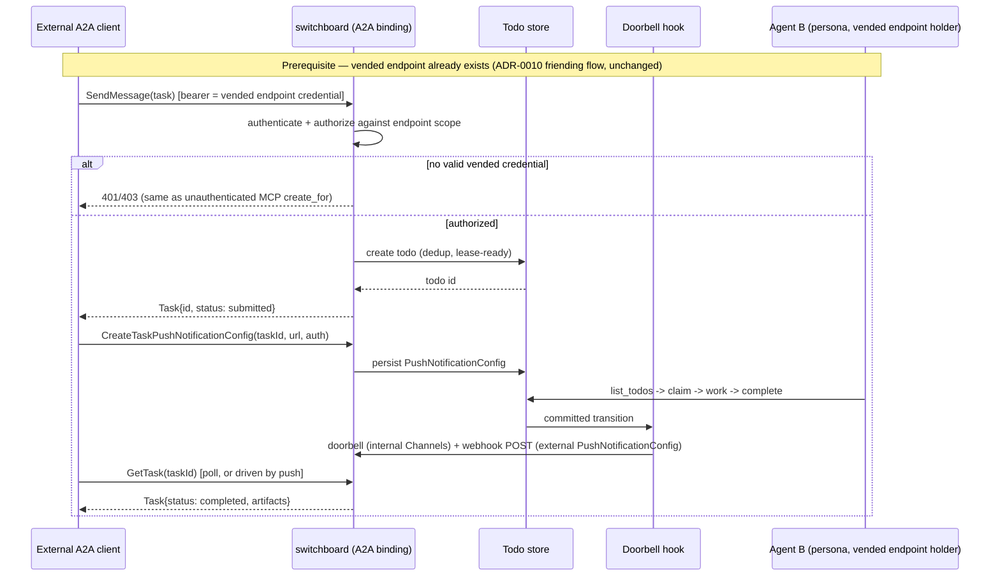

# ADR-0021: A2A as a First-Class Task-Delegation Transport (Supersedes Discovery-Only A2A)

## Context and Problem Statement

[ADR-0010](ADR-0010-a2a-discovery-human-vended-friending.md) deliberately scoped A2A to discovery and
human-vended friending: an agent's [Agent Card](ADR-0009-personas-as-scoped-agent-cards.md) is
published outward, but cross-agent work only ever lands as a **todo**, created via MCP's `create_for`
verb — never via A2A's own task RPCs. That ADR explicitly rejected "A2A end-to-end," on the grounds
that A2A's native peer task transport bypasses human vending and produces ephemeral, non-durable work.

Switchboard's ambitions have grown since then: the goal now is for switchboard to be a genuine,
standards-compliant participant in the [A2A ecosystem](https://a2a-protocol.org/latest/specification/) —
external A2A clients should be able to `SendMessage`, `GetTask`, `ListTasks`, `CancelTask`,
`SubscribeToTask`, and register real `PushNotificationConfig` webhooks against switchboard using A2A's
native wire protocol, not just discover an Agent Card and stop. The question this ADR answers: **how do
we give A2A real task-delegation teeth without reopening the accountability hole ADR-0010 was built to
close?**

## Decision Drivers

* **Real A2A interop.** Third-party A2A clients (agents built elsewhere, not just switchboard-hosted
  personas) should be able to task a switchboard-hosted agent using the actual A2A RPC surface, not a
  discovery-only stub.
* **Durability is non-negotiable.** ADR-0007's todo model (owned, dedup'd, leaseable, retryable,
  audited) is switchboard's core value proposition. Any A2A task surface must be backed by that model,
  not a parallel ephemeral one.
* **Human vending remains the access gate.** [ADR-0008](ADR-0008-human-principal-vended-endpoints.md)'s
  principle — no agent grants another agent access to itself autonomously — was the specific thing
  ADR-0010's rejected option (A2A end-to-end) violated. Widening the A2A surface must not re-violate it.
* **The A2A task model and the todo model should not diverge.** Maintaining two parallel "unit of work"
  concepts (A2A Task vs. switchboard Todo) is a maintenance and consistency liability.
* **Push and streaming are genuinely new capabilities.** Neither the existing internal "Channels"
  doorbell ([ADR-0013](ADR-0013-channels-push-delivery.md)) nor MCP's request/response shape satisfies
  A2A's authenticated webhook push (`PushNotificationConfig`) or SSE streaming (`SubscribeToTask`).

## Considered Options

* **(A) Status quo** — keep A2A discovery-only per ADR-0010; do not implement any A2A task RPCs.
* **(B) Read-only A2A projection** — implement only `GetTask`/`ListTasks` as a polling-friendly,
  read-only translation onto the Todo model; no `SendMessage`-based task creation, no push
  notifications, no streaming, no cancel.
* **(C) Full A2A RPC surface, gated by the existing vended-endpoint grant** — implement the complete
  task RPC surface (`SendMessage`, `SendStreamingMessage`, `GetTask`, `ListTasks`, `CancelTask`,
  `SubscribeToTask`, `PushNotificationConfig` CRUD) as a native A2A wire-protocol binding onto the Todo
  model, but `SendMessage` still requires the caller to hold a vended endpoint scoped to the target
  queue — i.e., A2A becomes a **second wire protocol for the same authorized relationship**, not a new
  way to acquire one. *(chosen)*
* **(D) Full A2A RPC surface, ungated** — implement the same RPC surface as (C), but allow any
  A2A-authenticated caller to `SendMessage` a task to any discovered agent without a prior friend-request
  approval, matching A2A's native peer-delegation model exactly.

## Decision Outcome

Chosen option: **"(C) full RPC surface, gated by the existing vended-endpoint grant."**

### What changes from ADR-0010

* A2A is no longer discovery-only. Once a vended endpoint exists between two parties — via ADR-0010's
  friend-request-and-human-approval flow, or any future onboarding path that mints the same kind of
  scoped credential — that endpoint now answers to **both** MCP tool calls **and** native A2A RPCs.
  Same credential, same scope, same queue, two wire shapes.
* An **A2A Task IS a projection of a Todo**, not a new parallel domain object. `SendMessage` creates a
  todo (via the same path as `create_for`); `GetTask`/`ListTasks` read the todo table; `CancelTask`
  transitions a todo out of its claimable states; `SubscribeToTask`/`SendStreamingMessage` stream the
  same committed-transition events that already drive the Channels doorbell hook
  (`store.SetTodoDoorbellHook`).
* `PushNotificationConfig` becomes a new, durable, authenticated **external** delivery mechanism —
  additive to, not a replacement for, the internal Channels doorbell. Channels stays the low-latency,
  best-effort "you have work" ping for switchboard-hosted sessions; `PushNotificationConfig` is for
  external A2A callers who registered a webhook and expect retried, authenticated HTTP delivery keyed
  off the same transition hook.
* The Todo state machine (`pending → claimed → done|failed`, ADR-0007) needs new states or a mapping
  layer to cover A2A's `input-required`, `auth-required`, and `rejected` — this ADR does not prescribe
  the exact schema change; the follow-up spec does.
* AgentCard (`internal/web/agentcard.go`) capability flags (`pushNotifications`, `streaming`) flip to
  `true` and gain real backing; the code comment noting "no push notifications, no state-transition
  history" becomes stale and must be corrected as part of implementation.

### What does NOT change from ADR-0010

* **Human vending is still the only way to acquire a grant.** Option (D) — ungated peer delegation,
  which is what ADR-0010's original rejected option (A) described — is explicitly rejected again here,
  for the same reason: it lets one agent hand another agent work with no human in the loop. A2A gets a
  real transport; it does not get a new way around the friend-request-and-approval gate.
  `PushNotificationNotSupportedError`/auth-failure semantics apply to any caller without a valid vended
  credential.
* **Durability is still mandatory.** Because A2A tasks are todos, every property ADR-0007 already
  guarantees (ownership, lease, dedup, retry backoff, dead-letter) applies unchanged. Nothing about this
  decision introduces an ephemeral, unaudited code path.
* ADR-0010's friending flow (discover → request → human-approved vend) is unchanged and remains the
  sole path to a grant; this ADR only expands what a grant-holder can *do* with that grant.

### Consequences

* Good, because switchboard becomes a real A2A interop point — external, standards-compliant A2A
  clients can `GetTask`/`ListTasks`/`CancelTask`/`SubscribeToTask`/push-notify against a switchboard
  agent without switchboard-specific tooling.
* Good, because reusing the Todo model for A2A tasks means no second "unit of work" implementation to
  keep consistent — one state machine, one audit trail, one lease/retry mechanism.
* Good, because the accountability property ADR-0010 was built to protect (no autonomous agent-to-agent
  access grants) is preserved — `SendMessage` still requires a pre-existing vended endpoint.
* Bad, because the Todo state machine must grow new states (`input-required`, `auth-required`,
  `rejected`) or a mapping layer, which is real implementation surface not previously needed.
* Bad, because `PushNotificationConfig` is a new external attack surface (server-side webhook delivery
  to attacker-controlled URLs is a classic SSRF vector) — the follow-up spec MUST define URL validation,
  authentication-info handling, retry/timeout bounds, and delivery deduplication.
* Bad, because streaming (`SendStreamingMessage`/`SubscribeToTask`) adds a long-lived connection surface
  distinct from [ADR-0017](ADR-0017-mcp-streamable-http-only.md)'s MCP-only streamable-HTTP decision —
  ADR-0017 governs the MCP transport specifically and is unaffected, but the new A2A SSE endpoints are a
  genuinely new operational surface (connection limits, backpressure) that MCP's transport decision
  never had to account for.
* Bad, because this is a second wire protocol for the same underlying operations (todo CRUD), which is
  more surface to keep behaviorally identical across MCP and A2A bindings — a scenario where MCP's
  `create_for` and A2A's `SendMessage` disagree on dedup or scope enforcement is a real bug class to
  guard against in the spec and its test plan.

### Confirmation

* The follow-up spec(s) define the exact Task↔Todo field/state mapping, the `PushNotificationConfig`
  schema and webhook-delivery guarantees, the streaming event shapes, and the AgentCard capability
  updates.
* A test asserts `SendMessage` without a valid vended-endpoint credential is rejected exactly like an
  unauthenticated MCP `create_for` call would be — no new anonymous-access path exists.
* A test asserts an A2A-created task and an MCP-created todo are indistinguishable in the store (same
  table, same lease/retry/dedup semantics).
* A test asserts `PushNotificationConfig` webhook delivery cannot target loopback/link-local/internal
  address ranges (SSRF guard).
* A test asserts Channels doorbell delivery and `PushNotificationConfig` delivery both fire from the
  same commit hook and neither can starve the other.

## Pros and Cons of the Options

### (A) Status quo (rejected)

* Good, because zero new implementation or attack surface.
* Bad, because it does not deliver what was asked for — no real A2A interop, discovery only.

### (B) Read-only A2A projection (rejected)

* Good, because smallest real increment — `GetTask`/`ListTasks` on top of existing Todo reads is low
  risk.
* Bad, because it leaves the two most-requested capabilities — task creation via `SendMessage` and
  webhook push notifications — entirely out of scope. Doesn't make switchboard "an A2A powerhouse," just
  a slightly richer discovery surface.

### (C) Full RPC surface, gated by existing vended-endpoint grant (chosen)

* Good, because it delivers the complete A2A RPC surface while preserving ADR-0010's accountability
  guarantee — the two things previously in tension are both satisfied.
* Good, because it reuses the durable Todo model instead of building a parallel one.
* Neutral, because it requires a state-machine extension and a new webhook-delivery subsystem — real
  work, but scoped and testable.
* Bad, because full interop with A2A clients that expect to `SendMessage` an *unfamiliar* agent
  cold — the pure-A2A "discover and task immediately" experience — is still not possible; a grant must
  exist first. This is the same interop trade-off ADR-0010 already accepted, carried forward.

### (D) Full RPC surface, ungated (rejected)

* Good, because it is maximally A2A-native — any agent can task any discovered agent, exactly as the
  spec's default model describes, with the best out-of-the-box interop story.
* Bad, because it reopens exactly the accountability hole ADR-0010 was built to close: one agent can
  hand another agent work with no human in the loop and no prior review of the relationship.
* Bad, because it makes every published Agent Card an unauthenticated task-injection target, a much
  larger spam/abuse surface than the bounded, rate-limited friend-request flow ADR-0010 designed for.

## Architecture Diagram

### Existing code this decision builds on

```mermaid
graph TD
    subgraph Friending [ADR-0010 friending flow — unchanged]
        Intake["server.friendIntake.Intake"]
        Verify["auth.Authenticator.VerifyProvenance"]
        PubPersona["store.Store.PublishedPersonaByID"]
        CreateFR["store.Store.CreateFriendRequest"]
        CreateApproval["store.Store.CreateApprovalTodo"]
        CountLive["store.Store.CountLiveFriendRequestsFrom"]
    end

    subgraph Vending [ADR-0008 vended endpoints — new A2A binding authenticates against this]
        VendExpiry["server.vendWithExpiry"]
        ExecVend["web.Handler.executeVend"]
        VendEndpoint["store.Store.VendAgentEndpoint"]
    end

    subgraph Discovery [ADR-0009 Agent Cards — capability flags gain new backing here]
        AgentCard["web.Handler.AgentCard"]
        GetDiscoverable["store.Store.GetDiscoverablePersona"]
    end

    subgraph TodoCore [ADR-0007 Todo model — A2A tasks project onto this]
        CreateTodo["store.Store.CreateTodo"]
        CreateEventTodo["store.Store.CreateEventTodo"]
        ClaimTodo["store.Store.ClaimTodo"]
        FireHook["store.Store.fireTodoHook"]
    end

    subgraph Doorbell [ADR-0013 Channels doorbell — stays alongside new PushNotificationConfig delivery]
        Run["server.Run"]
        SetHook["store.Store.SetTodoDoorbellHook"]
        FireDoorbell["store.Store.fireDoorbell"]
        Nudge["server.nudgeDoorbells"]
        Pending["store.Store.PendingDoorbellTodos"]
    end

    Intake --> Verify
    Intake --> PubPersona
    Intake --> CreateFR
    Intake --> CreateApproval
    Intake --> CountLive

    VendExpiry --> VendEndpoint
    ExecVend --> VendEndpoint

    AgentCard --> PubPersona
    AgentCard --> GetDiscoverable

    CreateTodo --> FireHook
    CreateEventTodo --> FireHook
    CreateEventTodo --> FireDoorbell
    ClaimTodo --> FireHook

    Run --> SetHook
    Run --> Nudge
    Nudge --> Pending
```

<!-- Call graph: filtered to doorbell/vend/agentcard/friend-intake core symbols (db plumbing, test fixtures, and fake stores excluded), generated 2026-07-19 -->

*The new A2A `SendMessage`/`GetTask`/etc. bindings are new call sites that plug into `TodoCore` (task creation/claim) and `Doorbell`/`Vending` (auth + delivery) — they do not yet exist in this graph; this is the substrate they attach to.*

## More Information

* The durable object A2A tasks now project onto: [ADR-0007](ADR-0007-todos-as-core-primitive.md).
* Why a vended endpoint is required and what it authorizes:
  [ADR-0008](ADR-0008-human-principal-vended-endpoints.md).
* What is discovered (personas as Agent Cards) and how capabilities are advertised:
  [ADR-0009](ADR-0009-personas-as-scoped-agent-cards.md).
* Provenance/assurance posture for the friend-request flow this decision leaves unchanged:
  [ADR-0011](ADR-0011-identity-assurance-oidc-passkey-deferred.md).
* The internal best-effort doorbell this decision runs alongside, not instead of:
  [ADR-0013](ADR-0013-channels-push-delivery.md).
* MCP's own transport decision, unaffected by this ADR's new A2A-specific streaming surface:
  [ADR-0017](ADR-0017-mcp-streamable-http-only.md).
* The friending flow this ADR leaves intact as the sole path to a grant:
  [ADR-0010](ADR-0010-a2a-discovery-human-vended-friending.md) (superseded by this ADR for the
  transport question only — its friending/vending mechanics remain in force).
* A2A protocol specification: <https://a2a-protocol.org/latest/specification/>.
