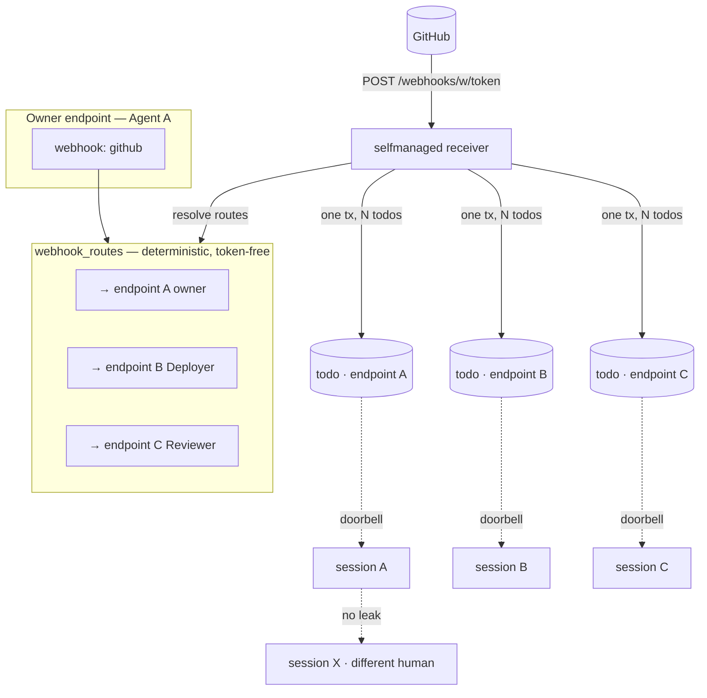

# ADR-0022: Endpoint-Scoped Todo Ownership and Webhook Route Fan-Out

## Context and Problem Statement

A bug report from a switchboard tester surfaced an **architectural isolation hole**:
deliveries to one user's webhook were visible to other users' agents. Investigation
showed the hole is not local to the push path — it is the todo model itself.

The `todos` table ([0001_init.sql](../../internal/db/migrations/0001_init.sql)) carries a
free-form `queue` text column but **no foreign key to `endpoints`, `agents`, or
`humans`**. Queue names are global strings (`"reviews"`, `"github"`). Every consumer of
todos — `ListTodos`, `ClaimTodo`, `GetTodo`, `CompleteTodo`, `FailTodo`, `Heartbeat`, and
the channel doorbell (`PublishTodoReady`) — filters by queue name only. Any two endpoints
that happen to share a queue string (which is the common case: every GitHub webhook uses
`"github"`, every review queue uses `"reviews"`) silently share visibility into each
other's work, across humans. Agent A's webhook delivery rings Agent B's doorbell; Agent B
can `list_todos` on `"reviews"` and see (and `claim`!) Agent A's todos.

This is a cross-tenant data leak on both the push path and the pull path.

Separately, the intended product direction (per Joe) is that a single webhook should be
**routeable to multiple agents**: Agent A creates a repo and wires the webhook so that the
resulting work reaches Agent B (Deployer) and Agent C (Reviewer) as well as A. That routing
must be **deterministic and token-free** once configured — it cannot require the agent to
spend model tokens invoking `create_for` on every delivery. The existing
[ADR-0010](ADR-0010-a2a-discovery-human-vended-friending.md) cross-agent model covers the
ad-hoc case (one agent handing one todo to another via `create_for`); it does not cover
deterministic delivery fan-out from a webhook.

## Decision Drivers

* **Tenant isolation is non-negotiable.** A webhook owned by human A must never be visible
  to, pushable to, or claimable by human B's agents. The current model cannot enforce this.
* **Webhooks are owned, not floating.** A webhook is always vended against exactly one
  MCP endpoint ([ADR-0012](ADR-0012-agents-self-manage-webhooks.md)). That endpoint's
  human is the authorization principal. Todos produced by that webhook must inherit that
  ownership.
* **Routing is a first-class concept.** "Agent A's webhook delivers to Agents A, B, and C"
  is a persistent configuration, not a per-delivery agent decision. It must live in the
  database, change rarely, and be resolved at ingest time without spending model tokens.
* **N independent todos per delivery.** When a webhook routes to N endpoints, each target
  gets its own todo: independently claimable, retried, completed, and deduped. B
  (Deployer) and C (Reviewer) do different work on the same delivery; they must not race
  on a shared row.
* **Operator-configured ingestion is retired.** The signed receiver paths for
  Stripe/Slack/GitHub in `internal/ingest/signed.go` predate agent self-management
  ([ADR-0012](ADR-0012-agents-self-manage-webhooks.md)) and carry no endpoint owner. Under
  the new isolation model they cannot be made safe without inventing an "operator endpoint"
  concept nobody wants. Self-managed signed webhooks (`internal/ingest/selfmanaged.go`)
  already cover the same providers and DO carry an owner.

## Considered Options

### (A) Per-endpoint namespacing of queue strings

Queue becomes `ep:{endpoint_id}:github`; the existing `ScopeQueues` membership check on the
session grants isolation for free.

* Good, because minimal schema change — no new column on `todos`.
* Bad, because `queue` is a human-readable routing label displayed in the Board UI and
  surfaced in `list_todos`; polluting it with endpoint ids destroys that. Routing-to-N
  still needs a join table, so this only delays the schema work.
* Bad, because two endpoints cannot share a queue even when they legitimately should (the
  future routing case: A, B, and C all read from the same routed delivery).

### (B) Single shared todo with an ACL/membership table

One todo per delivery; a `todo_visibility` join table lists every endpoint allowed to
see/claim it.

* Good, because no duplication of payload.
* Bad, because claim semantics break: SQS-style atomic claim assumes one owner. A shared
  todo means B's claim hides it from C, so C's review never runs — wrong product behavior.
  Dedup also becomes global, collapsing legitimate per-target retries.

### (C) Endpoint-owned todos with deterministic route fan-out *(chosen)*

Every todo carries a non-null `endpoint_id` (the endpoint that owns its lifecycle). A
webhook delivery resolves its target endpoints via a `webhook_routes` table and creates
**one todo per target endpoint**, each independently owned, claimable, and deduped.
Today the target set is `{owner endpoint}`; the `webhook_routes` table is wired now and
populated later by friending/routing without further schema change.

## Decision Outcome

Chosen option: **(C) endpoint-owned todos with deterministic route fan-out.**

**Implementation status (partial):** endpoint-owned todos and deterministic route fan-out — the mechanism this ADR chose — are implemented. The `create_for` verb it contrasts fan-out against is **not** exposed: a store backend exists, but no MCP tool registers it, so the "ad-hoc case (one agent handing one todo to another via `create_for`)" discussed above is unavailable today. That strengthens rather than weakens the decision recorded here: route fan-out is the path that works.

### Todo ownership

The `todos` table gains a non-null `endpoint_id` foreign key to `endpoints` (ON DELETE
CASCADE). Every todo is pinned to exactly one endpoint for its entire lifecycle. All todo
queries — `ListTodos`, `ClaimTodo`, `GetTodo`, `CompleteTodo`, `FailTodo`, `Heartbeat`,
`ReapExpired`, `RequeueDueRetries`, `PendingDoorbellTodos` — predicate on `endpoint_id`.
The doorbell (`PublishTodoReady`) filters sessions by `endpoint_id` as the primary scope;
queue membership remains as a secondary filter within an endpoint's grant (preserving the
existing SPEC-0011 "Scope-Filtered Fan-Out" contract at a finer grain).

The dedup key moves from `(queue, idempotency_key)` to `(endpoint_id, idempotency_key)`.
Redelivery to the same webhook dedups per-target; the same payload routed to A, B, and C
produces three todos, one per endpoint, each independently retryable. An empty
idempotency key still opts out of dedup entirely.

### Webhook routing

A new `webhook_routes` table maps a webhook to N target endpoints:

```
webhook_routes (
  webhook_id          uuid → endpoint_webhooks(id),
  target_endpoint_id  uuid → endpoints(id),
  granted_by_human_id uuid → humans(id),
  granted_at          timestamptz DEFAULT now(),
  PRIMARY KEY (webhook_id, target_endpoint_id)
)
```

At delivery time (`internal/ingest/selfmanaged.go`), the receiver resolves the webhook's
target endpoints. If none are configured, the target set is `{owner endpoint}` (the
webhook's `endpoint_id`). For each target endpoint, one todo is created, pinned to that
endpoint, with the idempotency key namespaced by target endpoint id so per-target dedup is
independent. The delivery is atomic across targets: all N todos commit in one transaction
with the event row, or none do (mirroring the existing SPEC-0002/0004 atomic ingestion
contract, generalized to N targets).

Routing rows are populated **deterministically** — by a human approving a friend request,
by a routing verb, or by a future A2A wiring step — never by an agent spending tokens per
delivery. Once a route exists, every delivery fans out for free.

### Operator-configured receivers retired

The signed receivers for Stripe, Slack, and GitHub in `internal/ingest/signed.go` and the
generic receiver in `internal/ingest/generic.go` are removed. They have no endpoint owner
and cannot satisfy the new isolation invariant. The same providers are covered by
self-managed webhooks (`internal/ingest/selfmanaged.go`), which mint and hold the signing
secret and carry an owner endpoint. The provider registry
([ADR-0020](ADR-0020-runtime-provider-registry.md)) is unaffected — it sources signing
secrets for self-managed signed webhooks, not for the retired operator receivers.

> **Amended 2026-09-21 (#181).** The last sentence did not hold: the provider registry was
> instance-wide too, and it was removed with the receivers. A self-managed webhook's signing secret
> is minted at `create_webhook` and held on its own `endpoint_webhooks` row; nothing sources it
> from a registry.

### Consequences

* Good, because cross-tenant isolation is enforced at the data layer: no query path can
  reach another human's todos regardless of queue name collision. The bug class is closed,
  not papered over.
* Good, because deterministic routing is token-free: the agent configures routes once (via
  friending or a routing verb) and every delivery fans out server-side. No per-delivery
  model tokens spent on routing.
* Good, because N-todos-per-target preserves SQS claim semantics and lets B and C do
  independent work on the same delivery without racing.
* Good, because `webhook_routes` is in place from day one, so activating A2A-driven routing
  is additive code + data, not a migration.
* Bad, because every todo query site changes — accepted as the cost of closing a
  cross-tenant leak.
* Bad, because operator-configured receivers go away — accepted: Joe does not want to
  hand-configure webhooks, and self-managed signed webhooks already cover the same
  providers with stronger ownership semantics.

### Confirmation

* A migration adds `todos.endpoint_id` (non-null) and the `webhook_routes` table, drops the
  operator receiver routes, and rebuilds the dedup index on `(endpoint_id, idempotency_key)`.
* A test asserts two humans with endpoints scoped to the same queue name never see each
  other's todos via `list_todos`, `claim`, or doorbell push.
* A test asserts a webhook with two routes produces two todos (one per target endpoint) on
  a single delivery, each independently claimable.
* A test asserts redelivery to a routed webhook dedups per-target (two targets, one
  redelivery → still two todos, not four).

## Architecture Diagram



## More Information

* Todos as the durable core primitive: [ADR-0007](ADR-0007-todos-as-core-primitive.md).
* Human-principal vended endpoints: [ADR-0008](ADR-0008-human-principal-vended-endpoints.md).
* A2A discovery and human-vended friending — the future route-population path is the
  friend edge, not A2A transport: [ADR-0010](ADR-0010-a2a-discovery-human-vended-friending.md).
  Note that ADR-0021 (A2A as a first-class task-delegation transport) supersedes ADR-0010,
  but it supersedes only ADR-0010's *transport* stance (that cross-agent work may land
  solely as a todo via `create_for`). ADR-0010's **friending flow** — discover, request,
  human approval, vend — is explicitly carried forward unchanged by ADR-0021, and it is
  that flow, not the superseded transport stance, that this ADR depends on. Routing a
  webhook to another agent's endpoint requires an approved `friend_edges` row regardless of
  which transport ADR is in force.
* Agent self-managed webhooks (the owner-carries-endpoint invariant):
  [ADR-0012](ADR-0012-agents-self-manage-webhooks.md).
* Channels push delivery (the doorbell that leaked): [ADR-0013](ADR-0013-channels-push-delivery.md).
* The amended isolation and routing requirements are codified in the
  [todo-queue spec](../openspec/specs/todo-queue/spec.md) and the
  [webhook-ingestion spec](../openspec/specs/webhook-ingestion/spec.md).
