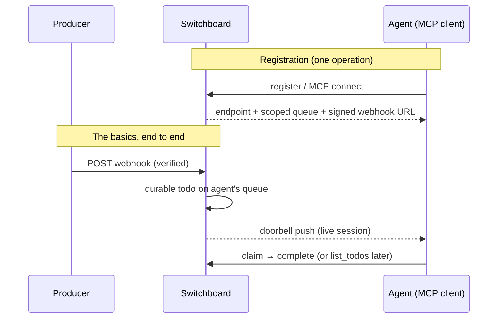

# ADR-0023: MVP Is MCP/API-First, Webhook-to-Doorbell Basics

## Context and Problem Statement

Switchboard's surface has grown (A2A discovery, friend edges, personas, A2UI
surfaces, signed and self-managed webhooks, tenant isolation) while its core
promise — a verified webhook becomes a durable todo that reaches a live agent —
is not a path a new user can follow or that CI proves end to end. The product
is "still not useful": every step of the basics requires manual stitching, and
the documentation explains the machinery rather than the one flow that matters.
Which slice do we declare the product, and what do we de-prioritize to get
there?

## Decision Drivers

* The operator's actual usage is: a producer posts a webhook; an agent (an MCP
  client) should receive the resulting todo without human relay.
* The pieces already exist (ingest, todo store, doorbell push, adapters); the
  gap is wiring, ergonomics, and proof — not missing capability.
* Surface area has outrun the working core; every added surface raises the
  cost of understanding and testing the basics.
* The web UI exists but is not required for the basics; UI work must not gate
  the MVP.

## Considered Options

* **Option 1: Declare the basics the MVP, MCP/API-first; hide everything
  else behind feature flags (default off).** One registration call vends the
  entire happy path; an end-to-end test proves webhook → todo → doorbell in
  CI; the UI is deferred; A2A, friend edges, personas, and A2UI stay in the
  codebase but are disabled by default and hidden from docs, defaults, and
  the MCP surface.
* **Option 2: Cut the non-basics from the codebase and MCP surface now.**
  Delete A2A, friend edges, personas, and A2UI until the basics have proven
  themselves.
* **Option 3: Keep all surfaces equal and simply write more documentation.**
  No refocusing; explain everything better.

## Decision Outcome

Chosen option: "**Option 1 — MCP/API-first basics; advanced features hidden
behind default-off feature flags; UI deferred**", because the fastest route to
a useful product is making the existing pieces work as one path, and hiding
behind flags — rather than deleting — keeps the advanced code maintained and
reversible while removing it from the product users actually see; Option 2's
deletions are irreversible churn we cannot un-do if an advanced consumer turns
out to matter; Option 3 leaves the actual problem (the happy path is neither
wired nor proven, and advanced surface crowds it out) untouched.

The MVP is, exactly:

1. **Register an agent** → switchboard mints the endpoint, its scoped queue,
   and a signed ingestion webhook in one operation (no manual stitching).
2. **A verified webhook arrives** → it becomes a durable todo on that agent's
   queue, following the fan-out and ownership rules of ADR-0022 and the
   adapter model of ADR-0014.
3. **The todo reaches the agent** → pushed as a doorbell to the agent's live
   MCP session (streamable HTTP per ADR-0017); a disconnected agent sees the
   todo on its next `list_todos`.

The transport surfaces are the MCP tools and the REST API only. The web UI is
out of the MVP: where a UI already exists it may be rearranged opportunistically,
but no MVP requirement may depend on it and no MVP work may block on UI
decisions (deferred to a later ADR; see ADR-0016/ADR-0018 when resumed).

Advanced surfaces (A2A discovery, friend edges, personas, A2UI) remain in the
codebase but are **hidden behind feature flags that default to off**. The
mechanism is the existing `internal/config` env-gate pattern (as with
`SWITCHBOARD_FRIENDING`): each advanced surface gets a `Config` boolean, and
`switchboard` and the MCP server register no advanced tools, routes, or docs
surfaces when the flag is unset. No new flag library is introduced — the repo
already has the mechanism, and it is env-scoped, typed, and testable. If
runtime or per-tenant toggling is ever needed, OpenFeature's Go SDK is the
upgrade path, not a starting dependency.

### Consequences

* Good, because one registration call replaces today's manual endpoint/webhook/
  queue stitching — the basics become a story a new user can follow.
* Good, because a CI end-to-end test (webhook → todo → doorbell) makes the
  basics un-rottable; regressions fail builds instead of users.
* Good, because default-off flags hide advanced surface from every consumer —
  MCP tool listings, routes, docs — without deleting maintained code, and a
  flag flip is all it takes to bring one back.
* Bad, because hidden code still carries maintenance, review, and test cost
  even while invisible; a later ADR must decide the real prune.
* Bad, because the UI drifts further from the API-first product and the
  deferred UI decision compounds.

### Confirmation

* Registration-vends-everything is observable: one call, then the webhook URL,
  queue, and doorbell delivery all work with no further configuration.
* Every advanced surface has a default-off flag: with no flag env vars set, a
  fresh deployment exposes none of them in the MCP tool list, the REST API,
  or the docs; the end-to-end CI test asserts exactly this default surface.
* The end-to-end test lives in CI and exercises a real ingest POST through to
  a connected MCP session receiving the doorbell; it MUST fail the build.
* Docs lead with the basics flow; advanced surfaces are documented under an
  explicit "advanced (flag-gated)" heading naming their flag.

## Pros and Cons of the Options

### Option 1: Basics as MVP, advanced surface flag-gated, UI deferred

Keep every existing surface in the codebase; hide the advanced ones behind
default-off config flags; reorient the default path, docs, and tests onto the
webhook → todo → doorbell flow.

* Good, because it is reversible and additive — refocus now, prune later with
  evidence of what is actually unused.
* Good, because it converts existing capability into a working product instead
  of removing surface, while users see only the basics.
* Bad, because hidden code still carries maintenance and review cost even
  while invisible.
* Bad, because "advanced but kept" invites drift between the basics path and
  the flag-gated surfaces left behind.

### Option 2: Cut the non-basics now

Delete A2A, friend edges, personas, and A2UI from the codebase and MCP surface
until the basics prove out.

* Good, because the smallest possible product is the easiest to understand,
  test, and document.
* Bad, because deletions are hard to reverse and several surfaces have active
  consumers (this session's operator tooling among them).
* Bad, because pruning before the basics have lived tells us nothing about
  which advanced pieces were actually load-bearing.

### Option 3: Document everything better

No change in scope; improve documentation across the existing surface.

* Good, because it costs the least engineering effort.
* Bad, because the problem is not comprehension alone — the happy path
  requires manual stitching no document can hide, and the advanced surface
  keeps shouting over the basics.

## Architecture Diagram

## More Information

* [SPEC-0001: Webhook Ingestion](../openspec/specs/webhook-ingestion/spec.md) —
  verification semantics the basics rely on.
* ADR-0014 (ingestion adapters push/pull), ADR-0017 (MCP streamable HTTP),
  ADR-0022 (endpoint-scoped todo ownership) — the pieces the MVP composes.
* ADR-0016 / ADR-0018 (operator design language) — resume here when the
  deferred UI decision is taken.
