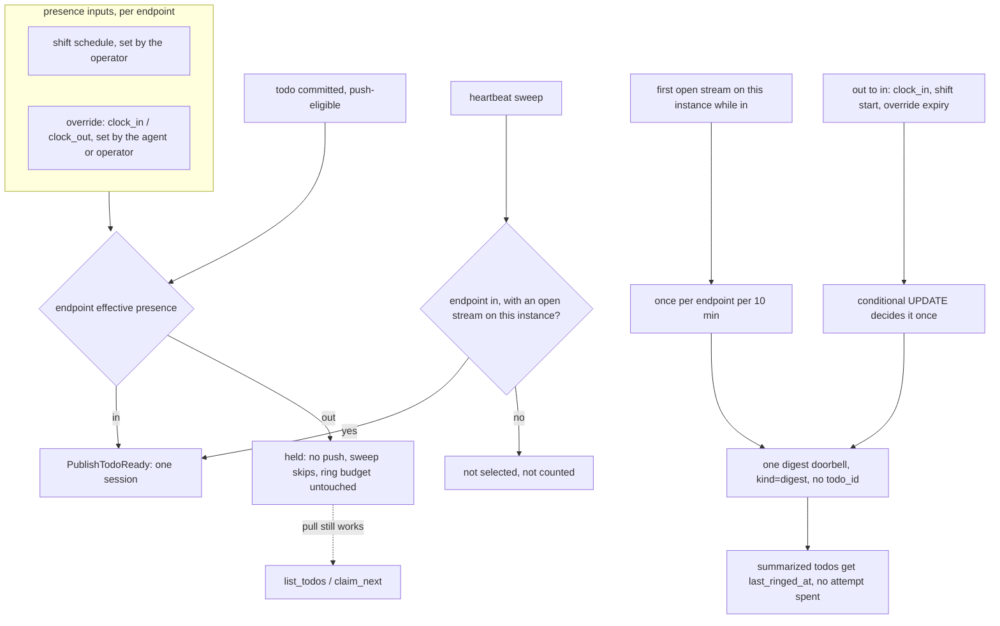

# ADR-0027: Endpoint Presence — Agents Clock In and Clock Out

## Context and Problem Statement

A doorbell is not free. Every `notifications/claude/channel` that reaches a live session becomes a
model turn ([ADR-0013](ADR-0013-channels-push-delivery.md)), which is why `PublishTodoReady` already
rings one session instead of the whole herd, and why the heartbeat sweep backs off and stops after
five rings. But Switchboard assumes an agent is always at work. Nothing records whether an endpoint's
agent *should* be taking work right now, and that costs tokens and loses doorbells in four ways:

1. **Stopped agents lose their re-rings.** An agent that is down for the night (for example a
   [Harness](https://github.com/stump-wtf/harness) harness held outside its operating hours) has no
   session. `PublishTodoReady` returns early and logs nothing. The sweep has still counted the ring:
   `RingUnclaimed` increments `ring_attempts` in the same statement that selects the row. The five
   re-rings land about 5 minutes, 25 minutes, 1h25m, 7h25m and 13h25m after creation. So a todo that
   arrives at the start of a night off has used up every re-ring before its agent returns, and is
   never rung again.
2. **An agent that is winding down keeps getting new work.** An agent finishing its last turn before
   a planned shutdown (Harness's graceful close waits for exactly that) is handed a fresh doorbell,
   starts another turn, and its shutdown slips to the cap. The same happens to an operator's
   interactive session that has the endpoint loaded but isn't there to work the queue.
3. **Coming back is expensive or silent.** When the agent returns, either nothing tells it what piled
   up (the re-rings are spent), or the sweep dribbles out re-rings for the backlog, each its own
   turn. Pulling the whole backlog with one `list_todos` is what the agent should do. Nothing tells
   it to.
4. **Stopping for the night is invisible.** The board can't tell "this agent is off until 09:00" from
   "this agent is broken" (the deaf-consumer warning, SPEC-0011).

How should an agent, or its human, tell Switchboard "not now", so doorbells wait instead of being
spent or lost, and "I'm back", so the agent learns what waited, in one turn?

## Decision Drivers

* **The queue stays the ledger.** Presence changes when Switchboard *rings*, never what work exists or
  who may *pull* it ([ADR-0007](ADR-0007-todos-as-core-primitive.md),
  [ADR-0013](ADR-0013-channels-push-delivery.md)). A clocked-out agent that pulls still gets its
  work.
* **Presence can only reduce pushes.** A presence change must never widen scope, move a todo between
  tenants ([ADR-0022](ADR-0022-endpoint-scoped-todo-ownership.md)), or reveal anything. That is what
  lets an agent set it itself.
* **No re-vend.** Scope is immutable ([SPEC-0007](../openspec/specs/vended-endpoints/spec.md)).
  Clocking in must work on every endpoint already vended, without revoking it.
* **No coupling to a supervisor.** Harness keeps itself agnostic about what runs inside a harness, and
  Switchboard should not learn what a harness is either. The design must pay off when the agent simply
  disconnects, and give more to agents that say something.
* **The human decides.** The operator can see and override presence, and can set a standing shift.
* **Many instances and restarts.** Sessions live on one instance. Presence and its transitions must be
  decided once, in the database, not in one process's memory.

## Considered Options

**Axis 1 — what presence belongs to:**

* **1A. The endpoint.** One vended endpoint is one agent ([ADR-0008](ADR-0008-human-principal-vended-endpoints.md)),
  and it is already the unit doorbells are addressed to.
* **1B. The MCP session.**
* **1C. The agent** (across all its endpoints).

**Axis 2 — how presence is set:**

* **2A. Explicit clock-in / clock-out** by the agent (MCP verbs) and by the operator (API, CLI,
  board), with an optional standing **shift** schedule as the default.
* **2B. Inferred from connection** alone: connected means in.
* **2C. A shift schedule only.**

**Axis 3 — what "clocked out" does:**

* **3A. Hold doorbells.** No push and no heartbeat ring, so no ring budget is spent, while every pull
  verb keeps working.
* **3B. Refuse the pull verbs too.**
* **3C. Buffer every held doorbell** and replay each one on return.

**Axis 4 — what "clocking back in" does:**

* **4A. One digest doorbell** summarizing what waited, then normal ringing resumes.
* **4B. Replay each held doorbell.**
* **4C. Nothing**: the sweep resumes on its own.

**Axis 5 — how the agent gets the verbs:**

* **5A. Self verbs available to every authenticated endpoint**, outside the scope allowlist.
* **5B. Scope-gated verbs**, requiring a re-vend to gain them.
* **5C. A migration that adds them to every stored scope.**

## Decision Outcome

Chosen: **1A + 2A + 3A + 4A + 5A**, plus one fix that applies whether or not an endpoint ever clocks
out: **a ring that no session can receive is not counted.**

### Presence

Every endpoint has an effective presence, **in** or **out**, computed from three stored inputs:

| Input | Set by | Meaning |
| --- | --- | --- |
| `shift` | the owning human | Optional weekly schedule. Inside it the endpoint is in; outside it, out. |
| override | the agent or the owning human | `in` or `out`, with an optional end time. Wins while it lasts. |
| default | — | With no shift and no override, an endpoint is **in**. Every existing endpoint behaves exactly as it does today. |

The effective presence is a pure function of those inputs and the clock, so every instance computes
the same answer without coordinating. `shift` uses the same weekly-window grammar as Harness's
`operating_hours` (for example `TZ=America/Los_Angeles Mon-Fri 09:00-13:00`), so one string can be
pasted into both. An override ends at its end time or at the next shift boundary, whichever comes
first. Crossing a boundary always returns control to the shift.

### Clocking in and out

Three MCP verbs, available to every authenticated endpoint (5A):

* **`clock_out`** sets an `out` override. With a shift, it lasts until the next shift start. Without
  one, it lasts until `clock_in`.
* **`clock_in {for?}`** sets an `in` override. Outside a shift it lasts for `for` (default 1 hour,
  at most 8 hours) or until the shift starts, whichever is sooner. Inside a shift, or with no shift,
  it clears an `out` override.
* **`presence`** returns the effective presence, where it came from (`shift`, `agent`, `operator`,
  `default`), when it next changes, and how many push-eligible todos are waiting.

These verbs act only on the caller's own endpoint, take no queue or endpoint argument, and can change
nothing but when that endpoint is rung. That is why they sit outside the scope allowlist rather than
requiring a re-vend (5B) or rewriting stored scopes (5C). The operator gets the same controls, without
the 8-hour cap, through `PUT /api/v1/endpoints/{ref}/presence`, `switchboard endpoint clock-in|clock-out`,
and a toggle and shift editor on the endpoint's board card.

### Clocked out holds doorbells (3A)

While an endpoint is out:

* new todos are created, deduplicated and routed exactly as before;
* `PublishTodoReady` rings none of its sessions;
* the heartbeat sweep skips its todos and does not touch `ring_attempts` or `last_ringed_at`;
* `list_todos`, `claim`, `claim_next`, `heartbeat`, `complete` and `fail` all keep working;
* the board shows it as off shift (and until when), not as deaf.

Refusing pulls (3B) would turn a cost control into an outage. Buffering every doorbell (3C) would
spend on return the turns presence exists to save.

### Coming back is one digest (4A)

When an endpoint's effective presence goes from out to in, whether by `clock_in`, the operator, a
shift start or an override expiring, Switchboard sends **one digest doorbell** to one of its sessions:

```
switchboard: clocked in — 7 todos waiting (reviews 5, lane-m 2), oldest 14h. Drain with claim_next.
```

It is a `notifications/claude/channel` with `meta.kind = "digest"`, `meta.pending`, `meta.queues` and
`meta.reason`, and no `todo_id`. Every todo it summarizes has `last_ringed_at` set to the digest time
without spending a ring attempt, so the sweep waits its normal backoff instead of re-ringing the
backlog one todo at a time. The transition is recorded in the endpoint row with a conditional update,
so exactly one instance decides it, even across a restart.

The same digest goes out when an endpoint that is in gains its first open notification stream on an
instance and has push-eligible pending todos (`meta.reason = "reconnect"`), at most once per endpoint
per 10 minutes. This is what makes Harness work with no configuration at all: an agent held for the
night reconnects at 09:00 and gets one doorbell for the night's backlog.

### A ring nobody receives is not a ring

Independently of presence, the heartbeat sweep selects todos only on endpoints that have a session
with an open notification stream **on the instance running the sweep**, and only those rings are
counted. A disconnected agent's todos keep their full ring budget until it reconnects. This fixes
problem 1 for every agent, including ones that never learn the new verbs.

### What each kind of agent gets

| Agent | What it does | What it gets |
| --- | --- | --- |
| Disconnects when off (a Harness harness held outside hours) | nothing | Re-rings preserved; one reconnect digest |
| Has a shift matching its hours | nothing | Doorbells held from the shift end, so a graceful close finishes; one digest at shift start |
| Clocks itself out before a planned stop | `clock_out` | Doorbells held immediately; one digest on `clock_in` |
| Worked by a human at a keyboard | the operator toggles it | Same, from the board |

### Consequences

* Good, because a stopped agent no longer spends its re-rings, and a returning one learns its whole
  backlog in one turn instead of one per todo.
* Good, because an agent can wind down without being re-woken, which is what lets a Harness
  graceful close finish before its cap.
* Good, because every existing endpoint is unchanged until someone sets a shift or clocks out, and no
  endpoint needs a re-vend.
* Good, because "off until 09:00" becomes visible and distinct from "deaf".
* Bad, because three verbs now bypass the scope allowlist. The exemption is bounded, since they act
  only on the caller and only reduce or restore pushes, but it is a new category every authorization
  audit must know about.
* Bad, because an injected instruction could make an agent clock itself out. Pulls still work, the
  board shows it, the operator can override, and a shift boundary clears it. The worst case is a
  quiet agent until the next boundary, not lost work.
* Bad, because the digest is a second kind of doorbell with no `todo_id`. SPEC-0011's notification
  shape and every consumer that assumes `todo_id` must learn it.
* Bad, because hours can now be written in two places, Harness `operating_hours` and the endpoint
  `shift`, and they can drift. The shared grammar makes copying trivial. Linking them automatically
  would couple the two projects, and is deferred.
* Neutral, because the heartbeat sweep gains a per-instance input (the endpoints with an open stream
  here), so a sweep on an instance serving no sessions rings nothing.

### Confirmation

[SPEC-0022](../openspec/specs/endpoint-presence/spec.md) specifies presence, the verbs, the operator
API and the digest. [SPEC-0011](../openspec/specs/channels/spec.md) is amended for the digest shape,
presence-filtered delivery, and a specified heartbeat sweep with the delivery-accounting rule.
[SPEC-0006](../openspec/specs/agent-tools/spec.md) and
[SPEC-0007](../openspec/specs/vended-endpoints/spec.md) are amended for the self-verb exemption.
Tests assert:

* a clocked-out endpoint's new todo rings no session, is not selected by the sweep, and is returned by
  `list_todos` and `claim_next`;
* a sweep with no open stream for an endpoint leaves its todos' `ring_attempts` unchanged;
* one out-to-in transition sends one digest per instance, with the right counts and no `todo_id`,
  sets `last_ringed_at` on the summarized todos without incrementing `ring_attempts`, and a
  concurrent second instance does not decide the same transition;
* a shift boundary ends an override; `clock_in {for: "9h"}` is refused; an endpoint with no shift and
  no override is in;
* the presence verbs are callable on an endpoint whose scope lists none of them, and cannot name
  another endpoint;
* a reconnect digest is sent at most once per endpoint per 10 minutes.

### Deferred

* **Presence-aware exclusive routing.** Preferring an on-shift endpoint in
  [SPEC-0020](../openspec/specs/event-routing/spec.md) REQ "Exclusive Delivery" would move work to
  whoever is awake, but routing determinism is load-bearing for once-keys and single-identity review
  routing, so it needs its own decision.
* **A Harness binding.** Harness setting an endpoint's shift from `operating_hours`, or clocking an
  endpoint in and out at its boundaries.
* **Session-level "busy"** (issue 160's ready/busy idea). Presence is about whether an agent is
  working at all, not whether it is mid-turn.
* **Presence history.** Only the latest change and who made it are stored.

## Pros and Cons of the Options

### 1A — The endpoint (chosen)

* Good, because doorbells are already addressed to endpoints, so the filter is one comparison where
  the tenant check already runs.
* Good, because it is durable: it survives reconnects and restarts.
* Bad, because every session of the endpoint shares it. One instance of a multi-session agent cannot
  clock out alone. (Sessions of one endpoint are one logical agent, so this matches the model.)

### 1B — The MCP session

* Good, because it is naturally scoped to one running process.
* Bad, because it dies with the session, so an agent that disconnects has already lost its presence,
  and a restart forgets a clock-out.

### 1C — The agent

* Bad, because an agent's endpoints can serve different purposes and hours, and the doorbell path
  never looks at the agent.

### 2A — Explicit verbs and operator controls, with an optional shift (chosen)

* Good, because the agent that knows it is winding down can say so, the human can override, and a
  standing schedule needs no calls at all.
* Bad, because three sources (shift, agent, operator) need a precedence rule. Here that rule is:
  the override wins until the next boundary.

### 2B — Inferred from connection

* Good, because it needs nothing from anyone.
* Bad, because a connected agent that is winding down or unattended still gets rung (problem 2).
* Neutral, because its best property, not ringing disconnected agents, is kept anyway by the
  delivery-accounting fix.

### 2C — Shift only

* Bad, because an agent can't react to its own situation, and one-off absences need a config edit.

### 3A — Hold doorbells, keep pulls (chosen)

* Good, because nothing is lost and pull remains the floor ADR-0013 promises.

### 3B — Also refuse pulls

* Bad, because a mis-set presence becomes an outage, and presence would stop being safe to hand to
  the agent.

### 3C — Buffer and replay each doorbell

* Bad, because on return the agent spends one turn per held todo.

### 4A — One digest (chosen)

* Good, because a whole backlog costs one turn to learn about, and `claim_next` drains it.
* Bad, because it is a new notification shape.

### 4B — Replay each held doorbell

* Bad, for the same reason as 3C.

### 4C — Nothing

* Bad, because the sweep's budget may already be spent, so the backlog can wait indefinitely.

### 5A — Self verbs outside the allowlist (chosen)

* Good, because every endpoint has them today, with no re-vend.
* Bad, because it is an exemption to "every verb is in `scope.verbs`".

### 5B — Scope-gated verbs

* Good, because it keeps the allowlist rule absolute.
* Bad, because every existing endpoint must be revoked and re-vended to use presence, which in
  practice means nobody will.

### 5C — Backfill stored scopes

* Bad, because it edits immutable scopes behind the operator's back, which is exactly what
  SPEC-0007's revoke-and-re-vend rule exists to prevent.

## Architecture Diagram



## More Information

* Amends [ADR-0013](ADR-0013-channels-push-delivery.md): a doorbell is now also withheld while its
  endpoint is clocked out, and a digest doorbell joins the todo doorbell.
* Builds on [ADR-0022](ADR-0022-endpoint-scoped-todo-ownership.md): presence is read at the same
  endpoint-ownership check that already filters doorbells.
* Leaves [ADR-0024](ADR-0024-event-routing-deterministic-and-llm.md) routing unchanged (see
  *Deferred*).
* Written alongside Harness's operating-hours decision (Harness ADR-0019,
  [github.com/stump-wtf/harness](https://github.com/stump-wtf/harness)). Harness stops an agent
  outside its hours; this ADR decides what happens to the doorbells meanwhile.
