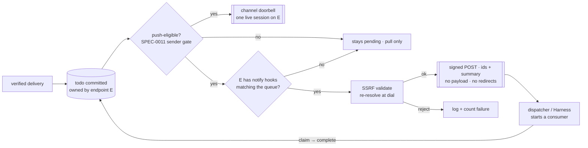

# ADR-0029: Per-Endpoint Outbound Webhooks Wake Consumers That Have No Session

## Context and Problem Statement

[ADR-0013](ADR-0013-channels-push-delivery.md) made push a doorbell over the durable queue: when a todo lands, switchboard writes a `notifications/claude/channel` to one live MCP session on the owning endpoint. That works — measured on 2026-09-21, an idle Claude Code session wakes, claims and completes, the same as Crush — but it has a hard precondition: **a process has to exist, hold the notification stream open, and have loaded the server as a channel.**

A large class of consumer never meets it:

* `claude -p` and every other one-shot run exits when its turn ends. There is nothing to ring.
* A scheduled sweep, a CI job, or a serverless function is not running between events.
* A supervisor that wants to *start* a worker on demand — rather than keep one idling — has no signal to start it on.

Today those consumers have two options, both bad. They can poll, paying latency and — for an LLM consumer — a model turn per "nothing for you". Or the operator can configure the *upstream* sender to deliver twice, once to switchboard and once to a bespoke listener, which duplicates trust configuration outside switchboard and bypasses routing rules ([ADR-0024](ADR-0024-event-routing-deterministic-and-llm.md)) entirely.

An outside self-hoster asked for exactly this, modelled on Cairn's `CAIRN_OUTBOUND_WEBHOOK_URLS`: a signed HTTP call the moment a todo is created. **How should switchboard tell a consumer with no session that work is waiting — without reintroducing the instance-wide infrastructure [#181](https://gitea.stump.rocks/stump.wtf/switchboard/issues/181) just removed?**

## Decision Drivers

* **No instance-wide anything.** Switchboard is multi-tenant; a todo belongs to exactly one endpoint ([ADR-0022](ADR-0022-endpoint-scoped-todo-ownership.md)). An env-configured URL list is a property of the deployment, belongs to no tenant, and would receive every tenant's work. That shape is what #181 tore out on the inbound side; it must not come back on the outbound side.
* **The queue stays the ledger.** Per ADR-0013 a push is a hint. An outbound call that fails, times out, or is never configured must lose nothing: the todo is `pending` and `claim_next` returns it.
* **Outbound HTTP to a caller-chosen URL is an SSRF primitive.** The guard already exists — `internal/push.Validator`, written for [ADR-0021](ADR-0021-a2a-task-delegation-transport.md), rejects private, loopback and link-local targets and re-resolves at dial time to defeat DNS rebinding. Nothing calls it yet.
* **The receiver must be able to trust the call.** A dispatcher that starts agents on an unauthenticated POST is a remote trigger for anyone who learns the URL.
* **Minimize what leaves.** A todo's payload is the full upstream webhook body, attacker-reachable and often large. The hook is a doorbell, not a copy of the work.
* **One sender gate.** Doorbells ring only for todos whose delivery passed per-source verification, or arrived on a token-trust self-managed webhook whose ingest URL is the credential (SPEC-0011 "Sender Gate and Injection Safety"; `internal/store/todos.go`). A second notification path with a looser gate would be the one attackers use.

## Considered Options

* **(A) Instance-wide URL list from the environment** — the requested shape, Cairn's shape.
* **(B) Per-endpoint notify hooks, self-managed over MCP** — an endpoint registers its own outbound URL, exactly as it registers its own inbound webhooks ([ADR-0012](ADR-0012-agents-self-manage-webhooks.md)). *(chosen)*
* **(C) Reuse A2A `PushNotificationConfig`** ([ADR-0021](ADR-0021-a2a-task-delegation-transport.md)) as the mechanism.
* **(D) Do nothing; document polling.**

## Decision Outcome

Chosen option: **"(B) Per-endpoint notify hooks, self-managed over MCP."** An endpoint may register a small number of outbound HTTPS URLs. When a push-eligible todo owned by that endpoint commits, switchboard POSTs a signed, payload-free notification to each. It is the doorbell of ADR-0013 on a second transport, with the same gate, the same lossiness, and the same owner.

> **A channel doorbell rings a session. A notify hook rings a door that has no one behind it yet.** Neither one is the work.

### Mechanics

* **Ownership and scope.** A hook row is `(endpoint_id, url, secret, queues[], enabled)`. It fires only for todos whose `endpoint_id` matches and whose queue is in `queues` (empty = every queue the endpoint drains). There is no global hook and no way to observe another endpoint's todos. A per-endpoint ceiling bounds the count, as `webhook_max` does inbound.
* **Management verbs** join the webhook family so the vend wizard and consent screen enumerate them for free: `create_notify_hook`, `list_notify_hooks`, `rotate_notify_hook`, `delete_notify_hook`. They are grantable per endpoint like any other verb; an endpoint that lacks them cannot make switchboard call out. The operator web UI lists and removes hooks on the endpoint's card.
* **Target validation.** `internal/push.Validator` runs at `create_notify_hook` (fail fast, nothing persisted) **and again immediately before every dial**. HTTPS only, unless the operator sets the existing `PushAllowHTTP` opt-in. Redirects are not followed — a 3xx is a failed delivery — because a redirect is a second, unvalidated target.
* **Signing.** Switchboard mints the secret, returns it once, and stores it through the `internal/cred` envelope like every other held secret. Requests carry the [Standard Webhooks](https://www.standardwebhooks.com/) headers — `webhook-id`, `webhook-timestamp`, `webhook-signature: v1,<base64 HMAC-SHA256>` over `id.timestamp.body` — which is the spelling switchboard's own generic receiver already honours inbound (`Webhook-Id`), so two switchboards chain without glue.
* **Body.** Identifiers and a summary, never the payload:

  ```json
  {"type": "todo.ready", "todo_id": "td_…", "queue": "inbox", "kind": "pull_request",
   "source": "gitea", "summary": "PR #482 opened in …", "endpoint": "<slug>", "created_at": "…"}
  ```

  `summary` is sender-controlled text. It is JSON-escaped data here rather than prose inside a prompt, but the receiver is told, in the docs, what the doorbell tells the model: it can inform, never instruct. The consumer fetches the work by claiming it.
* **Same gate, same trigger.** Hooks fire from the store's existing doorbell hook — after commit, only for todos that pass the sender gate: per-source verification (ADR-0003) or a token-trust self-managed webhook delivery, authenticated by its unguessable ingest URL (ADR-0023). A todo that would not ring a session does not call a hook.
* **Delivery is best-effort and off the ingest path.** A bounded in-process queue per instance; a full queue drops the notification and logs it. Each attempt has a short timeout (5s), with at most three attempts on a short backoff, then it gives up. `webhook-id` is stable across attempts so a receiver can dedup. No persistence of pending deliveries: a restart loses in-flight hints and nothing else, which is the ADR-0013 contract.
* **Health is visible.** Each hook records last status, last attempt and a consecutive-failure count, shown in `list_notify_hooks` and on the endpoint card. A hook that fails N times in a row is disabled and says so, rather than calling a dead URL forever.
* **Independent of sessions.** A hook fires whether or not a channel session is attached. An operator who runs both gets both; the claim lease is what prevents double work, as it already does between competing sessions.

### Consequences

* Good, because headless and on-demand consumers get real-time wake-up from switchboard itself, with no polling and no second upstream webhook.
* Good, because it adds no instance-wide surface: every hook has an owner, a scope, and a verb that granted it.
* Good, because it reuses what exists — the doorbell hook, the sender gate, the SSRF validator, the secret envelope — rather than a parallel pipeline.
* Good, because Harness can be the listener: a hook that starts a one-shot sweep replaces an always-idle worker.
* Bad, because switchboard now makes outbound requests to tenant-chosen hosts. The SSRF guard, HTTPS-only default and no-redirect rule bound it; they do not remove it.
* Bad, because it is a second thing that can silently not work. Mitigated by per-hook health and auto-disable; the queue still holds the todo.
* Bad, because a consumer might treat the hook as the delivery and never claim. The body deliberately carries too little to work from.

### Confirmation

* A push-eligible todo on an endpoint with a hook produces exactly one POST whose `webhook-signature` verifies against the minted secret, and whose body contains no field of the todo's payload.
* A todo owned by endpoint B never calls endpoint A's hook, including when both drain a queue of the same name.
* A hook whose host resolves to a public address at creation and a private one at delivery is **not dialled** (the rebinding scenario, with the injected resolver).
* A 3xx response is a failure and is not followed.
* With the hook URL unreachable, ingest latency is unchanged and the todo is `pending` and claimable.
* A todo that fails the sender gate calls no hook.

## Pros and Cons of the Options

### (A) Instance-wide URL list from the environment

* Good, because it is one env var and matches what the requester already knows from Cairn.
* Bad, because it belongs to no tenant: every endpoint's todos would reach one operator-chosen URL, which is a cross-tenant disclosure by construction on any instance with more than one human.
* Bad, because it is the mirror image of the receivers #181 removed for exactly that reason. Cairn can do this because a Cairn instance's artifacts share one owner scope; switchboard's todos do not.

### (B) Per-endpoint notify hooks, self-managed over MCP

* Good, because ownership, scope and grant are already solved problems on the inbound side, and this is symmetric with them.
* Good, because an agent can wire its own wake-up with no operator involvement, within what it was vended.
* Bad, because it is more to build than an env var: a table, four verbs, a delivery worker, a UI row.

### (C) Reuse A2A `PushNotificationConfig`

* Good, because the storage (`0012_a2a_push_notification_configs`) and the validator already exist.
* Bad, because it is scoped to an A2A **task**, configured by the remote caller per task, and lives behind `SWITCHBOARD_A2A`, an advanced flag that is off by default ([ADR-0023](ADR-0023-mvp-mcp-api-first-basics.md)). The requester's need is "every todo on my queue", owned by the endpoint and present in the MVP.
* Neutral: the two should share the validator and the delivery worker, and this ADR's worker should be written so ADR-0021's delivery path can adopt it.

### (D) Do nothing; document polling

* Good, because it is free and correct.
* Bad, because every headless consumer pays latency or model turns forever, and the workaround people reach for — a second upstream webhook — moves trust configuration outside switchboard.

## Architecture Diagram



## More Information

* **Presence.** [ADR-0027](ADR-0027-endpoint-presence-clock-in-clock-out.md) withholds doorbells while an endpoint is clocked out. A hook exists precisely to reach a consumer that is not running, so "clocked out" may not mean "do not start me". Resolved (design review 2026-09-22): hooks respect presence by default, with a per-hook `ignore_presence` opt-out for on-demand consumers ([SPEC-0024](../openspec/specs/notify-hooks/spec.md) REQ-9).
* **Digest.** Whether a burst should coalesce into one `todos.ready` call, as ADR-0027's digest doorbell does. Resolved (design review 2026-09-22): no for v1; `webhook-id` dedup and the receiver's own debounce are enough until the measurement plan in SPEC-0024's design shows a problem.
* The doorbell this extends: [ADR-0013](ADR-0013-channels-push-delivery.md). Ownership: [ADR-0022](ADR-0022-endpoint-scoped-todo-ownership.md). The inbound symmetry: [ADR-0012](ADR-0012-agents-self-manage-webhooks.md). The shared SSRF guard: [ADR-0021](ADR-0021-a2a-task-delegation-transport.md), `internal/push/ssrf.go`.
* Standard Webhooks signature scheme: <https://www.standardwebhooks.com/>.
