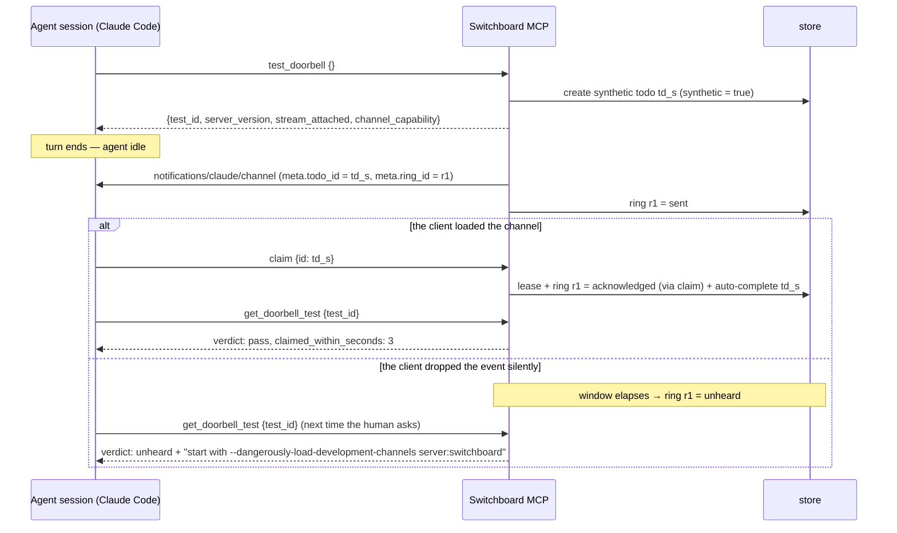

# ADR-0030: Doorbells Are Acknowledged, and Every Endpoint Can Test Its Own

## Context and Problem Statement

[ADR-0013](ADR-0013-channels-push-delivery.md) made push a doorbell: a
`notifications/claude/channel` written to one live MCP session on the owning endpoint. Switchboard
then records the write as a success. `pump` in `internal/mcp/doorbell.go` logs
`mcp doorbell delivered` as soon as `conn.Write` returns without error.

A successful write proves only that bytes reached the transport. Anthropic's channels reference
states the other half plainly:

> Claude Code doesn't acknowledge notifications. … If the session hasn't loaded your server as a
> channel, or the organization policy blocks it, Claude Code drops the events silently and returns
> no error to your server.
> — <https://code.claude.com/docs/en/channels-reference>

So the most common misconfiguration produces a clean log line on the server and total silence on
the client. The common case is a Claude Code session that connected Switchboard as an ordinary MCP
server, without `--dangerously-load-development-channels server:switchboard` (or
`--channels plugin:…` on an allowlisted plugin).

This has already cost real time:

* **A self-hosting customer spent about a week** concluding that idle wake-up "may be a
  Crush-fork-specific capability". It is not. On 2026-09-21 we measured an idle Claude Code session
  waking, claiming and completing a todo, once it was started with the development-channels flag.
  Their sessions were connected without it. Every server log said `delivered`.
* **The existing deaf-consumer warning cannot see this case.** It fires on
  `doorbellDeafThreshold = 3` consecutive *write failures*. A session that has not loaded the
  channel has write *successes*, so it is never flagged.
* **The server cannot ask the client.** The channel capability is declared by the *server*
  (`capabilities.experimental['claude/channel']`). Claude Code sends nothing back to say it
  registered a listener. `clientInfo` from `initialize` names the client and its version, and
  nothing more.

The only proof that a doorbell was heard is something the agent **does** afterwards: it claims
the todo. That signal is not recorded against the ring, and nobody can ask for it on demand.

**How should Switchboard tell "delivered" apart from "heard", and give an operator and an agent a
way to prove that the loop works end to end?**

## Decision Drivers

* **"Delivered" must stop meaning "worked"** anywhere a human reads it: logs, the board, metrics
  and docs.
* **Measure the property, not a proxy.** The property is "an agent acted on the ring". A transport
  write, an open stream and a declared capability are all proxies. Each can be true while the
  agent hears nothing.
* **Tenancy.** A test, a ring record or a metric MUST NOT let one tenant observe or trigger
  anything on another tenant's endpoint. The operator CLI acts as the signed-in human, on that
  human's endpoints only.
* **Metrics stay honest** ([ADR-0028](ADR-0028-prometheus-metrics-endpoint.md), SPEC-0023 REQ-6).
  A self-test must not inflate `todos_created_total`, and an unheard ring must be a counted event,
  not an absence.
* **No new cost per ring.** Acknowledging must not require an extra model turn. A claim, which the
  agent makes anyway, has to count.
* **Diagnose, then remediate.** The customer's week was spent guessing. The answer should name the
  flag to add.

## Considered Options

* **(A) Status quo, plus docs.** Document that `delivered` means written, and leave the rest to
  troubleshooting pages.
* **(B) Infer from the client.** Parse `clientInfo` and warn when a Claude Code client connects
  without evidence of the flag.
* **(C) Ring acknowledgement plus an end-to-end self-test.** Record each ring. Mark it acknowledged
  when the endpoint claims the todo, or when a lightweight `ack_doorbell` call names it, and
  unheard when a window passes with neither. Add a self-service `test_doorbell` verb and a
  `switchboard doctor` operator command that ring a synthetic todo and report whether it was
  claimed. *(chosen)*
* **(D) Require a synchronous ack.** Make the doorbell a request that the client must answer.

## Decision Outcome

Chosen option: **"(C) Ring acknowledgement plus an end-to-end self-test"**, because it is the only
option that measures the property itself: an agent acted on the ring. It turns the week-long
debugging session into a single tool call.

> **A write is not a ring someone heard.** Switchboard records the ring, waits for the agent to
> act on it, and says which happened.

### Ring states

Every doorbell written to a session creates a **ring** with this lifecycle:

```
sent ──(claim of its todo by the endpoint, or ack_doorbell {ring_id})──▶ acknowledged
  │
  └──(ack window elapses with neither)──▶ unheard
```

* **sent**: the transport write succeeded. A write that fails creates no ring. It stays a
  deaf-consumer write failure, as today.
* **acknowledged**: the endpoint claimed the ring's todo (any session of the endpoint, since the
  endpoint is one logical agent, as ADR-0022 establishes), or a session called
  `ack_doorbell {ring_id}`. A digest ring (ADR-0027) is acknowledged by `ack_doorbell`, or by any
  claim from the endpoint within the window. The claim path writes the acknowledgement in the same
  transaction as the lease, so it costs no extra turn and no extra round trip.
* **unheard**: the window (default 15 minutes, configurable) elapsed with neither. Exactly one
  instance claims each transition to `unheard`, with a conditional update. A later claim is
  recorded on the ring for diagnosis, but does not move it back.

A ring reaches exactly one terminal state, so `sent = acknowledged + unheard + open` holds at all
times.

Doorbells gain one identifier-safe `meta.ring_id`. The doorbell text does not change: claiming is
still the instruction.

**Per-session deafness replaces write-failure-only deafness.** A session whose last 3 rings went
unheard, with no acknowledgement of any kind in between, is marked **unheard** in the registry.
The board shows it, and one warning is logged per run. Any acknowledgement clears it. The existing
write-failure warning stays.

### The unheard-rings metric

These series join the SPEC-0023 registry (ADR-0028), with bounded labels only:

```
switchboard_doorbell_rings_total{kind}                         counter  # kind: todo|digest
switchboard_doorbell_rings_acknowledged_total{kind,via}        counter  # via: claim|ack
switchboard_doorbell_rings_unheard_total{kind}                 counter
switchboard_doorbell_unheard_sessions                          gauge
```

`unheard_total` rising while `acknowledged_total` stays flat is the alert. It is the channel-side
twin of ADR-0028's `pending > 0 and claimed == 0`. Endpoint and session identifiers are not labels.
Per-endpoint detail lives in the API and on the board. **Synthetic rings (below) are excluded from
every series.**

### `test_doorbell` and `switchboard doctor`

**`test_doorbell`** is a self verb: it needs no grant, like the presence verbs in SPEC-0022, and it
acts only on the caller's own endpoint. It:

1. creates a **synthetic, push-eligible todo** on the caller's endpoint, marked `synthetic`;
2. returns at once with a `test_id` and the facts Switchboard can observe;
3. rings the endpoint about 2 seconds later, so the calling turn can end before the doorbell
   arrives. A tool call that blocked while waiting for its own doorbell would deadlock, because
   the model cannot act on a channel event while it is waiting on a tool result.

`get_doorbell_test {test_id}` then returns the full report.

The report has these fields:

| Field | Meaning |
|---|---|
| `server_version` | The stamped version (ADR-0032) |
| `stream_attached` | Whether a session on the endpoint holds an open notification stream |
| `channel_capability` | Whether the server advertised `claude/channel` (always, today), plus the connecting client's `clientInfo` name and version, plus the explicit note that the client's listener cannot be observed |
| `delivered` | Whether the synthetic doorbell was written, when, and to which session |
| `claimed_within_seconds` | How long the claim took, or null |
| `verdict` | `pass`, `no_session`, `no_stream`, `write_failed`, `unheard`, or `pending` |
| `hints` | Remediation keyed by verdict and by client, for example, for Claude Code: "start with `--dangerously-load-development-channels server:switchboard`; pass `--allowedTools mcp__switchboard`, or a woken session stops at a permission prompt; `claude -p` cannot be woken, so use a notify hook (SPEC-0024)" |

**`switchboard doctor`** is the operator-CLI twin. It checks CLI credentials, server reachability,
the server version against the CLI version, and `/healthz`. With an endpoint reference it runs the
same test through a new operator route, `POST /api/v1/endpoints/{ref}/doorbell-tests`, and polls
for the report. That route is scoped exactly like the other `/api/v1/endpoints/{ref}` routes: it
answers not-found for an endpoint the caller does not own. The operator is an instance role, and
gives no reach into other tenants' endpoints.

### Synthetic todos

Synthetic todos are **marked, auto-cleaned and excluded**:

* They are rung exactly once, never swept, and never fire a notify hook (SPEC-0024).
* They never appear in `claim_next` or in default `list_todos`. They are claimable by id.
* They are excluded from every metric and from the board's lanes.
* A claim completes one automatically, with a result that says no work was needed.
* One that is never claimed is deleted when the test expires (window plus grace, at most 10
  minutes). Only the test report survives, for 7 days.
* Each endpoint may have one test outstanding, and at most 6 tests an hour.

### Consequences

* Good, because "delivered" stops passing for "heard". The board, the logs and a Grafana panel all
  show unheard rings.
* Good, because a misconfigured client is diagnosed in one call, with the flag to add. Most of the
  week the customer lost would have been one `test_doorbell` call.
* Good, because acknowledgement costs nothing per ring. The claim that already happens is the ack.
* Good, because `doctor` is the proof gate the layered onboarding path needs: "the agent claimed a
  real todo", not "a server log says delivered".
* Bad, because every ring is now a row. This is bounded by the ring budget (at most 5 per todo plus
  digests), pruned after 7 days, and written off the hot path by the instance that rang.
* Bad, because "unheard" has false positives. A worker that is heads-down for longer than the
  window sees its ring go unheard, then claims. The per-session mark needs 3 in a row and clears on
  any ack, so a busy worker is not labelled deaf. The counter reflects what happened within the
  window, which is what an operator tunes the window against.
* Bad, because the synthetic todo is a second todo kind that every read path has to exclude. This
  is mitigated by a single `synthetic` column and a store-level default filter, rather than a
  filter in each caller.
* Neutral: clients other than Claude Code get the same verdicts. Hints are keyed by `clientInfo`
  and fall back to generic advice.

### Confirmation

* A session connected **without** the channel flag: `test_doorbell` reports `delivered` with the
  verdict `unheard` and the Claude Code hints. The same session restarted with the flag reports
  `pass`.
* A claim of a rung todo writes `acknowledged` with `via = claim` in the same transaction as the
  lease.
* A synthetic todo changes no SPEC-0023 series, and appears in no `claim_next`.
* Endpoint B's session cannot read, acknowledge or trigger endpoint A's rings or tests, over MCP
  or through `/api/v1`, whether or not the two endpoints share a human.
* 3 unheard rings in a row mark a session unheard on the board. One ack clears it.

## Pros and Cons of the Options

### (A) Status quo, plus docs

* Good, because it costs a page of writing.
* Bad, because the customer read our docs and still spent a week. Docs cannot see a live
  misconfiguration.
* Bad, because the server keeps reporting a proxy as the property.

### (B) Infer from the client

* Good, because it needs no new state.
* Bad, because there is nothing to infer from. Claude Code sends no signal that it loaded the
  channel, and `clientInfo` is identical with and without the flag. A heuristic warning would be
  wrong in both directions.

### (C) Ring acknowledgement plus an end-to-end self-test

* Good, because it measures the outcome that matters, and needs no client cooperation beyond the
  claim the doorbell already asks for.
* Good, because it composes with presence (ADR-0027 digest rings), metrics (ADR-0028), notify
  hooks (ADR-0029, whose `claude -p` hint it points to) and Harness's auto-confirm of the
  development-channels prompt (Harness ADR-0029).
* Bad, because it adds a table, two self verbs, an operator route and a CLI command.

### (D) Require a synchronous ack

* Good, because it would be exact.
* Bad, because it is not ours to require. The channel contract is one-way and fire-and-forget by
  Anthropic's design, and we cannot change the client.

## Architecture Diagram



## More Information

* The doorbell this extends: [ADR-0013](ADR-0013-channels-push-delivery.md). Digest rings:
  [ADR-0027](ADR-0027-endpoint-presence-clock-in-clock-out.md). Metrics registry:
  [ADR-0028](ADR-0028-prometheus-metrics-endpoint.md). Consumers with no session:
  [ADR-0029](ADR-0029-outbound-todo-webhooks.md).
* Requirements: SPEC-0025 (`docs/openspec/specs/doorbell-acknowledgement/`).
* Companion records, accepted together on 2026-09-22 and linked as front-matter edges:
  * ADR-0032 / SPEC-0027 supplies `server_version`.
  * ADR-0038 / SPEC-0033 (teams) extends the owner-scope check to team-owned endpoints without
    changing this design.
  * SPEC-0024 (notify hooks): synthetic todos never fire a hook.
* Cross-product, cited in prose:
  * Harness ADR-0029 / SPEC-0023 (development-channels auto-confirm) is the Harness-side
    remediation that the hints point to.
* Anthropic channels reference, including the "doesn't acknowledge notifications" contract:
  <https://code.claude.com/docs/en/channels-reference>.
