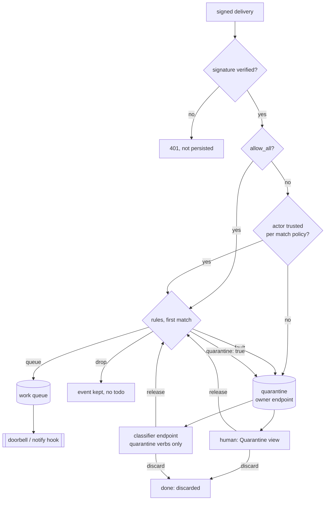

# ADR-0031: Intake Fails Closed — Trusted Actors Are First-Class and Everything Else Is Quarantined

## Context and Problem Statement

Switchboard's routing rules ([ADR-0024](ADR-0024-event-routing-deterministic-and-llm.md)) are the
only thing between an attacker-reachable webhook body and a tool-bearing agent. Anyone who can
open an issue, comment, or land a delivery controls that body. Three facts on `main` make the gate
weaker than it looks.

**1. Rules fail open (#212).** The `internal/routing` package documents it: "a rule that errors or
times out is treated as no-match and recorded on the trace rather than failing the delivery."
Rules are first-match-wins, so "no match" means *fall through*. A trust rule that faults stops
restricting, and a drop rule that faults stops dropping. `internal/ingest/selfmanaged.go` now logs
a warning when that happens (#226), but the delivery is still routed. If the sandbox cannot start
at all, `internal/ingest/ingest.go` logs "webhooks with rules will route by default" and carries
on. The checked-in fleet pack defends itself by hand: every allowlist is read through
`| arrays | strings`, and a test holds it to that. Every other rule author is expected to reinvent
fail-closed in jq.

**2. Params vanish (#213).** `set_webhook_rules` builds its config from `in.Params`, so omitting
`params` clears them (`internal/mcp/webhook_rules.go`). Params are where allowlists live
(`trusted_humans`, `cairn_actors`). An agent that edits a rule list without mentioning params
empties every allowlist. Combined with (1), whether the result is "everything passes" or
"everything drops" depends on rule order, and nothing reports an error.

**3. Trust is hand-written jq.** "Only act on trusted people" is a cookbook recipe:
`.issue.author as $a | any($params.trusted_humans[]; . == $a)`. It is projected only for `issues`
events, so pull requests, comments and reviews each need their own path expression. Cairn's signed
`actor_id` needs another. An untrusted delivery has two fates, dropped or routed, and the dropped
ones are gone.

The pressure on this is rising:

* **GitHub Issues are now open on every public mirror** as outside intake. Until now, trust leaned
  on "only our identities can reach the tracker". That stopped being true this week.
* **A self-hosting customer's operating plan** states the rule we want as a system property:
  customer text and errors are untrusted data, never instructions, and a server-verified identity
  governs scope. They enforce it in their own coordinator, because nothing underneath does.
* **The on-demand one-shot milestone** makes a trusted person's label start an agent within
  seconds (Switchboard ADR-0029, Harness ADR-0021). A gate that fails open in front of a trigger
  that starts agents is a remote-execution path.

**How should Switchboard decide who is trusted, fail closed when it cannot decide, and keep
untrusted input visible without ever letting it reach an agent that has tools?**

## Decision Drivers

* **Fail closed is the engine's job, not every author's.** A security gate whose default is "let
  it through" is inverted.
* **Identity comes from verified fields only.** An actor is trusted only when the delivery's
  signature verified and the actor field was parsed by Switchboard from the signed body. It is
  never trusted from a self-reported field, a header, or a token-trust webhook whose body nobody
  signed.
* **Untrusted is not worthless.** Outside bug reports on a public mirror are why intake was opened.
  They must be kept and reviewed, not silently dropped.
* **Untrusted text never reaches a tool-bearing agent unreviewed.** It must not arrive by
  doorbell, by notify hook, or by `claim_next`.
* **Multi-tenancy.** A trust list and a quarantine belong to the webhook's owner scope, like
  everything else a user creates (ADR-0022, and the Teams ADR-0038). The instance
  operator can bound them and never read them.
* **No silent data loss from an omitted field.** #213 is a class of bug. Every new
  "replace-the-config" verb introduced here must make clearing explicit.

## Considered Options

* **(A) Status quo plus documentation.** Keep jq-only trust, document the `| arrays` idiom
  harder, and fix #213 alone.
* **(B) Fail-closed engine plus first-class trusted actors; untrusted is dropped.**
* **(C) Fail-closed engine, first-class trusted actors, and a quarantine queue that only a human
  or a tool-less classifier drains.** *(chosen)*
* **(D) Put the optional LLM triage stage (ADR-0024 phase 2) in front as the trust gate.**

## Decision Outcome

Chosen option: **"(C) Fail-closed engine, first-class trusted actors, and a quarantine queue"**.
It is the only option where a broken rule, an unknown sender and an outside report all end up in
the same visible, reviewable place instead of in a work lane or nowhere.

> **Intake has three outcomes: routed, dropped on purpose, or quarantined.** "Routed because the
> gate broke" is no longer one of them.

### 1. The engine fails closed (fixes #212)

* **Any rule fault stops evaluation.** The causes are timeout, error, compile failure or an
  exhausted budget. No later rule runs and the default does not apply. The delivery's disposition
  is `faulted`. This holds for **all** rules, not a marked class. A first-match list means
  something only if every earlier rule decided. After a fault, the evaluator does not know what
  the author intended.
* **A faulted delivery is quarantined** (below), with the fault recorded, is counted, and is shown
  to the owner. Until quarantine ships, the #212 fix alone persists the event with no todo, which
  is the same shape as a drop, with disposition `faulted`, a counter and an owner-visible warning.
* **A wholly unavailable sandbox refuses the delivery** with `503`, persisting nothing, so that the
  producer retries. This follows the existing precedent: a webhook with no resolvable target
  already answers `503 webhook not configured`.
* **A rule that faults on real traffic is refused at save time.** `set_webhook_rules`,
  `add_webhook_rule`, `update_webhook_rule` and `move_webhook_rule` dry-run the candidate
  configuration against the webhook's most recent stored deliveries (up to 50), using the machinery `test_webhook_rules`
  already has. The save fails if any rule faults on any of them. `$params` values are also
  type-checked: every value must be a string, number, boolean, or a list of strings or numbers.

### 2. Params are never cleared by omission (fixes #213)

`set_webhook_rules` treats an omitted `params` as **unchanged**. Only an explicit `params: {}`
clears them. Every rules verb echoes the resulting `params` in its response. The same rule governs
the new trust verb: `trusted_actors` is a **required** argument of `set_trusted_actors`, and
clearing needs its own verb.

### 3. Trusted actors are a first-class webhook field

Each self-managed webhook may carry `trusted_actors`, owned by the webhook's owner scope:

```jsonc
// github / gitea webhook
{"logins": ["joestump", "joestump-agent"], "match": "sender"}   // match: sender | author | both
// cairn webhook
{"actor_ids": ["…"]}
```

* **Verbs.** `create_webhook {…, trusted_actors?}`, `set_trusted_actors {webhook_id,
  trusted_actors}` (a full replace, argument required), and `clear_trusted_actors {webhook_id}`.
  `list_webhooks` echoes the field. These verbs join the webhook family's grants.
* **Who is who.** Switchboard parses the actor in Go, from the **verified** body, identically for
  both forges:
  * `sender` is `sender.login`, the account that performed the action;
  * `author` is the author of the object the event is about: the comment, review, pull request or
    issue, in that order of preference;
  * for Cairn, both are the signed `actor_id`. Cairn records the account behind the token.
    `on_behalf_of` is self-reported and never counts.

  Logins compare case-insensitively.
* **Where it is refused.** It is refused on token-trust (`generic`) webhooks, because nobody signed
  the body, so an actor field there is attacker-written. It is also refused on sources with no
  actor projection (Stripe and Slack, for now). The error names the reason.
* **Match policy.** `match = "sender"` (the default) trusts the delivery when the sender is
  trusted, even if the author is not. That is the "a maintainer labels an outsider's issue"
  case, and it is how outside reports get promoted. `author` requires a trusted author. `both`
  requires both.
* **Evaluated before rules.** An untrusted delivery is quarantined, and rules never see it. A
  trusted delivery reaches rules with a new top-level, unforgeable envelope field:
  `.actor = {sender, author, sender_trusted, author_trusted, trusted}`. So a rule can still branch
  on "trusted labeler, outside author". Work orders (ADR-0025) carry `author_trusted`, so the agent
  knows when the body in front of it came from outside.
* **Fail closed by default; trusting everyone is an explicit opt-in.** On `github`, `gitea` and
  `cairn` webhooks the gate always runs. An empty list trusts no one, and everything is quarantined.
  `create_webhook` without `trusted_actors` stores an empty list; the vend wizard offers the vending
  human's linked login as a pre-filled entry, applied only when the human keeps it.
  `{"allow_all": true}` routes every verified sender. It is off unless set explicitly, rules see
  `.actor.trusted = true` with null per-actor flags, and `list_webhooks` and the webhook card flag it.
  (Joe, 2026-09-22: risky options are fine when they are configurable and off by default.)
* **Existing webhooks are migrated, not special-cased.** The migration writes
  `{"allow_all": true}` onto every existing `github`, `gitea` and `cairn` webhook, so each keeps
  routing as before and the choice is visible on its card. No code path treats a missing field as
  "gate off".

### 4. Quarantine

* **What it is.** A reserved queue named `quarantine`. A quarantined todo belongs to the webhook's
  **owning endpoint** and never to a fan-out target, so one delivery makes one quarantine item in
  the owner's scope. It records `quarantine_reason` (`untrusted_actor`, `rule_fault` or
  `rule_action`) and its detail. Rules gain an explicit action, `{"quarantine": true}`, alongside
  `queue` and `drop`, so rule packs can quarantine instead of dropping.
* **Never pushed to an agent with tools.** A quarantined todo never rings a doorbell for an
  ordinary endpoint. It never fires a notify hook (SPEC-0024). It is never returned by
  `list_todos`, `claim` or `claim_next`. It can never be named as a webhook target queue, a scope
  queue, a route or a rule action queue. The store applies this as a default filter, as it does
  for synthetic todos (ADR-0030).
* **Drained by a human, or by a classifier with no tools.**
  * **A human** uses the web UI's Quarantine view. It shows the reason, the actor, and the escaped
    summary and payload, and offers **release** (optionally to a named queue), **discard**, and
    **trust this actor and release**.
  * **A classifier** is an endpoint vended with the *classifier role*. Its grant is exactly
    `list_quarantined`, `get_quarantined`, `release_quarantined {id, queue?}` and
    `discard_quarantined {id, reason}`, plus self verbs. The vend refuses to combine them with any
    other verb, so a classifier credential can do nothing but classify. At vend time the human
    attests that the agent behind it runs without tools. A classifier endpoint receives only a
    count-only doorbell ("N items awaiting classification"), which never contains sender text.
* **Release re-enters routing.** A released item is routed again through the webhook's rules, with
  the trust gate satisfied by the release and a new `.release = {by, at}` envelope field
  (`by = "human:<id>"` or `"classifier:<slug>"`). The owner's rules decide where released items go.
  A classifier release can be sent to a separate "untrusted triage" lane, for example. `.actor`
  keeps `author_trusted = false`, so every downstream agent still sees outside text for what it
  is. A release to an explicit `queue` must be within the owner's webhook-queue ceiling.
* **Retention.** Quarantined items auto-discard after 30 days (reason `expired`), or sooner if the
  operator's retention bound is shorter.

### 5. A safe recipe for the public mirrors

The docs ship a routing recipe, "Outside intake from the public GitHub mirrors":

1. Create one signed `github` webhook, installed at the GitHub **organization** level for
   `issues` and `issue_comment`.
2. Set `trusted_actors` to the maintainers, with `match = "sender"`.
3. Route trusted `labeled` events to work lanes. Map the mirror repo to its canonical tracker in
   the work order, because fixes land on Gitea, not the mirror.
4. Let everything else quarantine, except a maintainer's own comments, which carry no issue subject
   and are dropped on purpose.

An outsider's `opened` issue waits in quarantine. A maintainer who labels it (sender trusted,
author not) promotes it into a lane with `author_trusted = false`. Outside comments never reach an
agent unreviewed.

### Consequences

* Good, because a broken rule can no longer widen what reaches a lane, and the owner learns about
  it immediately instead of by forensics.
* Good, because trust stops being a jq idiom each author re-derives. One field covers issues, pull
  requests, comments and Cairn artifacts.
* Good, because outside reports are kept and reviewed rather than dropped, and promoting one is a
  label, which fits how maintainers already work.
* Good, because rule packs (ADR-0036) and the one-shot trigger path get a gate they
  can rely on.
* Bad, because failing closed turns a mistyped rule into held work. A queue can go quiet because
  its deliveries are in quarantine. This is mitigated by the save-time dry-run, the fault counter,
  the board warning, and a quarantine count on the webhook in `list_webhooks`.
* Bad, because the queue-liveness alert from ADR-0028 (`pending > 0 and claimed == 0`) would fire
  forever on `quarantine`. The documented alert excludes `queue="quarantine"`, and quarantine gets
  its own age alert.
* Bad, because logins are mutable. A trusted user who renames frees their old login for someone
  else. Resolved (design review 2026-09-22): numeric forge ids become an alternative entry form in a
  follow-up.
* Bad, because "classifier with no tools" is an attestation, not something Switchboard can see.
  The credential's verb set is what is enforced. Doorbells carry no sender text, and a classifier
  release still carries `author_trusted = false`.
* Neutral: `.actor`, `.release` and the `quarantine` action are new envelope and rule contract
  surface (SPEC-0020 paths must not move), and they are additive.

### Confirmation

* A rule that faults on a delivery quarantines it. No later rule and no default runs. With the
  sandbox down, the webhook answers `503` and persists nothing.
* `set_webhook_rules` without `params` leaves the stored params unchanged.
* A trusted-actor webhook routes a maintainer's `labeled` event, and quarantines an outsider's
  `opened` event of the same issue.
* A quarantined todo is invisible to `claim_next`, rings no ordinary doorbell, and fires no hook.
  It appears only in the owner's Quarantine view and to the owner's classifier endpoints.
* Human B cannot list, release or discard human A's quarantine by any path. A classifier endpoint
  owned by B sees only B's items.
* `set_trusted_actors` on a `generic` webhook fails with `invalid_argument`.

## Pros and Cons of the Options

### (A) Status quo plus documentation

* Good, because it is cheap.
* Bad, because it leaves a fail-open security gate in place and documents the workaround rather
  than removing the hazard.
* Bad, because untrusted input keeps two fates, lost or routed, and the public intake just made
  "routed" dangerous.

### (B) Fail-closed engine plus first-class trusted actors; untrusted is dropped

* Good, because it closes the gate with less machinery.
* Bad, because dropping loses the outside reports that intake exists to collect.
* Bad, because fail-closed-by-dropping makes a mistyped rule silently discard real work. That is
  the "queue went quiet" incident, with no way to recover the deliveries.

### (C) Fail-closed engine, first-class trusted actors, and a quarantine queue

* Good, because faults, unknown senders and outside reports are kept, visible and recoverable.
* Good, because promotion reuses the maintainers' existing gesture, a label, through the same
  trust gate.
* Bad, because it is the most machinery: a reserved queue, a UI view, a classifier role, and a
  release path through routing.

### (D) LLM triage as the gate

* Good, because it could read intent that allowlists cannot.
* Bad, because the component deciding whether text is safe would be one that the text can
  instruct. An injection that talks the gate into "trusted" defeats it. Triage can run *on*
  quarantine, as a tool-less classifier. It cannot *be* the gate.

## Architecture Diagram



## More Information

* Bugs fixed first: #212 (rules fail open) and #213 (params cleared on omission).
* Builds on [ADR-0024](ADR-0024-event-routing-deterministic-and-llm.md) (routing), and on
  [ADR-0003](ADR-0003-per-provider-ingestion-and-trust-model.md), whose per-source verification is
  where an actor's identity comes from. Work orders: [ADR-0025](ADR-0025-handoff-work-orders-and-difficulty-lanes.md).
  Doorbells: [ADR-0013](ADR-0013-channels-push-delivery.md). Notify hooks:
  [ADR-0029](ADR-0029-outbound-todo-webhooks.md).
* Requirements: SPEC-0026 (`docs/openspec/specs/trusted-intake/`).
* Companion records, accepted together on 2026-09-22 and linked as front-matter edges:
  * SPEC-0024: quarantined todos never fire a notify hook.
  * ADR-0030 / SPEC-0025: the store's default-filter pattern for excluded todos.
  * ADR-0034 / SPEC-0029: notification sinks. A quarantine arrival can notify the owner through
    Gotify or Apprise.
  * ADR-0036 / SPEC-0031: the `trusted-actors` rule pack, which maps onto this field.
  * ADR-0038 / SPEC-0033: Teams. A team-owned webhook's trust list and quarantine belong to the
    team, and admins edit them.
* Cross-product: Cairn's signed `actor_id` is the identity for Cairn webhooks. Cairn's annotation
  events (Cairn ADR-0022 / SPEC-0016) carry the actor of a comment or reaction, so the same field
  gates them. A Harness one-shot started by a trusted event receives `author_trusted` in its work
  order.
