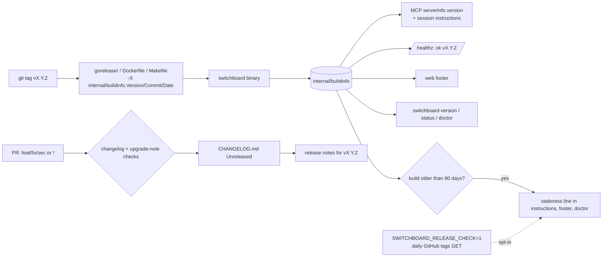

# ADR-0032: Every Surface Reports One Stamped Version, and Every Release Says What Changed and How to Upgrade

## Context and Problem Statement

Switchboard has cut two releases, `v0.1.0` and `v0.2.0` (2026-09-15). `main` is 17 commits past
`v0.2.0`. Those commits include a breaking removal, a behaviour change every client notices, and a
new operator surface. People run releases, read docs built from `main`, and cannot tell which of
the two they have:

* **The server lies about its version over MCP.** `internal/mcp/mcp.go` hardcodes
  `serverVersion = "0.1.0"` and sends it as `serverInfo.version` to every client. The binary does
  know its version: `main.version` is stamped by the Makefile, the Dockerfile and goreleaser, and
  the release workflow asserts it. But only `switchboard version` reads it. The web UI, `/healthz`
  (which answers `ok`) and the MCP session instructions report nothing.
* **Customers hit the skew.** A self-hosting customer was told in chat, "you're on an older version
  that doesn't send doorbells on connection". Ring-on-connect (#276) landed after `v0.2.0`, and
  nothing they could query would have told them. Three of their five reported bugs are fixed on
  `main` and not shipped. The public image they pull, `ghcr.io/stump-wtf/switchboard:latest`,
  moves only on `v*` tags. On 2026-09-22 its digest equals `:0.2.0`'s. (The internal Gitea-registry
  `:latest` tracks `main`, but self-hosters do not pull it.)
* **A breaking change shipped with no note.** #291 (`sec!:`) removed the environment-seeded
  receivers. After it:
  * `SWITCHBOARD_{GITHUB,GITEA,STRIPE,SLACK}_SECRET` are **silently ignored**. Nothing on `main`
    reads them, and nothing warns.
  * migration `0021_drop_adapters` drops the provider rows and cannot be reversed;
  * every sender has to move to `create_webhook`.

  There is no CHANGELOG, and no upgrade guide says any of this.
* **The docs describe `main` without saying so.** The docs site is built from `main` on every push,
  with no statement of which release it describes and no marker on features that are not in any
  release yet.

A self-hosting customer's operating plan names the principle: **installed is not rolled out**.
A capability is not done when it merges, only when a user can get it, knows they have it, and can
upgrade to it safely. **What release contract makes version skew visible, and makes every upgrade
path written down before anyone needs it?**

## Decision Drivers

* **One source of truth for the version**, set at build time, read by every surface. It is never a
  literal in code.
* **A human and an agent can both tell what they are talking to.** A human needs the web UI,
  `/healthz` and the CLI. An agent needs `serverInfo` and the session instructions.
* **Breaking changes are announced where an upgrader will look**, before they upgrade: the
  CHANGELOG, an upgrade guide, and loud startup warnings for configuration that stopped doing
  anything.
* **Docs are honest about what is released.** Readers are on releases, and docs are built from
  `main`.
* **No phoning home by default.** Switchboard is multi-tenant and self-hosted. An instance must not
  contact a third party unless its operator says so.
* **Verify by content.** The release workflow already learned this: a wrong `-X` path "injects
  nothing and still exits 0". Every new stamp needs an assertion that fails when the stamp did not
  happen.

## Considered Options

* **(A) Hotfix only.** Replace the hardcoded literal with `main.version`, and do nothing else.
* **(B) A release contract.** A single `internal/buildinfo` package, stamped by ldflags and read by
  every surface. Add a CHANGELOG discipline enforced in CI, mandatory upgrade notes for breaking
  changes, startup warnings for ignored configuration, release-honest docs, and an offline
  staleness warning in the session instructions, with an opt-in release check. *(chosen)*
* **(C) Versioned docs plus a release train.** Docusaurus versioned docs per minor release, and a
  fixed release cadence.
* **(D) Default-on update check.** Like (B), but the server polls for new releases by default.

## Decision Outcome

Chosen option: **"(B) A release contract"**. It fixes the lie and the silence together, at a cost
proportionate to a 0.x project, and it leaves versioned docs for when there is a 1.0 to version.

> **A release is a promise with three parts: the binary says what it is, the CHANGELOG says what
> changed, and the upgrade guide says what breaks.**

### 1. One stamped version

* A new `internal/buildinfo` package holds `Version`, `Commit` and `Date`. The Makefile, the
  Dockerfile and `.goreleaser.yaml` stamp all three with
  `-X github.com/stump-wtf/switchboard/internal/buildinfo.<Var>=…`. `main.version` is removed, and
  `switchboard version` reads `buildinfo`.
* When no ldflags were applied (`go install …@vX.Y.Z`, or `go run`), `buildinfo` falls back to
  `debug.ReadBuildInfo()`: the module version, and `vcs.revision` / `vcs.time` where Go recorded
  them. Only a build with neither reports `dev`.
* The literal `serverVersion = "0.1.0"` is deleted, and a test fails if a version-looking literal
  reappears in `internal/mcp`.
* The release workflow's existing assertion is extended. The released binary must report the tag
  from `switchboard version`, **and** a started server must report the same tag in `/healthz` and
  in the MCP `initialize` result.

### 2. Every surface shows it

| Surface | What it shows |
|---|---|
| MCP `initialize` | `serverInfo.version` = `buildinfo.Version` |
| MCP session instructions | A first line, `switchboard <version> (<date>)`, plus the staleness warning below when it applies |
| Web UI footer | Version, linked to its release notes. The short commit appears on hover |
| `GET /healthz` | `ok <version>` on one line for probes. With `Accept: application/json`, `{"status": "ok", "version", "commit", "date"}` |
| CLI | `switchboard version` prints the CLI's version, and the server's too when logged in. `switchboard status` and `switchboard doctor` (ADR-0030) warn when they differ in major or minor version |

`/healthz` stays public, because load balancers need it. Publishing the version there is accepted:
the source and every release are public, so the version gives an attacker nothing they could not
learn by fingerprinting assets. An operator who disagrees MAY set `SWITCHBOARD_HIDE_VERSION=1`.
That drops the version from `/healthz` and the footer only. MCP and the CLI still get it, because
they are authenticated.

### 3. CHANGELOG discipline

* `CHANGELOG.md` at the repository root, in [Keep a Changelog](https://keepachangelog.com/)
  format, with an `## [Unreleased]` section and headings Added / Changed / Fixed / Security /
  **Breaking**. It is back-filled for `v0.1.0` and `v0.2.0`.
* **A CI check enforces it.** A PR whose title is `feat`, `fix`, `sec` or `perf`, or carries `!`,
  must change `CHANGELOG.md` under `[Unreleased]`. `docs`, `toil`, `test`, `chore` and Renovate
  dependency PRs are exempt. A `no-changelog` label is the escape hatch, and it shows in review.
* Releasing moves `[Unreleased]` to `## [vX.Y.Z] - date`. goreleaser's release notes are taken from
  that section, not generated from commit subjects.

### 4. Breaking changes carry an upgrade note, and a startup warning

* A **breaking change** is any `!` commit, any removal or rename of configuration, of an MCP verb,
  field or error code, or of an API route, any change to a default that alters behaviour, or any
  migration that cannot be reversed. A PR containing one must add:
  * a `### Breaking` CHANGELOG entry;
  * a section in `docs/guides/15-upgrading.md`, under the target version, with what breaks, who is
    affected, the steps, and how to verify.

  CI enforces this for `!` titles and for new migrations containing `DROP` or `DELETE`.
* An **irreversible migration** is named in the upgrade note, with a "back up first" instruction
  and the exact `pg_dump` command.
* **Ignored configuration is loud.** The server keeps a table of retired environment variables,
  each with the version that retired it and a link to its upgrade note. At startup it logs one
  `WARN` per retired variable that is still set. The first entries are the four #291 secrets and
  `SWITCHBOARD_LEGACY_RECEIVER_ENDPOINT_ID`.

### 5. The docs say which release they describe

* Every page carries a banner, rendered at build time, that names the latest release tag and the
  commit the site was built from. On a build from `main` it reads: "These docs track `main`. The
  latest release is vX.Y.Z. Features marked *Unreleased* are not in it."
* A feature added after the latest tag is marked in the docs with an `Unreleased` admonition
  (`:::unreleased`). The release checklist rewrites each marker to `Since vX.Y.Z`, and a release CI
  step fails if any `:::unreleased` survives in a tagged build.
* Versioned docs per release (option C) stay deferred until 1.0.

### 6. Session instructions warn when the server is old

* **Offline, always on.** When `buildinfo.Date` is more than 90 days old, the instructions add:
  "This Switchboard build is more than 90 days old. Features described in current docs may be
  missing. Tell your human to check for an upgrade." The same warning appears in the footer and in
  `doctor`. A `dev` build is exempt.
* **Online, opt-in.** When `SWITCHBOARD_RELEASE_CHECK=1` is set, the server fetches the public tag
  list for `stump-wtf/switchboard` on GitHub at most once a day. The request is unauthenticated and
  sends no instance data beyond an HTTP GET with a `switchboard/<version>` user agent. The server
  caches the highest semver tag. When that tag is newer than the running version, the instructions,
  footer and `doctor` say "vX.Y.Z is available". A failed check is logged at debug level, and
  changes nothing.

### 7. Release cadence

* Cut a release whenever `main` holds a user-visible change and the last release is more than 14
  days old, and within 48 hours of any merged `sec` fix.
* `v0.3.0` is cut now. It includes the CHANGELOG back-fill and the #291 upgrade guide.

### Consequences

* Good, because "which version am I on?" is answerable from every surface a human or an agent
  touches. The skew the customer hit becomes a line in the session instructions.
* Good, because the next breaking change cannot ship silently: CI blocks it until the note exists,
  and a stale environment variable warns at boot.
* Good, because docs readers know what they can use today, without us maintaining versioned docs.
* Good, because the release notes become the CHANGELOG section, written by people, instead of a
  dump of commit subjects.
* Bad, because every behaviour PR now touches `CHANGELOG.md`. That is a merge-conflict hotspot.
  Keep a Changelog's bullet-per-line format keeps conflicts trivial, and the section stays small
  because releases are frequent.
* Bad, because the 90-day warning is a heuristic. A build can be old and current (no releases
  since), or young and behind. It is phrased as "may be missing", and the opt-in check gives the
  exact answer where the operator allows it.
* Bad, because the version is public on `/healthz` by default. See §2 for the rationale and the
  opt-out.
* Neutral: stamping `Commit` and `Date` makes builds depend on the VCS state. goreleaser's
  `{{.CommitDate}}` keeps release builds reproducible.

### Confirmation

* A release build reports its tag in `switchboard version`, `/healthz`, MCP `serverInfo.version`,
  and the footer. The release workflow asserts the first three.
* A server started with `SWITCHBOARD_GITHUB_SECRET` set logs a `WARN` naming it, the retiring
  version, and the upgrade-guide URL.
* A PR titled `feat: …` that does not touch `CHANGELOG.md` fails the `changelog` check. A PR titled
  `sec!: …` without an `upgrading.md` section fails the `upgrade-note` check.
* A tagged docs build with a leftover `:::unreleased` fails.
* `v0.3.0` exists, its CHANGELOG section lists #291 under Breaking, and `docs/guides/15-upgrading.md`
  has a `v0.3.0` section that covers the four ignored secrets, migration 0021, and moving to
  `create_webhook`.

## Pros and Cons of the Options

### (A) Hotfix only

* Good, because it is a one-line change.
* Bad, because it fixes one surface of one symptom. The next breaking change still ships silently,
  and the docs still pretend to describe what users run.

### (B) A release contract

* Good, because it addresses every gap the customer hit, with CI enforcement rather than good
  intentions.
* Bad, because it adds process: a CHANGELOG line per PR, and an upgrade note per breaking change.

### (C) Versioned docs plus a release train

* Good, because every release has exact docs.
* Bad, because at 0.x, with releases weeks apart, versioned docs multiply the maintenance of
  pages that are still changing weekly. The banner plus `Unreleased` markers get most of the
  honesty for a fraction of the cost.

### (D) Default-on update check

* Good, because every instance would know about new releases.
* Bad, because a multi-tenant, self-hosted service should not make outbound calls to a third party
  without its operator opting in. Some operators run with strict egress, and the offline warning
  covers the common case.

## Architecture Diagram

## More Information

* The hardcoded literal: `internal/mcp/mcp.go` (`serverVersion = "0.1.0"`). The existing stamp and
  its release assertion: `cmd/switchboard/main.go`, `.goreleaser.yaml`,
  `.gitea/workflows/release.yaml`.
* The breaking change with no note: #291 and migration `0021_drop_adapters.sql`.
* MCP contract context: [ADR-0005](ADR-0005-mcp-tool-and-resource-contract.md). The MVP surface:
  [ADR-0023](ADR-0023-mvp-mcp-api-first-basics.md). The metrics endpoint, which gains a
  `switchboard_build_info{version,commit}` gauge under this ADR:
  [ADR-0028](ADR-0028-prometheus-metrics-endpoint.md).
* Requirements: SPEC-0027 (`docs/openspec/specs/release-contract/`).
* Parallel records, cited by number until they merge: ADR-0030 / SPEC-0025 (`switchboard doctor`
  reports the version skew defined here).
* Cross-product: Harness and Cairn have the same class of problem, with release tags that do not
  match their docs. Harness's `v0.4.0` release and install fixes are tracked in its own repository.
  This contract is written so that the other two products can adopt it unchanged.
