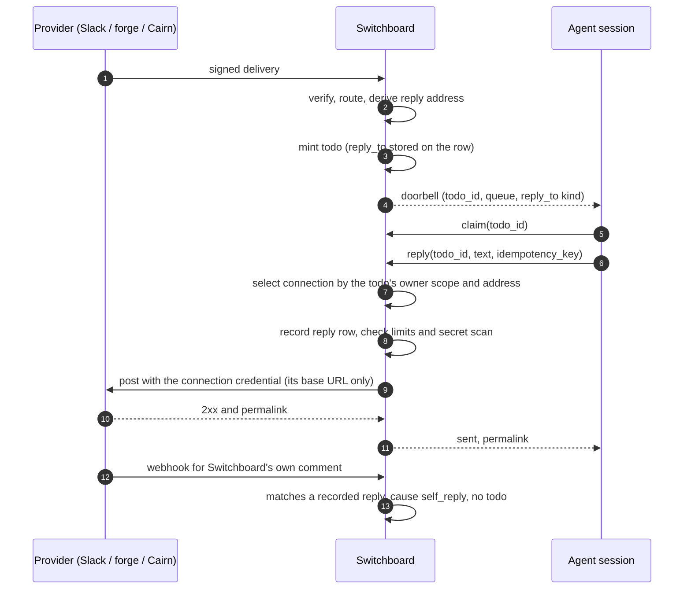

# ADR-0033: Todos Carry a Reply Address, and a `reply` Tool Posts Back to Where the Work Came From

## Context and Problem Statement

Work reaches Switchboard from a conversation: a Slack thread, a GitHub or Gitea issue or pull request,
a Cairn artifact. When an agent finishes, or gets stuck, the useful thing is to say so **in that
conversation**. Switchboard gives it no way to.

What exists today, on `origin/main`:

* The todo keeps the full upstream body as `payload`, and `routing.SubjectOf`
  (`internal/routing/subject.go`) already parses an issue or Cairn artifact subject out of the
  verified body in Go. Nothing records *where an answer should go*.
* The doorbell's `meta` carries `todo_id`, `queue`, `kind` and `source` and nothing else
  (`internal/mcp/doorbell.go`, `channelNotification`).
* The agent surface has no outbound verb. `DrainVerbs()` is `list_todos`, `claim`, `claim_next`,
  `complete`, `fail`, `heartbeat` (`internal/mcp/verbs.go`); `complete {result}` writes JSON onto the
  todo row and goes nowhere else.

So an agent that wants to answer has to hold its own GitHub token or Slack bot token, dig the target out
of the payload, and post. Every agent re-implements that. Every agent holds a credential that can post
anywhere it reaches. And the target it posts to is whatever the model decided, which makes a prompt
injection in an issue body one sentence away from "post this in #general".

Two pieces of evidence make this a priority rather than a nicety:

* **A self-hosting customer's rollout plan** puts a Slack front door in front of persistent agent
  sessions and states as a requirement that progress, completion, failure and blocked outcomes return
  to the originating thread, that this survives pauses, process failures and host restarts, and that a
  reply never goes to a guessed thread. They are building that bridge themselves. Switchboard already
  owns the durable half of it (the todo outlives the session, ADR-0013); it is missing the return path.
* **Our own operating rule** is "reply on the channel the request came in on". Our agents follow it by
  holding forge tokens, which is exactly the pattern above.

Claude Code's channel contract already names the shape. A two-way channel puts a routing key in the
event's `meta` (their example is `chat_id`) and exposes a `reply` tool that takes that key and the text
([Channels reference](https://code.claude.com/docs/en/channels-reference), "Expose a reply tool").
Switchboard is a channel server ([ADR-0013](ADR-0013-channels-push-delivery.md)), but a one-way one.

**How should an agent answer the origin of a todo without holding the origin's credential, and without
being able to post anywhere else?**

## Decision Drivers

* **The address comes from the verified delivery, never from the model.** A reply target the agent can
  choose is a target a prompt injection can choose.
* **Credentials stay out of agent context by default.** A secret that reaches a model transcript is
  burned. Replying needs the *right to reply to this todo*, not a token. An owner who wants an agent
  to manage connections may grant it that, off by default, and even then no surface returns a secret.
* **Multi-tenancy is a hard rule.** Every credential is owned by one human or one team (the owner shape
  of ADR-0038, Teams, being written in parallel) and never crosses owners, including across a fan-out
  route to another human's endpoint ([ADR-0022](ADR-0022-endpoint-scoped-todo-ownership.md)).
* **Durable and restart-proof.** The address lives on the todo row, not in session memory, so a reply
  after a crash or a reboot goes to the same place.
* **Idempotent and bounded.** A retried tool call must not double-post; a looping agent must not flood
  a thread; our own post arriving back as a new webhook must not become new work.
* **Honest trust.** A delivery whose body Switchboard did not verify must not yield an address that a
  credential will be spent on.
* **Compose with the other two products.** Harness supervises the process that replies; Cairn is both a
  source (artifact events) and a target (comments).

## Considered Options

* **(A) Status quo: agents hold provider credentials and post directly.**
* **(B) A reply address on the todo, derived at ingest, and a Switchboard-mediated `reply` verb that
  posts with an owner- or team-configured connection.** *(chosen)*
* **(C) A general `post_message` verb: the agent names provider, target and text; Switchboard supplies
  the owner's credential.**
* **(D) Emit outcome events (ADR-0029 notify hooks) and leave posting to a relay the owner runs.**

## Decision Outcome

Chosen option: **"(B) A reply address on the todo and a mediated `reply` verb"**, because it is the
only option in which the target is fixed by verified provenance, the credential never enters an agent's
context, and the owner scope that holds the credential is the same scope that owns the todo.

> **The agent chooses the words. The delivery chose the place. The owner chose the credential.**

### Mechanics

**Reply address.** At ingest, after verification and alongside `SubjectOf`, a provider parser in Go
derives a reply address from the verified body and stores it on every todo the delivery mints (each
fan-out target gets the same address). It is immutable once written.

| Source | Events | Address |
|---|---|---|
| `github`, `gitea` | `issues`, `issue_comment`, `pull_request`, `pull_request_review`, `pull_request_review_comment` | `forge_comment`: host, repository, issue or PR number |
| `slack` | `event_callback` carrying a channel message or `app_mention` | `slack_thread`: team id, channel, thread timestamp (the event's `thread_ts`, else its `ts`) |
| `cairn` | artifact events | `cairn_comment`: Cairn instance, artifact id |
| `stripe` | all | none: no conversation to answer |
| `generic` | all | none: token trust, body unverified |
| `linear`, `plain` | when ADR-0037's kinds land | `linear_comment` (issue id), `plain_thread` (thread id): deferred to that work |

Only a delivery that passed per-source verification gets an address. A `generic` webhook is authenticated
by its unguessable URL and its body is unverified, so an address parsed from it would let anyone holding
the URL spend the owner's credential on a target of their choosing. That is a confused deputy, so
`generic` gets none, even when it carries forge headers; an owner who wants replies uses a signed
`github` or `gitea` webhook.

**Connections.** A connection is an outbound credential owned by exactly one human or one team:
`kind` (`github`, `gitea`, `slack`, `cairn`), an account key (forge host, Slack team id, Cairn base
URL), the secret, and two optional allowlists: targets (repository globs such as `acme/*`, Slack channel
ids) and endpoints. The secret is stored through the `internal/cred` envelope, is **write-only** (no
surface ever returns it; the UI shows a fingerprint), and **cannot be stored at all** when
`SWITCHBOARD_SECRET_ENCRYPTION_KEY` is unset. Connections are created, rotated and deleted by the
owning human, or by a team admin for a team, in the web UI and the operator API. An owner **may also
grant an endpoint the connection verbs** (`list_connections`, `create_connection`,
`rotate_connection`, `delete_connection`), which are **off by default**: never in the basics vend,
unchecked in the vend wizard, and flagged on the consent screen as handing the agent the owner's
outbound credentials. No surface, MCP included, ever returns a secret.

**Credential selection follows the todo's owner scope**, never the claimer's and never the webhook
owner's when they differ. A fan-out todo on another human's endpoint replies with that human's
connection or not at all. Within the scope, the connection is the one whose kind and account key match
the address exactly (at most one, by a unique index). A connection's targets allowlist, when set, must
admit the address.

**The `reply` verb.** `reply {todo_id, text, idempotency_key?}`. The agent never passes an address or a
connection. It is a grantable verb like any other, offered unchecked in the vend wizard and never included
in the operator API's basics grant (which today grants every verb). It is allowed when the
todo belongs to the calling endpoint and is either claimed by the caller or reached `done`/`failed`
through the caller within a short grace window (15 minutes), so the outcome can be posted after
`complete`. The result says `sent`, `failed` or `unknown`, with the provider's permalink when there is
one. A refused call is an error before any dial, and produces no row.

**Where the credential goes.** Only to the connection's own base URL. The address contributes path
components (repository, number, channel, timestamp), each validated against a strict charset; the
address's host must equal the connection's account key. A payload can therefore never redirect a token
to another host. Every dial goes through `internal/push.Validator`, with no redirects followed. A
self-hosted Gitea or Cairn on a private address needs the operator's private-host allowlist, an
instance setting that bounds where tenants may reach and routes nothing.

**Idempotency.** The reply row is written before the dial, keyed by the caller's key or, absent one,
by a hash of `(todo_id, text)`. A repeat returns the recorded outcome. None of these providers takes an
idempotency key, so a failure after the request may have been written is recorded as `unknown` and not
retried automatically; only a failed dial or a `429` is retried.

**Recorded on the todo.** Every attempt is a row (state, connection, provider id and permalink, text
hash, timestamps), listed on the todo in MCP and on the board. `todoOut` gains `reply_to` (kind plus a
display string, never a credential) and a `replies` summary.

**Channels shape.** The doorbell's `meta` gains `reply_to` (the address kind) when the todo has one, and
the session instructions say: if a doorbell carries `reply_to`, call `reply` with its `todo_id`. That
is the reference pattern with `todo_id` in the role of `chat_id`.

**Bounds.** Per endpoint (a token bucket), per todo (a lifetime cap, 20 by default), and per connection
(honouring provider `429` and `Retry-After`). Text is capped at 16 KiB and at each provider's own
limit.

**Echo suppression.** Posting a comment makes the provider fire a webhook back. A delivery that is
Switchboard's own reply (its provider object id matches a recorded reply, or a Slack event's `bot_id` is
the connection's bot) is recorded with routing cause `self_reply` and mints no todo.

**Secret scanning.** Before dialing, `reply` SHOULD refuse text that matches a high-confidence secret
rule, using the same gitleaks rule set Cairn adopts for server-side redaction (Cairn's F-C5 work). A
public issue comment is the worst place for an agent to paste a token.

### Consequences

* Good, because the target is fixed by the verified delivery: an injected instruction can change what
  the agent says, never where.
* Good, because agents hold no forge or chat credentials. One connection per owner replaces one token
  per agent, and rotating it is one form, not a fleet redeploy.
* Good, because the address survives crashes and reboots on the todo row, which is the property the
  customer is building by hand.
* Good, because it makes Switchboard a two-way channel in the sense the Claude Code reference defines.
* Bad, because Switchboard now holds tenant credentials that can write to third-party systems. The
  envelope, write-only surfaces, fail-closed storage and owner scoping bound the exposure; a compromise
  of the process and its encryption key still yields them.
* Bad, because it is a new outbound surface with per-provider code (four adapters to start) that has to
  track provider API changes.
* Bad, because `generic` sources get no replies. That is deliberate, and it will surprise people who
  wired a forge through the vend wizard's generic webhook; the docs must say why.
* Neutral: `complete` and `fail` are unchanged. Posting the outcome is an explicit `reply`, so a worker
  that never calls it behaves exactly as today.

### Security and tenancy

* Connections are owned by exactly one human or team and are usable only by todos in that scope.
  Another human's todo cannot select them, including a todo minted on a friend's endpoint by a fan-out
  route; a team connection is usable only by the team's todos (ADR-0038's same-scope rule).
* The operator holds the encryption key and can therefore decrypt; no operator surface displays a
  connection secret. That is the same honesty ADR-0002 applies to webhook signing secrets.
* The address is derived only from verified bodies, never from `generic`, and never from agent input.
* A reply is text, posted as the connection's identity. Its content is agent output and may carry
  injected text from the source; the provider renders it, Switchboard does not. The per-todo cap and
  echo suppression bound a feedback loop.

### Composition with Harness and Cairn

* **Harness.** A supervised worker calls `reply` like any MCP tool. When Harness holds the lease on a
  worker's behalf (its supervisor-held leases work, F-H3), it can post the outcome with the same verb
  on process exit, so "report back" no longer depends on the model remembering.
* **Cairn** is a source and a target. An artifact event yields a `cairn_comment` address; the reply
  becomes a comment through Cairn's `POST /v1/artifacts/{id}/comments` with a token scoped to annotation
  writes. Once Cairn emits annotation events (Cairn's F-C3 work), that comment arrives back as a webhook,
  which is exactly the echo that suppression drops. A long result belongs in a Cairn artifact; the
  reply links it.

### Confirmation

* A verified Slack `event_callback` produces a todo with a `slack_thread` address; `reply` on it posts
  to that channel and thread with the owner's connection, and a second call with the same
  `idempotency_key` posts nothing and returns the first outcome.
* A `generic` delivery carrying a forge payload produces a todo with no address, and `reply` returns
  `no_reply_address`.
* A todo owned by human B, routed from human A's webhook, can never use A's connection: with no
  connection of B's matching, `reply` returns `no_connection`.
* A payload naming a different forge host from the connection's never causes a dial.
* With no encryption key configured, creating a connection is refused.
* Switchboard's own posted comment, delivered back by the forge, mints no todo.
* No MCP response, log line or page contains a connection secret.

## Pros and Cons of the Options

### (A) Status quo: agents hold provider credentials

* Good, because it needs nothing built and each team can use whatever client it likes.
* Bad, because every agent holds a credential that can post anywhere, in its own context, where a
  transcript can leak it.
* Bad, because the target is model-chosen, so a prompt injection controls where output goes.
* Bad, because every agent re-implements payload parsing and thread finding, and each gets it slightly
  wrong.

### (B) Reply address plus mediated `reply` verb

* Good, for the reasons in Consequences: fixed target, no credentials in context, owner-scoped.
* Bad, because it is a real build: a table, a vault surface, four provider adapters, a verb, UI.
* Bad, because it only answers origins Switchboard can verify, which excludes `generic`.

### (C) General `post_message` verb with the owner's credential

* Good, because it is more flexible: an agent could post to a channel the work did not come from.
* Bad, because the target is agent-supplied again. It moves the credential out of the agent's context
  but leaves the prompt-injection problem fully intact, and turns the owner's credential into a posting
  primitive for any endpoint that holds the verb.
* Bad, because allowlists would have to carry the whole security model, and allowlists rot.
* Neutral: rejected as the default path, not refused forever. If a target-choosing verb is built
  later, it is its own verb family, off by default, never in the basics vend, and usable only through
  a connection with a non-empty targets allowlist (Joe, 2026-09-22: risky options are fine when they
  are configurable and off by default).

### (D) Outcome events to a relay the owner runs

* Good, because Switchboard holds no third-party credentials at all.
* Bad, because every owner must build and run the relay, which is the bespoke glue this project exists
  to remove, and the relay still needs the address, so Switchboard would derive it anyway.
* Neutral: nothing in (B) prevents it. An owner who prefers (D) can use ADR-0029's hooks and grant no
  `reply` verb.

## Architecture Diagram

## More Information

* The spec: [SPEC-0028](../openspec/specs/reply-to-source/spec.md).
* The doorbell this makes two-way: [ADR-0013](ADR-0013-channels-push-delivery.md). Subjects parsed from
  verified bodies: [ADR-0025](ADR-0025-handoff-work-orders-and-difficulty-lanes.md). The SSRF guard:
  [ADR-0021](ADR-0021-a2a-task-delegation-transport.md), `internal/push/ssrf.go`. Per-source trust:
  [ADR-0003](ADR-0003-per-provider-ingestion-and-trust-model.md).
* Companion records, accepted together on 2026-09-22 and linked as front-matter edges: ADR-0038 and
  SPEC-0033 (Teams and tenancy: owner shape, team roles, credential selection by the todo's scope);
  ADR-0034 and SPEC-0029 (notification sinks, which reuse the connection vault this ADR introduces);
  ADR-0037 and SPEC-0032 (provider-issued signing secrets and the Linear and Plain kinds, which add
  their reply address kinds).
* Out of scope: Signal as a reply target. Signal is not an inbound source, so no todo carries a Signal
  address; notifying a human on Signal is ADR-0034's job, through an Apprise sink.
* Out of scope: Claude Code permission relay (`claude/channel/permission`). It needs an authenticated
  human reply path back into a live session; ADR-0034 records it as future work.
