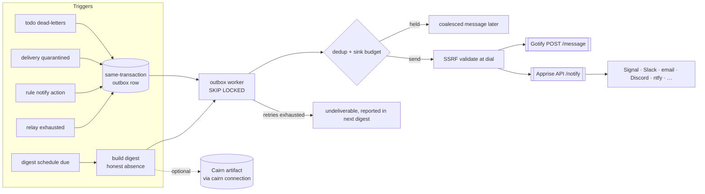

# ADR-0034: Notification Sinks (Gotify, Apprise) and Queue Digests — Tell Humans, Don't Ticket Them

## Context and Problem Statement

Some things that happen in Switchboard need a person:

* a todo **dead-letters**: it failed at its attempt cap, its lease lapsed at the cap, or its endpoint
  was revoked (`internal/store/todos.go`, `FailTodo`, `ReapExpired`, `deadLetterEndpointTodos`);
* a delivery lands in **quarantine** because its sender is not trusted (ADR-0031, being written in
  parallel);
* a Harness **relay** runs out of attempts (Harness ADR-0025 and Switchboard ADR-0039, both in
  parallel);
* a routing rule's author simply wants to know when a kind of event arrives;
* in aggregate, a queue is **quietly unhealthy**: work is ageing, leases are stalling, doorbells are
  going unheard (ADR-0030, in parallel).

Today nothing tells anyone. A dead letter sits in `failed` with `next_retry_at` NULL until someone opens
the board. ADR-0028's Prometheus endpoint is an **operator** surface behind a scrape credential no
tenant holds, so a user on a shared instance has no alerting at all. On 2026-09-14 every worker on one
queue stopped and the backlog grew for about twenty hours before a human happened to ask.

The original proposal for this (F-S4) went further: human queues, a human-assignee queue kind, a verb for
agents to file todos *for* a human, and completion that re-enters the agent flow. **Joe rejected that
shape: "I DO NOT want to recreate human ticketing systems."** A self-hosting customer's plan reaches the
same place from the other side: it names one tracker as the only ledger for work and bans a second
task database, and its notification policy contacts a human only for decisions, blockers, missing
authority, material risk and verification, never for routine retries. It also asks for a daily sweep of
blocked, abandoned and repeatedly failing work, and warns that "no action needed" must never be
presented as "no problems" while observation is down.

So humans already have a place to act: their tracker. What they lack is being told.

**How should Switchboard tell the right human, per owner, that something needs attention, without
becoming a ticketing system?**

## Decision Drivers

* **Notifications, not tickets.** No human-assignee lifecycle, no human queue kind, no acknowledge
  state inside Switchboard. The human acts in their own tracker; if that action should wake an agent,
  it arrives as an ordinary webhook from the tracker.
* **Multi-tenancy is a hard rule.** Sinks belong to one human or one team (ADR-0038, in parallel), and
  an event reaches only the sinks of the scope that owns the thing it is about.
* **Reach people where they are, without N integrations.** Signal, Slack, email, Discord, ntfy,
  Telegram and phones all matter; writing each is a treadmill.
* **Credentials are encrypted and write-only**, in the same vault as ADR-0033's reply connections.
* **Never a flood.** Deduplication, per-sink budgets and coalescing are part of the design, not a
  follow-up.
* **Honest digests.** A number Switchboard could not compute is shown as unavailable, never as zero
  (SPEC-0023 REQ-6's rule, applied to tenants).
* **Outbound to tenant-chosen hosts is an SSRF primitive**, including through a relay that makes
  further requests on our behalf.

## Considered Options

* **(A) Human queues and an assignee lifecycle, plus a notifier** — the original F-S4.
* **(B) Owner-scoped notification sinks (Gotify and Apprise), event subscriptions, a routing `notify`
  action, and a scheduled queue digest.** *(chosen)*
* **(C) Reuse ADR-0029 notify hooks; owners run their own bridge to a notifier.**
* **(D) Native per-service integrations (Slack, email, Signal) inside Switchboard.**
* **(E) Metrics only: point Alertmanager at ADR-0028.**

## Decision Outcome

Chosen option: **"(B) Owner-scoped notification sinks, subscriptions, a `notify` action and a queue
digest"**, because it tells humans what needs them through two self-hostable hubs that between them
reach almost every channel people use, keeps every sink and event inside one owner scope, and builds no
state a human would have to manage inside Switchboard.

> **Switchboard rings the human's phone. It does not become the human's inbox.**

### Mechanics

**Sinks.** A sink belongs to exactly one human or team and has a name, a kind and a connection:

* **Gotify**: a server base URL and an application token. A message is `POST /message` with the
  `X-Gotify-Key` header and `title`, `message`, `priority`.
* **Apprise**: an [Apprise API](https://github.com/caronc/apprise-api) server base URL plus either a
  **configuration key** (`POST /notify/{key}`, where the service URLs live on the Apprise server and never
  reach Switchboard; the preferred mode) or a list of **Apprise URLs** (`POST /notify/` with `urls`,
  stored as the secret because Apprise URLs embed service tokens), and an optional tag. One Apprise sink
  can fan out to Signal, Slack, email, Discord, ntfy, Telegram and the rest of Apprise's catalogue.

The credential half of a sink is a row in ADR-0033's connection vault (kinds `gotify` and `apprise`),
so it inherits that vault's rules: owner-scoped, envelope-encrypted, refused when no encryption key is
configured, write-only, fingerprinted, testable. Sinks are managed by the owning human, or by a team's
admins, in the web UI and operator API. An owner **may also grant an endpoint the `notifications` verb
family** (`list_sinks`, `set_sink`, `delete_sink`, `test_sink`, `set_sink_subscriptions`), which is
**off by default**: in no default or basics grant, and flagged on the consent screen because its holder
can redirect or silence the owner's alerts. The verbs reference existing connections only and never
read a secret.

**Events.** An owner subscribes a sink to event types, optionally filtered by queue, endpoint or webhook
and by severity:

| Event | Fires when | Severity |
|---|---|---|
| `todo.dead_lettered` | a todo reaches a terminal failure: attempts exhausted, lease lapsed at the cap, endpoint revoked | high |
| `relay.exhausted` | a todo whose attempt history (ADR-0039) shows relay attempts dead-letters; carries the attempt count and the last attempt's Cairn handle | high |
| `delivery.quarantined` | ADR-0031 quarantines a delivery from an untrusted sender | normal |
| `rule.notify` | a routing rule with a `notify` action matches | set by the rule |
| `digest` | a scheduled digest is due | low |

An event belongs to the owner scope of the resource it is about: a dead letter to the todo's scope
(so a fan-out todo on a friend's endpoint notifies the friend), a quarantine or rule match to the
webhook's scope. It is delivered only to that scope's sinks. There is no instance-wide sink.

**The `notify` routing action.** A rule's action gains `notify: "<sink name>"` (and an optional
`notify_severity`). It is additive: it composes with `queue`, `drop` and `work_order`, so "drop this and
tell me" and "route this and tell me" are both one rule. The sink must belong to the webhook's owner
scope, checked when rules are saved and again when the rule fires; a rule cannot name another owner's
sink.

**Content.** A notification carries a title, a one-line summary, the queue, the cause, a link to the
todo or event on the board, and the origin's display string or permalink (ADR-0033's address). A dead
letter also carries the attempt count and the closing attempt's summary and artifact handle, which
ADR-0039's attempt history hands to this hook. By default it never carries payload text. A
subscription can opt in with `include_excerpt: true` (off by default) to add up to 280 characters of
the subject's body, truncated, stripped of control characters and labelled as sender-written, for an
owner who accepts that text leaving for a third-party notification service. The todo title and the
attempt summary are sender- or agent-written, so they are truncated, stripped of control characters and
labelled as what they are.

**Durable delivery.** A notification is written to an outbox **in the same transaction** as the state
change that caused it (the dead-letter update, the quarantine insert, the routed event). A worker drains
the outbox with `FOR UPDATE SKIP LOCKED`, so any number of instances cooperate, retries with backoff for
about 30 minutes, and then records the notification as undeliverable, which the next digest reports.
This differs from ADR-0029's best-effort doorbell on purpose: a doorbell is a hint about work the
queue still holds; a dead-letter notice is often the *only* way anyone learns of it.

**Deduplication, budgets and coalescing.** Each event carries a dedup key (the dead-lettered todo id; a
quarantine's webhook plus a ten-minute window; a rule's id plus the delivery's subject), and a repeat
inside its window increments a counter instead of sending. Each sink has a budget (30 per hour, burst
10, by default). When it is spent, further notifications are held and collapse into one message when
the budget refills: "14 more events since 10:02; see the board".

**Queue digest.** An owner scope may schedule a digest with a weekly send-time spec in the zone of its
choosing (for example `TZ=America/Los_Angeles Mon-Fri 09:00`). It summarizes, per queue the scope owns:
pending count and oldest pending age, claimed count, stalled leases, dead letters since the last digest
(count and the first few), quarantined deliveries since the last digest, unheard doorbells per endpoint
(ADR-0030), endpoints clocked out (ADR-0027), work deferred by a queue's admission budget (ADR-0035,
in parallel), and notifications that could not be delivered. A section
Switchboard could not compute says "unavailable", never zero. It goes to one or more sinks, and/or is
published as a Cairn artifact through a `cairn` connection with a TTL, and the sink message links the
artifact. With `skip_when_quiet` (the default) a digest is not sent when every section is measured and
every count that signals trouble is zero.

**Not in scope, deliberately.**

* No human-assignee state, no human queue kind, no acknowledge or snooze inside Switchboard.
* **Agent paging is opt-in, not refused.** An agent that is stuck normally `fail`s the todo, or replies
  to the origin (ADR-0033). An owner may grant `notify_owner {title, severity?, todo_id?}`, which
  enqueues an `agent.notify` event to the owner's subscribed sinks. It is in no default or basics
  grant, because an injected agent holding it could page a person at will. It is fire-and-forget,
  with no acknowledgement or state, so it stays a notification and not a ticket. It is capped at 5 per
  hour per endpoint inside the sink budget, and its text is agent-written and truncated like any
  title.
* **Claude Code permission relay** (`claude/channel/permission`), which would let a headless session's
  approval prompt reach a phone. It needs an authenticated reply path from the human back into a live
  session, and Claude Code's reference is explicit that anyone who can answer through the channel can
  approve tool use. It is a good fit for this design later (the prompt out through a sink, the verdict
  back through an authenticated surface), and is future work, not part of this decision.

### Consequences

* Good, because users on a shared instance get alerting for the first time, scoped to what they own.
* Good, because two hubs reach Signal, Slack, email, Discord, ntfy, Telegram and phones without
  Switchboard carrying an integration per service.
* Good, because nothing new needs managing inside Switchboard: a notification is sent and done, and the
  human's tracker stays the ledger.
* Good, because the digest turns "someone should look at the board" into a message on a schedule, with
  honest gaps.
* Bad, because Switchboard now depends on a relay tenants run. An Apprise API server has no
  authentication by design and usually sits on a private network; reaching it needs the operator's
  private-host allowlist.
* Bad, because an Apprise URL can itself point at an arbitrary HTTP endpoint (`json://`, `xml://`,
  `form://`), making the Apprise server an SSRF relay. The instance restricts which Apprise schemes
  a tenant may store, and the docs recommend `APPRISE_ALLOW_SERVICES` on the server.
* Bad, because an outbox is a table and a worker to operate. It is the cost of not losing the one
  message that matters.

### Security and tenancy

* Sinks and their connections are owned by one human or team and may be referenced only by resources in
  the same scope (ADR-0038's same-scope rule), checked on write and on use.
* Events are attributed to the scope of the resource they concern and never reach another scope's
  sinks, including across friendship fan-out.
* Sink targets are validated with `internal/push.Validator` when saved and before each dial, with no
  redirects followed. Private Gotify and Apprise hosts need the operator's private-host allowlist, an
  instance setting that bounds reach and routes nothing (ADR-0038's rule for operator config).
* Stateless Apprise URLs are secrets. Stored URLs are limited to an instance allowlist of Apprise
  schemes, which excludes the generic HTTP schemes and local-system schemes by default.
* Content includes no payload text unless a subscription opts in with `include_excerpt` (off by
  default, 280 characters at most); sender-controlled strings are always truncated and neutralized.
* The `notifications` verbs and `notify_owner` are off by default and owner-granted; an endpoint
  holding them acts only in its own owner scope.

### Composition with Harness and Cairn

* **Harness.** A relay that exhausts its attempts (Harness ADR-0025) dead-letters its todo; this ADR is
  how a human hears about it, with the last attempt's Cairn handle in the message. Harness's own
  daemon-level alerts stay in Harness.
* **Cairn.** A digest can be published as a Cairn artifact, which gives it a durable link, comments,
  and a TTL, and keeps the phone notification short. A Cairn reaction is a Cairn event; if it should
  wake an agent, it arrives through Cairn's webhooks like any other source.
* **ADR-0029 notify hooks** wake machines; sinks tell people. They share the SSRF guard and, where it
  fits, the delivery worker.

### Confirmation

* A todo that dead-letters on a queue with a subscribed Gotify sink produces exactly one Gotify message
  carrying the queue, the cause and a board link, and no payload text unless its subscription set
  `include_excerpt`.
* An endpoint with a default grant calling `list_sinks` or `notify_owner` is refused, and nothing is
  enqueued.
* A dead letter on human B's endpoint, from human A's routed webhook, notifies B's sinks and not A's.
* A rule whose `notify` names another owner's sink is refused at save time.
* Fifty dead letters in a minute on one sink produce at most the burst plus one coalesced message.
* With the sink host unreachable, the notification is retried, then recorded undeliverable, and the
  next digest says so.
* A digest whose unheard-doorbell count cannot be computed shows that section as unavailable.
* Saving an Apprise sink with a `json://` URL is refused under the default scheme allowlist.

## Pros and Cons of the Options

### (A) Human queues and an assignee lifecycle

* Good, because it models human work explicitly and could show "waiting on human QA" state.
* Bad, because it is a ticketing system: assignment, acknowledgement, reassignment, SLAs, and the
  endless requests that follow. Joe ruled it out, and customers who already have a tracker ban a second
  one.
* Bad, because humans would have to watch Switchboard as well as their tracker.

### (B) Sinks, subscriptions, `notify` and digests

* Good, for the reasons in Consequences.
* Bad, because it depends on a tenant-run relay for everything except Gotify, and brings the SSRF care
  that comes with it.
* Bad, because a digest schedule is one more thing to configure.

### (C) Reuse ADR-0029 notify hooks; owners bridge themselves

* Good, because Switchboard adds nothing.
* Bad, because every owner writes the same bridge, and notify hooks fire on todo creation, not on dead
  letters, quarantine or schedules.
* Bad, because a hook's payload-free doorbell deliberately lacks what a human message needs.

### (D) Native per-service integrations

* Good, because messages could use each service's richest formatting.
* Bad, because it is an integration per service, forever, each with its own credentials and API drift.
  Apprise exists precisely to absorb that.

### (E) Metrics only

* Good, because ADR-0028 already exists and Alertmanager is excellent.
* Bad, because the scrape credential is operator-only and the metrics are instance-wide: a user on a
  shared instance can neither scrape nor be paged about only their own queues.
* Neutral: operators should still alert on metrics; this ADR is for tenants.

## Architecture Diagram

## More Information

* The spec: [SPEC-0029](../openspec/specs/notification-sinks/spec.md).
* Owner scoping: [ADR-0022](ADR-0022-endpoint-scoped-todo-ownership.md). Routing actions:
  [ADR-0024](ADR-0024-event-routing-deterministic-and-llm.md). Presence and its digest doorbell (a
  different thing: a doorbell to an agent, not a message to a human):
  [ADR-0027](ADR-0027-endpoint-presence-clock-in-clock-out.md). Operator metrics:
  [ADR-0028](ADR-0028-prometheus-metrics-endpoint.md). Machine wake-up hooks:
  [ADR-0029](ADR-0029-outbound-todo-webhooks.md).
* Companion records, accepted together on 2026-09-22 and linked as front-matter edges: ADR-0030 and SPEC-0025 (unheard doorbells);
  ADR-0031 and SPEC-0026 (quarantine); ADR-0033 and SPEC-0028 (the connection vault and reply
  addresses); ADR-0038 and SPEC-0033 (Teams and tenancy); ADR-0039 and SPEC-0034 (attempt history);
  ADR-0035 and SPEC-0030 (admission control, whose deferred work the digest reports).
* Cross-product, cited in prose: Harness ADR-0025 and SPEC-0019 (relay attempts).
* Gotify message API: [gotify.net/docs/pushmsg](https://gotify.net/docs/pushmsg). Apprise API:
  [github.com/caronc/apprise-api](https://github.com/caronc/apprise-api).
* Claude Code permission relay, recorded as future work above:
  [Channels reference, "Relay permission prompts"](https://code.claude.com/docs/en/channels-reference).
