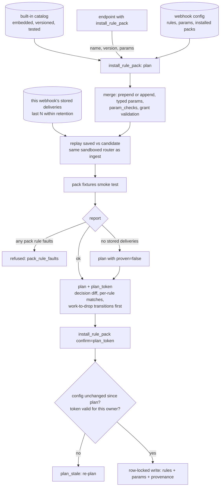

# ADR-0036: Rule Packs Are Installable, Versioned Presets That Must Prove Themselves on Real Traffic Before They Save

## Context and Problem Statement

Routing rules ([ADR-0024](ADR-0024-event-routing-deterministic-and-llm.md), [ADR-0025](ADR-0025-handoff-work-orders-and-difficulty-lanes.md), SPEC-0020) are ordered jq filters on a webhook, and they are the only thing between a public forge event and an agent's work lane. The fleet keeps two tested configurations in `docs/routing/rule-packs/`:

* `fleet.json`: 27 rules that mint handoff work orders and route issues into difficulty lanes;
* `pool-review.json`: 5 rules that keep each identity from reviewing its own pull requests and drop bot chatter.

Installing either one means pasting the JSON into `set_webhook_rules`. That is the whole "pack" mechanism, and it has four problems.

**Rules install green and match nothing.** On 2026-09-12, four rules installed in one day passed validation and never matched real traffic:

* a parameter of the wrong type made a rule fault, and a faulting rule is a no-match (#212);
* a `sender` read inside `any()` was rebound to the generator's element;
* two rules carried event-kind lists that real deliveries never send. One of those was a bot's own suggested "fix".

Save-time validation checks that an expression compiles and an action is granted. It can't know whether the rule means anything against the traffic the webhook actually receives. `test_webhook_rules` can, but it routes **one** event per call, and nothing requires calling it. The authoring loop in guide 07 is a recommendation. The pool-review README spends three paragraphs on traps that only real deliveries reveal. SPEC-0023 REQ-4's routing-decision counter makes a dead rule visible *after* it has been dead in production.

**Packs are copy-paste with no identity.** A webhook doesn't record which pack, at which version, produced its rules. An improved pack in the repo never reaches the webhooks that installed the old one, and a hand edit to an installed rule drifts silently. There is no upgrade and no diff.

**Packs don't compose.** `set_webhook_rules` replaces the rules, the default *and the params* (#213). Installing a second pack by hand overwrites the first. There are 32 rules per webhook, and `fleet.json` alone uses 27.

**The patterns are wanted beyond our fleet.** A self-hosting customer built cross-model author/reviewer pairing by hand: an identity map, agent-authored PRs reviewed only by the paired agent of the other model family, no self-merge, and human PRs kept for human review. That is `pool-review.json` generalized, rebuilt from scratch because it only existed as our fleet's JSON. The same customer, and our own queue (#223, the `issue_comment.deleted` flood), both needed CI and bot noise dropped at the source.

**How should switchboard ship reusable routing patterns so that installing one is a single call, is proven against the webhook's own stored deliveries before anything saves, composes with other packs, and can be upgraded later without silently overwriting local edits?**

## Decision Drivers

* **Evidence before save, every time.** A pack must not save until it has been evaluated against the webhook's own stored deliveries and its effect shown. This is the point of the feature, not a convenience. Joe's precedent is that plausible rules, including bot-suggested ones, install green and do nothing.
* **The same router as ingest.** The dry-run must use the sandboxed router the receiver uses, so a prediction and a live decision can't differ.
* **Faults are failures.** A pack rule that faults on any stored delivery is a bug, not a no-match. It blocks the install.
* **Packs are code.** Versioned, reviewed, tested against fixtures in the repo, and shipped inside the binary. No catalog is fetched at runtime unless the operator opts in (`SWITCHBOARD_RULE_PACK_SOURCES`, off by default; Joe, 2026-09-22: risky options are fine when configurable and off by default).
* **Compose, don't clobber.** An install merges into the webhook's configuration. It leaves other rules and params alone and records its provenance, and it refuses conflicts instead of guessing.
* **Upgrades are diffs.** A newer version shows its rule, param and decision diffs, and refuses to overwrite hand-edited pack rules unless told to.
* **Tenant safety is unchanged.** A pack installs only on a webhook the caller's owner scope owns ([ADR-0022](ADR-0022-endpoint-scoped-todo-ownership.md); Teams, ADR-0038). Its rules are validated against the webhook's grant like any other rule, so a pack can narrow where a delivery lands and never widen it.
* **Typed parameters.** Pack params declare types, and install rejects a mistyped allowlist instead of relying on every jq author to guard it. This is #212's third remedy, applied to packs.

## Considered Options

* **(A) Keep packs as documentation**, and improve the guides and the one-event dry-run.
* **(B) A built-in, versioned catalog with `list_rule_packs` and a two-phase `install_rule_pack`**, where the first phase is always a replay over stored deliveries and the second applies only that plan. *(chosen)*
* **(C) User-defined packs stored per owner**, a pack registry that users publish to and install from.
* **(D) A remote catalog** fetched from a URL or a Git repository at runtime.
* **(E) An optional `dry_run` flag on `set_webhook_rules`**, with no pack concept.

## Decision Outcome

Chosen option: **"(B) A built-in, versioned catalog with a two-phase install whose first phase is a replay"**, because it is the only option in which *skipping the evidence is impossible* rather than discouraged. It also gives packs the identity, versioning and composition that copy-paste lacks, and by default it adds no tenant-owned or remotely fetched surface.

> **A rule that has never met a real delivery is a hypothesis. Install turns hypotheses into rules only after showing what they would have done.**

### The catalog

Packs are JSON documents embedded in the binary. Their source is `docs/routing/rule-packs/`, which today's `fleet.json` and `pool-review.json` seed. A pack has:

* `name`, a semantic `version`, a `title` and a `summary`;
* `params_schema`: each param's type (`string`, `bool`, `int`, `string_list`, `object`, or a named shared type), whether it is required, its default and its description;
* `param_checks`: jq predicates over `$params`, evaluated at install, that must hold, such as "every reviewer pair crosses model families";
* `rules`, with pack-local ids, plus an optional `default_action`;
* `placement` (`prepend` or `append`);
* `requires`: source types, capabilities, and other packs;
* `fixtures`: real-shaped deliveries with expected decisions.

Params with the same meaning share one name and type across packs. For example, `trusted_humans` is a `string_list` in both `trusted-actors` and `handoff-lanes`. So packs compose on purpose, and install refuses two packs that declare one name with different types. Each pack version ships with tests that route its fixtures in-process and through the sandbox child, as `fleet_pack_test.go` does today.

**Operator packs are an opt-in.** `SWITCHBOARD_RULE_PACK_SOURCES` (unset by default) names `file://` directories or `https://` URLs of extra packs, loaded once at startup. Each must pass the same validation and fixture routing as a built-in or it is skipped with a logged error; none may reuse a built-in name; they are listed with `source: external`; and they install only through the same plan-then-confirm. They hold no tenant data, and a tenant uses one only by installing it on its own webhook.

The catalog is shipped code. It contains no tenant data, and every tenant sees the same read-only list, so it is not a global *resource* in the multi-tenancy sense (Teams, ADR-0038, allows a code-shipped catalog). What an install writes lands on one webhook, owned by that webhook's owner scope.

### Install is a plan, then an apply

`install_rule_pack {webhook_id, name, version?, params, position?, replay?}` never saves on its first call. It builds the candidate configuration and returns a **plan**:

* the candidate is the webhook's current rules, with the pack's rules inserted under the ids `<pack>--<local-id>`, plus the merged params and the default;
* it validates the candidate exactly as a save would, against the webhook's grant, with `param_checks` and param types checked too;
* it **replays** the candidate, and the currently saved configuration, over the webhook's most recent stored deliveries: 200 by default, at most 1,000, within retention, optionally filtered by `since`;
* it runs the pack's own fixtures through the candidate as a smoke test of the real router.

The plan reports:

* decisions before and after, by queue, drop, default and fault;
* the number of deliveries whose decision changes, with up to 20 example event ids per transition. Transitions that turn work into a drop are listed first, because that is where installs lose work;
* per-rule first-match counts for every rule, marking pack rules that matched nothing;
* faults per rule;
* the estimated change in todos per day;
* a `plan_token`.

The second call, `install_rule_pack {…, confirm: plan_token}`, applies exactly that plan. It does so in one row-locked write, provided the webhook's configuration hasn't changed since the plan was made. Otherwise it answers `plan_stale`, and the caller re-plans. There is no other path by which a pack saves.

Replay rules:

* **Faults block.** A pack rule that faults on any stored delivery, or on any fixture, refuses the plan with `pack_rule_faults`, naming the rule and the event ids.
* **Zero stored deliveries is not proof.** If the webhook has no stored deliveries of the pack's source types, the plan says so (`proven: false`), and the apply requires `allow_unproven: true`. The installed provenance records it, so the webhook stays marked unproven until a later replay proves it.
* **Matching nothing is a warning.** A pack rule that matched none of the replayed deliveries is flagged but doesn't block. A rule like "hold `size/XL`" may legitimately see nothing in 200 events.

`test_webhook_rules` gains the same replay mode (`replay: {limit, since}`) for hand-written candidates. Any rule change can carry the same evidence, and one code path produces it for both. That work also fixes #196: replay mints ids for id-less candidates, as a save does.

### Provenance, upgrade and removal

The webhook records each installed pack: `name`, `version`, the ids of the rules it installed, the param keys it owns, a digest of those rules as installed, who installed it and when, whether it was proven, and the replay summary. Installed rules remain ordinary rules. They are evaluated by the same code, and editable with the same verbs, because packs are an authoring layer, not a second evaluation path. `list_rule_packs {webhook_id?}` returns the catalog and, for a webhook, what is installed, whether an upgrade exists, and whether any installed pack rule has been edited or removed by hand (digest mismatch).

Installing a different version of an installed pack is an upgrade or a downgrade. The plan adds a rule diff (added, removed and changed, by local id), a param diff (new keys with their defaults, and removed keys), and the replay decision diff between the saved and the upgraded configuration. If the installed pack's rules were edited by hand, the plan refuses unless `overwrite_local_edits: true`, and it lists the edited rules. `remove_rule_pack` is planned and confirmed the same way: its replay shows what the webhook would do without the pack.

### Merge semantics

* An install never removes a rule it didn't install, and never clears a param it doesn't own. This is the opposite of `set_webhook_rules`, and deliberately so (#213). The one exception is explicit: `replaces` names hand-written rules the pack takes over. The plan lists them, and the replay proves the takeover changes nothing, or shows what it does change. That is how a webhook with pasted-in JSON, such as today's fleet, adopts packs.
* An omitted param keeps the webhook's current value when it has one, so adopting a pack never resets an allowlist to its default.
* A param supplied at install that another installed pack also owns updates it for both. The plan names both packs, and the replay shows the combined effect.
* At most one installed pack may set `default_action`. A second one is refused.
* An install that would exceed 32 rules is refused with `too_many_rules`, naming the packs that fill the webhook.
* `requires.packs` enforces order. `handoff-lanes` requires `trusted-actors` ahead of it, so an install places it after that pack's rules, or refuses if the pack is absent.

### The built-in packs

* **`no-self-review`**: generalizes `pool-review.json`'s identity rules. In single-identity mode (`identity`), it drops review requests addressed to someone else and review triggers on the identity's own PRs, and it keeps review outcomes on the identity's own PRs. In pair mode (`pairs`: author and reviewer logins, with optional `families`), a pool accepts review work only for PRs whose author is paired with its identity. It drops its own PRs and PRs by unpaired authors, so human PRs stay with human review. With `require_cross_family: true`, a `param_check` refuses any pair whose two logins declare the same model family. That is the customer's cross-model rule enforced at install, not at review time.
* **`trusted-actors`**: admits only deliveries whose signature verified and whose actor is in `trusted_humans`, `trusted_agents` or `cairn_actors`. It is split out of `fleet.json` rules 1, 3, 17 and 18. Version 1 is today's fail-closed jq (`| arrays` / `| strings` guards). Version 2 ships with the fail-closed trusted-actor gate of ADR-0031 / SPEC-0026. Its install sets the webhook's first-class `trusted_actors` from the pack's params, through that spec's `set_trusted_actors` semantics, and installs one rule that sends `.actor.trusted | not` to `{"quarantine": true}` instead of dropping it. Upgrading from version 1 to version 2 is the migration from hand-written allowlists to the engine's own gate. Version 1 leaves the catalog in the release that ships version 2, with an upgrade note: webhooks that installed it keep routing unchanged (their rules are data) and list `upgrade_available`, but it can no longer be planned.
* **`drop-ci-noise`**: drops deliveries nobody can work:
  * `*.deleted` actions, such as `issue_comment` `deleted` (#223);
  * comments and review outcomes whose `sender.login` is in `bot_actors` (`pool-review.json` rules 3–4);
  * CI status events that aren't failures, unless `keep_ci_success` is set.

  Its fixtures are real deliveries, because its failure mode is exactly the wrong-event-kind trap.
* **`handoff-lanes`**: `fleet.json`'s Cairn-tag and issue-size lane routing, with its hold rules and triage fallback. It requires `trusted-actors`, and `lane_queues` names the queues.

`fleet.json` becomes `trusted-actors@1` plus `handoff-lanes@1`, and `pool-review.json` becomes `no-self-review@1` in identity mode plus `drop-ci-noise@1`'s bot rules. The existing fixture suites must route every case to its expected decision through the composed installs. That is the regression proof that splitting the seed packs changed nothing. Once it passes, both JSON presets are deleted in the same story, with a CHANGELOG line: pre-1.0, a superseded preset is removed, not kept beside its replacement.

### Security and tenancy

* The install verbs join the webhook-rules family ([ADR-0012](ADR-0012-agents-self-manage-webhooks.md)). They are grantable per endpoint, owner-gated, and `not_found` for another owner's webhook, indistinguishable from an unknown one.
* Replay reads only the target webhook's own stored events, through the same scoping as `test_webhook_rules`' `event_id`. The plan returns decisions, counts and event ids, never payload text. The owner can open an example through `get_webhook_event`, which is already owner-scoped.
* A plan token is bound to the webhook, the owner scope, the pack version, the params and a digest of the candidate configuration. It is single-use and expires after 15 minutes. A token presented by another owner is `not_found`.
* Replay is bounded work. It runs in the existing sandbox under per-event budgets, holds at most one replay per webhook at a time, and is rate-limited per endpoint. A replay that exceeds its time budget returns a partial report marked `truncated`. A truncated plan is unproven: it applies only with `allow_unproven: true`, and its provenance records `truncated: true`.
* Pack params are owner-set values bound as `$params`, exactly as today. No delivery content can change them.

### Consequences

* Good, because the 2026-09-12 class of failure can't install silently: a faulting rule blocks, a dead rule is flagged, and a rule that turns work into drops is listed first.
* Good, because the patterns our fleet runs on, and that customers rebuild by hand, become one planned call with a version, a diff and an upgrade path.
* Good, because replay is available to hand-written rules through `test_webhook_rules`, so the evidence isn't limited to packs.
* Good, because `trusted-actors` gives the engine-level fail-closed gate of ADR-0031 a planned, replayed upgrade for each webhook, rather than a hand edit.
* Bad, because replay costs CPU on every install: up to 1,000 events times up to 32 rules, twice. It is bounded, rate-limited and sandboxed, but real.
* Bad, because a two-phase install is more ceremony than pasting JSON. That is intended. The ceremony is the evidence.
* Bad, because stored deliveries are only as representative as retention allows. A webhook that sees an event kind monthly may not have one in its window. The zero-match warning and `proven: false` make that visible rather than solving it.
* Bad, because packs are code-shipped, so a new or fixed pack needs a release. That is acceptable for a security-relevant surface, and user-defined packs remain possible later under ADR-0038 ownership.

### Confirmation

* No verb path saves pack rules without a `plan_token` from a replay of the same candidate, and a test enumerates the install paths to hold that.
* The four 2026-09-12 rules, replayed as fixtures: the param-type fault blocks with `pack_rule_faults`, the rebinding and the wrong-kind rules show zero matches, and the plan flags them.
* `trusted-actors@1` plus `handoff-lanes@1` routes every case in `internal/routing/testdata/fleet/cases.json` exactly as `fleet.json` does. `no-self-review@1` plus `drop-ci-noise@1` routes every `pool_review_pack_test.go` case exactly as `pool-review.json` does.
* An upgrade over a hand-edited pack rule is refused without `overwrite_local_edits`.
* A plan made against another owner's webhook, or confirmed with another owner's token, is `not_found`.

## Pros and Cons of the Options

### (A) Keep packs as documentation

* Good, because it costs nothing and keeps the surface small.
* Bad, because the dry-run stays optional and one event at a time, which is how four rules installed green and did nothing.
* Bad, because there is still no version, provenance, composition or upgrade. Copy-paste drift continues.

### (B) Built-in versioned catalog with a two-phase, replay-first install

* Good, because the evidence is structural: the only way to save a pack is through a replay plan.
* Good, because packs get identity, versioning, typed params, composition and diffs.
* Good, because the replay engine also serves hand-written rules.
* Bad, because it adds three verbs, a provenance column, a plan store and a batch replay mode.
* Bad, because new packs ride the release train.

### (C) User-defined packs per owner

* Good, because customers could package their own patterns, like the pairing map.
* Bad, because it needs a publishing, ownership, sharing and review model under Teams (ADR-0038) before it is safe. A pack shared across tenants is exactly the global resource the tenancy rule forbids.
* Neutral, because the catalog format chosen here is the format a later user-pack feature would store, so it isn't foreclosed.

### (D) A remote catalog instead of built-ins

* Good, because packs could update without a switchboard release.
* Neutral: rejected as the catalog's source, not as an option. The operator opt-in above loads extra packs at startup, off by default, beside the built-ins.
* Bad, because a routing rule is a security gate, and fetching gates from a URL at runtime is a supply-chain path into every instance's trust decisions.
* Bad, because self-hosters behind egress controls would get a degraded product.

### (E) Optional `dry_run` flag on `set_webhook_rules`

* Good, because it is small.
* Bad, because it is optional, so it has the same failure mode as today, one flag later.
* Bad, because it gives no versioning, provenance or composition, and `set_webhook_rules` still replaces the params.

## Architecture Diagram

## More Information

* **How it composes with the other products.**
  * **Harness:** the stack installer (Harness ADR-0024 / SPEC-0018) should install packs through the plan-then-confirm path, and show the operator the replay before it confirms. A fresh stack has no stored deliveries, so its installs are `proven: false` until real traffic arrives, and the installer should say so. Harness personas and lanes consume the queues `handoff-lanes` routes to.
  * **Cairn:** `handoff-lanes` pins Cairn's handoff tag vocabulary (`handoff`, `lane:*`, `size:*`). A change to that vocabulary ships as a new pack version with a diff, not as a silent edit. The annotation events Cairn is adding (Cairn ADR-0022) are new event kinds, and `drop-ci-noise` does not drop them.
* **Parallel records.** The fail-closed trusted-actor gate and quarantine are ADR-0031 / SPEC-0026. Teams and ownership are ADR-0038 / SPEC-0033. They are cited here in prose and become front-matter edges once they merge.
* **Out of scope.** User-published packs, which need ADR-0038 ownership and a review model. An operator web UI for routing, since rules are MCP-managed today (ADR-0012). An operator CLI path is an open question in the spec.
* **Prior art in the repo.** The rule-packs README's "three things that look wrong until you know why" is what a pack's fixtures and tests encode. That knowledge moves from prose that agents must read into tests that fail.
* Implementation: [SPEC-0031](../openspec/specs/rule-packs/spec.md).
