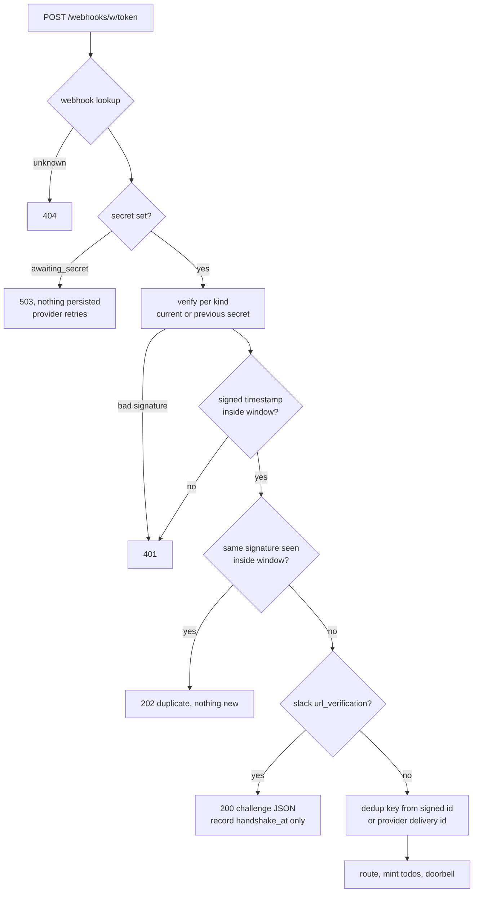

# ADR-0037: Provider-Issued Signing Secrets, Slack URL Verification, and the Linear and Plain Kinds

## Context and Problem Statement

A self-managed signed webhook works because Switchboard and the provider share an HMAC secret.
[ADR-0012](ADR-0012-agents-self-manage-webhooks.md) made Switchboard the side that **mints** it: the
agent pastes the minted secret into the producer. That holds for GitHub, Gitea and Cairn, which let you
type any secret you like. It does not hold for providers that **issue their own**.

### Finding: signed Stripe and Slack webhooks cannot work on `main`

Verified against `origin/main` at `8474757`:

* `create_webhook` takes only `source_type` and `target_queue` (`createWebhookIn`,
  `internal/mcp/webhooks.go`). For every signed type it mints the secret (`mintSecretFor` →
  `mintWebhookSecret`), and `rotate_webhook` mints a fresh one.
* The only writers of `endpoint_webhooks.signing_secret` are `store.CreateWebhook` and
  `store.RotateWebhookSecret` (`internal/store/webhooks.go`), and both are fed those minted values. No
  path stores a secret the caller supplies.
* Stripe generates each endpoint's `whsec_` secret when the endpoint is registered and shows it for
  copying; it does not accept one. Slack issues one signing secret per app, shown under Basic
  Information; it can be regenerated, not set. Linear and Plain are the same: Linear shows a secret on
  the webhook's page, and Plain has one workspace secret that admins view and regenerate.
* So the HMAC Switchboard recomputes (`verifyStripe`, `verifySlack` in `internal/ingest/verify.go`) can
  never match, and every delivery to a self-managed `stripe` or `slack` webhook is refused `401
  signature verification failed` by `SelfManaged` (`internal/ingest/selfmanaged.go`).
* Before #291 an operator could paste the provider's secret into `SWITCHBOARD_STRIPE_SECRET` or
  `SWITCHBOARD_SLACK_SECRET` (read in `internal/server/server.go` at the parent of `b9b6ed7`) for the
  instance-wide receivers `/webhooks/stripe` and `/webhooks/slack`. #291 removed those receivers, rightly:
  they belonged to no tenant. It also removed the only path that accepted a provider-issued secret.

**Since #291, signed Stripe and Slack are unusable.** `docs/getting-started/04-first-webhook.md` still
lists both as supported and tells the reader to paste the minted secret into the producer, which
neither provider allows.

### Two more gaps on the same path

* **Slack URL verification.** When a Request URL is entered, Slack POSTs a signed
  `{"type": "url_verification", "challenge": "…"}` and enables events only if the reply is `200` with the
  challenge. Nothing in `internal/ingest` handles it, and the pre-#291 Slack receiver never did either.
  Even with a matching secret the receiver would mint
  a todo and answer `202` with its own JSON, so Slack would reject the URL.
* **Delivery ids.** The self-managed path reads only `X-GitHub-Delivery`, `X-Gitea-Delivery`, Cairn's
  signed `event_id` and a generic sender's id; everything else falls back to a body hash. The removed
  Stripe receiver keyed on Stripe's event `id`. For providers that rewrite per-attempt metadata into the
  body (Plain does), a body hash turns every retry into a new todo.

### Demand

A self-hosting customer's stack puts a Slack front door in front of its agents, uses Linear as its only
work ledger, and runs customer support in Plain. Linear and Plain both sign with HMAC-SHA256. Their bug
reports against self-hosted Switchboard were about exactly this kind of provider wiring.

**How should a tenant connect a provider that issues its own signing secret, without bringing back
anything instance-wide, and which such providers should Switchboard verify natively?**

## Decision Drivers

* **Stay self-managed only.** No env secrets, no instance-wide receivers: every webhook belongs to one
  owner (#291, [ADR-0022](ADR-0022-endpoint-scoped-todo-ownership.md)).
* **No trust downgrade.** A delivery verified with a provider-issued secret is `verified = true`
  exactly as a minted one is ([ADR-0003](ADR-0003-per-provider-ingestion-and-trust-model.md)).
* **A vendor secret is a credential.** Stored encrypted, never returned, never logged, and entered by a
  human where possible so it does not pass through a model's transcript.
* **Verify each scheme as the vendor documents it today**, including its replay window, and never trust
  an unsigned header for freshness.
* **Dedupe on signed ids**, so a retry is one todo and an unsigned header cannot mint a second.
* **A handshake is not work.** Slack's challenge is answered without an event row or a todo.

## Considered Options

* **(A) Accept a provider-issued secret: a per-kind secret origin, a write-only secret input, and
  native Linear and Plain kinds.** *(chosen)*
* **(B) Restore env-configured provider secrets.**
* **(C) Declare Stripe and Slack unsupported; send them through `generic` token trust.**
* **(D) A tenant-run verifying relay that re-signs deliveries with Switchboard's minted secret.**

## Decision Outcome

Chosen option: **"(A) Accept a provider-issued secret"**, because it restores the two broken kinds
without an instance-wide surface, keeps full signature verification, and makes adding a provider that
issues its own secret (Linear, Plain) a table row plus a verifier.

> **Some providers take our secret. Some give us theirs. Either way, the delivery is verified or it is
> refused.**

### Mechanics

**Secret origin per source type.** Each signed type declares where its secret comes from:

| Source | Origin | Verification | Replay window | Delivery id (dedup) |
|---|---|---|---|---|
| `github` | minted | `X-Hub-Signature-256: sha256=<hex>` over the body | none (GitHub signs no timestamp) | `X-GitHub-Delivery` |
| `gitea` | minted | `X-Gitea-Signature: <hex>` or the GitHub header | none | `X-Gitea-Delivery` |
| `cairn` | minted | `X-Cairn-Signature` plus signed `event_id`, `created_at` | 5 minutes | signed `event_id` |
| `stripe` | **provider** | `Stripe-Signature: t=…,v1=…`: HMAC-SHA256 over `t.body`; any `v1` may match; other schemes ignored | 5 minutes on the signed `t` | body `id` |
| `slack` | **provider** | `X-Slack-Signature: v0=<hex>` over `v0:timestamp:body` | 5 minutes on `X-Slack-Request-Timestamp` | body `event_id` |
| `linear` | **provider** | `Linear-Signature: <hex>` HMAC-SHA256 over the raw body | 60 seconds on the body's `webhookTimestamp` (ms); the unsigned `Linear-Timestamp` header is never used | `Linear-Delivery` |
| `plain` | **provider** | `Plain-Request-Signature: <hex>` HMAC-SHA256 over the raw body | 5 minutes on the body's `webhookMetadata.webhookDeliveryAttemptTimestamp` | body `id` |

The first four rows exist today (with the delivery-id change for Stripe and Slack); Linear and Plain
are new kinds with `trust_mode = signed`.

**Provider-origin webhooks start awaiting a secret.** `create_webhook` does not mint for a
provider-origin type. The webhook is created in state `awaiting_secret` and returns its ingest URL with
no secret. Deliveries to it are refused `503` with nothing persisted, which Stripe, Linear and Plain
retry, so an event sent between registering the URL and entering the secret is delivered later rather
than lost.

**Setting the secret**, write-only, three ways:

1. **The web UI**, on the webhook's row on the endpoint card, by the owning human or a team admin
   (ADR-0038, in parallel). This is the recommended path: the vendor secret never enters an agent's
   context.
2. **`set_webhook_secret {webhook_id, signing_secret, keep_previous_for?}`**, a new verb in the webhook
   family, separately grantable and absent from basics vends.
3. **`create_webhook {…, signing_secret}`**, for a provider-origin type when the secret is already known.
   Slack's is: it exists before any Request URL, and it must be set before the URL is entered because
   the handshake is signed.

The secret is stored through the `internal/cred` envelope and **refused when no encryption key is
configured**: unlike a minted secret, a vendor secret is the tenant's credential and not ours to keep in
plaintext. It is never returned; results report `secret_set: true` and a fingerprint. A supplied secret
for a minted-origin type is refused (`invalid_argument`), so no one can swap a strong minted secret for a
weak chosen one. Per-kind format checks apply where the vendor documents one (Stripe's `whsec_`
prefix).

**Rotation with overlap.** `keep_previous_for` (at most 24 hours, Stripe's own roll window) keeps the
old secret valid alongside the new one, so an owner can roll the vendor secret without a gap.
`rotate_webhook` on a provider-origin webhook rotates only the ingest URL token and leaves the secret
alone, because minting would break it.

**Slack URL verification.** After the signature and timestamp verify, a body whose `type` is
`url_verification` is answered `200` with `{"challenge": "<value>"}` as JSON. No event row, no todo, no
doorbell. The webhook records `handshake_at`, which the endpoint card shows as "verified by Slack". A
challenge that fails verification is `401` like any other delivery.

**Replay defence independent of headers.** For timestamped schemes, a second presentation of the same
signature on the same webhook inside the replay window is answered `202` as a duplicate and creates
nothing. That closes the one gap a signed-body scheme with an unsigned delivery id (Linear) leaves open:
replaying a captured delivery under a fresh `Linear-Delivery` value.

**Kinds, titles and subjects.** Event kinds for routing come from the verified body: Stripe `type`
(`invoice.paid`), Slack's inner `event.type` (`app_mention`), Linear `type` plus `action`
(`Issue.create`), Plain `type` (`thread.thread_created`). Each gets a legible title. Linear issue and
Plain thread subjects, and their reply addresses (ADR-0033), follow with the kinds.

### Consequences

* Good, because Stripe and Slack work again, per tenant, with full verification, and without reviving
  instance-wide receivers.
* Good, because Linear and Plain join as first-class signed kinds, and the next provider that issues
  its own secret is a row in one table and one verifier.
* Good, because retries of all four provider-origin kinds dedupe on ids the provider signs or promises
  are stable, not on a body hash.
* Good, because Slack's handshake finally succeeds, which is the precondition for any Slack source and
  for ADR-0033's Slack replies.
* Bad, because a webhook now has a state (`awaiting_secret`) and a two-step setup for four kinds. The
  endpoint card and `list_webhooks` must make it obvious.
* Bad, because Switchboard now stores tenants' vendor secrets. Mandatory encryption and write-only
  surfaces bound it; the operator, who holds the key, could still decrypt them.
* Bad, because Slack retries only for minutes. A Slack event sent while a webhook awaits its secret is
  likely lost; hence the rule to set Slack's secret at creation.
* Neutral: `generic` is unchanged, and remains the path for providers with no signing scheme.

### Security and tenancy

* A provider-issued secret belongs to the webhook, which belongs to its endpoint's owner scope. It
  cannot be read back by anyone, including its owner; replacing it is the only operation.
* No trust downgrade: the trust mode is still derived from the source type; a provider-origin webhook
  without a secret refuses deliveries rather than accepting them unverified.
* Freshness is checked only on signed timestamps. Linear's `Linear-Timestamp` header and Plain's
  `Plain-Webhook-Delivery-Attempt-Timestamp` header are unsigned and ignored for trust.
* Plain uses one secret per workspace, so two webhooks for the same workspace share it. A delivery
  captured from one of them verifies on the other; that is inherent in Plain's scheme, the same owner
  holds both, and the per-webhook dedup keys still apply.
* The challenge response echoes only a verified, length-bounded, printable challenge value.

### Composition with Harness and Cairn

* **Harness** needs nothing new: its triggers see todos from these kinds like any other.
* **Cairn** stays minted-origin, because Cairn lets an operator set the secret today. If Cairn's
  per-owner webhooks (Cairn F-C8) come to issue their own secrets, `cairn` becomes a provider-origin row
  in the table above, with no other change.
* **ADR-0033** gets its Slack source through this ADR: no Slack thread can be answered until Slack
  deliveries verify and the handshake passes.

### Confirmation

* A Stripe webhook created with the secret Stripe issued accepts a correctly signed delivery with a
  fresh `t` and persists it `verified = true`; the same body with `t` six minutes old is `401`.
* A Stripe retry of the same event (new `t`, new signature, same `id`) creates no second todo.
* A Slack `url_verification` with a valid signature is answered `200` with the challenge, and no event or
  todo exists afterwards; with an invalid signature it is `401`.
* A Linear delivery whose body `webhookTimestamp` is 90 seconds old is refused, whatever its
  `Linear-Timestamp` header says.
* A Plain delivery retried with a new attempt id and timestamp but the same `id` creates one todo.
* Setting a secret with no encryption key configured is refused; no response ever contains a set
  secret.
* A byte-identical Linear delivery replayed within 60 seconds under a different `Linear-Delivery`
  creates nothing.

## Pros and Cons of the Options

### (A) Accept a provider-issued secret

* Good, for the reasons in Consequences.
* Bad, because it adds a webhook state, a verb, and a UI field.

### (B) Restore env-configured provider secrets

* Good, because it is what worked before #291, and it is trivial.
* Bad, because an env secret belongs to the deployment, not a tenant: every tenant's Stripe events would
  verify against one operator's secret, into one receiver. That is the cross-tenant shape #291 removed
  for good reason.

### (C) Declare Stripe and Slack unsupported; use `generic`

* Good, because it costs a docs change and is honest about today.
* Bad, because token trust leaves the body unverified, so anyone who learns the URL can forge a Stripe
  event. For payment events that is not acceptable.
* Neutral: the docs change is worth doing **now** as an interim step, until this ADR ships.

### (D) Tenant-run verifying relay

* Good, because Switchboard would stay minted-only.
* Bad, because every tenant runs a relay that holds the vendor secret and re-signs, which moves
  verification outside Switchboard and adds a hop that can fail or be misconfigured silently.

## Architecture Diagram

## More Information

* The spec: [SPEC-0032](../openspec/specs/provider-signing-secrets/spec.md).
* Self-management and minted secrets: [ADR-0012](ADR-0012-agents-self-manage-webhooks.md). Per-source
  trust: [ADR-0003](ADR-0003-per-provider-ingestion-and-trust-model.md). Held secrets and the trust
  boundary: [ADR-0002](ADR-0002-postgres-persistence-and-retention.md).
* Vendor documentation used for each scheme, read on 2026-09-22:
  Stripe ([docs.stripe.com/webhooks](https://docs.stripe.com/webhooks)),
  Slack ([verifying requests](https://docs.slack.dev/authentication/verifying-requests-from-slack),
  [url_verification](https://docs.slack.dev/reference/events/url_verification),
  [Events API](https://docs.slack.dev/apis/events-api/)),
  Linear ([linear.app/developers/webhooks](https://linear.app/developers/webhooks)),
  Plain ([request signing](https://www.plain.com/docs/request-signing),
  [webhooks](https://www.plain.com/docs/api-reference/webhooks)).
* Parallel records, cited by number until they merge: ADR-0033 and SPEC-0028 (reply to source, which
  consumes Slack deliveries and will add Linear and Plain reply addresses); ADR-0038 and SPEC-0033
  (Teams and tenancy: who may set a team webhook's secret).
* The open decision on plaintext minted secrets when no encryption key is set (#234) is unaffected:
  this ADR requires encryption only for provider-issued secrets.
