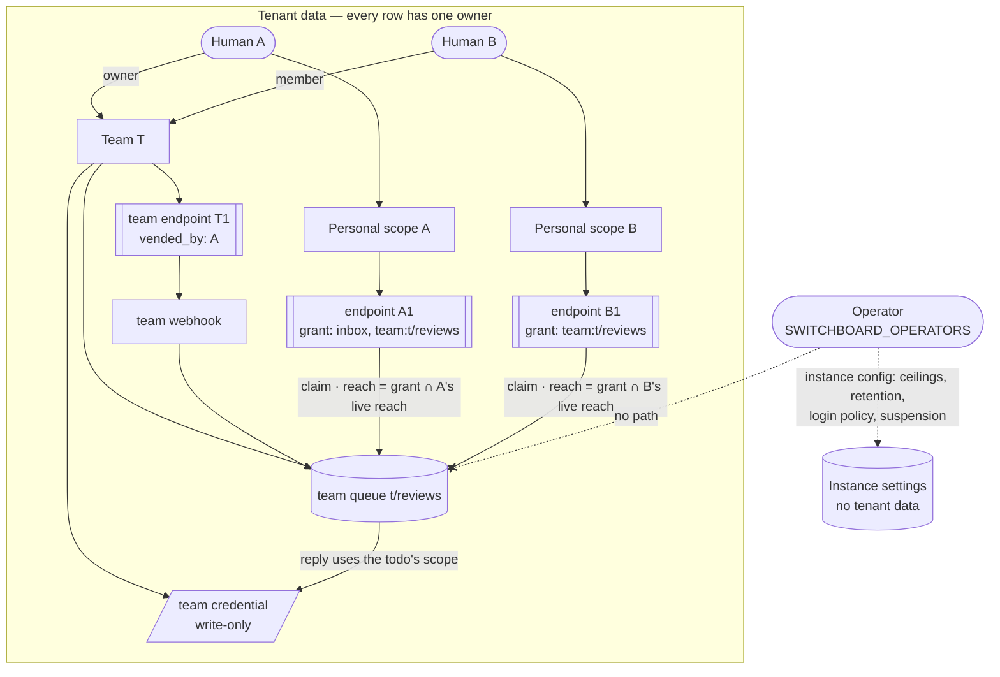

# ADR-0038: Teams and Tenancy — Every Resource Has a User or Team Owner, and the Operator Owns None

## Context and Problem Statement

[ADR-0008](ADR-0008-human-principal-vended-endpoints.md) made the human the tenant, and
[ADR-0022](ADR-0022-endpoint-scoped-todo-ownership.md) closed the hole where two endpoints sharing a
queue string shared each other's work. The shared-receiver removal
then took out the last instance-wide ingestion. Switchboard is a multi-tenant service: the hosted
instance on StumpCloud is run by one person and used by several others (family and friends), and
self-hosters run their own. Three problems remain.

**1. There is no way for two humans to share work.** The only cross-human primitives are friending
([ADR-0010](ADR-0010-a2a-discovery-human-vended-friending.md)) and webhook routes (ADR-0022). Both
copy: a route fans a delivery out into one independent todo per target endpoint, and `create_for`
hands one todo to one friend. Neither gives two people a queue they both drain, a webhook either of
them can manage, or config that survives one of them leaving. People who work together today either
share one human's login, or one human vends endpoints for the other's agents and becomes the owner of
work that is not theirs. A self-hosting customer running several role-specific agents for one team
described the same gap: they need one budgeted queue that several agents drain competitively, owned
by the team rather than by whoever set it up.

**2. "Operator" means two different things, and one of them is wrong.** In this codebase the word
names the *logged-in human managing their own agents*: the "operator board", "operator OAuth"
(`0014_operator_oauth.sql`), "operator-authored todos" (the second ADR-0026). It has also been used
for *the person who runs the instance*: `SWITCHBOARD_OPERATOR_SUBJECTS` gated the provider registry
until the shared-receiver removal took both out, and [ADR-0026 (GitHub login)](ADR-0026-github-second-human-login-provider.md)
lists "Single-operator deployment reality. Switchboard is single-tenant" as a decision driver. That
driver is false for the hosted service and for any self-hoster with a second user. The same
self-hosting customer's bug report shows what the conflation costs: an env-seeded receiver refused
every delivery because it had no owning endpoint, and the providers view showed "0 connected"
because an operator allowlist was empty.

**3. Unscoped surfaces remain, and new ones are being designed right now.** Event
history is the known P0: the event-history tools read and replay every tenant's deliveries. The audit below
finds the rest. Meanwhile, eight companion records add owned resources: notify hooks (ADR-0029,
SPEC-0024), trusted actors and quarantine (ADR-0031), reply-to-source credentials (ADR-0033),
notification sinks (ADR-0034), admission budgets (ADR-0035), rule packs (ADR-0036), provider secrets
(ADR-0037) and attempt history (ADR-0039). Without one owner model each will invent its own, and the
first one to get it wrong is the next event-history leak.

**What is the owner of every resource in Switchboard, how do people share ownership, and what can
the person who runs the instance do that a user cannot?**

## Decision Drivers

* **Two profiles, one rule (Joe, 2026-09-22).** The **operator** deploys and runs the instance. A
  **user** logs in and uses it. Every resource a user creates is owned by that user **or by a
  team**, and is never global. Nothing is designed as if the instance were one team's install.
* **Accountability survives sharing.** ADR-0008's invariant — every agent action traces to one
  accountable human — must still hold when the thing acting is a team's endpoint.
* **Least privilege, revoked live.** Losing a team membership or a role must cut access on the next
  call, with no re-vend and no residue. ADR-0008's immutable vend grant stays; membership narrows it.
* **One predicate, not one check per handler.** The event-history leak happened because tenancy was a `WHERE` clause
  each author had to remember. The owner model must be something a query cannot be written without.
* **Legible grants.** ADR-0008 chose a grant a human can read and know exactly what it permits. A
  sharing model has to keep that property; per-resource ACL lists do not.
* **Self-service without the operator.** Users create teams, invite each other and manage team
  config without asking the operator. The operator sets bounds; they are not in the loop.
* **The operator runs the service; they do not read it.** The operator has the database and cannot
  be kept out of it. The product must not add a second, easier path to tenant payloads, and every
  operator action that touches a tenant must be recorded.
* **Consistent with Cairn, separate stores.** Cairn (its ADR-0029, SPEC-0023) adopts the same
  profiles, the same role names, the same invite semantics and the same group mapping. Neither
  service reads the other's membership.

## Considered Options

* **(A) Humans only; share through friending and routes.** Keep ADR-0008 as is and document friend
  edges and webhook routes as the collaboration model.
* **(B) Teams as first-class owners, with roles and team queues.** A resource is owned by exactly
  one human or one team. Teams have members with roles `owner`, `admin`, `member`. A queue can
  belong to a team, and members' agents claim from it competitively. *(chosen)*
* **(C) The instance is the team.** Treat a deployment as one organisation: every user is a member,
  the operator is its admin, and resources are instance-scoped with per-user filters.
* **(D) Per-resource ACLs.** Keep human ownership and let an owner grant other humans (or groups)
  read, write or claim on each individual resource.
* **(E) Teams are IdP groups.** Store no teams; read an OIDC `groups` claim and treat each group as
  a team.

## Decision Outcome

Chosen option: **"(B) Teams as first-class owners, with roles and team queues"**, because it is the
only option that gives people a shared, durable owner without making anything global, keeps a grant
legible, and lets the rest of the companion records share one answer.

> **A resource belongs to a user or to a team. The operator runs the instance and owns nothing in it.**

### 1. Two profiles

| | Operator | User |
|---|---|---|
| Who | whoever deploys and runs the instance | anyone who can log in |
| Defined by | `SWITCHBOARD_OPERATORS` (provider-qualified subjects) and optionally `SWITCHBOARD_OPERATOR_GROUP` | a `humans` row, created at first login |
| Owns | nothing, as operator (an operator is also a user, and owns their own resources as one) | their personal resources, and a share of their teams' |
| May | instance config: login policy, ceilings and quotas, retention, suspension of a user or team, metrics scrape credentials, the operator console (aggregate counts, users and teams by name) | everything in their reach (below) |
| May not | read, replay, export or impersonate a tenant's todos, payloads, events, attempts, secrets or config through any product surface | anything outside their reach |

**Operator-only means instance config, not tenant data.** Operator configuration may **bound**
tenant data — limits, ceilings, retention windows, login allowlists — and may never **route, copy or
reveal** it. That sentence is the test for every future env var, and it is why an instance-wide
outbound URL list is ruled out on this side as it is being retired on Cairn's.

**Enrollment mode is operator config** (Joe, 2026-09-22: "This should be configurable.").
`SWITCHBOARD_ENROLLMENT_MODE` is `allowlist`, `invite` or `open`:

* `open` admits any identity the configured providers authenticate;
* `allowlist` admits only identities matching `SWITCHBOARD_ENROLLMENT_ALLOW` (provider-qualified
  subjects, verified emails, `@domain`, `github-org:<login>`);
* `invite` admits only identities whose verified email holds a pending team invitation, plus the
  operators.

It defaults to `invite` when GitHub login is configured, and to `open` otherwise. It gates only the
creation of a new user; an existing user is never locked out by a mode change, and the operator
suspends them instead. Cairn uses the same names, values and semantics (`CAIRN_ENROLLMENT_MODE`,
`CAIRN_ENROLLMENT_ALLOW`, stump.wtf/cairn#265), so one instance-pair has one enrollment story.

Operator surfaces require a session from the passkey issuer, the same gate ADR-0026 puts on consent
actions. Every operator action that touches a tenant (suspend, unsuspend, raise a quota, delete an
abusive team) writes an `operator_audit` row naming the operator, the target and the reason, and the
affected user or team owners see it on their settings page. The operator can still read the database
with `psql`; the product says so in the self-hosting guide rather than pretending otherwise.

**Terminology.** From this ADR on, *operator* means the instance operator. The existing "operator
board", "operator OAuth" and "operator-authored todos" are **user** surfaces — a human managing their
own agents — and keep their code names; documentation calls them "the board", "human OAuth" and
"human-authored todos". ADR-0026 (GitHub login)'s "Switchboard is single-tenant" driver is
**withdrawn** by this ADR; its decision (issuer-gated consent actions) stands and is reused here.

### 2. Principals and owners

There are two kinds of owner: a **human** (a user) and a **team**. A directly owned resource carries
exactly one of them:

```sql
owner_human_id      uuid NULL REFERENCES humans(id) ON DELETE CASCADE,
owner_team_id       uuid NULL REFERENCES teams(id)  ON DELETE CASCADE,
created_by_human_id uuid NULL REFERENCES humans(id) ON DELETE SET NULL,  -- audit only; grants nothing
CHECK (num_nonnulls(owner_human_id, owner_team_id) = 1)
```

A resource that already hangs off an endpoint — its webhooks, routes, notify hooks, rule-pack
installs, and the todos on its queues — **inherits the endpoint's owner** and carries no owner
columns of its own. So an endpoint is the one place ownership is decided, and everything attached to
it follows.

**Teams can own endpoints.** A team-owned endpoint is vended and revoked by team admins, survives the
human who vended it leaving the team, and records `vended_by_human_id`. That column is ADR-0008's
accountable human: every action a team endpoint takes still traces to the person who minted its
credential.

### 3. Reach: one predicate

A principal's **reach** is the set of owner scopes it may act in:

* a **human's** reach is their own scope plus every team they belong to, each with the permissions
  of their role there;
* an **endpoint's** effective reach is **its vend grant ∩ its owner's current reach**, evaluated on
  every call. A personal endpoint can never do more than its human can do *now*; a team endpoint can
  never do more than its team's admins allowed at vend time.

Every store read and write that touches a tenant resource takes a `Reach` value and compiles it into
the query. Methods that genuinely must see across tenants — ingest resolving a webhook token, the
lease reaper, retention, metrics gauges — are named `…Unscoped`, live behind an allowlist a test
enforces, and never return rows to a caller. Foreign and unknown ids are both `not_found`, so reach
cannot be probed.

### 4. Teams, roles and invites

Any user may create a team (subject to the operator's per-user ceiling) and becomes its first
**owner**. A team has an instance-unique `slug` and a display name.

| Role | Can |
|---|---|
| **member** | use team resources: see team queues, todos, events and attempt history on the board; claim, heartbeat, complete and fail team-queue todos through their agents; grant a team queue to their own endpoints; create human-authored todos on team queues |
| **admin** | everything a member can, plus configure: vend and revoke team endpoints; create, edit and delete team webhooks, routes, rules and rule-pack installs, notify hooks, sinks, credentials and secrets, admission budgets, trusted actors; invite and remove members and admins. A team owner may let members create webhooks with the off-by-default `members_create_webhooks` setting |
| **owner** | everything an admin can, plus govern: promote and demote owners, rename, transfer, delete the team |

*Members use, admins configure, owners govern.* A team always has at least one owner; the last owner
cannot leave or be demoted. Secrets are write-only for everyone, owners included: they are shown once
at creation and never returned again (the `internal/cred` envelope, ADR-0033 and ADR-0037).

**Invites** are addressed to an email address. An admin creates one; Switchboard mints an
unguessable, single-use token (stored hashed), valid for 7 days, carrying the role it will grant (at
most the inviter's own). Accepting requires a logged-in user whose provider-verified email equals
the invite's address. Admins can list and revoke pending invites. Nothing about an invite, including
whether the email has an account, is revealed to anyone but the team's admins.

**Consent-grade actions** — vending a team endpoint, creating a team credential, and granting
`admin` or `owner` — mint capabilities, so they require a passkey-issuer session, exactly as ADR-0026
gates friend approvals. Accepting an invite and ordinary member work do not.

### 5. Team queues

A queue is identified by **(owner scope, name)**. Today's queues are endpoint queues and keep their
behaviour exactly. A **team queue** is new: its todos are owned by the team, not by any endpoint.

```sql
ALTER TABLE todos ALTER COLUMN endpoint_id DROP NOT NULL;
ALTER TABLE todos ADD COLUMN team_id uuid NULL REFERENCES teams(id) ON DELETE CASCADE,
                  ADD COLUMN claimed_by_endpoint_id uuid NULL REFERENCES endpoints(id) ON DELETE SET NULL,
                  ADD CONSTRAINT todos_one_owner CHECK (num_nonnulls(endpoint_id, team_id) = 1);
```

A team-queue todo is claimable by any endpoint whose effective reach includes that queue: team-owned
endpoints granted it, and members' personal endpoints holding a `team:<slug>/<queue>` grant while
their human is still a member. Claims are the existing competing-consumer `SKIP LOCKED` claim; the
lease, retries and dead-lettering are unchanged, and `claimed_by_endpoint_id` records who holds it.
The doorbell rings exactly one live session among eligible, clocked-in endpoints (ADR-0013,
ADR-0027), so a burst on a team queue spreads across the team's agents instead of ringing all of
them.

Any per-queue row — an admission budget (ADR-0035), a digest schedule (ADR-0034), a rule-pack target
(ADR-0036), attempt history (ADR-0039) — keys on the same `(endpoint_id | team_id, queue)` identity.

### 6. What every resource is owned by

| Resource | Owner | Written by |
|---|---|---|
| Agents and endpoints | human or team (direct) | the human; team admins |
| Personas (ADR-0009) | the endpoint's owner (attached) | as endpoints |
| Endpoint queues and their todos | the endpoint (attached) | as today |
| Team queues and their todos | the team (direct, `todos.team_id`) | admins create; members work |
| Webhooks, routes (ADR-0012, ADR-0022) | the endpoint (attached) | endpoint verbs; team admins on the board |
| Routing rules and rule-pack installs (ADR-0024, ADR-0036) | the webhook, so the endpoint (attached) | as webhooks |
| Notify hooks (ADR-0029, SPEC-0024) | the endpoint (attached) | endpoint verbs; team admins |
| Notification sinks (ADR-0034) | human or team (direct) | the human; team admins |
| Reply and outbound credentials, provider secrets (ADR-0033, ADR-0037) | human or team (direct) | the human; team admins |
| Trusted-actor lists and quarantine (ADR-0031) | the webhook's owner (attached) | as webhooks |
| Admission budgets (ADR-0035) | the queue's owner | the human; team admins |
| Events, deliveries and attempt history (ADR-0039) | the event's owner, written at ingest (`events.endpoint_id` or `events.team_id`), never inferred through `webhook_id` | written by ingest only |
| Friend edges (ADR-0010) | the two humans | the humans |
| Human OAuth clients and grants (ADR-0019) | the human | the human |
| Instance settings, ceilings, login policy | the operator (instance config, not a tenant resource) | the operator |

**References stay inside a scope.** A resource may reference a credential, sink or rule pack only in
its own owner scope, or a code-shipped catalog entry that holds no tenant data. A personal rule
cannot bind a team credential; a team hook cannot use a personal sink. Checked at write and again at
use.

**Credentials follow the todo, never the claimer.** When a member's personal endpoint works a
team-queue todo, a reply to the source (ADR-0033) or a notification (ADR-0034) uses the **team's**
credential and sink. A personal todo uses the human's. Nobody can move a team secret into their own
scope by claiming work.

**Data may flow into a team, never out.** A route from a personal webhook into a team queue is a
member sharing their own deliveries and is allowed while the granting human is a member. A route
from a team webhook to a personal endpoint is refused: members read team data in place.

### 7. Friending stays

Teams do not replace ADR-0010. Friending is how two humans who share no team grant one endpoint a
capability on another; teams are shared ownership. A team member does not need a friend edge to work
a team queue, and a friend edge never grants anything on a team.

### 8. OIDC groups (optional)

If the operator sets `SWITCHBOARD_OIDC_GROUPS_CLAIM` (off by default), a team **owner** may link
their team to one IdP group and choose the role it confers (`member` or `admin`, never `owner`). The
linking owner must carry that group themselves. At each login from the configured OIDC issuer, a user
carrying the group gains the linked membership; a user whose claim no longer carries it loses a
group-sourced membership at that login. Manually granted memberships are never touched by sync.
GitHub logins carry no groups and never change group-sourced memberships. The claim name, the
link-by-owner rule and the role ceiling are identical in Cairn.

### 9. Unscoped surfaces found, and their fixes

The audit of `main` @ `8474757` that this ADR's spec turns into requirements:

| # | Surface | What is wrong today | Fix | Tracked |
|---|---|---|---|---|
| F1 | Event history: `list_webhook_events`, `get_webhook_event`, `replay_webhook_event`, `switchboard://events/recent` (`internal/store/events.go:94-115,169`; `internal/mcp/events.go`) | No owner predicate; any endpoint reads and replays every tenant's payloads, headers, source IPs and routing traces. `events` has no owner column, and `webhook_id` is set to null when a webhook is deleted | Add `events.endpoint_id` (or `team_id`) written at ingest and backfilled through the webhook; every read filters by reach; replay checks reach before reading the payload | existing issue (P0) |
| F2 | Enrollment (`internal/auth/github.go:37-58`, `auth.go:310`) | Any GitHub account becomes a tenant on first login, which makes every other finding internet-reachable | Operator config `SWITCHBOARD_ENROLLMENT_MODE`: `allowlist`, `invite` or `open`, defaulting to `invite` when GitHub login is configured (section 1) | new |
| F3 | Friend-vended endpoints (`internal/server/friend_intake.go:226-246`, `internal/store/friends.go:183-193`) | Intake accepts any requested verbs; the minted endpoint authorizes webhook, rule and event verbs against the **approver**, so a friend can rewrite the approver's rules and read payloads through `test_webhook_rules` | Friend grants limited to `create_for` and drain verbs; webhook, rule and event verbs authorize against the webhook's own endpoint | new |
| F4 | `KnownQueues` vend suggestions (`internal/store/agents.go:574-600`) | Unions every tenant's queue names into every human's vend screen; its comment still calls queues "a global namespace" | Filter by reach | new |
| F5 | Rule sandbox (`internal/routing/sandbox.go:50-57,151-158`) | Two evaluation slots for the whole process; a busy sandbox is a fault, and a fault means no match, so one tenant's flood silently disables other tenants' drop and trust rules | Per-owner fair share of slots; trust rules fail closed | new, with the fail-closed fix |
| F6 | Retention (`internal/store/retention.go:51-98`, `settings`) | Row caps counted across all tenants, so a noisy tenant evicts everyone else's history | Per-owner caps, operator-set defaults, eviction within the owner | new |
| F7 | Ingest rate limit (`internal/server/ratelimit.go:121-128`) | Keyed on `RemoteAddr` before the token is known: one bucket for everyone behind a proxy | Trusted-proxy keying, then a per-webhook limiter after token lookup | existing issue + new |
| F8 | Consent actions (`internal/auth/auth.go:77-81`) | The ADR-0026 passkey-issuer gate is not implemented, so GitHub sessions mint capabilities | Implement the gate; this ADR's consent-grade team actions reuse it | existing issue (dependency) |
| F9 | Replay targets (`internal/mcp/replay.go:98-110,205-211`) | `replay_default_target` and `replay_allowed_targets` are instance settings, and "trusted" targets skip the SSRF guard for every tenant | Replay targets become endpoint-owned; no tenant call bypasses the guard; the instance settings are deleted outright, with an upgrade note and no boot warning | new |
| F10 | Live lane frames (`internal/web/live.go:41-46`) | `lane_received` / `lane_rejected` / `lane_deduped` go to every connected human | Ingest passes the resolved webhook; frames filter by reach | existing issue |
| F11 | Metrics labels (`internal/metrics/metrics.go:103-134`, `limiter.go:31-33`) | Tenant queue names reach the operator's scrape; same-named queues of different owners merge; one tenant can exhaust the shared label cap | Named series only for queues owned by an operator's own scopes; all others aggregate under `__tenant__` by owner kind | new (amends SPEC-0023) |
| F12 | OAuth client registry (`0010_oauth.sql:12-18`, `internal/oauthsrv/oauthsrv.go:250-285`) | Anonymous global registration; consent shows only the client's self-chosen name | Consent shows the redirect origin; unverified clients are marked | new |
| F13 | Friend-request uniqueness (`0005_friend_edges.sql:41-43`) | Unique on persona names across tenants, so requests collide and can be squatted | Humans in the unique key | new |
| F14 | Event dedup (`0001_init.sql:74`) | `(source, external_id)` unique instance-wide; safe only because every current path prefixes the key | Owner in the dedup key | new |
| F15 | Human identity (`internal/auth/provider.go:126`) | Raw OIDC `sub` is the global key, not `(issuer, sub)` | Key humans on issuer and subject | new |
| F16 | Dev routes (`internal/server/server.go:288`) | `/dev/todos` sits outside auth and accepts any `endpoint_id` | Require a session and an endpoint in reach, even in dev | new |
| F17 | Uncalled store functions (`todos_a2a.go`, `push_configs.go`, `webhook_routes.go`, `routing.go`) | Id-only reads that leak the moment a handler calls them | Reach parameter or `Unscoped` suffix, enforced by the structure test | existing issue + foundation |
| F18 | Old-format wakeup fallback (`internal/server/listen.go:169-172`) | Reads every endpoint's pending todos by queue name | Remove it | new |
| F19 | Route and rule verbs (`internal/mcp/webhook_routes.go:239-242`, `internal/store/routing.go:49-68`) | Authorize against the human, so a narrowly vended endpoint rewrites all its human's webhooks | Authorize against the webhook's own endpoint, or the grant's explicit webhook list | with F3 |
| F20 | Routing trace on route-target todos | A friend's todo carries the owner's rule names, fault text and other targets | Redacted trace across owner scopes | existing issue |
| F21 | Feature flags and the encryption key (`internal/config/config.go:38-85`) | Instance-wide | Accepted: instance policy that bounds tenants and routes nothing. Documented | — |

### 10. Migration

Existing resources become owned by their creator, which on `main` is always one human:

* endpoints and agents take `owner_human_id = agents.owner_human_id`;
* everything attached to an endpoint needs no change;
* no teams exist until a user creates one, so every existing query returns exactly what it did;
* `todos.team_id` is null on every existing row, satisfying `todos_one_owner` without a backfill;
* events with no `webhook_id` (pre-0018 rows) become invisible to agents and remain visible to their
  endpoint's owner only when a join through `endpoint_webhooks` proves it, as the F1 fix proposes.

A human with no teams sees no difference anywhere except the removal of the leaks in section 9.

### Consequences

* Good, because people can finally share work without sharing a login: one queue, several agents,
  config that outlives whoever set it up.
* Good, because every companion record gets its owner model from one place: exactly-one-of owner
  columns, same-scope references, credentials that follow the todo.
* Good, because the operator gets a real, bounded role — and "operator" stops meaning "whoever is
  logged in".
* Good, because a single `Reach` predicate replaces a per-handler `WHERE` clause, which is the class
  of bug the event-history leak is.
* Good, because nothing changes for a user with no teams, and the migration needs no backfill.
* Bad, because `todos.endpoint_id` becomes nullable, and every consumer that assumed a todo has an
  endpoint (doorbell, presence, notify hooks, metrics labels) must handle a team todo. The spec lists
  them; the tenancy suite must cover each.
* Bad, because live reach adds a membership lookup to every agent call. It is one indexed join per
  call and is cached per request, not per session, so revocation stays immediate.
* Bad, because roles are a second axis next to the vend grant. Mitigated by the rule that roles only
  ever narrow: an endpoint never gains power from its human's role that its grant did not name.
* Bad, because a team member can see every team todo's payload. That is the point of a team, and the
  invite screen says so.
* Neutral, because the operator still has the database. The product removes the easy path and
  records the hard one; it does not claim more.

### Confirmation

* The tenancy suite (`internal/store/tenancy_isolation_test.go`, the MCP suite and the handler-level
  walk from the handler-level tenancy suite) gains a second team: a member of team A, an admin of team A, an ex-member, a
  non-member and the operator each attempt every read and write on every row of the table in
  section 6, and every attempt outside reach returns `not_found`.
* A store method without a `Reach` parameter and not on the `Unscoped` allowlist fails a test.
* Removing a member ends their personal endpoint's access to the team queue on the next call, with
  no re-vend, proven by a claim that succeeds before and returns `not_found` after.
* An operator session can suspend a user and cannot fetch any todo, event, attempt or secret of
  theirs through any route; the suspension appears in the user's audit list.
* A reply from a team-queue todo claimed by a member's personal endpoint uses the team credential.

## Pros and Cons of the Options

### (A) Humans only; share through friending and routes

* Good, because it is built and needs no migration.
* Bad, because every sharing mechanism copies: two people never drain one queue, and a route's N
  todos race nothing but also coordinate nothing.
* Bad, because work set up by one person belongs to that person forever. When they leave, the team's
  webhooks go with them.
* Bad, because it leaves the operator undefined, which is how the provider registry got an allowlist
  nobody could configure.

### (B) Teams as first-class owners, with roles and team queues

* Good, because shared ownership, competitive draining and survivable config all fall out of one
  owner column.
* Good, because it keeps ADR-0008's grant legible: the grant still names verbs and queues; a team
  queue is just a queue with a team in its name.
* Good, because it matches Cairn's model and the workspace boundary Cairn's ADR-0001 always intended.
* Bad, because it is the largest option: a nullable todo owner, a membership join on the hot path, a
  second role axis, and a UI for teams and invites.

### (C) The instance is the team

* Good, because it is the smallest change and fits a single self-hosted team exactly.
* Bad, because it is ruled out by the rule it would have to break: every user's resources become
  visible to every other user by default, and the operator becomes an admin over tenant data.
* Bad, because it is the shape the shared-receiver removal took out of ingestion, applied to everything.

### (D) Per-resource ACLs

* Good, because it is maximally flexible: share one webhook with one person for one day.
* Bad, because a grant stops being legible — "who can claim from this queue" becomes a query over
  every ACL row, which is the audit ambiguity ADR-0008 rejected mutable scope to avoid.
* Bad, because every new resource type needs its own ACL semantics, and the companion records would
  each design one.

### (E) Teams are IdP groups

* Good, because membership is managed where the operator already manages people.
* Bad, because GitHub login (ADR-0026) carries no groups, so GitHub users could never be in a team.
* Bad, because users cannot create a team or invite a friend without the operator editing the IdP,
  which puts the operator back in the loop for every collaboration.
* Neutral, because it survives as the optional sync in section 8, layered on stored teams.

## Architecture Diagram



## More Information

* Companion records, accepted together on 2026-09-22 and linked as front-matter edges: ADR-0029 and
  SPEC-0024 (notify hooks), ADR-0031 (trusted actors and quarantine), ADR-0033 (reply-to-source
  credentials), ADR-0034 (notification sinks and digest), ADR-0035 (admission control), ADR-0036
  (rule packs), ADR-0037 (provider secrets), ADR-0039 (attempt history), and their specs.
* The same model in Cairn: its ADR-0029 and SPEC-0023 ("Teams and tenancy"). A person in team
  `stump` in both products has two independent memberships with the same slug and role names; with
  group sync on, both derive from the same IdP group at next login. A Cairn team's outbound
  subscription pointed at a Switchboard team webhook delivers into that team's queue, owned end to
  end by the two teams and by no instance-wide setting.
* Harness composes by vending: its stack installer (Harness ADR-0024, SPEC-0018) should offer to vend
  into a team, and its supervisor leases (Harness ADR-0025) claim team-queue todos like any endpoint.
* Known P0 folded in here: F1, event history.
