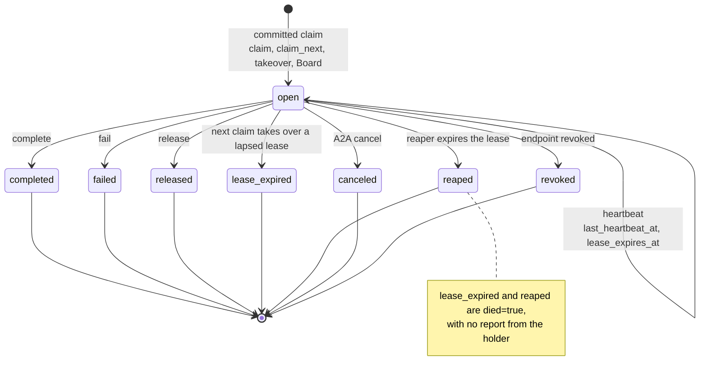
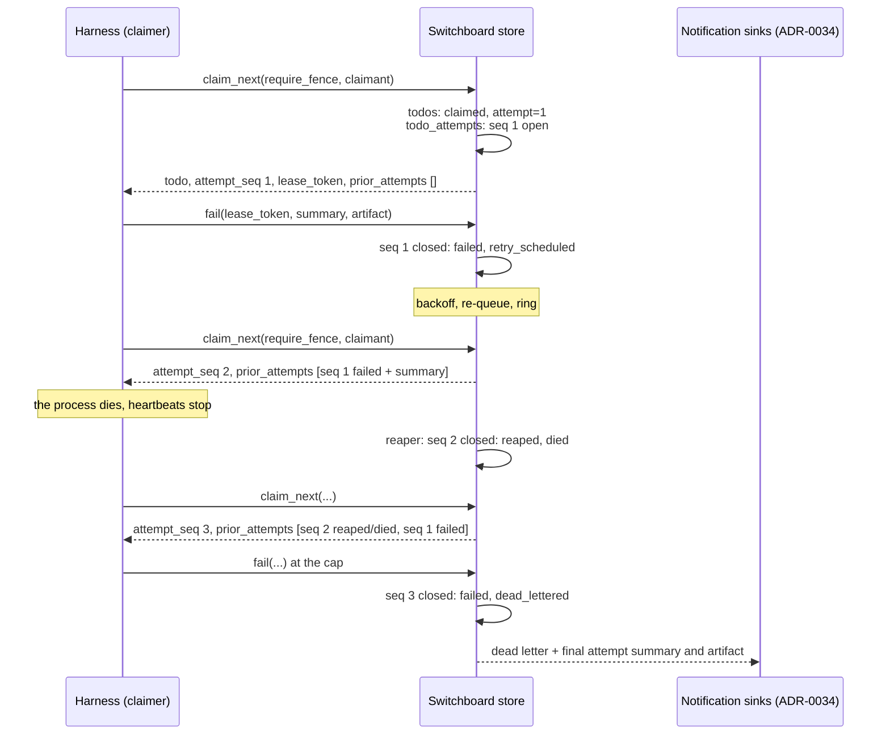

# ADR-0039: Attempt History on Todos — Every Claim Opens a Record, Every Ending Closes It

## Context and Problem Statement

A todo is a dispatch lease ([ADR-0007](ADR-0007-todos-as-core-primitive.md)): it is claimed, heartbeated, and then completed, failed and retried, or dead-lettered. Switchboard keeps the lease's *current* state and nothing about the ones before it. On `main`:

* **One `result`, overwritten.** `todos.result` is a single `jsonb` column. `CompleteTodo` and `FailTodo` each replace it, and `RetryTodo` sets it to `NULL` (`internal/store/todos.go`). After three failed attempts, the row holds the third attempt's result and nothing about the first two.
* **A counter, not a history.** `todos.attempt` is incremented by every claim and reset to `0` by a manual retry. It says *how many*, never *who*, *when* or *how it ended*.
* **Deaths leave no trace.** `ReapExpired` returns an expired lease to `pending` (or dead-letters it at the cap) and clears `owner` and `lease_expires_at`. A claim that takes over a lapsed lease does the same in its `cand.prior_state = 'claimed'` arm. Neither records that an attempt died, so the next claimer cannot tell a worker that crashed from one that tried and failed. [SPEC-0023](../openspec/specs/metrics/spec.md) REQ-3 counts these expiries (`switchboard_lease_expired_total`), but a counter cannot say which todo, which worker or when.
* **Every worker on an endpoint looks the same.** `owner` is `agent:<agent_id>`, shared by every session on an endpoint (issue #160, item 2). A stale worker whose lease lapsed can still `complete` a todo a newer worker on the same endpoint has claimed.
* **Nothing reads it back.** `todoOut` carries neither `result` nor `next_retry_at`, and there is no single-todo read verb, only `list_todos` (issue #214).

There is no attempt or result history anywhere in the schema: no table in migrations `0001`–`0021` records a claim.

Three consumers need it now:

* **Relay attempts.** Harness ADR-0025 (written in parallel with this ADR) runs a fresh one-shot per attempt. Harness claims, heartbeats and reports, and a new process takes over with the ticket if the build is still failing. The new process needs what the earlier ones tried, and whether they died or failed.
* **A human reading a dead letter** needs to see what each attempt tried, not just the last result.
* **The Board.** A self-hosting customer reported the Board's reaper ticker as a wall of "re-surfaced to queue" entries. The reaper was doing its job; nothing on the page could say whose attempt had died or what it had done.

**How should Switchboard record each attempt on a todo, so that the next claimer and the owning human know what was tried, by whom, how it ended, and whether it died rather than failed, without unbounded growth or leaks across tenants?**

## Decision Drivers

* **The queue stays the ledger** ([ADR-0013](ADR-0013-channels-push-delivery.md)). Attempt history belongs with the todo, in the same database, written in the same transaction as the transition it records.
* **Tenant isolation is a hard rule** ([ADR-0022](ADR-0022-endpoint-scoped-todo-ownership.md); the teams model in ADR-0038 / SPEC-0033). An attempt is visible exactly where its todo is, and nowhere else. An unknown id and a foreign id must be indistinguishable.
* **"Died" must be distinguishable from "failed".** An attempt that ended because its lease lapsed carries no report. The next claimer must be told that, not shown an empty failure.
* **Bounded.** Per-attempt text is capped, attempts per todo are capped, and history ages out with its todo under the existing retention policy ([ADR-0002](ADR-0002-postgres-persistence-and-retention.md)).
* **Additive.** Every new argument is optional and every new response field is additive. Nothing is renamed or superseded, so existing clients keep working unchanged, and `result` keeps its meaning.
* **Text is data.** Attempt summaries are written by agents that read attacker-reachable input. Switchboard stores and returns them as data, and never interprets them.
* **Minimal verb surface.** Endpoints are frozen at their vend-time verb set (issue #163), so history should reach existing endpoints without re-vending.

## Considered Options

* **(A) A `todo_attempts` table.** One row per committed claim, closed by whichever transition ends the attempt. *(chosen)*
* **(B) A `jsonb` array on `todos`.** Append an element on each claim and close it in place.
* **(C) A generic transition log.** Record every todo transition in a `todo_transitions` table, and derive attempts by folding the log.
* **(D) No server-side history.** Tell consumers to carry notes in `result` or in Cairn, and to pass handles forward themselves.

## Decision Outcome

Chosen option: **"(A) A `todo_attempts` table."** An attempt is a first-class record with a clear start (a committed claim) and a clear end (the transition that took the lease away), and a row per attempt is what makes both atomic with the todo's own update.

> **The todo says where the work is. The attempts say how it got there.**

### The record

Each row holds:

* the todo it belongs to, and a sequence number `seq` that increases per todo and is never reset;
* `attempt`, the todo's counter at claim time, which a manual retry resets;
* the claimer: `claimer_kind` (`endpoint` or `owner`, the latter for a human claiming from the Board), the claiming endpoint, the MCP session id when the claim arrived over MCP, `owner` as recorded on the todo, and an optional caller-supplied `claimant` label of at most 128 bytes (for example, `harness/buildbox/ci-fixer/run-42`);
* `claimed_at`, `last_heartbeat_at`, `lease_expires_at` (the last value the lease held) and `ended_at`;
* `outcome`: `completed`, `failed`, `released`, `lease_expired`, `reaped`, `canceled` or `revoked`;
* `disposition`, what the todo did next: `done`, `retry_scheduled`, `requeued`, `dead_lettered` or `canceled`;
* `summary`, bounded text of at most 2048 bytes stored, and `artifact`, an optional handle of at most 512 bytes (an `mcp://cairn/<id>` handle or an `https` URL, never fetched);
* a hash of the attempt's lease token when the claim asked for one.

Tenancy is not a column on the row. An attempt is reachable only through its todo, and it inherits the todo's owner scope: today the owning endpoint (ADR-0022), and after ADR-0038 whichever owner scope that record gives a queue. The claimer fields are provenance, never authority. For team-owned work, the scope that governs reads is the todo's, not the claimer's.

### Opening and closing

* **Every committed claim opens exactly one attempt**, in the same transaction as the `todos` update. That covers `claim`, `claim_next`, a lease takeover, and a human claiming from the Board. It is the same event queue admission control (ADR-0035 / SPEC-0030) charges one unit for, so the two count identically.
* **The transition that ends a lease closes the open attempt**, in the same transaction:

  | Transition | Outcome | Disposition |
  | --- | --- | --- |
  | `complete` | `completed` | `done` |
  | `fail` below the cap | `failed` | `retry_scheduled` |
  | `fail` at the cap | `failed` | `dead_lettered` |
  | `release` | `released` | `requeued` |
  | A claim takes over a lapsed lease | `lease_expired` | `requeued` (the new claim follows at once) |
  | The reaper expires the lease below the cap | `reaped` | `requeued` |
  | The reaper expires the lease at the cap | `reaped` | `dead_lettered` |
  | A2A cancel of a claimed todo | `canceled` | `canceled` |
  | The owning endpoint is revoked | `revoked` | `dead_lettered` |

* **"Died" is derived.** `lease_expired` and `reaped` mean the holder never reported. Every read carries `died: true` for them. `last_heartbeat_at` bounds when the holder was last known alive. The next claimer therefore sees "attempt 2 died after its last heartbeat at 14:21", not an empty failure.

### Summaries, artifacts and the fence

* `complete`, `fail` and `release` accept an optional `summary` and `artifact`. A missing `summary` is stored as null. An operator can set `SWITCHBOARD_ATTEMPT_SUMMARY_FROM_RESULT=true` to derive it from `result` instead (compact JSON, truncated). That is off by default, because it would replay what existing clients wrote to `result`, which no read returns today, to later claimers and to notification sinks (Joe, 2026-09-22: risky options are fine when configurable and off by default). `result` itself keeps its meaning on the todo.
* **The lease-token fence.** `claim` and `claim_next` accept `require_fence`. With it, the response carries an opaque `lease_token`, returned once and stored only as a hash. `heartbeat`, `complete`, `fail` and `release` accept `lease_token`. A token that does not match the todo's open attempt is `conflict`. On a fenced attempt, a call with no token is `conflict` too. This lets Harness hold an attempt that an agent holding the same endpoint credential cannot close. It also fixes #160's stale-worker case for any client that opts in, without changing `owner`.

### Reading it back

* **On claim.** `claim` and `claim_next` responses carry `attempt_seq`, the `lease_token` when fenced, and `prior_attempts`: the five most recent closed attempts, newest first. That is everything a relay consumer needs, in the response it already receives.
* **`get_todo`** returns one todo with its `result`, `next_retry_at`, a derived `dead_letter`, and up to 50 attempts (default 20), plus `attempts_total` and `attempts_pruned`. Any endpoint that holds `list_todos` or `get_todo` may call it, because it reads only the endpoint's own todos, which `list_todos` already enumerates, and the attempt text on them was written through the endpoint's own credential. It is the #163 "no new power" argument applied to one read verb.
* **`release`** joins the drain verbs. The store has had an endpoint-scoped `ReleaseTodo` since the Board shipped, and SPEC-0006 anticipated it ("MAY expose `release`"). A supervisor needs it to end an attempt without passing a verdict on the work, for example on shutdown or a usage limit.
* **The Board's todo drawer** and the A2UI todo detail list attempts.

### Retention and bounds

* Attempts are deleted with their todo (`ON DELETE CASCADE`), so the existing age and row-cap retention of terminal todos bounds them too. Live todos are never pruned, and neither are their attempts.
* Each todo keeps at most `attempt_history_max_per_todo` rows (a setting, default 50). When a claim would exceed it, the oldest closed rows are deleted in the same transaction, and a counter on the todo records how many. A todo retried by hand for weeks cannot grow without bound.
* Stored text is capped at 2048 bytes for `summary`, 512 bytes for `artifact` and 128 bytes for `claimant`. A larger input is truncated on a UTF-8 boundary and marked, never rejected, so a verbose reporter still gets its verdict recorded.

### Security and tenancy

* **Reads filter by the todo's owner scope.** The agent path uses `endpoint_id = $1` exactly as `ListTodos` does, and the Board path uses the `operatorOwns` predicate. ADR-0038 widens both to team membership, and attempts follow automatically because they have no scope of their own. An unknown id and a foreign id both answer `not_found`. That is the `classifyMiss` rule, and `get_todo` must not reintroduce the existence oracle ADR-0022 closed.
* **The instance operator sees aggregates**, such as SPEC-0023 counters, and never another user's attempt text. Attempt summaries are user content.
* **Background sweeps are exempt from caller scoping**, as `ReapExpired` and `RequeueDueRetries` already are. The reaper closes attempts for every tenant because it has no caller, it moves no row between tenants, and it reads nothing out.
* **Summaries are untrusted data.** Switchboard does not scan them for secrets. A producer such as Harness redacts before sending, and the docs say plainly that a summary is returned to every later claimer of that todo. Every read labels the field as data written by an earlier attempt, never an instruction, as the doorbell text already is.
* **Artifacts are never dereferenced.** A handle is a string Switchboard stores and returns. It is not fetched, so it is not an SSRF primitive.
* **Lease tokens** are 128 random bits, returned once, stored as SHA-256, compared in constant time, and never logged.

### How it composes with Harness and Cairn

* **Harness ADR-0025 / SPEC-0019** (in flight) is the first consumer. It claims with `require_fence` and a `claimant` label, heartbeats and reports with the token, and writes `prior_attempts` into the next attempt's context file. Harness's relay requires a Switchboard that has attempt history and refuses to run against one that does not (stump.wtf/harness#435). There is no detection or fallback path, per Joe's pre-1.0 "no compat shims" rule; the release that ships this spec is Harness relay's minimum.
* **Cairn** holds the long form. An attempt's `artifact` is typically a Cairn receipt (Cairn ADR-0027 / SPEC-0021, in flight) or a trace. Switchboard stores the handle, and Cairn's own tenancy (Cairn ADR-0029, in flight) governs who can open it.
* **Notifications.** When a todo dead-letters, the notification sinks (ADR-0034 / SPEC-0029) receive the final attempt's outcome, summary and artifact, and the attempt count, so the human is told *what was tried* in the notification itself.
* **Notify hooks** (ADR-0029 / SPEC-0024). A retry re-queued after a failed attempt must wake a hook consumer, or a relay on the webhook path stalls until its safety-net schedule. SPEC-0034 names this as an interface requirement on SPEC-0024.

### Consequences

* Good, because a relay's next attempt starts with what the last ones tried, and knows which of them died.
* Good, because a dead letter explains itself: every attempt, with its claimant, outcome and summary.
* Good, because the fence gives any client a per-attempt identity, so a stale worker cannot complete a newer worker's attempt, and #160's owner string does not have to change.
* Good, because `get_todo` also delivers #214's `next_retry_at` and `dead_letter`.
* Good, because it is one table and a few CTE arms on statements that already exist. No new process, no new trust.
* Bad, because every claim, heartbeat and closing transition writes one more row or column, which adds write amplification on the hottest path. The heartbeat update is one indexed row, and the cost is measured before the heartbeat write is kept (see *Confirmation*).
* Bad, because attempt summaries are a cross-attempt prompt-injection channel that Switchboard carries. Switchboard labels them and bounds them; it cannot sanitize them.
* Bad, because the drain surface grows by two verbs (`get_todo`, `release`) and five optional arguments, which is more contract to keep stable.
* Neutral, because clients that ignore attempts see no change except new optional response fields.

### Confirmation

* A claim, heartbeat, `fail`, backoff, re-queue and second claim on one todo produce two attempts, `failed` then open, and the second claim's response lists the first in `prior_attempts`.
* A claim whose worker stops heartbeating, reaped by the reaper, produces an attempt with outcome `reaped` and `died: true`, and the next claim lists it. The same through a lease takeover produces `lease_expired`.
* Endpoint B calling `get_todo` on endpoint A's todo gets `not_found`, byte-identical to an id that was never minted. The same holds on the Board path for a second human.
* On a fenced attempt, `complete` with no token, or with another attempt's token, is `conflict`, and the todo stays claimed.
* A todo retried 60 times keeps 50 attempt rows, and `attempts_pruned` is 10.
* Retention that deletes a terminal todo deletes its attempts, and a live todo's attempts are never pruned.
* Claim throughput under `claim_next` contention regresses by no more than 10% (the existing concurrency tests, timed), or the heartbeat write moves to a sampled update.

## Pros and Cons of the Options

### (A) A `todo_attempts` table

* Good, because each attempt has a row whose open and close are single statements inside the transitions that already exist.
* Good, because an index on `(todo_id, seq)` makes "the last N attempts" one cheap read, and a deferred exclusion constraint enforces "at most one open attempt per todo" at commit.
* Good, because cascade delete ties retention to the todo with no new sweep.
* Bad, because it is a new table, a migration, and a join on every read that wants attempts.

### (B) A `jsonb` array on `todos`

* Good, because there is no join, and the history travels with the row.
* Bad, because every heartbeat and close rewrites the whole array on the hottest row in the system, and TOAST makes large rows expensive to update.
* Bad, because "exactly one open attempt" and the per-todo cap become application logic over a blob, with no index to enforce them.

### (C) A generic transition log

* Good, because it records everything, including transitions this ADR does not model.
* Bad, because every reader has to fold a log to answer "how did attempt 2 end?", and the fold rules become a second, implicit state machine.
* Bad, because it grows by several rows per attempt and needs its own retention.
* Neutral, because an audit log may still be wanted later for other reasons. It would complement attempts, not replace them.

### (D) No server-side history

* Good, because it costs Switchboard nothing.
* Bad, because a worker that dies writes nothing. The one case the next claimer most needs to know about is exactly the case a client-side scheme cannot record.
* Bad, because `RetryTodo` clears `result`, so even the last note is lost on a manual retry.

## Architecture Diagram

## More Information

* **Extends [ADR-0007](ADR-0007-todos-as-core-primitive.md).** The lifecycle is unchanged. Each claim-to-end span now leaves a record.
* **Extends [ADR-0022](ADR-0022-endpoint-scoped-todo-ownership.md).** Attempts inherit the todo's scope, and reads keep ADR-0022's no-oracle rule.
* **Extends [ADR-0002](ADR-0002-postgres-persistence-and-retention.md).** History is bounded by cascade and a per-todo cap under the existing hybrid retention.
* **Related [ADR-0028](ADR-0028-prometheus-metrics-endpoint.md).** An attempt-closed counter labelled by outcome complements `switchboard_lease_expired_total`.
* **Related [ADR-0029](ADR-0029-outbound-todo-webhooks.md)** and **[ADR-0013](ADR-0013-channels-push-delivery.md).** A re-queued retry must ring through both doorbell transports for relay consumers to take the next attempt.
* **Related [ADR-0027](ADR-0027-endpoint-presence-clock-in-clock-out.md).** A clocked-out endpoint still gets attempts on its claims. Presence gates doorbells, not history.
* **Companion records, accepted together on 2026-09-22 and linked as front-matter edges:** ADR-0034 / SPEC-0029 (notification sinks), ADR-0035 / SPEC-0030 (admission control), ADR-0038 / SPEC-0033 (teams and tenancy), SPEC-0024 (notify hooks). **Cross-product, cited in prose:** Harness ADR-0025 / SPEC-0019 (relay attempts), and Cairn ADR-0027 / SPEC-0021 (receipts).
* Issues this touches: issue #160 (per-session owner identity; the fence covers the stale-worker case for clients that opt in), issue #214 (`next_retry_at` / `dead_letter`), and issue #163 (frozen verb sets; `get_todo` is gated on `list_todos` for that reason).
