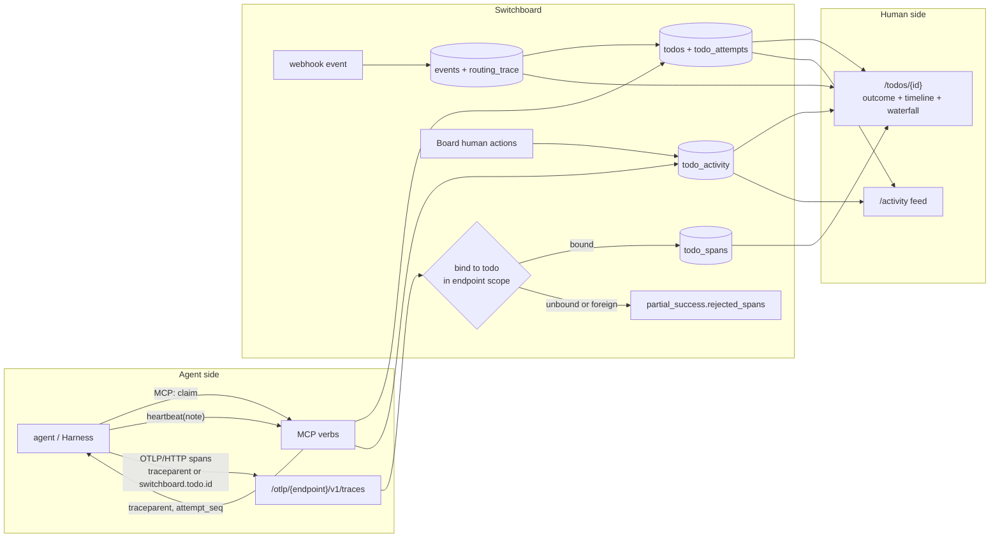

# ADR-0042: Agent Activity: OTLP Traces, Progress Notes, and a Todo-Centred Audit Trail

## Context and Problem Statement

A user reported that Switchboard has no UI for what agents actually did. They are right. Switchboard
records a lot and shows very little of it:

* **Attempts are stored but not shown.** `todo_attempts` (ADR-0039) holds who claimed each attempt,
  when, its heartbeats, and how it ended, with a summary and an artifact handle. The web UI renders
  none of it on `main`. PR #508 adds attempts to the Board drawer, and PR #511 lets agents fill in
  `summary`, `artifact` and `claimant` over MCP.
* **The source event is also stored but not shown.** `events` holds the verification detail, the
  sanitized headers, the disposition, and the `routing_trace` that says which rule sent the todo
  where. `todos.work_order` and `todos.result` sit next to it. The drawer shows the payload and
  four timestamps: received, created, claimed, completed.
* **Some things are never recorded at all.**
  * A human's actions on the Board: retry, extend, release, claim, complete, fail.
  * Doorbell rings. Only `last_ringed_at` and `ring_attempts` exist, and both are overwritten.
  * A2A state changes. Only the current `state` is kept.
  * Anything the agent did between claiming and reporting.
* **The richest source is still missing.** Agents already emit OpenTelemetry. Harness plans to
  export traces, and Cairn's [ADR-0015 / SPEC-0011](https://github.com/stump-wtf/cairn) specify an
  OTLP/HTTP receiver that turns spans into a viewable trace. Switchboard has no way to receive them,
  so "what the agent did" lives in a local log file or nowhere.
* **The todo detail is a drawer and nothing else.** `/todos/{id}` renders the same drawer inline.
  Nothing lets a human catch up on a morning's work across todos without opening each one.

The todo is the unit people reason about: "what happened to issue #12's work order?" The audit trail
should therefore be anchored on the todo.

**How should Switchboard collect what agents do, and show the owning human a complete, trustworthy
history of each todo and a way to catch up across todos, without new trust, unbounded growth, or
leaks across tenants?**

## Decision Drivers

* **The todo is the anchor.** Every recorded activity belongs to exactly one todo, and to one of its
  attempts when an attempt was open. There is no free-floating "agent log".
* **The queue stays the ledger** (ADR-0013). Activity is stored in the same database, scoped by the
  todo's owner scope. Where it records a transition, it is written in the same transaction as that
  transition.
* **Standard over bespoke for rich telemetry.** Agents should reach Switchboard with a stock OTLP
  exporter: an endpoint URL and an auth header. Cairn's July 2026 stress test found agents reaching
  for OTel on their own and garbling hand-translations, so translate once, on the server.
* **Cheap for everyone else.** An agent that does not run an exporter should still be able to say
  what it is doing, over a verb it already holds. Endpoints are frozen at their vend-time verb set
  (issue #163).
* **Tenant isolation is a hard rule** (ADR-0022, ADR-0038). An unknown id and a foreign id are
  indistinguishable everywhere, including in the OTLP response.
* **Text is data, and it may hold secrets.** Span attributes, notes and summaries are written by
  agents that read attacker-reachable input. Tool arguments and outputs are where credentials leak.
  Keep the risky fields off by default, and make keeping them an operator's choice.
* **Bounded.** There are caps per request, per attempt and per todo, and everything ages out with
  its todo under ADR-0002 retention.
* **Readable without JavaScript** (ADR-0018). The timeline and the trace waterfall are server
  rendered. htmx and SSE only add live updates.

## Considered Options

### How agents report activity

* **(A1) An OTLP/HTTP trace receiver, plus an optional `note` on `heartbeat`.** *(chosen)*
* **(A2) A bespoke `log_activity` MCP verb only.** Agents hand-write structured entries.
* **(A3) OTLP logs and metrics as well as traces.**
* **(A4) Store OTLP verbatim and render it generically.**

### What records the non-attempt history

* **(B1) A bounded `todo_activity` table** for what attempts and events do not already record.
  *(chosen)*
* **(B2) Derive everything from existing columns.** Show only what is stored today.
* **(B3) A generic transition log that replaces attempts.** ADR-0039 already rejected this as the
  attempt model.

### Where humans read it

* **(C1) A full todo page with a merged timeline, the drawer as a quick look, and an Activity feed
  across the human's todos.** *(chosen)*
* **(C2) Grow the drawer only.**
* **(C3) Send humans to Cairn for traces.**

## Decision Outcome

Chosen: **A1 + B1 + C1.**

> **The todo says where the work is. The attempts say how it got there. The trail says what was done
> along the way.**

### 1. OTLP/HTTP trace ingest

* **Route:** `POST /otlp/{endpoint}/v1/traces`. A stock exporter is configured with
  `OTEL_EXPORTER_OTLP_ENDPOINT=$SWITCHBOARD_URL/otlp/<endpoint-slug>` and
  `OTEL_EXPORTER_OTLP_HEADERS=Authorization=Bearer <credential>`.
* **Why the path names the endpoint:** OAuth access tokens here are not audience-bound. The only
  thing binding a token to an endpoint is the slug check that MCP (`internal/mcp/mcp.go`) and A2A
  (`internal/a2a/a2a.go`) already perform. The receiver reuses that same resolver: `sbk_` or OAuth
  bearer only, slug must match. A cookie is refused, never consulted.
* **Encodings:** `application/x-protobuf` and OTLP/JSON, both decoded with the upstream
  `go.opentelemetry.io/proto/otlp` types and `protojson`. `Content-Encoding: gzip` is accepted, with
  the size cap applied after decompression. gRPC, `/v1/logs` and `/v1/metrics` are out of scope,
  and so is any MCP tool for ingest. The same exclusions appear in Cairn's SPEC-0011.
* **Grant:** an endpoint may export if it holds `heartbeat`, meaning every drain endpoint. The
  export writes only to todos the endpoint can already read, so it adds no new power. This is the
  issue #163 argument that `get_todo` (ADR-0039) already made.
* **Binding a trace to a todo:** first match wins, keyed by `(todo_id, trace_id)` and never by
  `trace_id` alone.
  1. **Minted trace context.** Every claim response gains a W3C `traceparent` whose trace id
     Switchboard mints for that attempt and stores on it. A supervisor such as Harness passes it to
     the process it runs, and every span in that trace binds to that attempt.
  2. **Attributes.** A span or resource attribute `switchboard.todo.id`, optionally with
     `switchboard.attempt.seq`, binds the span's trace to that todo. Without a seq, each span goes
     to the attempt that was open at its start time, falling back to the latest attempt.
  3. **Nothing matches.** The span is not stored. It is counted in the response's
     `partial_success.rejected_spans`. A todo that does not exist and a todo outside the endpoint's
     scope produce byte-identical messages. The rejection is never a 4xx, because a 4xx on a mixed
     batch would make exporters retry the good spans forever.
* **Translation.** Spans are stored as rows, not as OTLP blobs:
  * **Kept:** trace id, span id, parent id, name, kind, status, start and end times, and a derived
    `category`. The category rules are Cairn's: an explicit attribute wins; else `gen_ai.operation`
    maps to `reason` or `tool`; else `http.*` or `rpc.*` gives `net`; `db.*` gives `read`; else the
    SpanKind.
  * **Named fields:** `gen_ai.tool.name` becomes `tool`, and the resource's `service.name` is kept.
  * **Allow-listed attributes:** the `gen_ai.*` model and usage fields, `code.*`, `process.exit.code`
    and `error.type`.
  * **Dropped:** everything else, plus span events, links and trace state.
* **Tool input and output are off by default.** Tool arguments and results (`gen_ai.tool.call.*`,
  `gen_ai.input.messages`, `gen_ai.output.messages`, `process.command_args`) are where credentials
  and private content leak. They are kept only when the operator sets
  `SWITCHBOARD_OTLP_KEEP_TOOL_IO=true`. That follows Joe's rule from 2026-09-22: risky options are
  fine when they are configurable and off by default. Even then they are truncated and masked by
  the credential-pattern masker in §5.
* **Idempotency.** An exporter retry re-sends the same spans, so a span is upserted on
  `(todo_id, trace_id, span_id)`.

### 2. Progress notes on `heartbeat`

* **`heartbeat` accepts an optional `note`** of at most 512 bytes, UTF-8 truncated and marked. Each
  accepted note becomes one activity entry on the open attempt ("running the test suite", "opened
  PR #12").
* **Why `heartbeat`:** every drain endpoint already holds it, so no endpoint has to be re-vended.
  It is also the call a working agent is already told to make on a cadence, so the note costs one
  extra field.
* **Fencing:** a note on a fenced attempt needs the lease token, as the heartbeat itself does
  (ADR-0039).
* **Bound:** at most 200 notes are kept per attempt. Once the cap is reached, the heartbeat still
  succeeds, the note is dropped, and a counter on the attempt records the drop.

### 3. `todo_activity`: what attempts and events do not already record

* **One append-only table** keyed to the todo, with an optional attempt seq. Each row holds a
  `kind`, an actor (`endpoint`, `human` or `system`) with a display reference, a bounded `message`,
  and a small bounded `detail` jsonb.
* **Kinds:**
  * `note`: from §2.
  * `human_action`: Board claim, complete, fail, retry, extend, release or cancel, with the acting
    human.
  * `rung`: a doorbell ring, with its transport and attempt count.
  * `a2a_state`: cancel, reject, input-required, auth-required or resume.
  * `retried`: a manual retry that reset the counter.
  * `reply_sent`: reserved for reply-to-source (ADR-0033) when it lands.
* **What it does not duplicate:** the event, the claim, and the attempt's end already have
  authoritative rows (`events`, `todo_attempts`). The timeline reads those directly.
* **Transactional writes:** an entry that records a transition is written in the same statement
  or transaction as that transition. This is a CTE arm, as ADR-0039 did for attempts. A best-effort
  entry such as a ring may be written after the fact, because losing one only costs detail.

### 4. Where humans read it

* **The todo page.** `/todos/{id}` becomes a full page. The drawer stays as the quick look and gains
  a "Full history" link. The page has:
  * **A header:** title, state, queue, source, owner, attempt N of max, and the next retry or the
    dead-letter state.
  * **An outcome card:** the latest closed attempt's outcome, summary and artifact, then `result`
    as escaped JSON. This is the "what happened" answer at the top.
  * **One merged timeline**, oldest first. It shows the event received, verified and routed (with
    the matching rule from `routing_trace`), the todo created, rings, each attempt as a section, the
    human actions, and the retries. Each attempt section shows its claim, its notes interleaved with
    time, its outcome (died attempts are marked, per ADR-0039), and its trace.
  * **A trace waterfall per attempt:** server-rendered bars sized by CSS custom properties, a
    category legend and a span table fallback. It needs no JS and follows the `'self'` CSP.
  * **The source event panel:** verification detail, sanitized headers, payload, disposition, the
    routing trace, and the work order.
  * **Live updates:** an SSE frame appends new timeline entries while the page is open, following
    the OOB swap contract from #286.
* **The Activity feed.** `/activity` is a reverse-chronological feed across the human's todos:
  * **What it lists:** attempts that ended (outcome and summary), notes, human actions and dead
    letters. Each entry links to its todo.
  * **Filters:** queue, endpoint and outcome.
  * **Catch-up marker:** a "since your last visit" marker comes from a per-human `activity_seen_at`.
  * **Nav:** it joins the rail between Board and Todos.
* **A2UI.** The existing `switchboard://todo/{id}/a2ui` detail gains the same outcome card and a
  compact timeline. It does not gain the waterfall.

### 5. Security and tenancy

* **Reads are scoped.** Every read goes through the todo's owner scope: `ownedByHuman` on the web
  and `endpoint_id` for agents, widened by ADR-0038 later. Spans and activity carry no scope of
  their own and are reachable only through their todo.
* **Foreign ids stay hidden.** A foreign todo id on `/todos/{id}` gets the same not-found response
  as an unknown one. The activity feed never names a todo the human cannot open.
* **The operator sees aggregates only**, never another user's trail. The aggregates are the
  ingest-accepted and rejected counters (ADR-0028).
* **Untrusted text renders inert.** Span names, attribute values, notes, summaries and
  `service.name` are rendered escaped and never as links, except that an https artifact URL becomes
  a link, as in ADR-0039. Switchboard never dereferences a URL found in a span.
* **Credential masking** is a small, dependency-free pattern pass over the kept attribute values
  and notes before they are stored. It covers `sbk_` tokens, bearer headers, and common vendor key
  prefixes (`ghp_`, `gho_`, `github_pat_`, `xox[abp]-`, `sk-`, `AKIA`), and replaces each match
  with `[REDACTED]`. It is a floor, not a guarantee. Producers such as Harness still redact before
  sending, and the docs say so.
* **The decoder faces hostile input.** Size-limit before buffering. The cap is 4 MiB decompressed by
  default, and a gzip bomb is cut off at that cap. A request carries at most 1000 spans. The
  decode path gets a fuzz test in CI. The route has its own rate limiter.

### 6. Bounds and retention

* **Caps.** Spans are capped per attempt (default 2000) and per todo (default 10 000). Notes are
  capped at 200 per attempt, and `todo_activity` at 1000 rows per todo. All of these are `settings`
  keys. When a cap is reached, further data is dropped and counted on the attempt or the todo,
  and the UI says "N spans not kept".
* **Retention.** Spans and activity are deleted with their todo (`ON DELETE CASCADE`), so ADR-0002's
  age and row caps on terminal todos bound them. A live todo's trail is never pruned.

### Consequences

* Good, because the owning human can open one page and see the whole story of a todo: where it came
  from, which rule routed it, who worked it, what they did step by step, how each attempt ended,
  and what a human changed.
* Good, because a stock OTLP exporter works unmodified, and Harness can bind a relay attempt's
  whole trace to the attempt with the `traceparent` it already receives on claim.
* Good, because agents without an exporter still leave a trail through `heartbeat` notes, with no
  re-vend.
* Good, because the Activity feed answers "what did the agents do while I was away?" in one place.
* Bad, because trace ingest is a new, hostile-input HTTP surface with a protobuf dependency. The
  mitigations are the size limit, the fuzz test, the rate limiter and the caps.
* Bad, because span storage is by far the largest write volume Switchboard has taken on. The caps
  and cascade retention bound it, but a busy instance will see real table growth. A metric reports
  it.
* Bad, because keeping tool input and output, when enabled, stores what agents saw and typed. The
  masker is a floor, not a guarantee.
* Neutral, because Cairn remains the place for long-form, shareable traces. An attempt's `artifact`
  may still point there. Switchboard's trail is private to the todo's owner scope.

### Confirmation

* A protobuf export and the equivalent OTLP/JSON export produce identical stored spans. A gzip body
  over the cap gets 413 without being fully inflated.
* A trace carrying the claim's `traceparent` trace id binds to that attempt. A span with
  `switchboard.todo.id` of another owner's todo is rejected with the same message as a random id,
  and nothing is stored.
* Re-sending the same batch stores no duplicates.
* By default, a span carrying `gen_ai.tool.call.arguments` is stored without it. With
  `SWITCHBOARD_OTLP_KEEP_TOOL_IO=true` it is kept, and a `ghp_…` token inside it is stored as
  `[REDACTED]`.
* `heartbeat(note)` on a fenced attempt without the token is `conflict`, and no note is stored.
* Human H2 requesting H1's `/todos/{id}` gets the same response as an unknown id, and `/activity`
  lists nothing of H1's.
* The todo page and its waterfall render fully with JavaScript disabled. `<script>` in a span name,
  note or summary renders as text.

## Pros and Cons of the Options

### (A1) OTLP traces plus heartbeat notes

* Good, because it covers both ends: a zero-code path for anything that already emits OTel, and a
  one-field path for anything that does not.
* Good, because it matches Cairn's ingest design, so one exporter configuration idiom works for
  both products.
* Bad, because it adds two surfaces to keep stable.

### (A2) A `log_activity` verb only

* Good, because it is simple and needs no new HTTP surface.
* Bad, because an agent has to decide to call it, and hand-written structure is exactly what Cairn
  saw agents garble.
* Bad, because it is a new verb, and existing endpoints would need re-vending to get it.

### (A3) Logs and metrics too

* Good, because some agent CLIs emit their richest events as OTLP logs rather than spans.
* Bad, because it triples the decode surface and the storage model before we know which signals
  people read. Deferred: revisit once traces are in use, and add `/v1/logs` under the same binding
  rules if needed.

### (A4) Store OTLP verbatim

* Good, because nothing is lost.
* Bad, because the viewer then has to translate on every read. Storing everything also keeps every
  secret an agent ever saw, and there is no sane cap.

### (B2) Derive from existing columns only

* Good, because it needs no migration.
* Bad, because human actions, rings and A2A transitions are simply not recorded, so the trail would
  have holes exactly where a reviewer asks "who did that?"

### (B3) A generic transition log replacing attempts

* Bad, for the reasons ADR-0039 gives. This ADR adds a complementary log for what attempts do not
  model, which ADR-0039's option (C) anticipated.

### (C2) Grow the drawer only

* Bad, because a drawer cannot hold a waterfall, an event panel and a long timeline, and it cannot
  be linked or shared within a team.

### (C3) Send humans to Cairn

* Bad, because it splits the story across two products and two tenancy models, and it only works
  for agents that already share to Cairn.

## Architecture Diagram

## More Information

* **Extends [ADR-0039](ADR-0039-attempt-history-on-todos.md).**
  * Claim responses gain `traceparent`, and attempts gain a `trace_id` and a dropped-span counter.
  * `heartbeat` gains `note`.
  * The ADR's option (C) note, "an audit log may still be wanted later", is what `todo_activity`
    delivers, as a complement.
* **Extends [ADR-0007](ADR-0007-todos-as-core-primitive.md).** The lifecycle is unchanged. The todo
  gains a trail.
* **Extends [ADR-0018](ADR-0018-charm-web-design-language.md).** It adds the todo page, the timeline,
  the waterfall and the Activity feed in the charm-web language.
* **Related:**
  * [ADR-0024](ADR-0024-event-routing-deterministic-and-llm.md): `routing_trace` is shown on the
    timeline.
  * [ADR-0025](ADR-0025-handoff-work-orders-and-difficulty-lanes.md): the work order is shown.
  * [ADR-0028](ADR-0028-prometheus-metrics-endpoint.md): ingest counters.
  * [ADR-0033](ADR-0033-reply-to-source.md): `reply_sent` entries.
  * [ADR-0038](ADR-0038-teams-and-tenancy.md): scope widens to teams automatically.
* **Cross-product, cited in prose:**
  * Cairn ADR-0015 / SPEC-0011 (OTLP trace ingest): the route shape, encodings, category rules and
    rejected options.
  * Cairn ADR-0023 (redaction at ingest): Cairn masks with gitleaks rules. Switchboard takes a
    smaller pattern floor, because it keeps far less text by default.
  * Harness: the first exporter. It passes the claim's `traceparent` to the process it runs.
* Implemented by [SPEC-0036](../openspec/specs/agent-activity/spec.md).
