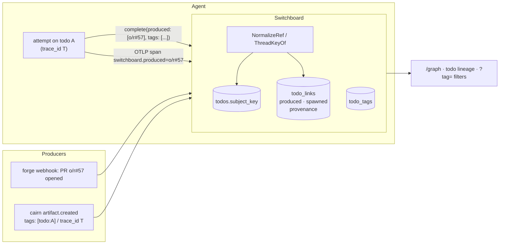

# ADR-0043: Todo Lineage, Subject Threads and Tags — Structural Links Between What Agents Did and What It Caused

## Context and Problem Statement

[ADR-0042](ADR-0042-agent-activity-and-todo-audit-trail.md) shows what happened *inside* one todo. A self-hosting user built the next view on their own. It is an operator graph over `/todos`:

* **Nodes and groups:** each node is a todo, grouped by what the todos are about. That means `repo#57` for a pull request, `repo@master` for a branch's workflow runs, and `repo#52` for an issue.
* **Edges** show which agent worked what, and "todo A's work produced todo B".

They filed the gaps they hit as two public intake issues:

* **stump-wtf/switchboard#28: no structural link between a todo and the todo or attempt that caused it.**
  * The only way to draw "A's work produced B" is to string-match `todo_attempts.artifact` (freeform, optional) against a later todo's `work_order.subject`.
  * That match is often missing: no artifact was reported, or the handles have different shapes (a Cairn share URL versus `mcp://cairn/<id>`).
  * It has no index to search on.
  * When a match looks right by coincidence, nothing tells it apart from a real link. So the graph could only draw that edge as a labelled guess.
* **stump-wtf/cairn#3: an artifact cannot reference the artifact it was produced from or replies to.** This is the same gap one layer down. The `artifact.created` webhook carries `tags`, but no relation.

Switchboard's view of "what a delivery is about" is also narrow. `routing.Subject` (ADR-0025) recognizes forge **issues** and Cairn artifacts only, because it exists to mint work orders. Pull requests, comments, reviews, workflow runs and pushes have no subject. So even the user's "shared origin" grouping has to be rebuilt from raw payloads.

Joe's direction (2026-09-27): trace events end to end, visually track what the agents are doing and how they are communicating, and carry **tags** as metadata along the way.

**How should Switchboard record which todos belong together, which todo's work caused which other todo, and free-form metadata about each, structurally and with honest provenance, so a graph can draw facts instead of guesses?**

## Decision Drivers

* **Facts over guesses.** Every edge the UI draws must come from a recorded statement, and must say *who* made it: an authenticated agent, a human, a verified producer, or a matching trace id. Switchboard never infers a causal edge from matching strings.
* **No new trust.**
  * A link can be recorded only by someone who could already write to the todos involved.
  * A link is resolved only inside the reader's scope.
  * A link can never reveal that a todo outside that scope exists. This is ADR-0022's no-oracle rule.
* **Normalize, don't compare.** `mcp://cairn/abc`, `https://cairn.stump.wtf/a/abc`, `gitea:o/r#57` and `https://gitea…/o/r/pulls/57` must reduce to one canonical key, so that the shape of a handle cannot break a link.
* **Additive and optional.** Endpoints are frozen at their vend-time verb set (issue #163). So new capability arrives only as optional arguments on verbs agents already hold, as ADR-0039 and ADR-0042 did.
* **Tags are cheap and uniform.** The tag grammar is the one Cairn already uses (`[a-z0-9._:/#-]`, 1–64 bytes). A tag moving between products means the same thing in both.
* **Bounded.** Caps apply per todo, and everything is deleted with its todo.

## Considered Options

* **(A) Subject threads + a `todo_links` table with provenance + tags.** *(chosen)*
* **(B) An optional `caused_by_todo_id` on `complete`.** This is the direction #28 proposed.
* **(C) Infer links by matching `artifact` against later subjects.** This is what the user's graph had to do.
* **(D) Declare cross-todo causality out of scope and document it.** The other direction #28 offered.
* **(E) Links as tags only**, for example a `caused-by:td_x` tag, with no link table.

## Decision Outcome

Chosen: **(A)**.

> **A subject says what a todo is about. A link says what caused it, and who says so. A tag says whatever else a person or agent wants to remember.**

### 1. Subject threads

**Every todo gets a `subject_key`, derived when it is minted.** A new, broad projection in `internal/routing` (`ThreadKeyOf`) computes it. This projection is separate from `SubjectOf`, which keeps its work-order meaning unchanged. Keys are canonical, lowercase for provider and repo, and never contain payload free text:

| Delivery | Key |
| --- | --- |
| Forge issue, pull request, issue/PR comment, review, review comment | `<provider>:<owner>/<repo>#<number>` (issues and PRs share a number space on both forges) |
| Push, workflow run, check run/suite, branch create/delete | `<provider>:<owner>/<repo>@<ref>` (branch or tag name, `refs/heads/` stripped) |
| Release | `<provider>:<owner>/<repo>@<tag>` |
| Cairn artifact | `cairn:<artifact id>` |
| Anything else | none (null) |

**A thread is the set of todos in one owner scope that share a key.** It is a query, not a table.

**The graph groups by thread.** The todo page lists the other todos in its thread.

### 2. Links: a small table, written only by an authenticated statement

`todo_links` records two kinds of edge. Both are stored cause → effect:

* **`produced`: "my work on this todo produced subject K."**
  * It is stored against the producing todo and attempt, with the *subject key* `K` as its target, not a todo id.
  * At read time it resolves to the todos in the reader's scope whose `subject_key` is `K` and that were created after the attempt was claimed.
  * **Why the target is a key:** the follow-on webhook can arrive before the agent reports, and one PR yields many todos (opened, closed, commented). Storing the key needs no race handling and no fan-out writes.
* **`spawned`: "this todo was caused by todo C."**
  * It is stored with both todo ids, and written when the effect todo is created or while it is claimed.
  * The cause must be in the writer's owner scope. A cause that is unknown or foreign is ignored, with the same result either way.

Every link carries a **provenance** from a closed set. The UI renders it on every edge:

| Provenance | Written by | How |
| --- | --- | --- |
| `declared` | An authenticated endpoint | `produced: [...]` on `heartbeat`/`complete`/`fail`/`release`. Also an attempt `artifact` that normalizes to a subject key, and the `switchboard.produced` span attribute (ADR-0042). |
| `api` | A signed-in human, or the operator API | `caused_by` on `POST /api/v1/endpoints/{ref}/todos` (ADR-0026) or on the Board |
| `tagged` | A verified producer delivery | A `todo:<id>` tag on a Cairn artifact whose delivery verified, and whose actor the webhook's trusted-actor rules admit (ADR-0031) |
| `trace` | A verified producer delivery | A W3C trace id on the delivery (Cairn `artifact.created` once it carries one; see §5) equal to an attempt's minted `trace_id` (ADR-0042) |

There is deliberately **no `inferred` provenance**. Switchboard does not string-match freeform text into edges; that is option (C). Anyone who wants a fuzzy view can build one outside Switchboard and label it there.

**Normalization.** One pure function, `routing.NormalizeRef(s) (key string, ok bool)`, maps each of these to a thread key:

* `mcp://cairn/<id>` and Cairn share URLs on the configured Cairn origin;
* forge web URLs for issues, PRs and branches;
* already-canonical keys.

That one function serves the `produced` argument, the `artifact` field and span attributes, so a Cairn share URL and its `mcp://` handle can no longer disagree. A URL on an unknown host normalizes to nothing and records nothing. It is never fetched.

### 3. Tags

**Todos carry tags:** at most 32 per todo, using Cairn's grammar. Each tag records its **origin** (`rule`, `agent`, `human` or `producer`) and who added it.

**Where tags come from:**

* **A routing rule's action** gains `tags: [...]`: literal tags added to every todo the rule mints (ADR-0024).
* **Agents** pass `tags: [...]` on `claim`, `heartbeat`, `complete`, `fail` and `release`. These are additive, and an agent removes a tag with a leading `-`.
* **Humans** add and remove tags on the todo page.
* **Producers:**
  * A Cairn artifact's own tags are copied onto the todo it mints, with origin `producer`. Cairn validates the same grammar.
  * Forge labels are *not* copied. They stay in the payload and the work order, because a label is a routing signal with its own meaning (the lane router), not metadata.

**Reserved prefixes Switchboard interprets:**

* `todo:<id>` on a producer delivery becomes a `tagged` link (§2).
* `trace:<32 hex>` on a producer delivery is treated as a trace id, for producers that cannot send a field.

Every other tag is opaque. **Tags are data**, like attempt summaries: they are rendered escaped, never as instructions, and never as authority. The lane router's `lane:`/`size:` tags on Cairn handoffs keep their existing meaning, because routing reads the delivery, not the todo's tags.

Tags filter `/todos`, `/activity` and the graph (`?tag=`), and are returned by `claim`, `claim_next` and `get_todo`.

### 4. The graph view

`/graph` is the view the user mocked up, built into the Board:

* **Groups:** one card per thread, holding its todos in creation order. Each todo card shows its id, title, state, claimant chip and tags. Todos with no key sit in an "Unthreaded" group.
* **Edges:**
  * `produced` and `spawned` links are drawn as arrows. The line style distinguishes provenance: solid for `declared`/`api`/`trace`, dashed for `tagged`. Every arrow carries an accessible label.
  * "Worked by" is shown as a claimant chip, not an edge.
* **Scope and filters:** only the signed-in human's todos appear. Filters are time window (default 24 h), queue, endpoint, tag and state. There is a cap of 300 todos, and the page says when it truncates.
* **Rendering:** the page is server-rendered HTML. The groups are a CSS grid, and each card lists its links as text ("produced → sublayer#57 (declared by ci-fixer)"), which is the no-JS view. A small vendored script (`static/js/sb-graph.js`, under the `'self'` CSP) reads those `data-sb-edge-*` attributes and draws an SVG overlay of curves, redrawing on resize.
* **Lineage on the todo page:** ADR-0042's todo page gains a section with the upstream chain (up to 10 hops), the downstream todos, and the rest of the thread, each with its provenance.

### 5. Across products

* **Cairn.** The companion Cairn change (stump-wtf/cairn#3, tracked on Cairn's canonical tracker) adds two things:
  * an artifact relation (`in_reply_to` / `derived_from`), surfaced on read and in `artifact.created`;
  * an optional `traceparent` on `artifact_create`, whose trace id is echoed in `artifact.created`.
  With these, an artifact made during an attempt links back to that attempt with provenance `trace`, and an artifact's relation becomes a `spawned` link between the two artifacts' threads. Until Cairn ships them, the `todo:<id>` tag already works, because `artifact.created` carries `tags` today.
* **Forges.** A forge webhook carries neither a trace id nor our tags. The link from "agent opened PR #57" to the PR's todos is the agent's `produced` declaration. `NormalizeRef` accepts the PR URL the agent already has.
* **A2A.** A task a friend delegates (ADR-0021) comes from another owner's scope. It must never name a todo there, so it is shown as "delegated by persona P", not as a link. Linking across owners is out of scope.

### 6. Security and tenancy

* **Writes are scoped.** A `spawned` cause and a `tagged` target must be in the writer's owner scope. Otherwise the statement is dropped, and the result is identical for a foreign id and an unknown one. `produced` stores only a key, and keys are not secrets.
* **Reads are scoped.** Links resolve only to todos in the reader's scope: the owning human on the web, the endpoint over MCP, widened by teams in ADR-0038. A `produced` key that matches a todo outside the scope shows nothing.
* **Provenance is always visible.** A human can tell the difference between "the agent said so" and "a Cairn artifact was tagged so".
* **Caps:** at most 32 tags per todo, 64 `produced` links per attempt, and 64 `spawned` links per todo. Excess entries are dropped and counted.
* **Retention:** everything cascades with its todo. A `produced` link whose producer has been deleted simply stops drawing.

### Consequences

* Good, because #28's edge becomes a fact with an author, not a guess. The user's graph can draw it solid.
* Good, because threads come from a projection that also covers PRs, comments and workflow runs. That gives grouping for every todo, not just work orders.
* Good, because one normalizer ends handle-shape mismatches everywhere.
* Good, because tags give people and agents a place for metadata without schema changes. Tags filter every list.
* Bad, because the drain verbs gain two more optional arguments, which is more contract to keep stable.
* Bad, because a `produced` link resolves at read time. The graph query joins links to todos by key, so it needs an index on `todos(subject_key)`. This is measured before shipping.
* Bad, because an agent can over-declare `produced`. That is visible, labelled with the endpoint, and bounded to its own human's scope, but it is not preventable.
* Neutral, because the SVG overlay is the first Board script that computes layout. Its fallback is the textual link list, so the page stays usable without it.

### Confirmation

* An agent completes todo A with `produced: ["https://gitea…/o/r/pulls/57"]`. A later `pull_request` webhook for `o/r#57` mints todo B. B's lineage shows A with provenance `declared`, and so does the graph. The reverse order works the same way: B exists first, and A declares after.
* An attempt artifact of `https://cairn.stump.wtf/a/abc` and a later Cairn delivery for `mcp://cairn/abc` link, because both normalize to `cairn:abc`.
* Human H2's todo whose key equals the key H1's agent declared shows no link in H1's views, and H2's views show no link either.
* `caused_by` naming a foreign todo produces the same API response as an unknown id, and records nothing.
* A tag outside the grammar is rejected on the Board and dropped with a count over MCP. `<b>` in a Cairn tag cannot occur, because the grammar excludes it.
* `/graph` with JavaScript disabled shows the groups and the textual links. With JavaScript it draws curves between the same pairs.

## Pros and Cons of the Options

### (A) Subject threads, a `todo_links` table with provenance, and tags

* Good, because it covers every edge the mockup draws, and each one is structural.
* Bad, because it is three concepts (threads, links, tags) to explain rather than one field.

### (B) `caused_by_todo_id` on `complete`

* Good, because it is the smallest change.
* Bad, because at `complete` time the agent almost never knows the follow-on todo's id: the forge webhook for the PR it just opened is minted afterwards, on a different endpoint. What the agent knows is the *subject* it produced, and that is what `produced` records.

### (C) Infer by string matching

* Bad, for exactly the reasons #28 gives: the match is missing, has the wrong shape, is unindexed, and coincidences are indistinguishable from real links. Normalizing makes matches *exact*. It does not make an undeclared relation true.

### (D) Out of scope

* Good, because it is honest and costs nothing.
* Bad, because tracking how agents' work flows between each other is the point of the request. Every consumer would rebuild a worse version of (C).

### (E) Links as tags only

* Good, because it adds no table.
* Bad, because a tag has no direction, no attempt, no provenance beyond its origin, and no index shaped for "what did this cause". The reserved `todo:` tag stays as an *input* that becomes a link. It is not the storage.

## Architecture Diagram

## More Information

* **Extends [ADR-0042](ADR-0042-agent-activity-and-todo-audit-trail.md):** the todo page gains lineage, and the Activity feed and graph gain tag filters.
* **Extends [ADR-0025](ADR-0025-handoff-work-orders-and-difficulty-lanes.md):** a broader thread projection sits beside `SubjectOf`, which keeps its work-order semantics. Rule actions gain `tags`.
* **Extends [ADR-0039](ADR-0039-attempt-history-on-todos.md):** an attempt's `artifact` is normalized, and when it normalizes it counts as a `produced` declaration.
* **Related:**
  * [ADR-0024](ADR-0024-event-routing-deterministic-and-llm.md): rule actions.
  * [ADR-0026](ADR-0026-operator-authored-todos.md): `caused_by` on the operator API.
  * [ADR-0021](ADR-0021-a2a-task-delegation-transport.md): delegation is shown, not linked.
  * [ADR-0038](ADR-0038-teams-and-tenancy.md): scope widens.
* **Reported by** a self-hosting user in stump-wtf/switchboard#28 and stump-wtf/cairn#3, with a graph mockup. Both are public intake, triaged onto the canonical trackers.
* Implemented by [SPEC-0037](../openspec/specs/todo-lineage/spec.md).
