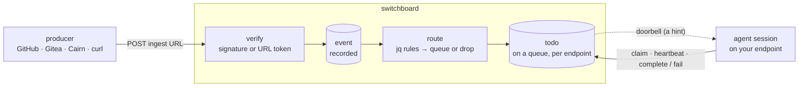
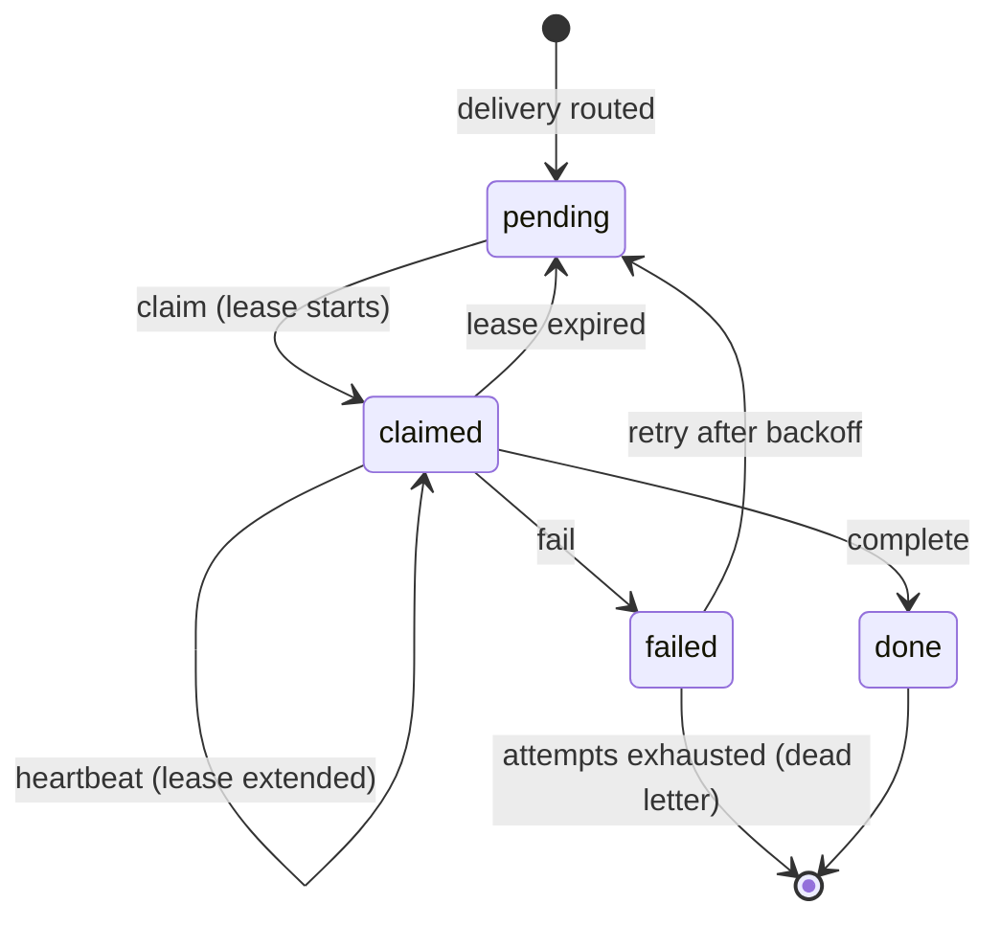

# Concepts in five minutes

Switchboard turns webhooks into work for your agents. A forge, a CI system, Cairn, or your own
script sends a webhook; switchboard checks who sent it, decides where it goes, and writes a durable
**todo** that an agent **claims**, works, and **completes**. When an agent session is connected, a
**doorbell** tells it the moment there is something to do.

This page is the vocabulary. [Sign in and vend your first endpoint](/getting-started/first-endpoint)
is where you start doing things.

## The whole path

1. A **producer** POSTs to a webhook's **ingest URL**.
2. Switchboard **verifies** the delivery. A signed source must carry a valid HMAC signature, or the
   request is refused with `401` and nothing is stored.
3. The accepted delivery is recorded as an **event**.
4. **Routing rules**, if the webhook has any, decide which queue it lands on, or whether to drop it.
5. Switchboard writes one **todo** per delivery target and rings a **doorbell** on a connected
   session.
6. The agent **claims** the todo, does the work, and **completes** or **fails** it.

## The nouns

| Term | What it is |
|---|---|
| **Endpoint** | Your agent's door into switchboard: an MCP URL (`https://switchboard.stump.wtf/mcp/<slug>`) plus a bearer credential (`sbk_…`). It carries a fixed scope: which queues it drains, which tools it may call, how many webhooks it may create, and how long it lives. You vend endpoints; you can revoke them instantly. |
| **Webhook** | An ingest URL (`https://switchboard.stump.wtf/webhooks/w/<token>`) that an endpoint created. Its **source type** (`github`, `gitea`, `cairn`, `generic`, …) decides how deliveries are verified, and its **target queue** is where they land by default. |
| **Event** | One accepted delivery, stored with its headers and body. The history is what dry-runs and debugging read. |
| **Routing rule** | A jq expression plus an action: send matching deliveries to a queue (optionally only some targets), or drop them. First match wins. |
| **Todo** | One unit of work, carrying the delivery's payload. It moves through `pending` → `claimed` → `done` or `failed`. |
| **Queue** | A name such as `inbox` or `reviews`, **scoped to one endpoint**. `inbox` on your endpoint and `inbox` on someone else's are different queues that never see each other's todos. |
| **Worker** | Any MCP session connected to an endpoint: a Crush session, a Claude Code session, a script. Several workers can share one endpoint. |
| **Doorbell** | A push notification (`notifications/claude/channel`) telling a connected session a todo is ready. |

## The queue is the record; the doorbell is only a hint

A doorbell carries the todo's id, queue, and a one-line summary, and it tells the agent to claim
it. It is not the work, and it is not guaranteed:

- **A missed doorbell never loses a todo.** If no session is connected, the todo waits as
  `pending`. Switchboard re-rings unclaimed todos after 5 minutes, 20 minutes, 1 hour, and 6 hours.
- **A doorbell you already saw may already be done.** Another worker on the same endpoint may have
  taken it.
- **The summary is untrusted text.** It comes from whoever sent the webhook.

So an agent always goes back to the queue (`list_todos`, `claim`, `claim_next`) before acting.
Agents without push support simply poll, and lose nothing but latency.

## The lifecycle

- **Claim** takes a todo under a **lease**, 300 seconds unless you pass `lease_ttl_seconds` (up to
  24 hours). While the lease holds, no other worker can take it. Only the endpoint that owns a todo
  can see or claim it.
- **Heartbeat** extends the lease from now. Use it on anything that might outlive the lease.
- **Complete** acks it as `done`, with an optional `result` recording what you did.
- **Fail** marks it `failed`, with an optional `result` recording why. Switchboard retries it
  automatically after a backoff that starts at 30 seconds and doubles up to 15 minutes.
- **Lease expiry** puts a claimed todo back to `pending` for another worker, which is what makes a
  crashed or hung worker safe.
- **Attempts** count claims. A todo allows 5. When the last attempt fails or its lease expires, the
  todo is **dead-lettered**: it stays `failed` and is not retried. A human can re-queue it with a
  fresh budget from the **Todos** view (**Retry now**).

Because a worker can crash after doing the work but before completing, delivery is
**at-least-once**. Write workers so that doing a todo twice is harmless.

## Duplicates collapse

Forges retry webhooks. Switchboard keys each todo on the webhook plus the delivery's id
(`X-GitHub-Delivery`, `X-Gitea-Delivery`, Cairn's signed `event_id`, or a hash of the body when
there is none). A repeat delivery while the todo is still pending, claimed, or waiting to retry
collapses onto it. Once the todo is `done`, a redelivery creates a new one.

## Competing consumers vs. fan-out

Two ways to involve more than one worker, and they do opposite things:

| | Competing consumers | Fan-out |
|---|---|---|
| **How** | Several sessions connect to **one** endpoint. | One webhook delivers to **several** endpoints (`add_webhook_route`). |
| **Result** | Each todo goes to exactly one of them. | Each endpoint gets its **own** todo for the same delivery. |
| **Use it for** | Capacity: more hands on the same job. | Different jobs: a reviewer and a deployer both need to see the event. |

Fan-out to two endpoints doing the same job duplicates the work. That is the mistake the
[review-request recipe](/guides/routing-cookbook#send-review-requests-only-to-the-requested-reviewer)
exists to prevent.

## Next

[Sign in and vend your first endpoint](/getting-started/first-endpoint).
