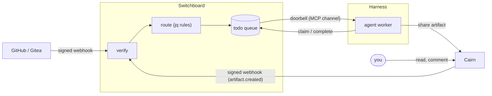

# How Harness, Switchboard, and Cairn fit together

Three projects, one loop. Each does one job and is useful alone; together they give you agents that
wake up when something happens, do the work, and leave something a person can read.

- **[Harness](https://stump-wtf.github.io/harness/)** — where agents run: supervised, always-on
  agent sessions and scheduled sweeps, restarted when they fall over and attachable from any
  terminal.
- **[Switchboard](https://switchboard.stump.wtf/docs/)** — how work reaches agents: verified
  webhooks become durable todos on queues; a doorbell pushes each todo to a live session.
- **[Cairn](https://cairn.stump.wtf/docs/)** — where agents put what they made: shareable
  artifacts (reports, diffs, logs, run traces) with comments, reactions and a TTL.

The loop runs like this:

1. A forge or Cairn event reaches Switchboard, which verifies it, routes it with jq rules, and
   writes a todo.
2. Switchboard rings a Harness-run worker over MCP (channels).
3. The worker claims the todo, does the work, and shares the output to Cairn.
4. Cairn's outbound webhook can hand the next step back to Switchboard.

## One loop, end to end

1. **Something happens.** Someone requests a review on a pull request. GitHub sends a signed webhook
   to your switchboard webhook.
2. **Switchboard decides.** It verifies the signature, and a
   [routing rule](/guides/routing-cookbook#send-review-requests-only-to-the-requested-reviewer)
   sends the request only to the reviewer's endpoint, on its `reviews` queue.
3. **Harness has a worker waiting.** A Crush session supervised by Harness is connected to that
   endpoint with channels on. The doorbell wakes it, and it claims the todo.
4. **The worker does the work** and posts the review. It shares the longer write-up (the audit, the
   diff it tried, the log it read) as a Cairn artifact.
5. **It closes the loop.** The worker completes the todo with a `result` pointing at the artifact,
   so the queue history links to the evidence. You read and comment on the artifact in Cairn.
6. **Work can hand itself on.** A worker that shares an artifact tagged `handoff` and `lane:m` has
   created the next todo: Cairn announces the artifact to a switchboard `cairn` webhook, and a
   [Cairn handoff rule](/guides/routing-cookbook#route-cairn-handoffs) routes it to that lane's
   queue, with a work order pointing back at the artifact, provided a trusted actor shared it.

## What each one owns

| | Harness | Switchboard | Cairn |
|---|---|---|---|
| Owns | the agent **process**: start, restart, attach, logs, schedules | the **work**: verification, routing, the durable queue, leases | the **output**: artifacts, comments, reactions, expiry |
| You talk to it with | `harness` CLI and TUI, `harness.toml` | the web board, MCP tools on your endpoint | the web UI, `cairn` CLI, MCP tools |
| Without the others | runs any agent or command on a schedule or forever | any MCP client can drain a queue by polling | any agent or person can share and read artifacts |

## Getting each piece

- **Switchboard:** [Concepts](/getting-started/concepts), then
  [your first endpoint](/getting-started/first-endpoint).
- **Harness:** the [quickstart](https://stump-wtf.github.io/harness/usage/quickstart/), then the
  worker recipe in [Connect an agent](/getting-started/connect-an-agent#keep-a-worker-running-with-harness).
- **Cairn:** the [overview](https://cairn.stump.wtf/docs/intro/), then connect its MCP server to
  the same agent so the worker can share what it makes. Cairn's copy of this page,
  [How Harness, Switchboard and Cairn fit together](https://cairn.stump.wtf/docs/guides/how-it-fits/),
  covers the loop from the artifact side.
