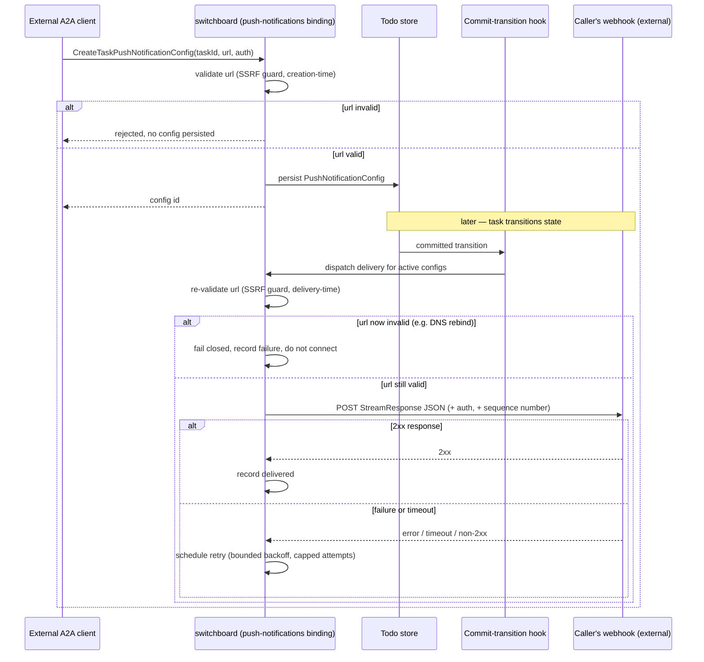

# Design: A2A Push Notification Webhooks

## Context

[ADR-0021](../../../adrs/ADR-0021-a2a-task-delegation-transport.md) calls out `PushNotificationConfig` as
a genuinely new external attack surface: switchboard, on a task state transition, makes an *outbound* HTTP
request to a URL the caller supplied at registration time. That is a textbook SSRF shape — a server
making requests to attacker-influenceable destinations — layered on top of a delivery-reliability problem
(webhooks fail, need retry, need bounded backoff, need dedup) that switchboard has not had to solve before.
[SPEC-0011](../channels/spec.md)'s existing "Channels" push mechanism does not help here: it is an
internal, best-effort MCP notification to an already-connected session, with no external HTTP call and no
caller-supplied destination — a completely different risk profile.

This capability is split out from [SPEC-0018](../a2a-tasks/spec.md) specifically so the security
requirements (SSRF guard, redirect handling, rate limiting on both registration and delivery) get the same
first-class spec treatment SPEC-0010's friending capability gave provenance verification, rather than
being a paragraph buried in the task RPC spec.

## Goals / Non-Goals

### Goals

- Implement the four `PushNotificationConfig` CRUD operations, authorized identically to the task they
  reference.
- Deliver task-transition events to registered webhooks with authenticated, retried, at-least-once
  semantics and receiver-detectable deduplication.
- Guard against SSRF via both creation-time and delivery-time URL validation, including DNS-rebinding
  defense.
- Bound the blast radius of a misbehaving or malicious webhook target (timeouts, no automatic redirect
  following, per-destination rate limiting) so it cannot degrade switchboard for other callers.

### Non-Goals

- The task RPC surface itself (`SendMessage`, `GetTask`, streaming) — [SPEC-0018](../a2a-tasks/spec.md).
- Changing Channels' internal doorbell mechanism — [SPEC-0011](../channels/spec.md) is untouched by this
  spec; the two mechanisms coexist.
- A general-purpose outbound-webhook framework for non-A2A use cases — this spec is scoped to A2A task
  push notifications specifically.

## Decisions

### Delivery triggers off the same commit hook as everything else

**Choice**: `PushNotificationConfig` delivery subscribes to `store.SetTodoDoorbellHook`, the same hook
Channels and SPEC-0018's streaming already use.
**Rationale**: One source of truth for "a todo transitioned." Introducing a second event-detection path
for push notifications specifically would be a place for delivery guarantees to silently diverge from
what streaming/doorbell subscribers see.
**Alternatives considered**:
- A separate polling loop scanning for transitioned todos: simpler to isolate, but duplicates
  transition-detection logic and could observe transitions at a different latency than the hook-based
  path. Rejected.

### SSRF guard validates at both creation and delivery time

**Choice**: Validate the target URL's resolved address at `CreateTaskPushNotificationConfig` time (fail
fast, good error message) *and* re-validate immediately before each delivery attempt (defend against
DNS-rebinding — the target could re-resolve to a private address after passing the initial check).
**Rationale**: Creation-time-only validation is a well-known bypass: register a URL that resolves
correctly, wait for validation to pass, then change DNS to point at an internal address before the actual
delivery fires. Re-validating at delivery time closes that gap at the cost of one extra DNS resolution per
attempt.
**Alternatives considered**:
- Creation-time validation only: simpler, but leaves the DNS-rebinding gap open. Rejected.
- Pin the resolved IP at creation time and only ever connect to that IP: closes rebinding but breaks
  legitimate target infrastructure that rotates IPs (e.g., behind a load balancer or CDN) without a DNS
  change. Rejected in favor of re-validate-at-delivery, which tolerates legitimate IP rotation but still
  blocks a rebind to a disallowed range.

### At-least-once delivery with a sequence number, not exactly-once

**Choice**: Retries can produce duplicate deliveries; every delivery carries a monotonic per-task sequence
number so receivers can detect and discard duplicates themselves.
**Rationale**: Exactly-once delivery over HTTP requires a distributed transaction or an idempotency
handshake switchboard does not control on the receiver's side. At-least-once + a sequence number is the
same posture A2A's own spec describes ("no guaranteed delivery; client must handle retries/timeouts") and
is honest about what switchboard can actually guarantee.
**Alternatives considered**:
- Best-effort, at-most-once (fire once, never retry): simpler, but silently drops events on any transient
  failure — unacceptable for a mechanism whose entire purpose is reliable async notification. Rejected.

### No automatic redirect following on delivery

**Choice**: A 3xx response from a webhook target is treated as a delivery failure, not followed.
**Rationale**: Following a redirect would mean connecting to a URL that never went through the SSRF-guard
validation applied to the registered `url` — a straightforward bypass if left unguarded.
**Alternatives considered**:
- Follow redirects but re-validate the redirect target: adds meaningful complexity (recursive validation,
  redirect-loop bounds) for a use case (webhook receivers that redirect) that is unusual enough to not be
  worth the added attack surface. Rejected; a receiver that wants to move its webhook URL can register a
  new config instead.

## Architecture

## Risks / Trade-offs

- **SSRF is the dominant risk this spec exists to manage.** Mitigation: dual creation+delivery-time
  validation, no automatic redirect following, explicit denial of loopback/link-local/private ranges and
  switchboard's own listening address(es).
- **Webhook receivers are third-party infrastructure switchboard doesn't control.** A slow, flaky, or
  malicious receiver could otherwise degrade switchboard. Mitigation: per-attempt timeout, bounded retry
  cap, per-destination-host rate limiting, and async/non-blocking delivery so one slow receiver cannot
  stall others.
- **At-least-once delivery pushes dedup work onto receivers.** This is explicit and documented (matching
  A2A's own stated posture) rather than a silent gap, but it does mean poorly-implemented receiver clients
  could double-process events. Mitigation: the sequence number is present specifically so receivers *can*
  dedupe correctly if they choose to.
- **Registered webhook configs are themselves sensitive data** (URLs, tokens, auth descriptors). Mitigation:
  configs are only readable/deletable by the vended endpoint that created them, per the CRUD auth
  requirement.

## Migration Plan

1. Add a `push_notification_configs` table (`id`, `task_id` / todo id, `url`, `token`, `authentication`
   descriptor, `created_at`).
2. Implement the SSRF-guard URL validator (shared helper, used at both creation and delivery time).
3. Implement the four CRUD handlers, reusing SPEC-0018's vended-endpoint auth check.
4. Subscribe a delivery dispatcher to `store.SetTodoDoorbellHook`, alongside the existing Channels and
   SPEC-0018 streaming subscribers.
5. Implement the retry/backoff/timeout/sequence-number delivery logic as an async worker pool, distinct
   from the request-handling goroutine so a slow webhook cannot block the transition commit path.
6. Flip `capabilities.pushNotifications` to `true` in `internal/web/agentcard.go` once delivery is
   operational and tested end-to-end — not before.

## Open Questions

- **Exact retry backoff schedule and attempt cap.** Not fixed by this design; needs an operational
  starting point (e.g., something in the spirit of ADR-0007's existing todo retry backoff: 30s base,
  doubling, capped) plus room to tune per deployment.
- **Per-destination-host rate limit parameters.** Not yet fixed.
- **Config lifecycle on task terminal state.** Whether a `PushNotificationConfig` is auto-deleted once its
  task reaches a terminal state, or persists until explicitly deleted, is unresolved — auto-delete is
  tidier but could surprise a caller that wants a final delivery confirmation retained.
- **Multiple configs per task.** Whether a task may have more than one active `PushNotificationConfig`
  simultaneously (fan-out delivery) is not yet decided; `ListTaskPushNotificationConfigs` implies plural,
  but the delivery-dispatch fan-out behavior needs to be pinned down before implementation.
