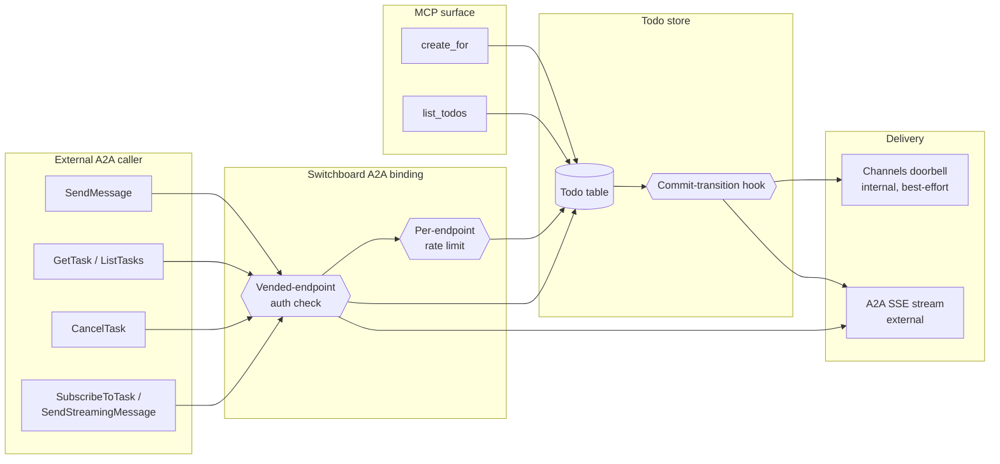

# Design: A2A Task Delegation Transport

## Context

[SPEC-0010](../friending/spec.md) and [ADR-0010](../../../adrs/ADR-0010-a2a-discovery-human-vended-friending.md)
originally scoped A2A to discovery/announcement only: personas publish Agent Cards, but cross-agent work
flows exclusively as MCP `create_for` calls into the durable todo queue
([SPEC-0003](../todo-queue/spec.md), [ADR-0007](../../../adrs/ADR-0007-todos-as-core-primitive.md)).
That was a deliberate trade — A2A's native peer task transport bypasses human vending and produces
ephemeral, unowned RPCs — but it also meant switchboard was not a real participant in the A2A ecosystem:
an external, standards-compliant A2A client could discover a persona's card and nothing more.

[ADR-0021](../../../adrs/ADR-0021-a2a-task-delegation-transport.md) revisits that trade: implement the
full A2A task RPC surface, but keep it gated by the exact same vended-endpoint credential SPEC-0010's
friend-request-and-approval flow already mints. A2A becomes a second wire protocol for an already-
authorized relationship, not a new way to acquire one. This spec is the requirements-level realization of
that decision.

The substrate this spec builds on already exists in code: `internal/store/todos.go` (the `Todo` type and
its `pending → claimed → done|failed` lifecycle with lease/dedup/retry), `internal/server` (the doorbell
gate and `nudgeDoorbells`/`PendingDoorbellTodos` that drive Channels), `internal/web/agentcard.go` (Agent
Card projection, which today hard-codes `capabilities.streaming: false` and comments "no push
notifications, no state-transition history"), and `internal/server/friend_intake.go` /
`internal/store/agents.go` (`VendAgentEndpoint`, the credential this spec's auth checks reuse). None of
the A2A RPC handlers (`SendMessage`, `GetTask`, etc.) exist yet.

## Goals / Non-Goals

### Goals

- Implement `SendMessage`, `GetTask`, `ListTasks`, `CancelTask`, `SendStreamingMessage`,
  `SubscribeToTask`, and `GetExtendedAgentCard` as a native A2A binding over the existing Todo model.
- Gate every state-changing call (`SendMessage`, `CancelTask`) behind the same vended-endpoint bearer
  credential MCP's `create_for` already requires — no new anonymous access path.
- Extend the Todo state machine with the four A2A states it doesn't yet have (`canceled`, `rejected`,
  `input-required`, `auth-required`) without breaking any existing `pending`/`claimed`/`done`/`failed`
  consumer.
- Rate-limit `SendMessage` per vended endpoint, independent of SPEC-0010's friend-request quota, so a
  single already-friended peer cannot flood a queue at a rate no human ever approved.
- Advertise `capabilities.streaming: true` on the Agent Card once implemented.

### Non-Goals

- `PushNotificationConfig` CRUD and webhook delivery — a separate spec (a2a-push-notifications).
- Changing how a vended endpoint is acquired — SPEC-0010's friend-request-and-approval flow is unchanged.
- Renaming the `Todo` type, database schema, or MCP tool names (`list_todos`, `claim_todo`, `create_for`)
  to "Task." "Task" remains A2A's wire-boundary vocabulary for the same object; the internal primitive
  keeps its existing name. (Considered and explicitly declined — see Decisions.)
- Open, ungated peer task delegation (any A2A caller tasking any discovered agent without a prior grant)
  — this is exactly ADR-0010's originally-rejected option and remains rejected under ADR-0021.

## Decisions

### Task is a projection, not a parallel object

**Choice**: `SendMessage` creates a todo via the same store path as `create_for`; `GetTask`/`ListTasks`
read the todo table; there is no separate `tasks` table.
**Rationale**: One state machine, one audit trail, one lease/retry/dead-letter implementation to keep
correct. Avoids the classic "two systems of record disagree" bug class.
**Alternatives considered**:
- A parallel `a2a_tasks` table mirrored from todos: doubles the surface to keep consistent, and risks
  exactly the kind of drift this decision is trying to avoid. Rejected.

### Keep "Todo" as the internal name; "Task" only at the A2A boundary

**Choice**: No rename of the Go type, database schema, or MCP tool surface. The A2A HTTP/JSON-RPC layer
translates between A2A's `Task`-shaped wire format and the internal `Todo` model at the handler boundary
only.
**Rationale**: A full rename touches the Go type, DB columns, `list_todos`/`claim_todo`/`create_for` tool
names, ADR-0007's title, and every one of the ~17 specs that reference "todo" — and breaks any existing
MCP client calling those tool names today. The conceptual alignment ("an A2A Task is a Todo") is fully
captured by ADR-0021's framing without paying that migration cost.
**Alternatives considered**:
- Full rename now: real cost (breaking MCP tool interface, DB migration, doc sweep) for a naming-only
  gain; explicitly declined in favor of scoping it as a separate future consideration if ever pursued.

### SendMessage authorization reuses the vended-endpoint credential, not a new grant type

**Choice**: `SendMessage` checks the same bearer-credential-scoped-to-queue mechanism as `create_for`.
**Rationale**: Preserves ADR-0010's core accountability property — no autonomous agent-to-agent access
grant — while still delivering the full A2A RPC surface. The alternative (open peer delegation) was
already rejected once, for the same reason, and rejecting it again here keeps the two ADRs consistent.
**Alternatives considered**:
- Open peer delegation matching A2A's native default: maximal interop, but reopens the exact
  accountability hole ADR-0010 closed. Rejected (this is ADR-0021's "Option D").

### SendMessage gets its own rate limit, separate from SPEC-0010's friend-request quota

**Choice**: A per-vended-endpoint token bucket on `SendMessage`, distinct from the friend-request
quota that bounds how fast a new grant can be acquired.
**Rationale**: The two quotas bound different things — acquiring a grant vs. using one — and conflating
them would either make friend-request approval too permissive (if the SendMessage bucket is generous) or
choke a legitimately busy, already-approved relationship (if the friend-request quota is reused for task
volume). This gap existed for `create_for` before this spec too; this spec is the first to name it and
close it explicitly, rather than silently inheriting it.
**Alternatives considered**:
- No new rate limit, rely on general endpoint request throttling (SPEC-0007): doesn't distinguish
  "chatty but legitimate" from "flooding," and doesn't give operators a task-creation-specific knob.
  Rejected as insufficiently targeted.

### Streaming reuses the existing doorbell commit hook

**Choice**: `SendStreamingMessage`/`SubscribeToTask` subscribe to the same `store.SetTodoDoorbellHook`
transition events that already drive Channels, rather than introducing a second event-emission path.
**Rationale**: One source of truth for "a todo just changed state." Two independent emission paths would
be a place for delivery guarantees to silently diverge between the internal doorbell and external
streaming.
**Alternatives considered**:
- A separate polling-based event loop for A2A streams: simpler in isolation, but duplicates the
  transition-detection logic the doorbell hook already provides correctly. Rejected.

## Architecture

An A2A caller authenticates with the same vended-endpoint credential an MCP client would use. `SendMessage`
and MCP's `create_for` converge on the same store call; `GetTask`/`ListTasks` read the same table;
streaming and the internal Channels doorbell both subscribe to the same commit hook, diverging only in
transport (SSE to an external caller vs. an MCP notification to a connected session).



The task lifecycle, showing the four new states alongside the existing four:

```mermaid
stateDiagram-v2
    [*] --> pending: SendMessage / create_for
    [*] --> rejected: policy check fails at intake
    pending --> claimed: worker claims (lease)
    claimed --> done: complete
    claimed --> failed: fail (retry if attempts remain)
    failed --> pending: retry backoff elapses
    claimed --> input-required: needs client input
    input-required --> claimed: input supplied
    claimed --> auth-required: needs auth resolution
    auth-required --> claimed: auth resolved
    pending --> canceled: CancelTask
    claimed --> canceled: CancelTask
    done --> [*]
    failed --> [*]: retries exhausted (dead-letter)
    rejected --> [*]
    canceled --> [*]
```

## Risks / Trade-offs

- **New rate-limiting surface to get right.** A too-tight `SendMessage` bucket makes switchboard feel
  broken to a legitimate high-volume peer; too loose and the original "agents going nuts" worry
  materializes anyway. Mitigation: default conservative, make it operator-tunable, and log rejections
  distinctly from other 429s so the limit is diagnosable.
- **State machine extension touches every existing Todo consumer.** Adding four new states means every
  place that switches on `Todo.State` needs to handle them (or explicitly not, if not applicable).
  Mitigation: audit all existing switch/match sites on `Todo.State` as part of implementation, not just
  the new A2A handlers.
- **Two wire protocols, one behavior contract.** MCP's `create_for` and A2A's `SendMessage` must agree on
  dedup, scope enforcement, and validation, or the same logical action behaves differently depending on
  which protocol a caller happens to use. Mitigation: both MUST call the same internal function; the A2A
  handler is a thin translation layer, never a reimplementation.
- **Streaming is a new connection-lifecycle surface.** Long-lived SSE connections need explicit
  backpressure and cleanup on caller disconnect, which the request/response-shaped MCP surface never had
  to handle. Mitigation: explicit context-cancellation propagation and connection caps (see spec's
  Concurrency Safety requirement).

## Migration Plan

1. Add the four new `Todo.State` values (`canceled`, `rejected`, `input-required`, `auth-required`) via a
   database migration; existing rows are unaffected (additive enum/constraint change).
2. Audit and update every existing switch/match on `Todo.State` (claim logic, retry/backoff logic, UI
   rendering, MCP tool responses) to handle the new states or explicitly document why a given site can
   ignore them.
3. Implement the A2A HTTP/JSON-RPC handlers (`SendMessage`, `GetTask`, `ListTasks`, `CancelTask`,
   `SendStreamingMessage`, `SubscribeToTask`, `GetExtendedAgentCard`) as thin translators onto the
   existing store functions (`store.CreateTodo`/`CreateForFriend`, `store.ClaimTodo`, etc.), reusing the
   same auth check `create_for` uses.
4. Add the per-vended-endpoint `SendMessage` rate limiter.
5. Wire `SubscribeToTask`/`SendStreamingMessage` onto `store.SetTodoDoorbellHook`, alongside (not
   replacing) the existing Channels doorbell subscription.
6. Flip `capabilities.streaming` to `true` in `internal/web/agentcard.go` and remove the now-stale "no
   push notifications, no state-transition history" comment (the push-notifications half of that comment
   is corrected by the companion a2a-push-notifications spec).
7. Update SPEC-0010's "Work Flows as Todos, Not A2A Tasks" requirement and SPEC-0009's Agent Card
   capability-advertisement requirement to reflect that A2A task intake is now permitted for endpoint
   holders (tracked as part of this spec's rollout, not a separate migration).

## Open Questions

- **Exact rate-limit defaults.** Bucket size and refill rate for the per-endpoint `SendMessage` limiter
  are not fixed by this design; they need an operational starting point plus room to tune.
- **`input-required`/`auth-required` timeout policy.** How long a todo may sit in an interrupt state
  before switchboard gives up and transitions it to `failed` (or leaves it interrupted indefinitely) is
  unresolved.
- **Cursor implementation for `ListTasks`.** Whether the pagination cursor is an opaque encoded offset,
  a keyset on `(created_at, id)`, or something else is an implementation detail to settle during coding,
  not an architectural choice this design needs to pin down.
- **Cross-protocol dedup key parity.** Whether A2A's `SendMessage` should accept/require an idempotency
  key in the same shape MCP's `create_for` does, or derive one from A2A's own `messageId`, needs a
  decision before implementation.
