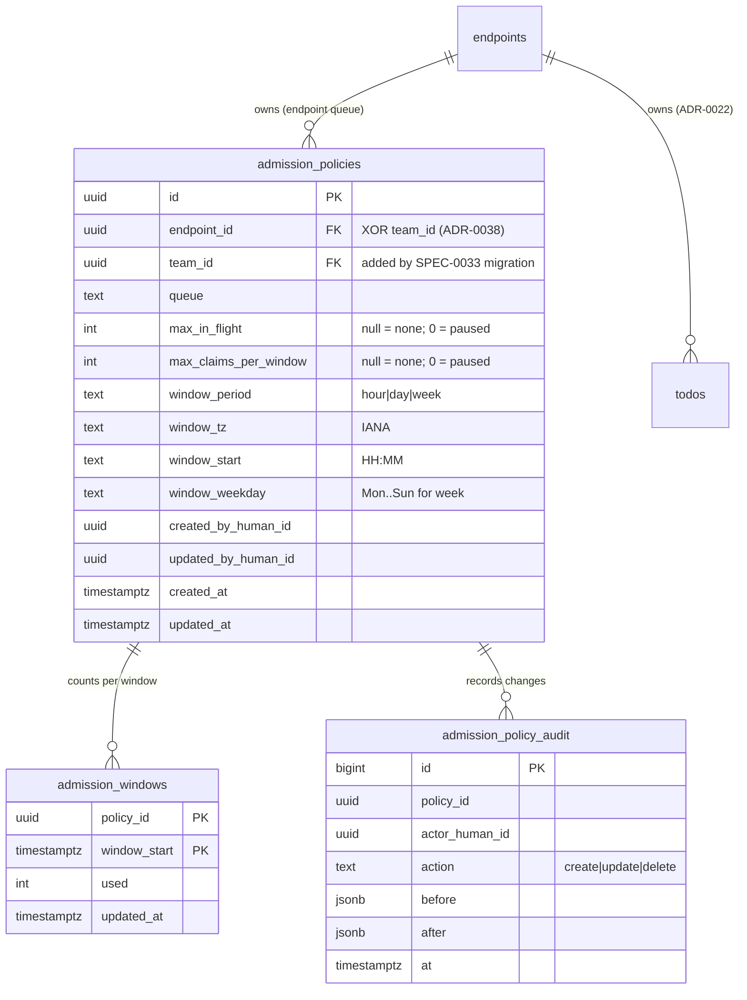

# Design: Per-Queue Admission Control

## Context

[SPEC-0030](spec.md) realizes [ADR-0035](../../../adrs/ADR-0035-per-queue-admission-control.md). Today's
claim paths live in `internal/store/todos.go`:

* `ClaimTodo` locks one row with `FOR UPDATE`.
* `ClaimNext` picks the oldest claimable row across the granted queues with `FOR UPDATE SKIP LOCKED`
  in a candidate CTE.
* `ClaimTodoOperatorOwned` is the board's claim.

All three already share one candidate predicate: a row is claimable when it is pending, when its lease
has lapsed with attempts remaining, or when its retry backoff has elapsed. All three increment `attempt`
on the claim. The reaper (`ReapExpired`) and the retry scheduler (`RequeueDueRetries`) are background
sweeps with a documented exemption from endpoint scoping. SPEC-0023 counters (`countClaim`) fire after
commit.

The design adds admission to that path without changing its shape. A queue with no policy runs today's
exact SQL.

Queue identity follows the Teams contract (ADR-0038 / SPEC-0033, in flight): a queue is
`(endpoint_id, name)` or `(team_id, name)`, and per-queue settings key on that pair. Endpoint queues ship
first, because that is all the schema has today. The team column arrives with SPEC-0033's migration.

## Goals / Non-Goals

### Goals

* A per-queue ceiling on claims per declared window and on claims in flight, exceeded by nothing.
* Over-budget work retained as `pending`, with a reason and an eligible time on every surface.
* No push for work that can't be claimed, and one push when it can.
* Zero cost and zero behaviour change for queues without a policy.

### Non-Goals

* Operator-imposed ceilings on tenants. That is a separate record under ADR-0038's operator-bounding
  rule.
* Priority or fair share across queues (#160 keeps this deferred).
* Cost accounting in dollars or tokens. Switchboard can't see model usage, and Harness ADR-0027 does
  that for its runs.
* A rolling-window mode. It is rejected for v1 (see Decisions).

## Decisions

### Charge per committed claim, never refund

**Choice**: every claim that commits, including a retry and a takeover, spends one unit. Nothing refunds
one.
**Rationale**: a claim is a dispatch. Charging per claim makes the worst-case dispatch count equal the
limit, independent of `max_attempts` (default 5), worker count and lease lapses. That is the customer's
"retries must not multiply the allowance". It also keeps the counter equal to
`switchboard_todos_claimed_total` over the same queue and window, which a test can assert, and to
ADR-0039's attempt rows.
**Alternatives considered**:
- Charge once per todo: dispatches can reach `max_attempts` times the limit.
- Refund on `release`: this opens a free claim, spend and release loop.
- Refund on `fail`: failure is exactly when the spend happened.

### A locked policy row plus a counter row, not a count query

**Choice**: `SELECT ... FOR UPDATE` on `admission_policies`, then an upsert on `admission_windows`.
**Rationale**: the row lock serializes admissions for one queue identity only. The counter survives
retention, which prunes the terminal todos a count query would read. In-flight is read from `todos`
under the lock: every raise of it takes the lock, and a lowering only loosens the read, so no in-flight
counter has to be reconciled.
**Alternatives considered**:
- `count(*)` over `claimed_at` in the window without a lock: this races, and it undercounts after
  pruning.
- `pg_advisory_xact_lock(hash)`: it works, but it still needs the counter, and it hides the lock from
  `pg_locks` readers behind a hash.
- `SERIALIZABLE` isolation on the claim: it retries under contention, and it would change the isolation
  level of every claim, including queues without a policy.

### Fixed zoned windows

**Choice**: `hour`, `day` or `week` windows at a declared `start`, in a declared IANA zone, keyed by
`window_start` (an absolute instant).
**Rationale**: a declared boundary is what the customer asked to record. A fixed window has one exact
`next_eligible_at`, and one row per window.
**Alternatives considered**:
- A rolling window: it needs a per-claim log and a moving "resets at", and it is kept for a later version
  if someone needs it.
- UTC only: owners think in local days, and the presence shift grammar already embeds tzdata.

### Derived deferral, not a stored state

**Choice**: admission status is computed from the policy, the counter and `now()` when a todo is read.
**Rationale**: deferral is a property of the queue at an instant. Storing it would mean rewriting rows at
every boundary, with windows in which the stored state and the policy disagree. SPEC-0023 counts by
state would also split.

### A dedicated `deferred` error for `claim`, and an extended empty answer for `claim_next`

**Choice**: `claim_next` returns `{empty: true, deferred: [...]}`, and `claim` returns error code
`deferred`.
**Rationale**: `empty: true` is the documented normal idle answer, and existing clients must keep
working. The `deferred` list is additive, so an old client ignores it, and a new one sleeps until
`next_eligible_at`. `claim` on a specific id already has a conflict error. `deferred` is distinct
because the right client response differs: wait for the given time, don't pick another todo.

## Architecture



### Schema (migration `00NN_admission_control.sql`)

```sql
-- 00NN_admission_control — per-queue admission policies (ADR-0035, SPEC-0030).
-- Additive: no existing query reads these tables, and a queue without a row behaves as before.
CREATE TABLE admission_policies (
    id                    uuid PRIMARY KEY DEFAULT gen_random_uuid(),
    endpoint_id           uuid NOT NULL REFERENCES endpoints(id) ON DELETE CASCADE,
    queue                 text NOT NULL,
    max_in_flight         int CHECK (max_in_flight BETWEEN 0 AND 10000),
    max_claims_per_window int CHECK (max_claims_per_window BETWEEN 0 AND 1000000),
    window_period         text CHECK (window_period IN ('hour','day','week')),
    window_tz             text,
    window_start          text CHECK (window_start ~ '^([01][0-9]|2[0-3]):[0-5][0-9]$'),
    window_weekday        text CHECK (window_weekday IN ('Mon','Tue','Wed','Thu','Fri','Sat','Sun')),
    created_by_human_id   uuid NOT NULL REFERENCES humans(id),
    updated_by_human_id   uuid NOT NULL REFERENCES humans(id),
    created_at            timestamptz NOT NULL DEFAULT now(),
    updated_at            timestamptz NOT NULL DEFAULT now(),
    CHECK (max_in_flight IS NOT NULL OR max_claims_per_window IS NOT NULL),
    CHECK (max_claims_per_window IS NULL
           OR (window_period IS NOT NULL AND window_tz IS NOT NULL AND window_start IS NOT NULL)),
    CHECK ((window_period = 'week') = (window_weekday IS NOT NULL))
);
CREATE UNIQUE INDEX idx_admission_policies_endpoint_queue ON admission_policies (endpoint_id, queue);

CREATE TABLE admission_windows (
    policy_id    uuid NOT NULL REFERENCES admission_policies(id) ON DELETE CASCADE,
    window_start timestamptz NOT NULL,
    used         int NOT NULL DEFAULT 0 CHECK (used >= 0),
    updated_at   timestamptz NOT NULL DEFAULT now(),
    PRIMARY KEY (policy_id, window_start)
);

CREATE TABLE admission_policy_audit (
    id             bigint GENERATED ALWAYS AS IDENTITY PRIMARY KEY,
    policy_id      uuid NOT NULL,               -- not an FK: the audit outlives a deleted policy
    endpoint_id    uuid NOT NULL,               -- the scope, for owner-filtered reads
    queue          text NOT NULL,
    actor_human_id uuid NOT NULL,
    action         text NOT NULL CHECK (action IN ('create','update','delete')),
    before         jsonb,
    after          jsonb,
    at             timestamptz NOT NULL DEFAULT now()
);
CREATE INDEX idx_admission_audit_scope ON admission_policy_audit (endpoint_id, queue, at DESC);

-- In-flight reads under the policy lock.
CREATE INDEX idx_todos_claimed_endpoint_queue ON todos (endpoint_id, queue) WHERE state = 'claimed';
```

SPEC-0033's migration later adds `team_id uuid REFERENCES teams(id)` and relaxes `endpoint_id` to
nullable under `CHECK (num_nonnulls(endpoint_id, team_id) = 1)`, with a second unique index on
`(team_id, queue)`. Retention prunes `admission_windows` rows older than 35 days, which keeps a month of
history for the board. The audit follows the events retention bound.

### The claim, with admission

`store.ClaimNext` becomes a loop in Go over at most `len(queues)` attempts:

```
excluded := unlocked read of policies for (endpointID, queues) that are exhausted now
for {
  BEGIN
    cand := today's candidate CTE with `AND queue <> ALL($excluded)`   -- SKIP LOCKED, never waits
    if no cand: COMMIT; return ErrNotFound, deferredSummary(excluded)
    pol := SELECT ... FROM admission_policies WHERE endpoint_id=$1 AND queue=$cand.queue FOR UPDATE
    if no pol:                        -- the common case, and today's exact path
      UPDATE todos ... claim ...; COMMIT; return
    ws := windowStart(pol, now())     -- pure Go, embedded tzdata; an error means admission_unavailable
    inflight := SELECT count(*) FROM todos WHERE endpoint_id=$1 AND queue=$q AND state='claimed'
                AND id <> $cand.id    -- a takeover replaces its own lapsed claim
    used := SELECT used FROM admission_windows WHERE policy_id=$p AND window_start=$ws  (0 if none)
    if refused(pol, inflight, used):
      ROLLBACK; excluded += cand.queue; record refusal; continue
    UPDATE todos ... claim ...
    INSERT INTO admission_windows (policy_id, window_start, used) VALUES ($p,$ws,1)
      ON CONFLICT (policy_id, window_start) DO UPDATE SET used = admission_windows.used + 1, updated_at = now()
  COMMIT
  return todo, headroom(pol, inflight+1-takeoverAdj, used+1, nextBoundary(pol))
}
```

`ClaimTodo` and `ClaimTodoOperatorOwned` use the same middle section with one candidate, and return
`ErrDeferred` (mapped to code `deferred`) on refusal. The "is there a policy" probe is one indexed
lookup. To keep a queue without a policy on exactly today's path, the probe runs inside the same
transaction, after the candidate lock. It is a `SELECT ... FOR UPDATE` that returns no row, so it costs
one index lookup and takes no lock. Metrics (`countClaim`, `AdmissionCharged`) fire after commit, as
today.

### Window arithmetic

`windowStart(pol, t)` and `nextBoundary(pol, t)` are pure functions in a new `internal/admission`
package. They load the policy's zone from the embedded tzdata, which `internal/presence` (SPEC-0022)
shares when it lands, and walk local wall-clock boundaries. A `start` in a DST gap resolves to the first
valid instant after it. An overlap resolves to the first occurrence. The package is table-tested across
DST transitions in several zones, which guards the boundary against the host's zone data.

### MCP surface

* `claimNextOut` gains `Deferred []deferredOut` (`queue`, `reason`, `pending`, `next_eligible_at`,
  `exact`) and, on a claim, `Admission *admissionOut` (`max_in_flight`, `in_flight`,
  `max_claims_per_window`, `used`, `remaining`, `window_resets_at`). Both are omitted when empty, so an
  existing client sees today's shape.
* `todoOut` gains `Admission *todoAdmissionOut` on pending todos of a budgeted queue.
* New error code `deferred` in `internal/mcp/tools.go`, beside `conflict`.
* New verb `admission_status {queue?}`, registered whenever the endpoint holds `claim` or
  `claim_next`, and added to the drain verb set in `internal/mcp/verbs.go`.

### Operator API and CLI

| Method | Path | Auth | Body or result |
|---|---|---|---|
| GET | `/api/v1/admission` | Required | the caller's manageable policies, with status and usage |
| GET | `/api/v1/admission/{scope}/{queue}` | Required | one policy, its status, the last 30 windows, the audit tail |
| PUT | `/api/v1/admission/{scope}/{queue}` | Required | `{max_in_flight, max_claims_per_window, window}`, a full replace |
| DELETE | `/api/v1/admission/{scope}/{queue}` | Required | removes the policy; the audit is kept |

`{scope}` is `endpoint:<slug-or-id>`, and `team:<id>` once SPEC-0033 lands. Foreign and unknown scopes
both return `404 not_found`. CLI:

```
switchboard queue budget show  [ENDPOINT] [QUEUE]
switchboard queue budget set   ENDPOINT QUEUE [--per-day N | --per-hour N | --per-week N]
                               [--tz America/Los_Angeles] [--start 00:00] [--weekday Mon]
                               [--max-in-flight N]
switchboard queue budget clear ENDPOINT QUEUE
```

### Doorbells and the reopen sweep

The store's doorbell hook, `PendingDoorbellTodos`, the attach ring and the heartbeat sweep all gain one
predicate: the todo's queue identity is not deferred. A new sweep, `admission.Reopen`, runs on the
reaper's tick, every 30 s. It finds policies whose window rolled over since the last tick, or whose
in-flight count fell below the cap, and that have push-eligible pending todos. For each such endpoint
and queue it emits one `todo_ready` notification (SPEC-0004), which drives the doorbell and the notify
hook through their existing paths, presence included. It also fires on `complete`, `fail`, `release`
and a policy write, so a freed slot rings immediately rather than on the next tick.

### Metrics

A scrape-time collector reads `admission_policies`, the current windows and deferred-todo counts
grouped by queue label, as the liveness gauges of #302 do. The two counters are incremented at commit
and at refusal. The collector registers `collection_errors_total{collector="admission"}`.

### Board

The queue header fragment gains a budget strip: used of limit, in-flight of cap, status, and "resets at"
in both zones. Deferred cards get a reason chip. The endpoint card links to a "Budget" editor, a full
page with server-side state and a no-JS fallback per SPEC-0015 REQ "Wizard Interaction Pattern" (not an
overlay modal), and to the audit list. The header is pushed over the existing SSE live
fragments on every claim and at reopen.

## Risks / Trade-offs

* **Lock contention on a hot budgeted queue** → the lock is held for one short transaction. Measure with
  a benchmark in the story that lands the lock. Queues with no policy are untouched.
* **Charging retries surprises owners** → the docs say it first, the claim response shows headroom, and
  `switchboard_todo_attempts_total` shows the multiplier.
* **Boundary bursts** → document pairing `max_in_flight` with the window limit.
* **tzdata drift** → a zone removed from the embedded database fails closed with
  `admission_unavailable` and is flagged on the board, never admitted.
* **Starvation inside `claim_next`** → excluded queues are re-evaluated on every call, and the loop is
  bounded by the number of granted queues.
* **Window redefinition as a reset** → an owner can reset usage by redefining the window, but only an
  owner, who could equally raise the limit. It is audited.

## Migration Plan

1. Ship the migration and the store changes behind no flag. With no policy rows, every claim takes
   today's path, which the existing claim tests prove.
2. Ship the operator API and CLI, then the board editor.
3. Ship the doorbell and hook gating together with the reopen sweep. Gating without reopen would strand
   doorbells.
4. Roll back by deleting policy rows, which restores today's behaviour immediately. The tables can stay.

## Open Questions

* Should a team queue policy (SPEC-0033) also be able to cap each draining endpoint's share? This is
  deferred until team queues exist.
* Should `admission_status` be a self verb that needs no grant, as SPEC-0022 proposes for presence?
  Today it rides on the drain grant.
* Should the queue digest (ADR-0034 / SPEC-0029) warn when a budget is, say, 80% spent before the
  window's midpoint? It is a candidate for the digest spec rather than this one.
