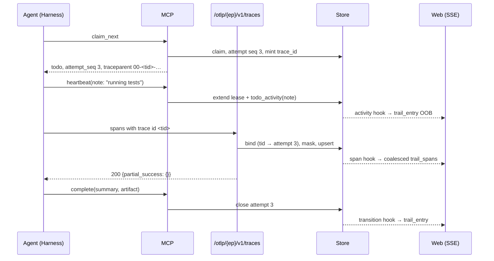
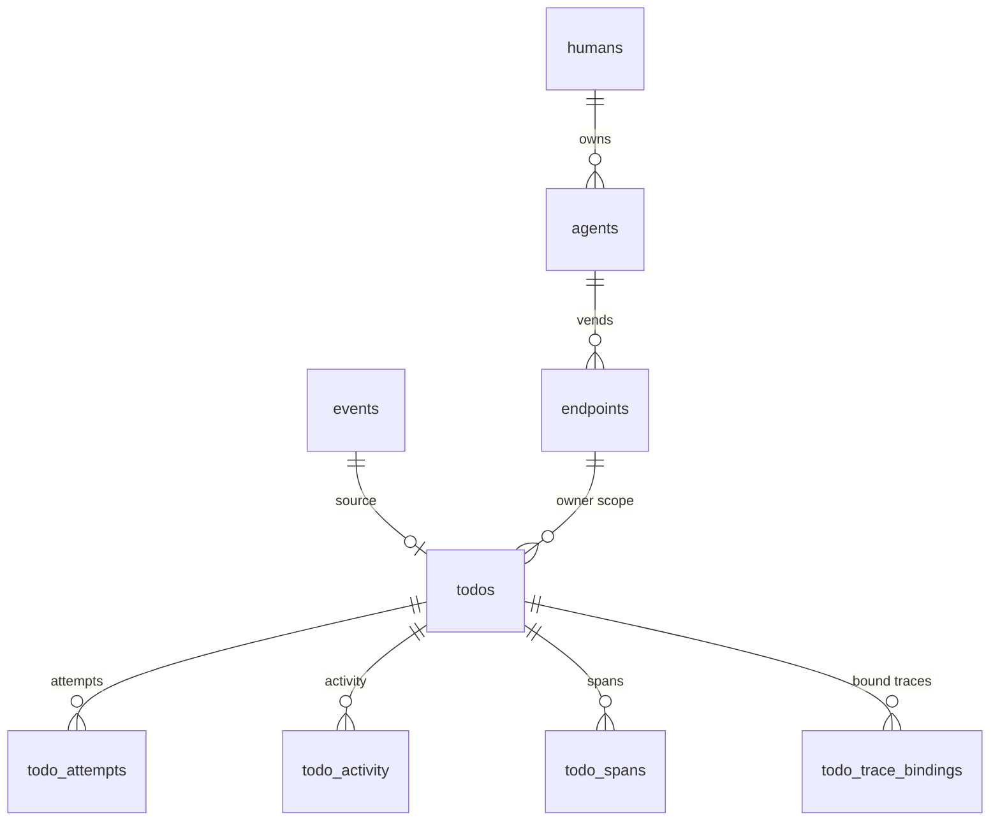

# Design: Agent Activity and the Todo Audit Trail

## Context

Switchboard records far more about a todo than it shows:

* `todo_attempts` (SPEC-0034) holds the claims, heartbeats, endings, summaries and artifacts.
* `events` holds the verification detail, headers, payload, disposition and `routing_trace`.
* `todos` carries `result`, `work_order`, `routing_trace`, `attempts_total` and `attempts_pruned`.

The web UI shows the payload and four timestamps in a drawer (`internal/web/todos.go`
`buildDrawer`, `templates/fragments/todos.html` `drawer`). `/todos/{id}` renders that same drawer
inline (`templates/todo.html`). PR #508 adds the attempt list to the drawer and an operator-owned
attempts read. PR #511 wires `summary`, `artifact` and `claimant` through MCP. This design assumes
both have landed.

Some things are never recorded:

* Board actions, beyond the resulting state.
* Doorbell rings. `todos.last_ringed_at` and `ring_attempts` are overwritten.
* A2A transitions.
* Anything an agent did between claim and report.

Cairn specifies an OTLP/HTTP trace receiver (Cairn ADR-0015 / SPEC-0011, not yet implemented there).
This design takes its route shape, encodings, category rules and rejected options, and adapts the
binding to Switchboard's unit, the todo.

## Goals / Non-Goals

### Goals

* A stock OTLP/HTTP trace exporter can send spans that land on the right todo and attempt.
* An agent without an exporter can leave progress notes over a verb it already holds.
* Every Board action and ring leaves a record on the todo.
* One page per todo tells its whole story. One feed lets a human catch up across todos.
* Everything is scoped by the todo's owner scope, bounded, and deleted with its todo.

### Non-Goals

* OTLP logs or metrics, and gRPC. Deferred, per ADR-0042 (A3).
* Server-side secret scanning beyond a pattern floor. Cairn's gitleaks integration is not ported.
* Sharing a trail outside the owner scope. Cairn remains the sharing surface.
* A generic cross-resource audit log (webhooks, endpoints, rules). The trail is todo-centred. A
  secret audit trail is tracked separately (#453).
* Replacing attempts as the record of claims and endings.

## Decisions

### The receiver lives in its own package and reuses the MCP resolver

`internal/otlp` owns decode, bind, translate, mask and response encoding. It is mounted in
`internal/server/server.go` `newRouter` at `/otlp/{endpoint}/v1/traces`, behind a pre-auth IP
limiter, then `maxBytes`, then auth, then a per-endpoint limiter.

Auth is the same resolution MCP performs in `internal/mcp/mcp.go` `auth` (`bearer()`, then
`EndpointByCredHash` for `sbk_` or `EndpointByOAuthToken`, then the slug check), and A2A duplicates
it in `internal/a2a/a2a.go`. The first story extracts that into `internal/auth/endpointauth.go` as
`ResolveEndpointBearer(ctx, store, r, slug) (store.AuthEndpoint, error)`, and MCP and A2A switch to
it with no behaviour change. The receiver then uses it. A third copy would be the wrong move.

The `{endpoint}` segment is required because OAuth tokens carry no audience. Without it, any live
token for any endpoint would be accepted, and binding would have to search every endpoint the human
owns.

### Decode with the upstream proto types

We use `go.opentelemetry.io/proto/otlp/collector/trace/v1` and
`go.opentelemetry.io/proto/otlp/trace/v1`, with `google.golang.org/protobuf/proto` and `protojson`
(already an indirect dependency). OTLP/JSON encodes ids as hex, while protojson expects base64 for
`bytes`. The JSON path therefore needs a pre-pass that rewrites `traceId`, `spanId` and
`parentSpanId` from hex to base64 before `protojson.Unmarshal`, and the reverse is not needed. This
is the usual receiver workaround, and a parity test pins it (REQ-2).

Body handling:

1. `http.MaxBytesReader` caps the wire bytes.
2. When the body is gzip, `gzip.NewReader` is wrapped in an `io.LimitReader` of cap+1 bytes. Reading
   cap+1 bytes means 413.
3. `io.ReadAll` of the limited reader.
4. Unmarshal.

### Binding is a per-request resolution, cached per trace

For a request, the translator walks `ResourceSpans` → `ScopeSpans` → `Span` and collects, per
trace id:

* the resource-level and span-level `switchboard.todo.id` and `switchboard.attempt.seq` values;
* the span start times.

It then resolves in one query per request:

```sql
-- $1 endpoint_id (owner scope), $2 trace_ids bytea[], $3 todo_ids text[]
SELECT 'trace' AS via, a.todo_id, a.seq, a.trace_id
FROM todo_attempts a JOIN todos t ON t.id = a.todo_id
WHERE t.endpoint_id = $1 AND a.trace_id = ANY($2)
UNION ALL
SELECT 'attr', t.id, NULL, NULL FROM todos t
WHERE t.endpoint_id = $1 AND t.id = ANY($3)
UNION ALL
SELECT 'prior', s.todo_id, NULL, s.trace_id FROM todo_trace_bindings s
JOIN todos t ON t.id = s.todo_id
WHERE t.endpoint_id = $1 AND s.trace_id = ANY($2);
```

`todo_trace_bindings (todo_id, trace_id)` records every trace id bound by attribute. The third
rule, "an earlier span of this trace was bound", then costs one index probe. Without it, a
child span that lacks the attribute could not follow its parent when they arrive in different
batches. Exporters batch by time, not by trace, so that case is common.

Attempt choice for rules 2 and 3 uses the attempt intervals of the matched todos, read once:

```sql
SELECT todo_id, seq, claimed_at, ended_at FROM todo_attempts WHERE todo_id = ANY($1)
```

Everything the resolver cannot bind is counted as `unbound`. The `WHERE t.endpoint_id = $1` filter
is the whole tenant boundary: a foreign todo id simply produces no row, exactly like an unknown
one. When SPEC-0033 lands, this predicate widens to team reach in one place, `bindScope`.

### Spans are rows; attributes are an allow-listed jsonb

```sql
CREATE TABLE todo_spans (
    todo_id         text        NOT NULL REFERENCES todos(id) ON DELETE CASCADE,
    trace_id        bytea       NOT NULL CHECK (octet_length(trace_id) = 16),
    span_id         bytea       NOT NULL CHECK (octet_length(span_id) = 8),
    parent_span_id  bytea       CHECK (octet_length(parent_span_id) = 8),
    attempt_seq     int,
    name            text        NOT NULL CHECK (octet_length(name) <= 256),
    kind            text        NOT NULL,
    category        text        NOT NULL CHECK (octet_length(category) BETWEEN 1 AND 64),
    tool            text        CHECK (octet_length(tool) <= 128),
    status_code     text        NOT NULL DEFAULT 'unset' CHECK (status_code IN ('unset','ok','error')),
    status_message  text        CHECK (octet_length(status_message) <= 512),
    service_name    text        CHECK (octet_length(service_name) <= 128),
    start_at        timestamptz NOT NULL,
    end_at          timestamptz NOT NULL CHECK (end_at >= start_at),
    attributes      jsonb       NOT NULL DEFAULT '{}' CHECK (octet_length(attributes::text) <= 16384),
    truncated       boolean     NOT NULL DEFAULT false,
    received_at     timestamptz NOT NULL DEFAULT now(),
    PRIMARY KEY (todo_id, trace_id, span_id)
);
CREATE INDEX idx_todo_spans_attempt ON todo_spans (todo_id, attempt_seq, start_at);

CREATE TABLE todo_trace_bindings (
    todo_id   text  NOT NULL REFERENCES todos(id) ON DELETE CASCADE,
    trace_id  bytea NOT NULL CHECK (octet_length(trace_id) = 16),
    PRIMARY KEY (todo_id, trace_id)
);
CREATE INDEX idx_todo_trace_bindings_trace ON todo_trace_bindings (trace_id);

ALTER TABLE todo_attempts ADD COLUMN trace_id      bytea CHECK (octet_length(trace_id) = 16);
ALTER TABLE todo_attempts ADD COLUMN spans_dropped int NOT NULL DEFAULT 0;
ALTER TABLE todo_attempts ADD COLUMN notes_dropped int NOT NULL DEFAULT 0;
CREATE INDEX idx_todo_attempts_trace ON todo_attempts (trace_id) WHERE trace_id IS NOT NULL;
ALTER TABLE todos ADD COLUMN spans_dropped int NOT NULL DEFAULT 0;
```

`attempt_seq` is not a foreign key. SPEC-0034's per-todo cap may prune an old attempt, and its
spans should survive as "attempt N (pruned)" until the todo itself goes. Upsert is
`ON CONFLICT (todo_id, trace_id, span_id) DO UPDATE SET … WHERE todo_spans.end_at IS DISTINCT FROM
EXCLUDED.end_at`, so a retry with identical data is a no-op. A span re-sent with a corrected end is
updated.

The per-attempt and per-todo caps are checked in the same transaction. The transaction counts the
existing rows with `SELECT count(*) … FOR UPDATE` on the attempt row, so two concurrent batches
cannot both pass the cap. Spans over the cap increment `spans_dropped`.

### Masking is a pure function over capped strings

`internal/otlp/mask.go` holds `Mask(s string) (string, bool)`, built from a fixed slice of RE2
patterns (Go's `regexp` is linear-time). It is applied after truncation, so its input is at most
4 KiB. Heartbeat notes call the same function. It lives in `internal/redact`, so that `mcp` does
not import `otlp`.

### Heartbeat notes ride the heartbeat statement

`HeartbeatTodoWith` already updates `todos` and the open attempt in one statement. It gains an
`INSERT INTO todo_activity … SELECT … WHERE` arm, guarded on the note being non-null and on the
attempt's note count being under the cap. When the attempt is at the cap, the arm instead does
`UPDATE todo_attempts SET notes_dropped = notes_dropped + 1`. Note counts come from
`count(*) FROM todo_activity WHERE todo_id = $1 AND attempt_seq = $2 AND kind = 'note'`, served by
the index below. On a fenced attempt a token mismatch already makes the whole statement a
`conflict`, so no note is written.

### `todo_activity` is written in the same statements as the transitions

```sql
CREATE TABLE todo_activity (
    todo_id      text        NOT NULL REFERENCES todos(id) ON DELETE CASCADE,
    seq          bigint      NOT NULL,
    attempt_seq  int,
    at           timestamptz NOT NULL DEFAULT now(),
    kind         text        NOT NULL CHECK (kind IN ('note','human_action','retried','a2a_state','rung')),
    actor_kind   text        NOT NULL CHECK (actor_kind IN ('endpoint','human','system')),
    actor_ref    text        NOT NULL CHECK (octet_length(actor_ref) <= 128),
    message      text        CHECK (octet_length(message) <= 512),
    truncated    boolean     NOT NULL DEFAULT false,
    detail       jsonb       NOT NULL DEFAULT '{}' CHECK (octet_length(detail::text) <= 4096),
    PRIMARY KEY (todo_id, seq)
);
CREATE INDEX idx_todo_activity_note ON todo_activity (todo_id, attempt_seq) WHERE kind = 'note';
CREATE INDEX idx_todo_activity_at   ON todo_activity (at DESC);

ALTER TABLE todos  ADD COLUMN activity_seq     bigint NOT NULL DEFAULT 0;
ALTER TABLE humans ADD COLUMN activity_seen_at timestamptz;
```

`seq` is allocated from `todos.activity_seq`, with `UPDATE todos SET activity_seq = activity_seq
+ 1 … RETURNING activity_seq` inside the same CTE. The todo row is already locked by the
transition, so no sequence contention arises.

Writers:

| Writer | File | How |
| --- | --- | --- |
| `HeartbeatTodoWith` (note) | `internal/store/todos.go` | CTE arm |
| `*OperatorOwned` claim, complete, fail, retry, extend, release | `internal/store/todos.go` | CTE arm, with `actor_ref` the human id |
| `RetryTodo`, `RetryTodoOperatorOwned` (`retried`) | `internal/store/todos.go` | CTE arm |
| `CancelTodo`, `RejectTodo`, `InterruptTodo`, `ResumeTodo` | `internal/store/todos_a2a.go` | CTE arm |
| `RingUnclaimed` and the push ring (`rung`) | `internal/store/todos.go`, `internal/push` | Batch insert after the ring; best effort, errors logged |

The helper `activityInsertCTE(kind, actorKind string) string` returns the SQL fragment, so the
writers do not each hand-roll it. A test enumerates the operator-owned functions and asserts that
each one writes exactly one row.

The cap (`activity_max_per_todo`) is enforced lazily. After an insert, when `activity_seq` minus
the rows deleted so far exceeds the cap, a follow-up `DELETE` removes the oldest `note` rows. It
runs in the same transaction for notes and best effort for rings.

### The timeline is assembled in Go from four reads

`store.TodoTrail(ctx, ownerHumanID, id) (Trail, error)` runs:

1. `GetTodoItem` (owner-scoped; returns `ErrNotFound` for foreign ids).
2. `EventForTodoOperatorOwned`: the full event row joined through the todo, with the owner
   predicate. This is a new function. `EventHistoryByID` is endpoint-scoped and cannot be reused.
3. `TodoAttemptsOperatorOwned` (from PR #508), extended to return `trace_id`, `spans_dropped`,
   `notes_dropped` and `attempts_pruned`.
4. `TodoActivity(ctx, todoID, limit)`, which is unscoped and therefore called only after (1)
   succeeds. The rule is enforced by making it unexported and reachable only through `TodoTrail`.

`internal/web/trail.go` merges these into `[]TimelineEntry{At, Kind, AttemptSeq, …}`, sorted by
`At` with a stable tie-break (event < created < claim < activity < end), and groups them by
attempt. The merge is a pure function with table tests, and needs no database.

Spans are read separately, per attempt, with `TodoSpans(ctx, todoID, attemptSeq, limit)`, which is
also unexported behind `TodoTrail`. The page loads them all up to `waterfall_max_spans`, and a
`?attempt=N` fragment exists for the live refresh.

### The waterfall is a table with inline custom properties

`internal/web/waterfall.go` provides:

* `BuildWaterfall(spans []store.Span) Waterfall`, which orders spans into a tree (orphans become
  roots) and computes `Depth`, `AtPct` and `LenPct` (with a minimum of 0.3% so instant spans are
  visible).
* Duration labels, and the category class.

The template renders a `<table class="sb-waterfall">`. Its bar cell is
`<span class="sb-bar sb-cat-{{.Category}}" style="--sb-at:{{.AtPct}}%;--sb-len:{{.LenPct}}%" aria-hidden="true">`.
The `style` value is built only from floats formatted in Go, never from span data, so
`html/template`'s CSS escaping has nothing to reject. Category classes come from a fixed map. An
unknown category gets `sb-cat-other`, so span data never names a class.

### The Activity feed is a keyset UNION

```sql
-- $1 owner human, $2 cursor (at, kind, todo_id, seq), $3 limit, filters appended
SELECT a.ended_at AS at, 'attempt_end' AS kind, a.todo_id, a.seq, …
FROM todo_attempts a JOIN todos t ON t.id = a.todo_id <ownedByHuman join>
WHERE a.ended_at IS NOT NULL AND a.ended_at < $cursor
UNION ALL
SELECT v.at, v.kind, v.todo_id, v.seq, …
FROM todo_activity v JOIN todos t ON t.id = v.todo_id <ownedByHuman join>
WHERE v.kind <> 'rung' AND v.at < $cursor
ORDER BY at DESC, todo_id, seq LIMIT $3;
```

It needs `idx_todo_attempts_ended (ended_at DESC) WHERE ended_at IS NOT NULL`. The unread count for
the rail badge is the same query with `at > activity_seen_at` and `LIMIT 100`, counted, then
rendered as "99+" above 99. It is computed in `buildShell` only when the human has a non-null
`activity_seen_at`, or on first visit. It is cached per request.

### Live updates reuse the transition hook

`SetTodoTransitionHook` already fires on every lifecycle change (`internal/server/server.go`,
wired to `web.PublishTodoTransition`). It gains a sibling, `SetTodoActivityHook(func(todoID string,
kind string))`. The store fires it after commit for activity inserts, and the receiver fires it
after a span batch commits. `internal/web/live.go` renders a `trail_entry` OOB fragment into
`#sb-trail-live-<todoID>`, and a `trail_spans` refresh for spans. Span refreshes are coalesced by a
per-todo 1-second timer. Events go only to the owning human (`Event.Owner`), as today.

## Architecture

### Where the pieces live

| Piece | Location |
| --- | --- |
| Endpoint bearer resolver (extracted) | `internal/auth/endpointauth.go` |
| OTLP decode, bind, translate, respond | `internal/otlp/{receiver,decode,bind,translate,response}.go` |
| Credential masker | `internal/redact/redact.go` |
| Span and trail store | `internal/store/{spans,activity,trail}.go` |
| Migration | `internal/db/migrations/00NN_agent_activity.sql` (next free number) |
| Heartbeat `note`, claim `traceparent` | `internal/mcp/tools.go`, `internal/store/todos.go` |
| Todo page, timeline, waterfall | `internal/web/{trail,waterfall}.go`, `templates/todo.html`, `templates/fragments/trail.html` |
| Activity feed | `internal/web/activity.go`, `templates/activity.html` |
| Routes | `internal/server/server.go` |
| Settings | `internal/store/settings.go` keys; `internal/config/config.go` for `SWITCHBOARD_OTLP*` |
| Metrics | `internal/metrics` |
| Docs | `docs/guides/agent-activity.md`, the configuration reference, `CHANGELOG.md` |

### Flow



### Entity relationship



## Risks / Trade-offs

* **Write volume.** Spans are the biggest table Switchboard has had. Caps, per-endpoint rate
  limits and cascade retention bound it. `switchboard_otlp_spans_total` makes the growth visible.
  If it is still too much, a later change can sample by category.
* **Binding misses.** An exporter that neither propagates `traceparent` nor sets the attribute gets
  every span rejected as `unbound`. The guide leads with that failure mode, and `rejected_unbound`
  in the metrics makes it diagnosable. We deliberately do not bind "the endpoint's only claimed
  todo" by guessing. That guess is wrong exactly when it matters, during concurrent work.
* **Pattern masking is incomplete.** It is a floor. Tool I/O stays off by default for that reason.
* **Clock skew.** Span times come from the agent's clock. The attempt-interval choice (REQ-3
  rule 2) can misfile a span by a few seconds around an attempt boundary. The waterfall renders
  times relative to each attempt's own span window, not to the claim time, so skew does not distort
  it.
* **Proto dependency.** `go.opentelemetry.io/proto/otlp` is generated code with a stable wire
  format. We import only the message types, not the SDK or collector.

## Migration Plan

1. One migration adds `todo_spans`, `todo_trace_bindings`, `todo_activity`, the new columns on
   `todo_attempts`, `todos` and `humans`, and the indexes. It needs no backfill. Existing attempts
   have a null `trace_id`. Existing todos have an empty trail beyond what attempts and events
   already hold, and the page renders those.
2. The receiver ships behind `SWITCHBOARD_OTLP`. The page, the feed and notes ship ungated.
3. Rollback: the new tables are additive. Dropping them loses only the trail.

## Open Questions

* Should `get_todo` return notes and a span count, so a relay's next attempt sees the previous
  attempt's notes as well as its summary? It is cheap, but it widens the cross-attempt injection
  channel ADR-0039 already accepts. Proposed as a follow-up once the page is in use.
* Should `/v1/logs` be accepted for agent CLIs whose richest events are OTLP log records? Deferred
  until traces are in use (ADR-0042, A3).
* Default-on for `SWITCHBOARD_OTLP` in the next minor release, once the fuzz test has run in CI for
  a release cycle?
