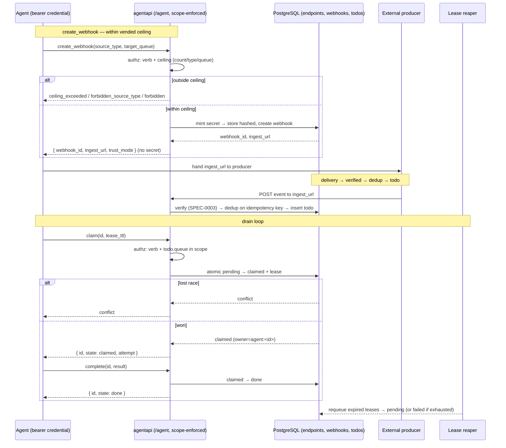

# Design: Agent-Facing MCP Tool Set

## Context

Switchboard vends each agent a scoped endpoint whose whole purpose is to let the agent *do work*:
drain the durable todo queue and stand up the ingestion sources that feed it. SPEC-0006 realizes
[ADR-0012](../../../adrs/ADR-0012-agents-self-manage-webhooks.md) (agents self-manage their own
webhooks within a human-vended ceiling) and the contract shape of
[ADR-0005](../../../adrs/ADR-0005-mcp-tool-and-resource-contract.md). It depends on the shared
event-history contract [SPEC-0005](../mcp-tools/spec.md) for structured-output/error conventions and
on the trust model [SPEC-0003](../../../adrs/ADR-0003-per-provider-ingestion-and-trust-model.md) that
switchboard enforces on every ingested event regardless of who created the webhook.

The surface is implemented in `internal/agentapi/agentapi.go`, mounted under `/agent` on the shared
`chi` router (`internal/server/server.go`). Each request carries a bearer credential resolved by
`store.EndpointByCredHash` to a `store.AuthEndpoint { AgentID, AgentName, OwnerHumanID, ScopeQueues,
ScopeVerbs }`. The handler enforces `hasVerb` (verb in `ScopeVerbs`) and `inScope` (queue in
`ScopeQueues`) before any transition. Todo transitions delegate to the store (`ClaimTodo`,
`CompleteTodo`, `FailTodo`), the acting owner is recorded as `agent:<AgentID>`, and expired leases are
requeued by a background reaper (`server.reaper`, 30s ticker) so a crashed agent never strands work.
Newly-verified todos are fanned out as a lossy doorbell — the durable `todos` table
(`internal/db/migrations/0001_init.sql`, states `pending|claimed|done|failed`) is always the ledger.
As shipped (ADR-0017; [SPEC-0014](../mcp-transport/spec.md)) this doorbell is delivered to attached
MCP sessions as `notifications/claude/channel` on the Streamable-HTTP notification stream, driven by
the store's committed-transition doorbell hook (`store.SetTodoDoorbellHook` → `mcp.PublishTodoReady`).
The original bespoke `/agent/stream` SSE and its `internal/agentapi` `Hub` are retired; the ingest
accept-path keeps a small in-process `ingest.Hub` only as a test-observable new-todo seam.

The webhook self-management verbs (`create_webhook`, `list_webhooks`, `rotate_webhook`,
`delete_webhook`) extend this same scoped endpoint with ceiling-bounded ingestion-source management.

## Goals / Non-Goals

### Goals

- Give agents an autonomous, scoped work surface: claim/complete/fail todos and self-serve their
  ingestion sources without a human in the loop for routine ops.
- Enforce least privilege at the boundary: verb allowlist + queue grant + webhook ceiling.
- Keep switchboard the owner of secrets, verification, and idempotency — the agent handles URLs only.
- Guarantee crash safety: leases + reaper mean no work is stranded by a dead agent.
- Keep the fan-out stream a best-effort doorbell that never gates correctness.

### Non-Goals

- The read-only event-history tools (list/get/replay) — those are SPEC-0005.
- The friending / A2A vend flow and the human web UI (separate capabilities/ADRs).
- Defining the ceiling *storage* fields (owned by the accounts/endpoints capability); this consumes
  them.
- Choosing the concrete MCP transport wiring; auth-by-default and scope enforcement are mandated
  regardless.

## Decisions

### Enforce scope at the boundary, before any mutation

**Choice**: Check `hasVerb` and queue-`inScope` in the handler before delegating to the store.
**Rationale**: An agent's scope is immutable per request; failing closed at the boundary keeps the
store logic simple and makes `forbidden` decisions attributable and uniform.
**Alternatives considered**:
- Enforce in the store: entangles authz with persistence and risks inconsistent checks per verb.

### Leases + background reaper for crash safety

**Choice**: `claim` acquires a time-bounded lease; a 30s reaper requeues expired-lease todos (or
dead-letters when attempts are exhausted).
**Rationale**: An agent can crash mid-work; the durable queue plus lease expiry guarantees the todo
becomes claimable again without human intervention (SQS-style visibility).
**Alternatives considered**:
- No lease (claim = own forever): a crashed agent strands the todo permanently.

### Lossy doorbell stream, durable queue as ledger

**Choice**: `Hub.Publish` never blocks; a full subscriber buffer drops the notification. The todo
stays in the queue.
**Rationale**: Push is a wake-up optimization; correctness must come from claiming off the durable
queue, so the stream can be best-effort without losing work.
**Alternatives considered**:
- Blocking/guaranteed delivery: a slow consumer would back-pressure producers and couple ingestion to
  agent liveness.

### Switchboard mints and holds the secret; reveals it once; verifies per SPEC-0003

**Choice**: On `create_webhook`/`rotate_webhook`, switchboard mints the signing secret and holds the
plaintext server-side (the `signing_secret` column). For a signed-type webhook it reveals that secret
to the agent **exactly once** in the result — the agent pastes it into the producer (GitHub/Stripe/
Slack) — and every later read (`list_webhooks`) returns only the ingest URL. On delivery, the
`/webhooks/w/{token}` receiver recomputes the provider HMAC over the raw body against the held secret
in constant time (`verifyGitHub`/`verifyStripe`/`verifySlack`, `internal/ingest`) and persists `verified=true`/`trust_mode=signed` on a valid signature, failing closed
(401, nothing persisted) otherwise.
**Rationale**: Self-management changes *who created* a webhook, not *how it is verified*. Provider
HMAC verification needs the plaintext secret at both ends — the producer (to sign) and switchboard (to
recompute) — so switchboard must hold a recoverable secret, not a one-way hash, and hand it to the
agent once to configure the producer. Switchboard still owns the trust mode (no agent downgrade) and
never marks a delivery `verified` it did not verify, so a self-created signed webhook is exactly as
trustworthy as a human-configured one.
**Alternatives considered**:
- Store only the hash: precludes recomputing the HMAC, so the secret could never reach the verifier;
  signed deliveries could not be verified at all.
- Reveal the secret on every read: needless additional exposure of key material; one-time reveal at
  create/rotate is sufficient for the agent to configure the producer.

**At-rest encryption (optional hardening, issue #153)**: because the secret must be *recoverable*
(not hashed), the plaintext-in-`signing_secret` design leaves it readable to anyone with DB access.
As optional hardening, setting `SWITCHBOARD_SECRET_ENCRYPTION_KEY` (a 32-byte AES-256 key, base64 or
hex, held **outside** PostgreSQL via env/deploy config) makes `create_webhook`/`rotate_webhook`
persist the secret as AES-256-GCM ciphertext (`enc:v1:<base64(nonce‖ct)>`) instead of plaintext, and
the `/webhooks/w/{token}` delivery path decrypts it transparently to recompute the HMAC — **no
behavior change**, only a stronger at-rest posture. The key is deliberately not co-located with the
ciphertext, so a DB-only compromise yields ciphertext, not live signing secrets. It is off by default
(empty key = legacy plaintext), and a store with a key configured still reads legacy plaintext rows
unchanged (values without the `enc:v1:` marker pass through), so enabling it strands no existing rows.
The envelope primitive lives in `internal/cred` (`SecretBox`) alongside credential hashing; the store
seals on write and opens on read in `internal/store/webhooks.go`. Governing: SPEC-0006 REQ
"Switchboard Owns Secrets, Verification, and Idempotency", ADR-0002 (PostgreSQL is the trust boundary).

## Architecture

The agent endpoint is one component in the switchboard process, sharing the router, store, and hub
with the ingestion and UI surfaces. The sequence below traces the two core flows this capability
owns: a ceiling-checked `create_webhook` (which then produces todos on delivery) and the
claim/complete drain loop over the durable queue.

## Risks / Trade-offs

- **Lossy doorbell can miss a wake-up** → Mitigated: the todo is durable; agents also `list_todos`
  to reconcile, so a dropped push only delays, never loses, work.
- **Agents can churn webhooks noisily within the ceiling** → Mitigated by the count cap, per-endpoint
  rate limits, and the fact that all such actions are logged and attributable to the owning human.
- **Boundary authz must be applied uniformly across every verb** → Mitigated by a shared `transition`
  helper that centralizes verb-check, queue-scope-check, decode, and error-mapping for
  claim/complete/fail; new verbs reuse it.
- **Reaper cadence (30s) bounds how quickly a crashed agent's todo is reclaimed** → Accepted for the
  MVP; the lease TTL and reaper interval are tunable.

## Migration Plan

Greenfield as a spec artifact — the agent surface, store transitions, hub, and reaper already exist
(`internal/agentapi/agentapi.go`, `internal/server/server.go`, `internal/store`,
`internal/db/migrations/0001_init.sql`). The webhook self-management verbs formalize behavior on the
same vended endpoint; no data migration is required beyond the ceiling fields owned by the
accounts/endpoints capability. The old prose contract (`docs/specs/agent-mcp-tools.md`) is superseded
by this spec/design pair.

## Open Questions

- **Resolved (2026-07):** `heartbeat` and the four webhook self-management verbs are implemented on
  the vended surface (`internal/mcp/tools.go`, `internal/mcp/webhooks.go`). The optional `release`
  verb (a MAY under SPEC-0006 "Lease Lifecycle and Crash Safety") is **consciously deferred**, not an
  oversight: an agent that wants to hand a todo back can stop heartbeating and let the lease expire —
  the reaper requeues it, losing nothing — and the operator board already exposes a human release
  action (`POST /todos/{id}/release`, SPEC-0013). Revisit only if lease TTLs grow long enough that
  expiry-as-release costs real latency.
- Whether the friending verbs (`send_friend_request`, `approve`/`deny`, `revoke`) live on this same
  endpoint or a distinct capability is out of scope here; they are noted in the old contract and
  belong to the A2A/vending ADRs.
- The concrete storage of the webhook ceiling (max count, allowed source types, allowed queues) is
  owned by the accounts-and-endpoints capability; this spec consumes those fields.
