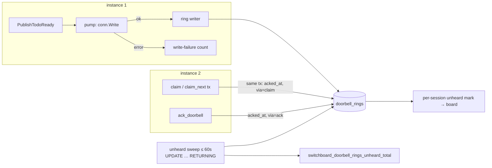

# Design: Doorbell Acknowledgement and End-to-End Self-Test

## Context

`pump` (`internal/mcp/doorbell.go`) writes a `notifications/claude/channel` and logs
`mcp doorbell delivered` when `conn.Write` returns nil. Anthropic's channels contract is
fire-and-forget: Claude Code "drops the events silently and returns no error" when the session did
not load the server as a channel. The deaf-consumer warning (`doorbellDeafThreshold`) counts write
*failures*, so it is blind to that case.

A self-hosting customer lost about a week to it. They concluded that idle wake-up was a
Crush-only capability, when their Claude Code sessions simply lacked the development-channels flag.
[ADR-0030](../../../adrs/ADR-0030-doorbell-acknowledgement-and-self-test.md) decides to record
rings, count an agent's claim as the acknowledgement, and give every endpoint a self-test.
Governing spec: SPEC-0025. Amended: SPEC-0011 (the `ring_id` meta key, and unheard sessions next to
write-failure deafness).

## Goals / Non-Goals

### Goals

- "Delivered" and "heard" are different words everywhere a human reads them.
- An agent or its human proves the whole loop in one action, and gets the flag to add when it
  fails.
- Acknowledgement costs no extra model turn.
- The self-test never pollutes metrics, pulls, hooks or the board.

### Non-Goals

- Guaranteeing delivery. The queue stays the ledger, and the ring record is diagnostics.
- Detecting the client's channel listener directly. That is impossible under the current protocol.
- Testing notify hooks (SPEC-0024). A hook's health is its own row. A future `test_notify_hook`
  is out of scope here.
- Replacing the heartbeat re-ring. Unheard rings are measured, not retried differently.

## Decisions

### A `doorbell_rings` table, written by the instance that rang

**Choice**: one row per successful write, inserted asynchronously by a small per-instance writer
fed from `pump`, which uses a buffered channel and drops with a counter on overflow. Ring ids are
generated before the write so that `meta.ring_id` and the row agree.

**Rationale**: acknowledgement happens on *any* instance: a claim through instance B can
acknowledge a ring that instance A sent. Only shared state can join them. The row count is bounded
by the ring budget (at most 5 pushes per todo plus digests), and a 7-day prune keeps it small.

**Alternatives considered**:
- In-memory ring state per instance: breaks as soon as the claim lands on another instance, and is
  lost on restart.
- Columns on `todos` (`last_ring_acked_at`): no room for digests (no todo) or per-session
  deafness, and it overwrites history on every re-ring.

### Claim is the acknowledgement, written in the claim's transaction

**Choice**: `Claim` and `ClaimNext` run
`UPDATE doorbell_rings SET acked_at = now(), ack_via = 'claim', acked_session_id = $s
 WHERE endpoint_id = $e AND todo_id = $t AND acked_at IS NULL
 RETURNING kind, (unheard_at IS NULL) AS in_window`
in the same transaction. For digests, the same transaction also acknowledges the endpoint's
`kind = 'digest' AND sent_at <= now() AND acked_at IS NULL` rings.

The predicate deliberately does **not** filter on `unheard_at`. A claim that arrives after the
window still records `acked_at` and `ack_via` on the ring, which REQ-3 and REQ-4's "A late claim"
scenario require. The terminal state and the counters are decided by `in_window`:

- `acknowledged_total` increments only for returned rows where `in_window` is true;
- a late ack changes neither the terminal state (`unheard_at` stays set) nor any counter.

The unheard sweep keeps its `acked_at IS NULL AND unheard_at IS NULL` predicate. Both statements
are conditional on the same row, so the row lock serializes a claim and a sweep that race.
Whichever commits first decides the terminal state, and the other either records a late ack or
finds nothing to do (REQ-12 "Concurrent claim and unheard sweep").

**Rationale**: it is free. The agent was always going to claim, and the extra statement is an
indexed update. A separate "ack" message would cost a tool call per ring, which is exactly the
per-ring cost the drivers rule out.

### `ack_doorbell` exists for the cases a claim cannot cover

**Choice**: a self verb `ack_doorbell {ring_id}`.

**Rationale**: three honest cases need it:

1. a digest, which has nothing specific to claim;
2. a busy worker that heard the ring but will not take the work now;
3. a triage agent whose policy says "do not claim" for some kinds.

Without it, all three would read as deaf.

### Two-phase self-test: return, then ring

**Choice**: `test_doorbell` returns immediately and rings about 2 seconds later. The report is
fetched with `get_doorbell_test`.

**Rationale**: a model cannot act on a channel event while one of its own tool calls is still
pending. A blocking test would always report `unheard` for a correctly configured client, which is
the opposite of the truth. Returning first lets the turn end, so the doorbell arrives at an idle
session. That idle session is precisely the case the customer could not get working.

**Alternatives considered**:
- Block for `wait_seconds` and ring immediately: deadlocks every client. However the client
  surfaces a channel event, the model cannot issue the `claim` until its own pending tool call
  returns, and that call is waiting for the claim.
- Ring a *different* session than the caller: the endpoint may have only one session, and the
  question being asked is "does *my* setup hear doorbells?".

### Store-level default filter for synthetic todos

**Choice**: add `synthetic boolean NOT NULL DEFAULT false` to `todos`. Every store query that reads
or moves todos has an explicit `AND NOT synthetic` predicate, and the self-test paths opt in with a
dedicated method (`ClaimSyntheticByID`, `SyntheticTestReport`). A partial index
`WHERE synthetic` keeps the cleanup sweep cheap. SPEC-0023 collectors read through the same
filtered queries.

**Rationale**: a filter that every caller must remember will eventually be forgotten, and the
failure would be a synthetic todo in a real worker's `claim_next`, or a metric off by one per test.
Putting it in the store puts it in one place, and a test enumerates the store's todo queries to
prove it.

**Alternatives considered**:
- A reserved queue name: the doorbell's scope filter (`s.queues[t.Queue]`) would then need a
  special case, and the synthetic todo would stop exercising the real session-selection path.
- A separate table: the test would no longer exercise the real claim path, and that path is half
  of what it proves.

### Hints are data, keyed by verdict and client

**Choice**: a static table in `internal/mcp/doorbelltest_hints.go`, keyed by
`(verdict, client family)`, where the client family comes from `clientInfo.name`: `claude-code`,
`crush`, or other. The exact name strings each client sends are captured from real `initialize`
requests during implementation, not assumed. The docs page renders the same table.

| Verdict | Client | Hints |
|---|---|---|
| `unheard`, `no_stream` | claude-code | Start with `--dangerously-load-development-channels server:switchboard`; on Team/Enterprise with the plugin allowlisted, use `--channels plugin:switchboard@<marketplace>` · Pass `--allowedTools mcp__switchboard`, or a woken session stops at a permission prompt · `claude -p` cannot be woken: use a notify hook · Under Harness, enable its development-channels auto-confirm (Harness ADR-0029) |
| `unheard`, `no_stream` | other | Your client must support `notifications/claude/channel` and keep the notification stream open · See the connect guide |
| `no_session` | any | Nothing is connected to this endpoint. Check the MCP URL and credential; `switchboard doctor` lists attached sessions |
| `write_failed` | any | The stream closed during the write. Retry; if it repeats, the client is dropping its stream |
| `pass` | any | none |

**Rationale**: remediation will change as clients change: flags get renamed, and allowlists
change. One table, rendered to docs and tested, is cheaper to keep true than prose spread across
code paths.

### `doctor` uses the operator API and never the endpoint credential

**Choice**: `switchboard doctor` authenticates as the signed-in human (existing OAuth CLI login)
and calls `/api/v1/endpoints/{ref}/doorbell-tests`. It never asks for or stores an endpoint bearer
token.

**Rationale**: the human owns the endpoint. Asking them to paste the agent's credential into a
second place would be a new way for it to leak. The ownership check is the same one revoke and
presence use, so the operator role cannot reach another tenant's endpoint through it.

## Architecture



### Schema

A new migration, taking the next free number when it is written:

```sql
CREATE TABLE doorbell_rings (
    id                text PRIMARY KEY,                 -- rg_<ULID>
    endpoint_id       uuid NOT NULL REFERENCES endpoints(id) ON DELETE CASCADE,
    session_id        text NOT NULL,
    todo_id           text,                             -- NULL for digests; no FK: synthetic todos are deleted
    kind              text NOT NULL CHECK (kind IN ('todo', 'digest', 'test')),
    queue             text,
    synthetic         boolean NOT NULL DEFAULT false,
    sent_at           timestamptz NOT NULL DEFAULT now(),
    acked_at          timestamptz,
    ack_via           text CHECK (ack_via IN ('claim', 'ack')),
    acked_session_id  text,
    unheard_at        timestamptz
);
CREATE INDEX idx_rings_open_todo ON doorbell_rings (endpoint_id, todo_id)
    WHERE acked_at IS NULL AND unheard_at IS NULL;
CREATE INDEX idx_rings_open_age ON doorbell_rings (sent_at)
    WHERE acked_at IS NULL AND unheard_at IS NULL;

ALTER TABLE todos ADD COLUMN synthetic boolean NOT NULL DEFAULT false;
CREATE INDEX idx_todos_synthetic ON todos (created_at) WHERE synthetic;

CREATE TABLE doorbell_tests (
    id              text PRIMARY KEY,                   -- dt_<ULID>
    endpoint_id     uuid NOT NULL REFERENCES endpoints(id) ON DELETE CASCADE,
    todo_id         text NOT NULL,
    ring_id         text,
    wait_seconds    integer NOT NULL CHECK (wait_seconds BETWEEN 10 AND 300),
    started_at      timestamptz NOT NULL DEFAULT now(),
    expires_at      timestamptz NOT NULL,
    report          jsonb,                              -- frozen at expiry or on claim
    started_via     text NOT NULL CHECK (started_via IN ('mcp', 'api'))
);
CREATE INDEX idx_doorbell_tests_endpoint ON doorbell_tests (endpoint_id, started_at DESC);
```

The migration is additive, and every existing row gets `synthetic = false`. Rollback drops the
two tables and the column.

### MCP shapes

```jsonc
// test_doorbell {"wait_seconds": 60} → result (returns before the ring)
{"test_id": "dt_…", "todo_id": "td_…", "report_after": "2026-09-22T14:04:13Z",
 "server_version": "v0.3.0", "stream_attached": true,
 "channel_capability": {"server_advertised": true,
   "clients": [{"name": "claude-code", "version": "2.1.240"}],
   "note": "the server cannot observe whether the client registered a channel listener; only a claim proves it"}}

// get_doorbell_test {"test_id": "dt_…"} → result
{"test_id": "dt_…", "verdict": "unheard", "server_version": "v0.3.0", "stream_attached": true,
 "channel_capability": {…},
 "delivered": {"written": true, "at": "…", "session_id": "…"},
 "claimed_within_seconds": null,
 "hints": ["Start Claude Code with --dangerously-load-development-channels server:switchboard …",
           "Pass --allowedTools mcp__switchboard …",
           "claude -p cannot be woken: use a notify hook …",
           "Troubleshooting: <docs URL>"]}

// ack_doorbell {"ring_id": "rg_…"} → {"ring_id": "rg_…", "state": "acknowledged"}
```

### Operator API and CLI

```
POST /api/v1/endpoints/{ref}/doorbell-tests            {"wait_seconds": 60}  → 201 start result
GET  /api/v1/endpoints/{ref}/doorbell-tests/{test_id}                        → 200 report

switchboard doctor                      # CLI + server + endpoints overview
switchboard doctor my-agent-k3x9        # plus a live self-test
switchboard doctor my-agent-k3x9 --wait 120s --json
```

### Configuration

| Variable | Default | Range |
|---|---|---|
| `SWITCHBOARD_DOORBELL_ACK_WINDOW` | `15m` | `1m` to `6h`; outside the range fails startup |

## Risks / Trade-offs

- **The window is a guess.** → 15 minutes outlasts an ordinary turn. The per-session mark needs 3
  consecutive unheard rings, and the counter is for trends, not paging on single events. Operators
  tune it.
- **Synthetic todos leak into a read path someone adds later.** → The store default filter, plus a
  test that asserts every exported todo query excludes synthetic rows. The test creates a synthetic
  todo and calls each exported method.
- **Ring writes under load.** → Asynchronous, bounded, and dropped with a counter. A lost ring
  record under-reports; it never blocks or loses a doorbell.
- **Hints go stale as clients change.** → One table, rendered into the docs, covered by a
  snapshot test. Changing a flag is a one-line diff reviewed alongside the docs.
- **A test can wake a worker in the middle of real work.** → Only on the caller's own endpoint, at
  most one outstanding, and the doorbell says no work is needed. The cost is one short turn.

## Migration Plan

1. Migration: `doorbell_rings`, `doorbell_tests`, `todos.synthetic`, and the store default filter.
   This is a no-op for existing behaviour.
2. `meta.ring_id`, the ring writer, claim acknowledgement, the unheard sweep and the metrics.
3. The self verbs `ack_doorbell`, `test_doorbell` and `get_doorbell_test`, with hints.
4. The operator routes, `switchboard doctor`, the board's unheard-session state, and docs (the
   connect-guide FAQ and a troubleshooting page that renders the hint table).

Each step is independently revertible. Removing the verbs leaves ring accounting in place, and
removing the ring writer leaves the verbs reporting `delivered` without a claim verdict.

## Open Questions

- Should the board offer a "run self-test" button on the endpoint card, or leave it to `doctor`
  and the agent? Proposed: offer it, since it is the same route, and the button is the most
  discoverable proof gate for a new user.
- Should an `unheard` session also be exposed to the agent itself, for example in `presence` or a
  future `whoami`, so a model can self-diagnose without being asked? Deferred until self verbs
  have landed.
