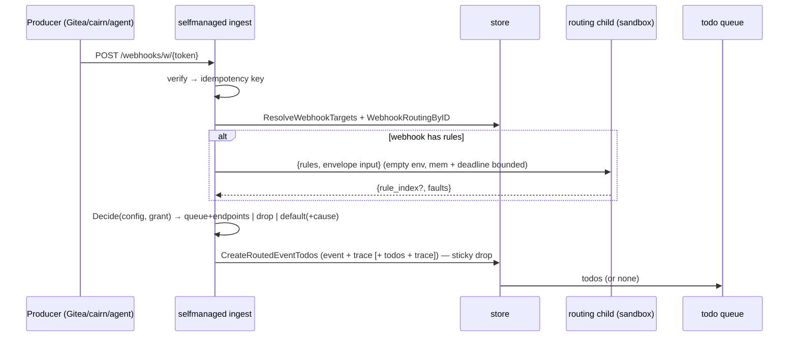

# Design: Event Routing

## Context

Ingestion was linear: verify → normalize → derive idempotency key → create todo on the webhook's target queue (`internal/ingest/selfmanaged.go`, per [SPEC-0001](../webhook-ingestion/spec.md)). Every delivery became a todo. That held while deliveries were scarce forge subscriptions. It breaks with volume producers: cairn `artifact.created` for every paste, Gitea org hooks, and agent chatter on generic ingests.

[ADR-0024](../../../adrs/ADR-0024-event-routing-deterministic-and-llm.md) adds a routing stage between target resolution and todo creation: deterministic jq rules first, an optional LLM triage fallback (Phase 2, not yet built), an explicit default, and a routing trace on every event.

## Goals / Non-Goals

### Goals

- Per-webhook ordered rules (jq filter + `queue`/`drop` action) evaluated sandboxed, first-match-wins
- Compile-time validation of rules; default action always defined
- Routing trace persisted on the event and on the todo
- Dedup contract untouched: routing outcomes never create or consume extra dedup slots
- An authoring loop that does not require guesswork: a dry-run against real stored deliveries
- *(Phase 2)* Opt-in per-endpoint LLM triage with structured output, granted-queue constraint, budget, timeout, deterministic fallback

### Non-Goals

- Producer-side filtering (cairn `ring=true` et al.) — producers may set advisory metadata (`data.metadata.review_requested`) that rules can match, but the mechanism lives here
- Broadcast routing beyond the webhook's existing targets — an action may **narrow** fan-out to a subset of the webhook's delivery targets, but never add one
- Pull-adapter routing ([ADR-0014](../../../adrs/ADR-0014-ingestion-adapters-push-pull.md) pull family) — the same stage applies once pull adapters exist
- A rules UI in the operator board (MCP surface first)

## Decisions

### Routing slot: after target resolution, before any write

**Choice.** The router runs inside the self-managed receiver after the delivery is verified, its idempotency key derived, and its fan-out targets resolved (`ResolveWebhookTargets`). It runs before the event or any todo is written. The event, its trace, and every todo commit in one transaction (`store.CreateRoutedEventTodos`).

**Rationale.**
- The dedup contract ([SPEC-0003](../todo-queue/spec.md)) is defined on (endpoint, idempotency key) and must not depend on routing outcomes.
- Resolving targets first means the rule's endpoint subset is intersected with the same live, authorized set the delivery would otherwise fan out to.

**Alternatives considered.**
- Routing at claim time (workers filter their queue): scatters policy across consumers, breaks the todo-is-a-promise invariant, and cannot drop silently.
- Routing in the producer: rejected at ADR level — producers stay dumb.

### Storage: columns on the rows routing already touches

**Choice.** Migration `0018_event_routing.sql` adds:
- `endpoint_webhooks.routing_rules jsonb NOT NULL DEFAULT '[]'` (the ordered `{id, name, expr, action}` array);
- `endpoint_webhooks.default_action jsonb` (NULL = the target queue on every target);
- `events.webhook_id uuid REFERENCES endpoint_webhooks ON DELETE SET NULL`;
- `events.routing_trace jsonb`;
- `todos.routing_trace jsonb`;
- the index `idx_events_webhook (webhook_id, received_at DESC)`.

**Rationale.**
- Rules are webhook configuration and read with it.
- The trace is written in the same statement as the row it explains.
- `events.webhook_id` is what scopes a dry-run's `event_id` to the webhook's owner.
- `ON DELETE SET NULL` keeps history when a webhook is deleted, rather than blocking the delete.
- Copying the trace onto each todo, rather than joining through `event_id`, keeps every todo read path unchanged apart from one column.
- Additive with zero values meaning "as before": existing webhooks change nothing until an owner saves rules.

**Alternatives considered.**
- A `webhook_routing_rules` table (one row per rule, `position` column): natural ids and ordering, but reordering becomes a multi-row renumbering transaction. The whole list is validated as a unit anyway.

### Rules: jq via gojq, first-match-wins, compiled at save

**Choice.** `expr` is a jq filter whose **first** output decides the match with jq truthiness. Actions are:
- `{"queue": name}`
- `{"queue": name, "endpoints": [ids]}`
- `{"drop": true}`

Expressions compile with [gojq](https://github.com/itchyny/gojq) at save. Saves reject:
- non-compiling expressions;
- forbidden functions, found by a reflective AST walk;
- malformed actions;
- unreachable queues or endpoints.

Evaluation bounds: 50 ms per rule and 250 ms per event. Limits: 32 rules, 4096-byte expressions, 128-byte names, 16 endpoints per action.

**Rationale.** jq is the lingua franca of webhook filtering. gojq is pure Go and exposes no I/O unless asked: no environ loader means an empty `env`, and no input iterator means `input` is refused. Compile-at-save moves every typo from silent runtime misroute to a loud, rule-naming error.

**Examples** (real envelope paths):

```jq
# Drop CI chatter from a Gitea hook
.kind == "workflow_run" or .headers["x-gitea-event"] == "workflow_job"
# Human-requested reviews go to forge
.kind == "pull_request" and .payload.action == "review_requested"
# Only sizeable human markdown pastes are worth an agent's time
.source == "cairn" and .artifact.share_type == "markdown" and .artifact.actor_id != null and .size > 1024
```

**Alternatives considered.**
- EventBridge-pattern JSON matching: less expressive; jq is a superset for our needs.
- CEL/expr-lang: equally capable, but jq matches the operator skill set.

### The envelope: switchboard facts on top, producer data underneath

**Choice.** Rules see one document:
- **Switchboard facts, top level:** `.source`, `.kind`, `.webhook_id`, `.trust_mode`, `.verified`, `.content_type`, `.size`.
- **Producer data:** `.headers` (sanitized, lower-cased, exactly as persisted) and `.payload` (parsed JSON or null).
- **Source projections:** `.artifact` for cairn today.

`routing.Envelope` builds it for both the receiver and the dry-run.

**Rationale.** A producer cannot forge the top-level fields. Using the persisted, sanitized headers means a dry-run against a stored event reproduces what the live delivery saw. For cairn, `.kind` comes from the signed body rather than the unsigned header. `.artifact` passes `tags`/`metadata` through, null today, so rules written for a future cairn field match the day it ships.

### Out-of-process evaluation

**Choice.** `routing.Sandbox` re-executes the switchboard binary as a child for every routed delivery whose webhook has rules. `main` calls `routing.RunChildIfRequested` before anything else. The child protocol and limits:
- **Environment:** empty.
- **Input:** `{rules, envelope input}` on stdin.
- **Work:** the child builds the envelope, runs `routing.Match`, and writes `switchboard-routing-match-v1\n{rule_index?, faults?}`.
- **Memory:** a watchdog in the child exits it (code 3) when `/memory/classes/total:bytes` exceeds 128 MiB.
- **Deadline:** the parent kills it at the event budget + 750 ms.
- **Concurrency:** at most two children run. A delivery waits up to one second for a slot, then routes by default with `sandbox_busy`.
- **Failure:** any other failure routes by default with `sandbox_failure`.

The parent then runs `routing.Decide` over its own configuration and grant. Webhooks with no rules never spawn.

**Rationale.** gojq's context check bounds time between steps but not memory:
- `"x" * 1e9` is one uninterruptible allocation (gojq caps it at 2 GiB).
- A short pipe of `(. + .)` doubles a string per step faster than the check notices.
- Serializing or comparing a structure of shared references is exponential within one builtin.

Every jq subset that closes those also stops being useful for routing, and the service is multi-tenant. A child process makes memory and CPU bounds hard. Returning only a rule index means the child cannot name a destination. Latency (a process start per routed delivery) is acceptable at webhook volume.

**Alternatives considered.**
- In-process with an allowlisted jq subset: every candidate subset still amplifies through concatenation, serialization, or deep comparison.
- A long-lived evaluator process pool: cheaper per call, but one runaway rule poisons state shared with other tenants' evaluations.

### Default action

**Choice.** The webhook's `target_queue`, on every target, remains the default unless the owner sets `default_action` (`queue`, with optional `endpoints`, or `drop`). An unreachable configured default falls back to the target queue with cause `default_not_granted`.

**Rationale.** Existing webhooks keep today's behavior with zero migration; opt-in tightening is per-webhook.

### Actions narrow fan-out; the grant is re-applied per delivery

**Choice.** The grant is:
- the webhook's target queue;
- the owner endpoint's allowed webhook queues;
- the webhook's live, authorized delivery targets.

`endpoints` must be a subset of those targets at save. At delivery the grant is recomputed and the subset intersected again. A matched rule that no longer fits takes the default with cause `rule_not_granted`. It does not fall through to later rules, so a revocation never silently promotes a broader rule.

**Rationale.** Cairn signs every outbound target with one secret, and switchboard mints a secret per signed webhook. Agent handoff from cairn therefore needs **one** webhook that reaches every pool, and rules that pick the pool. Letting a rule add targets would bypass `add_webhook_route`'s ownership and friendship checks. Narrowing preserves them.

### LLM triage: registry-backed, schema-validated, always-fallback *(Phase 2)*

**Choice.** `llm_triage` config on the endpoint: `{provider, model, queues: [{name, description}], min_confidence, prompt_budget_per_minute, prompt_budget_per_day, include_payload: false}`. The call uses the runtime provider registry ([ADR-0020](../../../adrs/ADR-0020-runtime-provider-registry.md)). The model must answer `{"queue": "...", "confidence": 0..1, "reason": "..."}`, validated strictly. Fallback on:
- unknown queue;
- low confidence;
- transport failure;
- timeout;
- exhausted budget.

**Rationale.** Constrained to granted queues, the worst case of a bad model day is "everything takes the default".

**Status.** Not built. The trace's `stage` enum reserves `llm` for it.

### Drop semantics: spend the dedup slot, keep the receipt, stay dropped

**Choice.** On `drop`, persist the event row (with trace and `webhook_id`), spending the `(source, external_id)` dedup slot. Create no todo; no hub publish, no doorbell. The receiver answers `{"dropped": true}`.

When a redelivery finds an existing event whose stored trace is a drop, `CreateRoutedEventTodos` drops again **regardless of the new decision**. This resolves the earlier open question: dedup alone was not sufficient. A drop leaves no live todo for dedup to collapse onto, so an owner who later loosened the rules would have seen redeliveries of old noise become work.

**Rationale.** Without the event row, "where did my webhook's deliveries go?" is unanswerable. Without stickiness, routing would leak into the dedup contract.

### Trace: one JSON value, on the event and on each todo

**Choice.** The trace takes the shape `{"stage": "rule"|"default", "cause"?, "rule_index"?, "rule_id"?, "rule_name"?, "action", "faults"?: [{"rule_index", "rule_id"?, "cause", "detail"?}]}`.
- **Default causes:** `no_match_default`, `rule_not_granted`, `default_not_granted`.
- **Fault causes:** `timeout`, `error`, `compile_error`, `budget_exhausted`, `sandbox_failure`, `sandbox_busy`.
- **Sandbox-level faults** carry `rule_index: -1`.

**Rationale.** A todo that cannot explain why it exists trains owners to distrust the queue. Writing the trace atomically with the rows keeps history honest.

### Rule management surface

**Choice.** Seven MCP verbs join the webhook verb family ([SPEC-0006](../agent-tools/spec.md)):
- `list_webhook_rules`
- `set_webhook_rules`
- `add_webhook_rule`
- `update_webhook_rule`
- `move_webhook_rule`
- `remove_webhook_rule`
- `test_webhook_rules`

Ownership is checked at the human, as the ADR-0022 route verbs do. Mutations are a read-modify-validate-write inside `store.UpdateWebhookRouting`'s row lock.

**Rationale.** Endpoints are agent-self-managed ([ADR-0012](../../../adrs/ADR-0012-agents-self-manage-webhooks.md)); rules are webhook config, so they ride the same surface and auth. The switchboard REST API and CLI have no webhook-management surface to mirror.

## Architecture



## Risks / Trade-offs

- **Rule-order sensitivity** → first-match-wins is documented, rules carry ids and names, and the trace names the matched index; a future lint can warn about shadowed rules.
- **Process start per routed delivery** → a few milliseconds at webhook volume. The two-child cap bounds aggregate memory; under a flood, deliveries degrade to their default (`sandbox_busy`) rather than queueing without bound.
- **Faults degrade to the default, not to drop** → a payload that makes a rule blow up gets default routing. Work is never lost, but noise a rule meant to drop can leak into the default queue. The trace records why.
- **A runaway rule can starve later rules in the same child** → later rules may record `timeout`/`budget_exhausted` faults; bounded and visible.
- **Cairn freshness window** → cairn signs no timestamp header, so freshness comes from the signed body's `created_at` (default 300 s). A cairn backlog older than that, e.g. after a long switchboard outage, is refused with 401 and abandoned by cairn.
- **gojq divergence from real jq** → the save-time compiler is the compatibility contract (if it compiles in the sandbox, it routes).
- *(Phase 2)* **LLM cost runaway / payload egress** → budgets with operator ceilings; `include_payload` off by default.

## Migration Plan

Additive migration `0018_event_routing.sql`. Existing webhooks behave identically until an owner saves rules. Rollback = reset `routing_rules` to `[]` and `default_action` to NULL. The trace and webhook-id columns are inert to older readers.

Operational note: endpoints vended before this change hold the verb list of their day. They need the seven rule verbs added to `scope_verbs`, and `cairn` added to `webhook_source_types`, to use this surface.

## Open Questions

- Shadowed-rule linting in `set_webhook_rules` (warn when a rule can never match) — cheap and useful; deferred.
- Should cairn emit `data.metadata` (e.g. `handoff_to`, `review_requested`) and `tags`? The envelope already passes them through; today the title-prefix convention stands in. Producer-side, tracked in cairn.
- Dynamic destinations (a rule whose action queue is computed from the payload, constrained to the grant) — not built; one static rule per destination keeps every destination validated at save.
