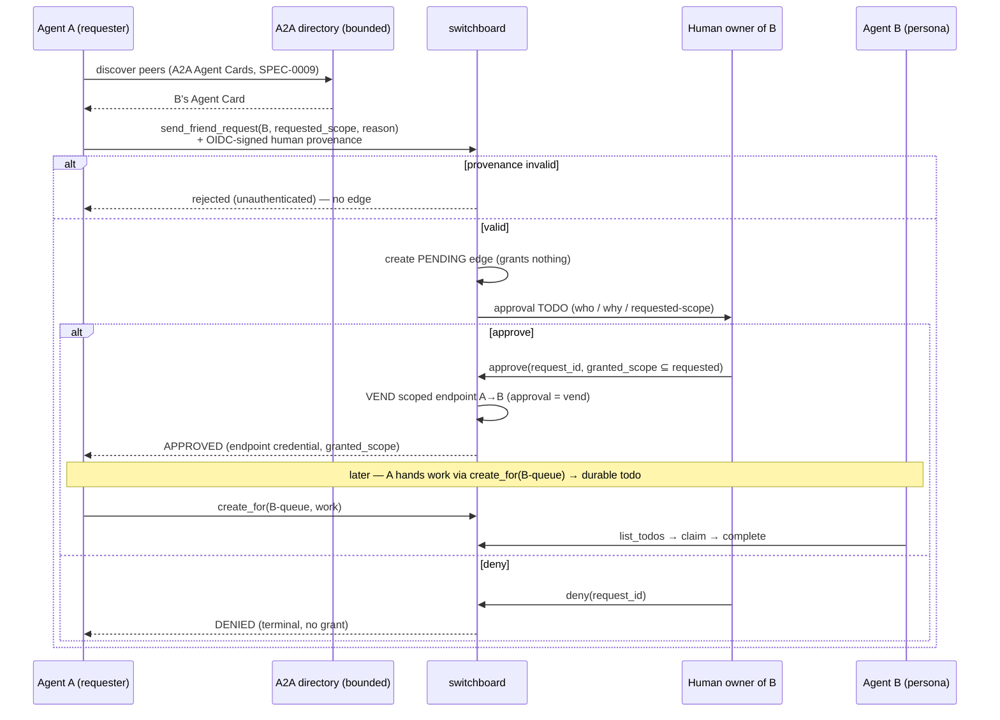
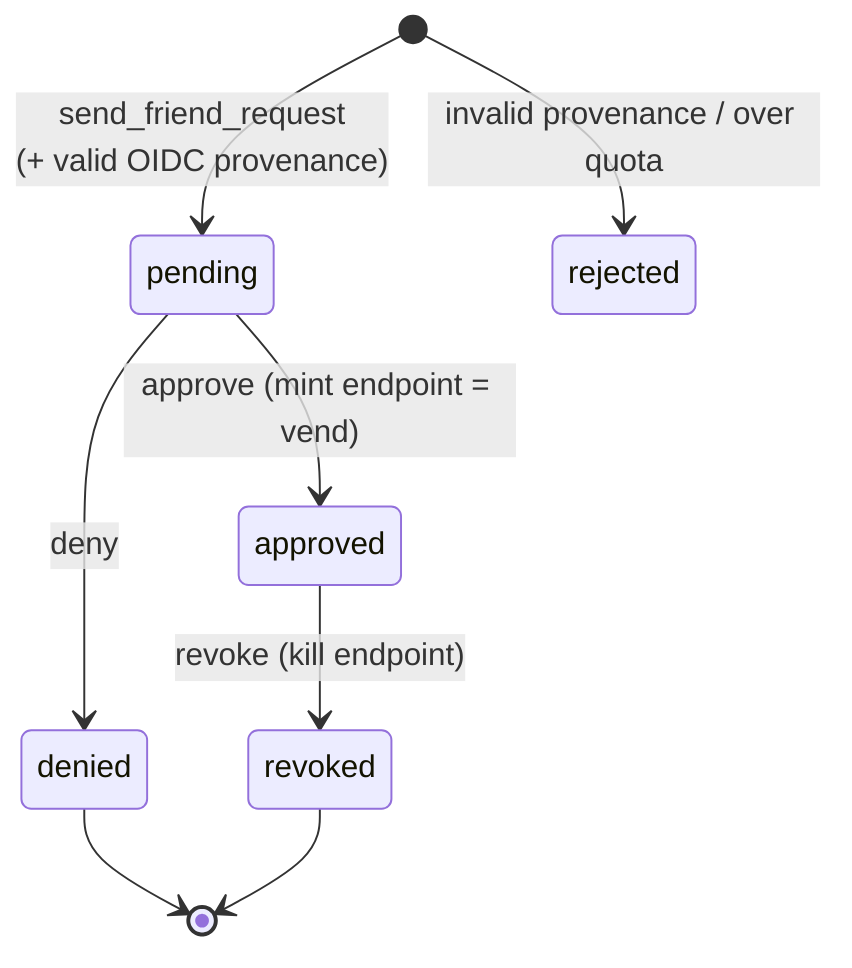

# Design: A2A Discovery + Human-Vended Friending

## Context

Switchboard has two protocols in play that are easy to conflate. **MCP** connects an agent to
switchboard's *tools* (the todo/webhook verbs on a vended endpoint,
[ADR-0008](../../../adrs/ADR-0008-human-principal-vended-endpoints.md), realized in
`internal/agentapi/agentapi.go`). **[A2A](https://a2a-protocol.org/)** connects an agent to *other
agents* — discovery and announcement — with personas published as Agent Cards (SPEC-0009,
[ADR-0009](../../../adrs/ADR-0009-personas-as-scoped-agent-cards.md)). The open question this capability
answers: when agent A wants agent B to do work, how does that happen and who authorizes it?

A2A ships a direct peer task transport, but using it would let one agent hand another work with no human
in the loop and no durable record — the exact accountability hole
[ADR-0008](../../../adrs/ADR-0008-human-principal-vended-endpoints.md) was built to close. SPEC-0010 and
[ADR-0010](../../../adrs/ADR-0010-a2a-discovery-human-vended-friending.md) resolve this by **splitting by
strength**: A2A discovers, a human-approved **friend request** vends access, and cross-agent work flows
as durable **todos** ([ADR-0007](../../../adrs/ADR-0007-todos-as-core-primitive.md)) — never as A2A
tasks.

The vend target already existed in code when this spec was drafted: the `endpoints` table and
`store.CreateEndpoint` / `store.RevokeEndpoint` (`internal/store/agents.go`) mint and kill scoped
credentials, with verb+queue scope enforced at the boundary. The friending layer itself — friend-edge
table, request/approve/deny/revoke store code, A2A intake route — did **not** yet exist; it has since
shipped (`internal/db/migrations/0005_friend_edges.sql`, `internal/store/friends.go`,
`internal/server/friend_intake.go`, and the web-UI friend handlers in `internal/web/friends.go`),
reusing the existing endpoint substrate as the thing approval mints, and the spec's frontmatter status
reflects that.

## Goals / Non-Goals

### Goals

- Define the friend-edge lifecycle `pending → approved | denied`, `approved → revoked`, where the pending
  edge grants nothing and approval *is* the vend.
- Enforce narrow-only approval (`granted_scope ⊆ requested_scope`) and per-direction / revocable /
  non-transitive semantics.
- Require verifiable OIDC-signed human provenance on every request.
- Route cross-agent work as todos; expose no A2A direct-task intake.

### Non-Goals

- Defining personas / Agent Cards themselves — SPEC-0009.
- Implementing A2A direct task delegation — deliberately excluded.
- Specifying OIDC verification internals or the deferred non-passkey `amr`/`acr` step-up — that is
  [ADR-0011](../../../adrs/ADR-0011-identity-assurance-oidc-passkey-deferred.md).

## Decisions

### Approval is the vend

**Choice**: The pending edge confers nothing; the human's approval is the single act that mints a scoped
MCP endpoint. There is no separate vend step.
**Rationale**: Keeps human vending the one and only access gate
([ADR-0008](../../../adrs/ADR-0008-human-principal-vended-endpoints.md)) — no autonomous agent-to-agent
grant is ever possible. Reuses the existing `endpoints` substrate as the grant.
**Alternatives considered**:
- A2A end-to-end (discover + direct delegate): bypasses human vending; peer tasks are ephemeral,
  undurable, unowned. Rejected.
- Auto-approve within a trusted directory: reintroduces autonomous grants. Rejected.

### Narrow-only at approval

**Choice**: `granted_scope` MUST be a subset of `requested_scope`; the human can hand back less than
asked, never more. The minted endpoint's scope is `requested ∩ human-narrowing`.
**Rationale**: The requester bounds the ceiling; the human bounds it further. Neither can be widened by
the other, so a grant is never a surprise to either party.
**Alternatives considered**:
- Free-form human-authored scope at approval: could grant *more* than requested, surprising the
  requester and defeating least authority. Rejected.

### Work transports as todos, not A2A tasks

**Choice**: After a grant, A hands B work via `create_for` into B's granted queue; switchboard exposes no
A2A direct-task delegation intake.
**Rationale**: Cross-agent work becomes durable, owned, dedup'd, leaseable, and traceable — a first-class
todo ([ADR-0007](../../../adrs/ADR-0007-todos-as-core-primitive.md)) — instead of an RPC that vanishes on
crash. Interop with pure-A2A delegators is intentionally limited to discovery.
**Alternatives considered**:
- Accept A2A peer tasks and persist them internally: re-implements the todo queue behind a lossy
  transport and blurs the "A2A is discovery-only" line. Rejected.

### Per-direction, revocable, non-transitive edges

**Choice**: A→B and B→A are separate grants; either is revocable instantly and one-sidedly; each edge is
opaque to every other.
**Rationale**: Minimal, legible trust graph — a compromise of one edge does not cascade, and no traversal
leaks a friend's friends/personas/queues.
**Alternatives considered**:
- Symmetric friendship (approve once, both directions): grants access the approver never intended.
  Rejected.
- Transitive trust (friend-of-a-friend): leaks the graph and enables lateral movement. Rejected.

## Architecture

Discovery is outward (A2A cards); intake is inward and human-gated (a friend request that becomes a todo
the human approves); the approval mints a scoped endpoint on the existing `endpoints` substrate; work
then flows as todos. The sequence below is the load-bearing flow.

The friend edge itself would be a new table; its lifecycle drives the existing endpoint substrate.

## Risks / Trade-offs

- **First-interaction latency** — every new (direction, scope) needs a human approval → mitigated because
  approval is one-time per (direction, scope); subsequent work needs no re-approval until scope changes
  or is revoked.
- **Discovery/friending is an attack surface** (unsolicited requests, flooding) → bounded directories,
  per-requester quotas/rate limits, legible approval todos, and OIDC-signed provenance.
- **No A2A delegation interop** → intentional; durability + human vending are the whole point. Documented
  so integrators know discovery is the only A2A surface.
- **Provenance trust boundary** — today switchboard trusts the Pocket ID issuer and does not enforce
  `amr`/`acr` step-up because Pocket ID is passkey-only; before federating to any non-passkey IdP it MUST
  require a phishing-resistant `amr`/`acr` claim on approvals
  ([ADR-0011](../../../adrs/ADR-0011-identity-assurance-oidc-passkey-deferred.md)). Recorded as deferred
  hardening, not silent.

## Migration Plan

At drafting time the friending layer was unimplemented; the endpoint substrate it mints onto already
existed (`endpoints` table, `store.CreateEndpoint`, `store.RevokeEndpoint`, boundary enforcement at
the vended surface). Realizing this spec required (all four steps have since shipped):

1. A migration adding a `friend_edges` table keyed by (from_persona, to_persona, direction) with a
   `state` column (`pending|approved|denied|revoked`), the `requested_scope`, `granted_scope`,
   `reason`, `provenance_verified`, and a link to the minted `endpoint_id`.
2. A unique/quota index to enforce per-requester rate limits and the pending-edge grants-nothing
   invariant.
3. Store methods: create pending edge (after provenance validation), approve (validate
   `granted_scope ⊆ requested_scope`, then `CreateEndpoint` in the same transaction), deny, revoke
   (`RevokeEndpoint` + mark edge revoked).
4. A2A intake route for `send_friend_request` (validating OIDC-signed human provenance), the
   approval-todo emitter, and web-UI approve/deny/revoke handlers, wired in
   `internal/server/server.go`.

No data migration of existing rows is needed.

## Open Questions

- **Resolved (2026-07): implemented.** The friend-edge table
  (`internal/db/migrations/0005_friend_edges.sql`), request/approve/deny/revoke store code
  (`internal/store/friends.go`), and the A2A intake route (`internal/server/friend_intake.go`,
  `POST /a2a/friend-requests`) all exist in the current tree; the drafting-time gap this design
  originally recorded is closed.
- **Scope-narrowing representation.** How `granted_scope ⊆ requested_scope` is checked for queues/verbs
  (set containment) and stored alongside the edge vs. only on the minted endpoint is TBD.
- **Bounded-directory mechanics.** What constitutes the "known set" of directories, how personas join
  one, and how discovery is bounded to it (interacts with SPEC-0009 discoverability) is unresolved.
- **Deferred non-passkey hardening.** The exact phishing-resistant `amr` value / `acr` level to require
  once a non-passkey IdP enters the trust set is TBD — there is no standard "passkey" `amr`
  ([ADR-0011](../../../adrs/ADR-0011-identity-assurance-oidc-passkey-deferred.md)).
- **Quota parameters.** The concrete per-requester request ceiling and pending-edge cap per target are
  not yet fixed.
