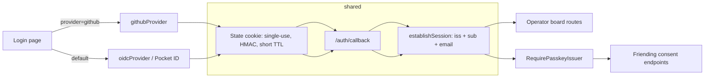

# Design: GitHub Login for the Operator Web UI

## Context

Switchboard's human auth (`internal/auth`) is a single-provider OIDC flow
against Pocket ID: `Login` / `Callback` handlers, a state cookie, session
establishment, `RequireHuman` middleware. ADR-0011's "trust the issuer"
policy is conditioned on every trusted issuer being passkey-only, with a
recorded deferred-hardening requirement. Adding GitHub — a non-passkey,
non-OIDC provider — both extends the login surface and fires that
requirement. See SPEC-0021 (`spec.md`) for the normative requirements.

## Goals / Non-Goals

### Goals

- One session type; provider difference is provenance + assurance class.
- Consent actions (capability minting) are impossible from a GitHub session.
- A third provider is config + one file.
- Zero GitHub API traffic outside the login callback.

### Non-Goals

- Generic `amr`/`acr` assurance-claim machinery (ADR-0026 Option C) — no
  second assuring IdP exists to feed it.
- Changes to the MCP OAuth authorization server (ADR-0019) or agent-facing
  surfaces — this is human web login only.
- Replacing Pocket ID or the dev login path.

## Decisions

### Issuer-gated consent, not claims enforcement

**Choice**: `RequirePasskeyIssuer` middleware wraps every consent endpoint
(friending approve/reject today; any future capability-minting route by
policy). It reads the session's recorded `iss` and allows only the
passkey-only IdP. GitHub sessions get 403 with a re-auth link.
**Rationale**: ADR-0011's requirement is "a consent action must not be
authorizable by a phishable login." GitHub supplies no assurance claims to
check, so the strongest enforceable signal is the session issuer. One
middleware and an allow-list beat speculative claims plumbing that would
either block GitHub outright or be quietly bypassed for it.
**Alternatives considered**:
- Trust GitHub as any other issuer: rejected — voids a recorded MUST-DO
  security condition.
- Generic assurance claims now: rejected — nothing to feed them; collapses
  back to issuer allow-listing for GitHub anyway.

### Provider interface behind the existing routes

**Choice**: A minimal provider interface (start/finish login, id, display
name) implemented by the existing Pocket ID OIDC code and a new GitHub
provider; `/auth/login` and `/auth/callback` gain a `provider` query
parameter. The OIDC state cookie is reused as the GitHub `state` carrier.
**Rationale**: Mirrors cairn's ADR-0019 decision — one route tree, one state
mechanism, one session-establishment path; a parallel `/auth/github/*` tree
would duplicate security-critical code that drifts.

### Session records `iss`/`sub`; token dropped at callback exit

**Choice**: `establishSession` gains issuer and subject fields; the GitHub
access token lives only inside the callback.
**Rationale**: Provenance auditing and the consent gate both need `iss`
persisted; token containment avoids per-request GitHub calls (rate limits)
and keeps credentials out of every store.

## Architecture

Package layout: `internal/auth/provider.go` (interface + registry),
`internal/auth/github.go` (GitHub provider); `auth.go` grows the issuer gate
middleware and the `iss`/`sub` session fields. Login template gains one
conditionally rendered button.

## Risks / Trade-offs

- **Consent UX speed bump** → deliberate: re-auth via Pocket ID at the
  capability-minting moment is the security property, not a bug; the 403
  response carries a direct re-auth link to minimize friction.
- **Issuer trust weakens if Pocket ID offers non-passkey methods** → not
  automatable today (no OIDC signal exposes Pocket ID's method mix);
  recorded as a quarterly operational check in the confirmation criteria of
  ADR-0026.
- **GitHub outage blocks new logins** → existing sessions unaffected; Pocket
  ID path remains; acceptable for a single-tenant deployment.
- **Two client credentials to rotate** → stored like the OIDC secret; rotation
  is ops, not code.

## Migration Plan

1. Land provider interface + GitHub provider + issuer gate + login button
   (feature-flagged off unless GitHub credentials configured).
2. Configure credentials on the deployment; verify board access with a
   GitHub session and a 403 on a consent action.
3. Update the identity runbook with the quarterly passkey-only check.
4. Rollback: clear GitHub credentials — button disappears, route 404s,
   Pocket ID flow and consent gate unaffected.

## Open Questions

- Should GitHub logins be allow-listed (org membership or explicit email
  list) for this deployment? Default plan: any verified-email GitHub account,
  matching cairn; the single-operator reality makes enumeration a non-issue
  today.
- When a third IdP with real assurance signals arrives, revisit ADR-0026
  Option C (generic `amr`/`acr` enforcement) replacing the issuer gate.
