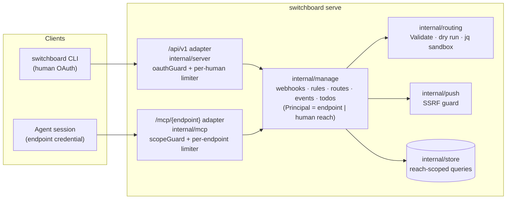

# Design: Human API and CLI Parity for Webhooks, Rules, Routes, Events and Todos

## Context

The human API (`/api/v1`, `internal/server/api.go`) was built for ADR-0023's MVP loop: vend an
endpoint, list and revoke endpoints, push a todo, list agents. The CLI (`cmd/switchboard`) covers all
five routes, so "CLI parity with the API" already holds. The gap is one level up: everything a human
needs to *operate* agents — webhooks, routing rules, routes, delivery history, todos — exists only as
MCP verbs, callable with an agent's endpoint credential, or partly on the board.

That gap has a cost. On 2026-09-27 a human asked whether four issues had reached the Qwen lanes. The
answer depended on routing rules nobody could read without an agent credential: Claude Code
deliberately has no Switchboard MCP (dotfiles drop it on every host), and the CLI has no rule
commands. The same day, an incident needed "which events faulted on this webhook?", which is
`list_webhook_events` and again MCP-only.

The MCP verbs sit on three different ownership scopes (surveyed at `e793a42`):

| Family | Store takes | Examples |
| --- | --- | --- |
| Webhook lifecycle, todos | the endpoint id | `ListWebhooks(endpointID)`, `CreateWebhook(endpointID, …, max)`, `ListTodos(endpointID, queues, …)`, `GetTodo(endpointID, id)` |
| Rules, routes | the owning human id | `WebhookRoutingForHuman(webhookID, humanID)`, `UpdateWebhookRouting(…, humanID, mutate)`, `WebhookOwnerEndpointForHuman` |
| Event history, replay | the caller `AuthEndpoint` (human-level reach via `eventInReach`) | `ListEventHistory(caller, filter)`, `EventHistoryByID(caller, id)` |

The board already has human-scoped todo queries and actions (`ListTodoItems`, `GetTodoOperatorOwned`,
`RetryTodoOperatorOwned`, …). No human-scoped webhook list and no human-only event-history entry
point exist. `/api/v1` has no rate limiter, only `oauthGuard` and a 64 KiB body cap. Rule, route and
webhook changes write only slog lines. There is no audit table.

SPEC-0033 (teams and tenancy) is approved but not yet in code: there is no reach type in
`internal/store` at `e793a42`. This design is written against *reach*, so it works unchanged whether
it lands before or after teams.

## Goals / Non-Goals

### Goals

- Every MCP verb a human would use to manage an agent has a `/api/v1` route and a CLI command.
- One implementation per behavior. Validation, grants, ceilings, dry runs and SSRF checks are shared
  code, never duplicated.
- Parity is enforced by a test, so the next MCP verb cannot silently skip the API.
- Tenancy by construction: every new store method takes a reach value (SPEC-0033).
- A human can answer "why didn't this reach the lane?" from a terminal: `webhook rules get`,
  `webhook rules test --event`, `event list --disposition`, `todo list --queue`.

### Non-Goals

- New capabilities. Every route mirrors an existing verb or board action.
- Human lease verbs (`claim`, `claim_next`, `heartbeat`) through the API. Humans act on todos through
  the board actions, not by holding leases.
- Bulk replay ("replay every faulted delivery"). `replay_failed` is only an MCP error code, not a
  verb. The CLI can loop over `event list --disposition faulted`, and a bulk route would need its
  own rate and SSRF design.
- An audit table for rule and route changes (Open Questions). This spec requires structured logs.
- Team management routes. SPEC-0033 REQ "Human API for Teams" owns them. This spec only reuses reach.
- Instance-operator surfaces. Per ADR-0038 the operator may bound tenant data, never read it.
- A generated OpenAPI document (Open Questions).

## Decisions

### It is the human API, not the operator API

**Choice**: Name the surface the *human API* in the spec, docs and CLI help. Keep the Go names
(`apiHandler`, `oauthGuard`, "operator OAuth" in code) as ADR-0038 allows.
**Rationale**: ADR-0038 made *operator* mean the instance operator. These routes read and change
tenant data, which that ADR forbids the operator to see. Calling them operator routes would invite
someone to add an operator-wide variant later.
**Alternatives considered**:
- Keep "operator API": rejected, since it contradicts ADR-0038's terminology and its test ("bound,
  never route, copy or reveal").

### Resource layout follows the store's scope

**Choice**: Endpoint-scoped resources nest under the endpoint (`/endpoints/{ref}/webhooks`).
Resources whose ids are globally unique and human-scoped hang off the root: `/webhooks/{id}/rules`,
`/webhooks/{id}/routes`, `/events/{id}`, `/todos/{id}`. The two cross-reach lists (`GET /webhooks`,
`GET /todos`) take an `endpoint` filter instead of forcing a nested path.
**Rationale**: Creating a webhook draws on one endpoint's vend-time ceiling, so the endpoint belongs
in the path. Rules and routes are gated by webhook ownership, not by endpoint (that is how
`webhook_rules.go` already works), so nesting them under an endpoint would add a check that means
nothing. It is also the shape the CLI wants: `webhook rules get W` should not make the human remember
which endpoint owns `W`.
**Alternatives considered**:
- Everything under `/endpoints/{ref}/…`: rejected. It is redundant for human-scoped resources, and
  wrong for events, which carry an owner, not a caller endpoint.
- A flat RPC surface (`POST /api/v1/call {verb, args}`) mirroring MCP 1:1: rejected. It would inherit
  the endpoint-caller model the human API does not have, would lose HTTP semantics (`404`, `409`,
  `429`), and would make every future verb a human route by accident rather than by decision.

### Extract a shared management package; both surfaces call it

**Choice**: Move each verb's body (argument validation, ownership and grant checks, ceilings,
`mutateRules`, the dry run, `authorizeRouteTarget`, the replay target resolution and guard) from
`internal/mcp` into a new `internal/manage` package. Each function is parameterized by a `Principal`:
either a calling endpoint (MCP) or a human reach (API). The MCP handlers become thin adapters that
decode arguments and map sentinel errors to MCP codes. The API handlers do the same for HTTP.
**Rationale**: The dangerous parts of this surface — grants, the dry run, the conflict check, the SSRF
guard — have subtle rules that already needed issues (#270 for the owner-wide grant, #194 for event
reach). A second copy would drift. Sharing makes REQ "Shared Implementation With MCP" testable: one
table-driven test runs each case through both adapters and compares outcomes.
**Alternatives considered**:
- Call the MCP handlers from HTTP with a synthesized `AuthEndpoint`: rejected. The API caller has no
  endpoint, so picking one of the human's endpoints as a stand-in would silently narrow or widen
  reach, which is exactly the pattern SPEC-0033 is removing.
- Reimplement in `internal/server`: rejected for drift, as above.

### Events need a human-reach store entry point

**Choice**: Add `ListEventHistoryForReach(ctx, reach, filter)` and `EventHistoryByIDForReach(ctx,
reach, id)`, and express `eventInReach`'s predicate in terms of reach so both callers share one SQL
fragment. The MCP path computes the endpoint's effective reach and calls the same functions.
**Rationale**: SPEC-0033 REQ "Owner-Scoped History Reads" already requires owner scoping on the
`/api/v1` equivalents. The current functions take an `AuthEndpoint` only because MCP was the only
caller.

### Replay uses the event's owning endpoint

**Choice**: The API resolves the replaying endpoint from the event's `endpoint_id`. Its owned replay
targets supply the default. Its replay bucket (`replayRL`, keyed by endpoint id) is charged. An
explicit `target_url` goes through the same owned-or-SSRF-valid check as MCP.
**Rationale**: SPEC-0033 REQ "Owned Replay Targets" makes targets belong to the endpoint that
replays. Sharing the bucket means a human with the CLI cannot multiply an endpoint's replay budget.
An event with a `team_id` owner and no endpoint has no default target, so it must name one.

### `PUT …/rules` keeps the stored params unless told otherwise

**Choice**: `PUT` without a `params` key keeps the stored params. Clearing requires `"params": null`
or `{}` in the body (the CLI sends the file as written, so the file says it). The CLI says when it
kept them.
**Rationale**: ADR-0025 names this footgun. Rule packs fail closed without `params.repo_prefixes`,
so a careless replace silently stops every lane. SPEC-0026 REQ-4 already requires
`set_webhook_rules` to keep omitted params, and a new surface should not copy the trap while MCP
catches up. Keeping is what a human editing rules expects, and it is what Joe asked for
(2026-09-29): a rules file written by hand, or one `webhook rules get --json` printed before params
were added, must not wipe them.
**Alternatives considered**:
- Refuse a `PUT` without `params` while params are stored (this spec's first draft): rejected. It
  also prevents the wipe, but makes every rules-only edit restate the params, and a stale copy of
  them in a hand-kept file is its own way to change them by accident.

### Todo actions reuse the board's human-owned functions

**Choice**: `retry`, `release`, `complete` and `fail` call `*TodoOperatorOwned`, and reads call
`ListTodoItems` and `GetTodoOperatorOwned` plus `TodoAttempts`. Those functions gain reach
parameters when SPEC-0033 lands.
**Rationale**: The board already has correct, attempt-recording human actions (SPEC-0034 REQ-12,
REQ-13). The API should behave exactly like the board.

### Rate limiting per human on `/api/v1`

**Choice**: A token bucket keyed by human id, using the existing `internal/mcp/ratelimit.go` limiter,
moved to a shared package. Reads 20/s burst 40, writes 5/s burst 20.
**Rationale**: Adding write routes that trigger the jq sandbox (dry runs) and outbound HTTP (replay)
to an unlimited surface would let one token exhaust the sandbox share. The numbers match MCP's
per-endpoint read limit and are stricter for writes.

### Parity as a test

**Choice**: Two tests in `internal/server`: MCP registry → API route table (with an allowlist that
states a reason for each entry), and API route table → CLI dispatch table. The API route table is
declared once as data (method, path, handler, mirrored verb) and mounted from that data, so the test
reads the same table the router uses.
**Rationale**: CLAUDE.md's verification rule: check the property, not a proxy. "The CLI has lots of
commands" is a proxy; "no registered verb lacks a route or a stated reason" is the property.

## Architecture



A rule save from the CLI:

```mermaid
sequenceDiagram
    participant H as Human (CLI)
    participant A as /api/v1 adapter
    participant M as manage.AddRule
    participant S as store
    participant R as routing
    H->>A: POST /api/v1/webhooks/W/rules {expr, action}
    A->>A: oauthGuard → human; limiter(write)
    A->>M: AddRule(Principal{reach}, W, rule)
    M->>S: WebhookRoutingForReach(W, reach) (read, no lock)
    M->>S: ResolveWebhookTargets / EndpointScopeQueues (grant)
    M->>R: Validate(candidate, grant)
    M->>S: RecentWebhookEvents(W, 50)
    M->>R: dry run candidate over 50 deliveries
    M->>S: UpdateWebhookRouting(W, reach, compare-and-set)
    S-->>M: saved | conflict
    M-->>A: config + grant | sentinel error
    A-->>H: 201 JSON | 400/403/404/409/503 {error, code}
```

### Route → shared function → store

| Route | `internal/manage` (from) | Store |
| --- | --- | --- |
| `GET /webhooks` | `ListWebhooks` (new, reach) | `ListWebhooksForReach` (new) |
| `GET/POST /endpoints/{ref}/webhooks` | `ListWebhooks`, `CreateWebhook` (webhooks.go:199,256) | `ListWebhooks`, `CreateWebhook` |
| `POST /webhooks/{id}/rotate`, `DELETE /webhooks/{id}` | `RotateWebhook`, `DeleteWebhook` | `RotateWebhookSecret`, `DeleteWebhook` (resolve owning endpoint via reach first) |
| rules routes | `mutateRules`, `listRules`, `testRules` (webhook_rules.go:215–502) | `WebhookRoutingForHuman`→`ForReach`, `UpdateWebhookRouting`, `EventForWebhook`, `RecentWebhookEvents` |
| routes routes | `authorizeRouteTarget`, `ownedWebhook` (webhook_routes.go:243,264) | `AddWebhookRoute`, `RemoveWebhookRoute`, `ListWebhookRoutes` |
| `GET /events`, `GET /events/{id}` | `ListEvents`, `GetEvent` (events.go:271,318) | `ListEventHistoryForReach`, `EventHistoryByIDForReach` (new) |
| `POST /events/{id}/replay` | `ReplayEvent` (replay.go:173–313) | `EventHistoryByIDForReach`, `EndpointReplayTargets` |
| `GET /todos`, `GET /todos/{id}` | `ListTodos`, `GetTodo` | `ListTodoItems`, `GetTodoOperatorOwned`, `TodoAttempts` |
| todo actions | board actions | `{Retry,Release,Complete,Fail}TodoOperatorOwned` |

### CLI

`cmd/switchboard` keeps its hand-rolled dispatch (`cli.go`) and grows one file per noun
(`cmd_webhook.go`, `cmd_rule.go`, `cmd_route.go`, `cmd_event.go`, `cmd_todo.go`). Each command is a
thin call through `apiClient` (which already refreshes tokens) plus a text renderer. `--json` prints
the body verbatim, so scripts depend only on the API contract. The dispatch table is exported to the
parity test.

## Risks / Trade-offs

- **Extraction touches the most security-sensitive code in the repo.** → Move each verb as-is first,
  with MCP behavior pinned by the existing tests before and after. Then add the API adapter in a
  separate commit. The dual-surface test is the gate.
- **A leaked human OAuth token can now rewrite routing rules and set work orders.** Previously it
  could only vend and revoke. → The human API is already that human's authority (vend mints
  credentials), and work orders stay semi-trusted (ADR-0025: they pick the task, never the
  permissions). The write limiter, work-order logging and `409` on concurrent edits bound the damage.
  The token's short lifetime and refresh (`oauth.go`) are unchanged. An audit table is an Open
  Question.
- **Reach before teams.** Until SPEC-0033 ships, reach is the human's own scope. → Store methods take
  a reach value now, so teams widen them without changing handlers.
- **Parity allowlist rot.** → Every entry carries a reason string, and the test prints it. Adding one
  needs a spec edit (REQ "Parity Is Tested").
- **Body cap on rules.** 256 KiB for rule routes is larger than today's API cap. → Only three routes
  get it, and a rule config's own limits (32 rules, 4 KiB expressions, 16 KiB params) bound it anyway.

## Migration Plan

Additive. No schema migration. No existing route or MCP verb changes behavior; the only divergence
(the `PUT` params guard) is on a new route. Rollback is reverting the release.

Implementation lands as one PR per group, in order, each with tests and `make test lint` green:

1. **Foundation**: `internal/manage` scaffold with `Principal`, sentinel errors and HTTP/MCP error
   mappers; the declarative `/api/v1` route table; the per-human limiter; the two parity tests (with
   the unimplemented routes allowlisted as `pending`, and the allowlist shrinking in each later PR).
2. **Webhooks**: extract lifecycle verbs, add `ListWebhooksForReach`, routes, and `webhook` commands.
3. **Rules and routes**: extract `mutateRules` and friends, add the routes (params guard,
   work-order logging), and `rule` and `route` commands.
4. **Events and replay**: add the reach-based event store functions, extract replay, routes, and
   `event` commands.
5. **Todos**: routes over the board functions, and `todo list|show|retry|release|complete|fail`.
6. **Docs**: `docs/guides/06-operator-cli.md` (retitled "Human CLI and API"), the API table, and the
   CHANGELOG.

Groups 2–5 depend only on 1 and can proceed in parallel.

## Open Questions

- Should rule, route and webhook changes write an owner-visible audit row, like ADR-0038's
  `operator_audit`, rather than only structured logs? Needed before work-order rules are edited from
  many places.
- Should `GET /todos` expose a cursor over `ListTodoItems`, which pages by limit today, or is limit
  plus filters enough?
- Should the route table also emit an OpenAPI document for non-CLI clients?
- Should a team owner's API calls default to their personal reach and take `--team` explicitly, or
  span every team they belong to? This follows SPEC-0033's board decision once made.
