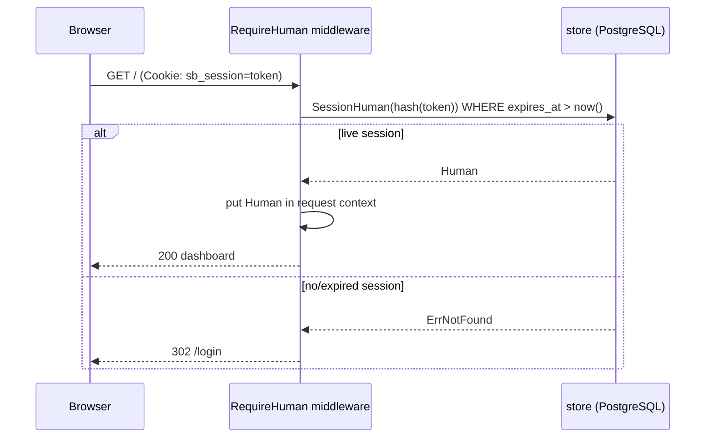

# Design: Human Identity & Assurance

## Context

Switchboard's access model rests on a single accountable principal — the human
([ADR-0008](../../../adrs/ADR-0008-human-principal-vended-endpoints.md)). This capability, formalized
in [SPEC-0008](spec.md) and realizing
[ADR-0011](../../../adrs/ADR-0011-identity-assurance-oidc-passkey-deferred.md), governs how a human
proves who they are and how switchboard carries that identity through a request.

The MVP is implemented in `internal/auth/auth.go`: switchboard is an OIDC relying party against Pocket
ID (a passkey-only IdP holding humans only). Login runs the authorization-code flow with PKCE + nonce;
the callback verifies state, exchanges the code, verifies the ID token against the issuer, checks the
nonce, upserts the human (`store.UpsertHuman`, keyed on OIDC `sub`), and mints a server-side session
(`store.CreateSession` stores only the SHA-256 hash of an opaque cookie token). `RequireHuman`
middleware gates the human UI and redirects unauthenticated requests to `/login`. Routes are wired in
`internal/server/server.go` (`/login`, `/auth/login`, `/auth/callback`, `/auth/dev-login`, `/logout`).
The `humans` and `sessions` tables live in `internal/db/migrations/0001_init.sql`. The login page is
`internal/web/templates/login.html`.

Crucially, this human OIDC path is **separate** from the machine-auth path in
[SPEC-0007](../vended-endpoints/spec.md): agents present a bearer credential resolved to a scoped
endpoint; humans present a session cookie resolved to a `humans` row. The two never mix.

## Goals / Non-Goals

### Goals

- Authenticate humans via OIDC against Pocket ID as a relying party (no passwords held).
- Key each human on the OIDC subject; keep the IdP humans-only.
- Establish revocable, server-side sessions carried by an `HttpOnly` cookie storing only a hashed
  token.
- Carry the authenticated human in request context for downstream ownership authorization.
- Keep the MVP right-sized: trust the passkey-only issuer, defer `amr`/`acr` step-up with a written,
  triggered requirement.

### Non-Goals

- Vended-endpoint credential auth and scope enforcement — owned by [SPEC-0007](../vended-endpoints/spec.md).
- Building `amr`/`acr` step-up plumbing now (deferred until a non-passkey IdP joins the trust set).
- Multi-IdP federation and provenance assurance across issuers.
- Passkey registration/management (that lives in Pocket ID, not switchboard).

## Decisions

### OIDC relying party against a single passkey-only IdP

**Choice**: Switchboard is an RP against Pocket ID; it trusts the issuer and holds no passwords.
**Rationale**: the humans are few and already authenticate against one passkey-only IdP; running the RP
flow (PKCE + nonce) is standard and keeps all credential handling in the IdP.
**Alternatives considered**:
- Local password auth: rejected — reintroduces password storage and phishing surface switchboard
  should not own.
- Agents-as-OIDC-identities: rejected in [ADR-0008](../../../adrs/ADR-0008-human-principal-vended-endpoints.md);
  bloats the IdP with non-human principals.

### Server-side, hashed, revocable sessions

**Choice**: Mint an opaque token, store only its SHA-256 hash + expiry, set it in an `HttpOnly`,
`SameSite=Lax`, HTTPS-`Secure` cookie; logout deletes the row.
**Rationale**: revocability (logout, expiry) and no reversible secret at rest; a stolen cookie is
useless once the session is deleted or expired.
**Alternatives considered**:
- Stateless JWT sessions: harder to revoke before expiry; rejected for a small, revocation-friendly
  deployment.

### Trust the issuer; defer `amr`/`acr` step-up (triggered)

**Choice**: No assurance-claim enforcement in the MVP; a written requirement mandates phishing-resistant
`amr`/`acr` step-up before federating to any non-passkey IdP.
**Rationale**: within a passkey-only tenant, issuer-trust is genuinely passkey-backed, so step-up
plumbing would have no consumer today; making the future requirement explicit and triggered prevents a
silent security gap.
**Alternatives considered**:
- Full step-up now: builds plumbing with no consumer; the exact `amr`/`acr` semantics (no standard
  "passkey" value per RFC 8176) can't be pinned without a real non-passkey issuer.
- Silent about the future: leaves the issuer-trust ⇒ phishing-resistance assumption undocumented, to
  be violated silently the first time a non-passkey IdP is added — the exact failure ADR-0011 prevents.

### Dev-login is config-gated and never production

**Choice**: A dev-login bypass exists but returns 404 unless `SWITCHBOARD_DEV_LOGIN` is set, and logs a
loud warning when used.
**Rationale**: lets local development proceed without a live IdP while making accidental production use
loud and self-disabling.

## Architecture

The human login sequence — authorization-code flow with PKCE + nonce, ending in a server-side session:

```mermaid
sequenceDiagram
    participant Browser
    participant SB as switchboard (auth)
    participant IdP as Pocket ID (OIDC)
    participant Store as store (PostgreSQL)
    Browser->>SB: GET /auth/login
    SB->>SB: generate state, nonce, PKCE verifier
    SB->>Browser: Set-Cookie sb_oidc_state (10m) + 302 to IdP (S256 challenge)
    Browser->>IdP: authorize (passkey login)
    IdP->>Browser: 302 /auth/callback?code&state
    Browser->>SB: GET /auth/callback?code&state (+ state cookie)
    SB->>SB: verify state matches stashed
    SB->>IdP: exchange code (PKCE verifier)
    IdP->>SB: tokens incl. id_token
    SB->>SB: verify id_token signature vs issuer; check nonce
    Note over SB: no amr/acr step-up check (ADR-0011: issuer is passkey-only)
    SB->>Store: UpsertHuman(sub, name, email)
    SB->>Store: CreateSession(hash(opaque token), human_id, TTL)
    SB->>Browser: Set-Cookie sb_session (HttpOnly, SameSite=Lax) + 302 /
```

Session-gated request handling on the protected human surface:



Data model (from `0001_init.sql`): `sessions.token_hash` (PK) references `humans.id`; the human is
keyed on `oidc_subject` (unique). No agent rows exist here — agents live under
[SPEC-0007](../vended-endpoints/spec.md).

## Risks / Trade-offs

- **A future maintainer could federate a non-passkey IdP and forget the step-up requirement** →
  mitigated by a guard/comment at the OIDC provider-init site in `internal/auth/auth.go` referencing
  ADR-0011, plus the requirement recorded in the open-questions index and this spec.
- **The eventual `amr`/`acr` choice is genuinely ambiguous** (RFC 8176 has no `passkey` value) →
  surfaced now so it is not a surprise when step-up is implemented; the value is deliberately not
  pinned.
- **Dev-login could be enabled in production by misconfiguration** → mitigated by default-off, 404 when
  off, and a loud warning log when used.
- **Session cookie theft** → mitigated by `HttpOnly` + `SameSite=Lax` + `Secure` (HTTPS), server-side
  revocation, and a bounded TTL.

## Migration Plan

Greenfield — no migration. The `humans` and `sessions` tables ship in `0001_init.sql`. Adding a
non-passkey IdP later is a policy/code change (introduce `amr`/`acr` step-up), not a schema migration.

## Open Questions

- **Exact `amr`/`acr` value/level for step-up** when a non-passkey IdP is added — TBD against real
  issuer behavior; there is no standard `amr` "passkey" value (RFC 8176), so it will likely be a
  combination (`hwk` + `pop`), a `phr` marker, or an agreed `acr` level.
- **Session lifetime and idle vs. absolute expiry**: the MVP uses a fixed absolute TTL; whether to add
  idle-timeout or refresh-on-activity is an open product decision.
- **Per-route rate limiting on `/auth/*`** is currently deferred to a reverse proxy; revisit if
  callback-abuse or login-flooding becomes a concern.
