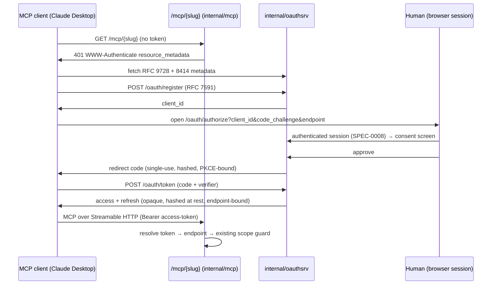

# Design: MCP OAuth Authorization for Vended Endpoints

## Context

Switchboard's MCP endpoints authenticate today with a single static bearer looked up by hash
(`internal/mcp` → `store.EndpointByCredHash`); the 401 is bare, and no AS exists anywhere in the
codebase — the only OAuth code is the OIDC *relying-party* login (`internal/auth`). The MCP
authorization spec expects discovery → dynamic registration → code + PKCE → consent. Governing:
ADR-0019. Amends in spirit: SPEC-0007 (vended endpoints), SPEC-0014 (transport auth). Depends on:
SPEC-0008 (the human session the consent screen sits behind), `internal/cred` (mint/hash
primitives), SPEC-0015 (consent screen renders in the charm-web language and wizard pattern).

## Goals / Non-Goals

### Goals

- Standards-shaped: RFC 9728 + 8414 + 7591 + OAuth 2.1 code + PKCE (S256), opaque tokens.
- One capability model: every token is a credential onto one vended endpoint; ADR-0008 doctrine
  (immutable scope, revoke = kill) survives byte-for-byte.
- Consent that cannot lie: bullets derive from `scope_queues`/`scope_verbs`, the same columns the
  scope guard enforces.

### Non-Goals

- No JWT/JWKS, no token introspection service — AS and RS are the same binary and Postgres is the
  source of truth.
- No third-party resource servers, no client secrets flow (public clients + PKCE), no scope
  *selection* UI at consent (the endpoint's scope IS the scope; consent is yes/no).
- Humans keep OIDC/Pocket ID (ADR-0011) — this subsystem never authenticates humans.

## Decisions

### New sibling package, not an extension of internal/auth

**Choice**: `internal/oauthsrv` owns metadata, DCR, authorize, token, and token storage; it calls
into `internal/auth` only for "who is the logged-in human".
**Rationale**: RP-to-Pocket-ID and AS-to-MCP-clients are different trust directions with different
failure modes; the audit explicitly warned against overloading `internal/auth` (~430 LOC, heavily
tested as an RP).

### Tokens hang off endpoints

**Choice**: `oauth_tokens.endpoint_id → endpoints.id` (as `oauth_codes` too); revocation and expiry
cascade from the endpoint row; token minting reuses `internal/cred` Mint/Hash.
**Rationale**: Preserves "revoke is instant and total" with one code path
(`endpointRevoked` hook → close sessions + now delete tokens). The alternative — a standalone
grant model — would create two capability universes to reconcile forever.

### Opaque tokens, hashed at rest

**Choice**: High-entropy opaque strings, SHA-256 stored, constant-time lookup, no self-describing
claims.
**Rationale**: Same binary validates; the `endpoints` table already holds the authorization data.
JWTs would add key management for zero lookups saved.

## Architecture

### Storage (one migration)

- `oauth_clients(id, client_id, name, redirect_uris text[], created_at)`
- `oauth_codes(id, code_hash, client_id, endpoint_id, pkce_challenge, redirect_uri, expires_at, used_at)`
- `oauth_tokens(id, token_hash, refresh_hash, client_id, endpoint_id, expires_at, revoked_at, created_at, last_used_at)`
- `ALTER TABLE endpoints ADD COLUMN expires_at timestamptz` (lifetime; reaper enforces)

### Resource-server delta

~40 LOC in the `internal/mcp` auth middleware: try `oauth_tokens` by hash → fall back to
`endpoints.credential_hash`; emit the `WWW-Authenticate` challenge on all 401s. Everything past
"resolve to endpoint ID" is untouched (verbs guard, sessions, doorbells, `CloseEndpointSessions`).

## Security notes

Exact-match redirect URIs; single-use codes with replay-revocation; refresh rotation; access-token
expiry clamped to endpoint expiry; no raw secrets in logs (existing discipline); rate limiting on
`/oauth/*` consistent with the server's existing limiter; conformance tests for PKCE failure
modes, redirect mismatches, and code replay are part of the definition of done.

## Key files

New: `internal/oauthsrv/*`, one migration, consent templates under `internal/web/templates/`.
Touched: `internal/mcp/mcp.go` (auth + challenge), `internal/server/server.go` (routes),
`internal/store` (token/client/code queries, endpoint expiry), reaper loop, vend reveal
(`buildMCPJSON` URL-only variant).
