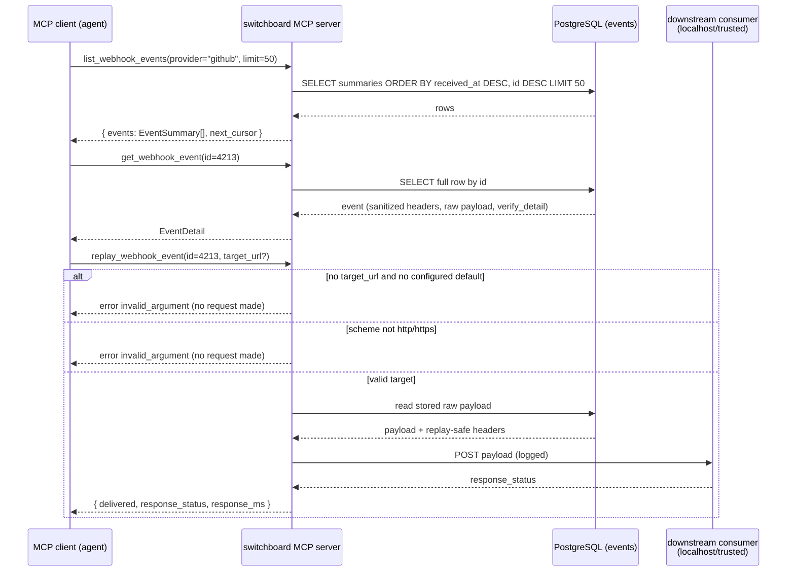

# Design: MCP Tool and Resource Contract

## Context

Switchboard is an MCP server (Go + PostgreSQL) that verifies inbound webhooks and
turns them into a durable todo work-queue. Beyond turning events into todos, it exposes the raw event
log to MCP clients so an agent can scan history, drill into a specific delivery, and replay a stored
payload to a local consumer. SPEC-0005 realizes
[ADR-0005](../../../adrs/ADR-0005-mcp-tool-and-resource-contract.md), which fixed the shape of this
contract.

The surface is served by the official Go MCP SDK, mounted over **streamable HTTP** in the same
`chi` router that serves the human web UI and the vended agent API (`internal/server/server.go`),
reading the same PostgreSQL layer (`internal/store`). The `events` table
(`internal/db/migrations/0001_init.sql`) is the single source of truth for the event shape:
`id bigint`, `source`, `family` (`webhook|queue`), `event_type`, `external_id`, `trust_mode`
(`signed|token|open|queue`), `verified`, `verify_detail`, `content_type`, sanitized `headers`,
`payload`, `payload_size`, `source_ip`, `received_at`. The MCP `EventSummary`/`EventDetail` shapes are
projections of exactly these columns, so the MCP, HTTP, and UI surfaces cannot drift.

This capability is the **shared, generic** event-history contract. The agent-facing *work* surface
(todos + ingestion self-management) is [SPEC-0006](../agent-tools/spec.md).

## Goals / Non-Goals

### Goals

- Pin a stable three-tool contract (`list_webhook_events`, `get_webhook_event`,
  `replay_webhook_event`) plus a read-only recent-events resource.
- Keep agent context lean: compact summaries on `list`, full record only on `get`.
- Make pagination correct under concurrent inserts via opaque cursors.
- Carry trust metadata (`trust_mode`/`verified`/`verify_detail`) on every event so agents cannot
  mistake unverified data for signed.
- Confine all side effects to a single, clearly-marked, SSRF-conscious `replay` verb.
- Never leak signing secrets or full signature header values across the boundary.

### Non-Goals

- The agent work verbs (claim/complete/fail) and ingestion self-management — those are SPEC-0006.
- Choosing the concrete transport wiring (stdio vs. streamable HTTP details) beyond "served over
  HTTP in-process."
- Guaranteeing push/subscription on the recent-events resource; a pull-able resource is the floor.
- Defining the storage schema itself (owned by the persistence ADR/spec); this projects from it.

## Decisions

### Tools + a read-only resource

**Choice**: Expose three tools for query/detail/replay, plus a read-only
`switchboard://events/recent` resource.
**Rationale**: Tools naturally model parameterized filtering, detail lookup, and the side-effecting
replay; a resource serves clients that model context as pull-able resources rather than tool calls.
**Alternatives considered**:
- Tools only: ignores the requirement to expose recent events as a resource.
- Resources only: replay and parameterized filtering are awkward or impossible as resources.

### Compact `list`, full `get`

**Choice**: `list_webhook_events` returns `EventSummary` (no payload/headers); `get_webhook_event`
returns `EventDetail` (full sanitized record).
**Rationale**: Broad scans stay small and fast; full fidelity is fetched only on drill-down.
**Alternatives considered**:
- Return full events from `list`: floods agent context and slows broad scans.

### Opaque cursor pagination

**Choice**: `limit` + `since` + opaque `cursor` encoding the last `(received_at, id)`, ordered
`received_at DESC, id DESC`.
**Rationale**: An always-on receiver inserts rows continuously; numeric offsets would shift between
pages and cause duplicates/gaps. A cursor anchored to a stable sort key is correct under concurrent
inserts.
**Alternatives considered**:
- Numeric offset: duplicates/gaps under concurrent inserts.
- `limit` only: cannot page beyond the first window.

### Optional replay target with a configured default

**Choice**: `target_url` optional; fall back to `settings.replay_default_target`; hard
`invalid_argument` if neither is set. Never replay back to the originating provider.
**Rationale**: Ergonomic for the common "replay to my local consumer" case while staying explicit;
providers are senders, not receivers, so back-to-provider is meaningless and a footgun.
**Alternatives considered**:
- Always-required target: tedious when a stable dev target exists.
- Back-to-provider: nonsensical; providers don't receive webhooks.

### SDK structured output

**Choice**: Every tool declares input JSON Schema and returns SDK structured output validated against
declared output schemas.
**Rationale**: Clients get typed, validated results; the contract is enforceable and drift is caught.
**Alternatives considered**:
- Free-form text/JSON blobs: pushes parsing and drift risk onto every client.

## Architecture

The MCP server is one component inside the switchboard process. Tools resolve against the PostgreSQL
data-access layer; the single side-effecting tool (`replay`) additionally drives an outbound HTTP
client toward a localhost/trusted downstream consumer. The recent-events resource shares the exact
`EventSummary` projection used by `list`.

The sequence below traces a representative agent workflow — scan, drill in, replay — across the MCP
boundary:

Every event object in every response carries `trust_mode` + `verified`; `EventDetail` adds
`verify_detail`. Sanitized headers redact signature/secret headers to `«redacted»`; no signing secret
ever crosses the boundary.

## Risks / Trade-offs

- **Summary/detail split means two round-trips when an agent wants full payloads for many events** →
  Accepted: the common case is scan-then-drill-down, and lean summaries keep context small. An agent
  needing many full records pays the extra `get` calls deliberately.
- **`replay` is inherently an outbound-request tool and an SSRF risk** → Mitigated by scheme
  validation (`http`/`https` only), a localhost/trusted-network default or allowlist, per-caller rate
  limiting, and mandatory logging of every replay.
- **Cursor opacity hides sort semantics from clients** → Accepted: opacity is deliberate so the
  encoding can evolve; a malformed cursor fails fast with `invalid_argument`.
- **Trust metadata is only useful if clients read it** → The contract makes `trust_mode`/`verified`
  required on every event so a client that ignores them is choosing to; the surface is honest.

## Migration Plan

Greenfield for the MCP contract as a spec artifact — the underlying `events` table and store layer
already exist (`internal/db/migrations/0001_init.sql`, `internal/store`). The old prose contract
(`docs/specs/mcp-tools.md`) is superseded by this spec/design pair and its exact JSON schemas are
carried forward into SPEC-0005's requirements; no data migration is required.

## Open Questions

- Whether the SDK's resource subscription/update mechanism is wired for push on
  `switchboard://events/recent` (mirroring the UI's SSE), or the resource stays pull-only for the MVP.
  ADR-0005 leaves this to the code session; the spec requires only a pull-able resource.
- The concrete authentication scheme for the streamable-HTTP MCP mount (bearer credential shape,
  relationship to the vended-endpoint credentials of SPEC-0006) is a code-session detail;
  auth-by-default is mandated here regardless.
