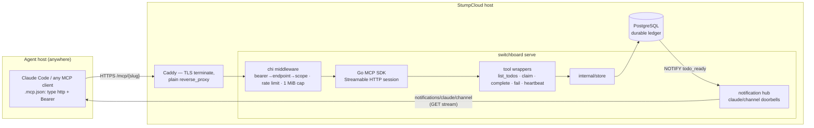

# Design: MCP Streamable HTTP Transport

## Context

SPEC-0014 realizes [ADR-0017](../../../adrs/ADR-0017-mcp-streamable-http-only.md): vended MCP
endpoints are served **exclusively over Streamable HTTP/S** by the central Go service, and the local
stdio adapter is retired. Today (`internal/channel/adapter.go`) an agent host must run
`switchboard channel` — a hand-rolled stdio JSON-RPC proxy pinned to protocol `2024-11-05` — which
forwards tool calls to a bespoke REST surface (`/agent/*`, `internal/agentapi`) and re-emits
`/agent/stream` SSE frames as channel notifications. That triple surface (stdio protocol + REST +
SSE) exists to simulate what MCP's remote transport already provides. After this change the entire
client contract is [SPEC-0007](../vended-endpoints/spec.md)'s pair — URL + credential — consumed by
any Streamable-HTTP-capable MCP client (`"type": "http"` in `.mcp.json`).

Related: tool semantics [SPEC-0006](../agent-tools/spec.md); queue semantics
[SPEC-0003](../todo-queue/spec.md); push shape and injection hardening
[SPEC-0011](../channels/spec.md); vend UX [SPEC-0013](../operator-board/spec.md).

## Goals / Non-Goals

### Goals

- URL + bearer credential is the complete agent footprint — connect from any host with no install.
- One protocol surface: the official Go MCP SDK replaces the hand-rolled JSON-RPC framing, the REST
  proxy API, and the bespoke agent SSE stream.
- Preserve ADR-0013's contract: push is a doorbell, the durable queue is the ledger.
- Per-endpoint URLs (`/mcp/{slug}`) for observability and clean revocation semantics.

### Non-Goals

- Backwards compatibility with `switchboard channel` wiring (breaking change accepted pre-1.0).
- The ADR-0005 event-store MCP contract (`list_webhook_events` etc.) — separate capability
  ([SPEC-0005](../mcp-tools/spec.md)); this spec only carries the SPEC-0006 agent verbs.
- OAuth flows on the MCP surface — bearer credentials minted at vend time remain the model
  (ADR-0008).
- In-process TLS — HTTPS terminates at the deployment's Caddy per the Dockerfile contract.

## Decisions

### Official Go MCP SDK, mounted per-endpoint

**Choice**: Vendor `github.com/modelcontextprotocol/go-sdk` and mount its Streamable HTTP handler
under chi at `/mcp/{endpoint}`, constructing per-session servers whose tool registry is filtered by
the resolved endpoint's verb allowlist.
**Rationale**: The SDK owns protocol negotiation, session management, and stream mechanics —
exactly the code that was hand-rolled and version-pinned in the adapter. ADR-0005/ADR-0015 already
name it the house choice.
**Alternatives considered**:
- Keep hand-rolled JSON-RPC, add HTTP framing: re-implements session/stream semantics the SDK has;
  permanent maintenance liability — rejected.
- A single `/mcp` mount with credential-only routing: loses per-endpoint URLs (worse logs/metrics,
  designs show per-slug URLs) — rejected.

### Auth middleware resolves credential → endpoint → scope before the SDK sees the request

**Choice**: A chi middleware hashes the bearer token, resolves the active endpoint row, verifies the
path slug matches, stamps last-seen, and injects the scope into the request context; the SDK layer
reads scope for tool filtering and enforcement. 401 unknown/revoked, 403 slug mismatch.
**Rationale**: Same boundary-enforcement shape the REST layer proved (`internal/agentapi`), reused
verbatim; the SDK stays scope-unaware.

### Tool registry = SPEC-0006 verbs incl. `heartbeat`

**Choice**: `list_todos`, `claim`, `complete`, `fail`, `heartbeat` — thin wrappers over
`internal/store` with SDK-declared schemas and structured outputs. `tools/list` advertises only
allowlisted verbs.
**Rationale**: `heartbeat` exists in the store and SPEC-0003/0006 but was never exposed by the
adapter — long-running work needs it; adding it here closes that gap without new store code.

### Push rides the Streamable HTTP notification stream

**Choice**: The existing lossy hub (fed by `pg_notify('todo_ready')`) fans out to MCP sessions;
matching sessions (queue within scope) receive `notifications/claude/channel` with the SPEC-0011
summary/meta shape. No stream ⇒ no delivery ⇒ pull remains correct.
**Rationale**: Identical semantics to today's `/agent/stream`→adapter path, minus one hop and one
process; ADR-0013's lossy-by-design stance is untouched.

### Hard cutover, single release

**Choice**: The release that ships `/mcp/{endpoint}` also deletes `cmd` channel wiring,
`internal/channel`, `internal/agentapi` routes, and all local-binary instructions; the vended screen
and docs emit `type: "http"` wiring only.
**Rationale**: ADR-0017 rejected dual-transport; a shim would keep the third surface alive
indefinitely. Install base is single-operator; re-vending is cheap.

## Architecture

## Risks / Trade-offs

- **Harness support for channels-over-HTTP** may lag stdio channels → correctness never depends on
  push (queue is the ledger); agents degrade to pull. Tracked as the one external dependency.
- **Long-lived streams through the proxy** (buffering, idle timeouts) → Caddy `reverse_proxy`
  defaults stream SSE correctly; deployment notes pin flush behavior and disable response buffering
  for `/mcp/*`; keep-alives ride the SDK's ping.
- **Breaking change for existing wiring** → single-operator install base; release notes + vended
  screen make re-vend the documented path.
- **SDK as a new vendored dependency** → pinned + vendored per the hermetic build; the SDK replaces
  more code than it adds.
- **Credential leakage via logs on a busier surface** → middleware logs slug + tool only; a test
  asserts the bearer value never appears in logs or errors.

## Migration Plan

1. Vendor the SDK; mount `/mcp/{endpoint}` behind the new auth middleware alongside the existing
   surfaces (dark launch, integration-tested with a vended credential).
2. Switch the vended reveal + docs to `type: "http"` wiring (SPEC-0013 vend modal).
3. Delete `switchboard channel`, `internal/channel`, `/agent/*` + `/agent/stream`, and their tests;
   update README/reference docs; re-vend the operator's own endpoints.
4. Rollback path: revert the deletion commit — the store layer is untouched by the cutover.

## Open Questions

- Whether Claude Code's channel listener attaches to HTTP MCP servers today or only stdio ones; if
  only stdio, doorbells wait on harness support while tools work immediately (pull loop unaffected).
- Whether per-endpoint rate limits need operator-visible configuration or a fixed sane default
  suffices for the MVP.
