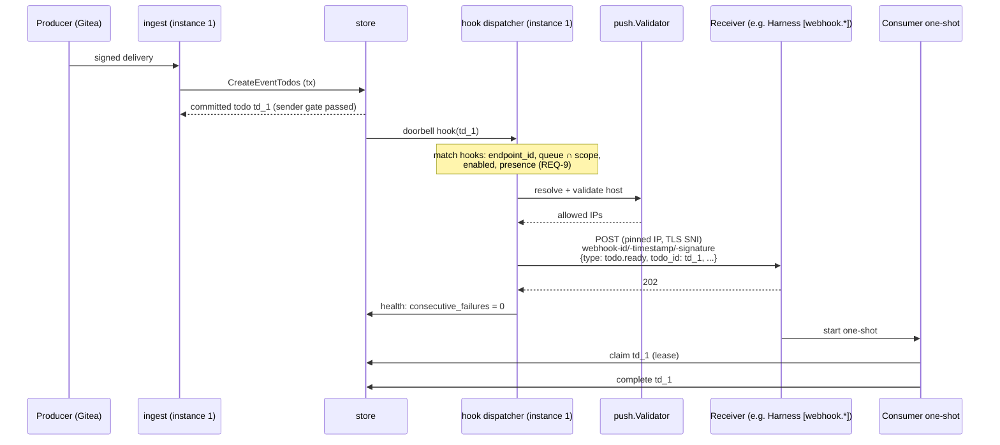
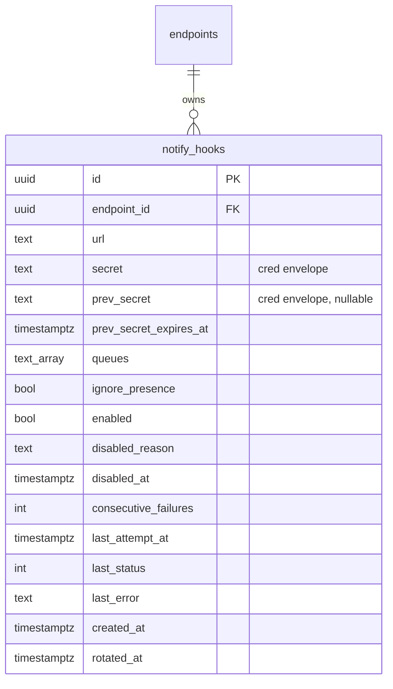

# Design: Outbound Todo Notify Hooks

## Context

A channel doorbell ([ADR-0013](../../../adrs/ADR-0013-channels-push-delivery.md)) needs a live
process that has loaded Switchboard as a channel. `claude -p`, cron sweeps, CI jobs and
start-on-demand supervisors have no such process. Today they poll, or the operator makes the
upstream sender deliver twice, which moves trust configuration outside Switchboard and bypasses
routing rules.

[ADR-0029](../../../adrs/ADR-0029-outbound-todo-webhooks.md) (accepted) chose per-endpoint notify
hooks managed over MCP. SPEC-0024 is the requirement set. Nothing outbound exists for todos today:

* `internal/push/ssrf.go` is a DNS-rebinding-aware validator with no callers.
* `push_notification_configs` (migration 0012) is A2A task-scoped, sits behind
  `SWITCHBOARD_A2A`, and is unused.

The consumer this unblocks first is Harness's event triggers (Harness ADR-0021 / SPEC-0014):
a `[webhook.*]` listener that starts a one-shot when Switchboard says work is waiting. Together
with Cairn's annotation events, this is the "on-demand one-shot" milestone.

## Goals / Non-Goals

### Goals

- A headless consumer learns that work is waiting within seconds, with no polling and no second
  upstream webhook.
- No instance-wide surface. Every hook has an owner, a scope and a verb that granted it.
- Reuse what exists: the doorbell hook, the sender gate, the SSRF validator and the secret
  envelope.
- Ingest never waits on a tenant's receiver.

### Non-Goals

- Guaranteed delivery. The queue is the guarantee, and the hook is a hint.
- Carrying the work. The body is a pointer, and the consumer claims.
- Coalescing bursts (see Open Questions).
- A `test_notify_hook` verb. ADR-0029 fixed the verb set at four. A receiver is tested by a real
  todo, and `list_notify_hooks` shows the result.
- Replacing A2A push (SPEC-0019). That path should adopt this worker later, not the other way
  round.

## Decisions

### A table of its own, keyed to the endpoint

**Choice**: a new `notify_hooks` table with `endpoint_id` as a cascading foreign key. The table
has no owner columns of its own.

**Rationale**: every endpoint-attached resource inherits the endpoint's owner scope. Teams
(ADR-0038 / SPEC-0033, cited by number until they merge) keep that rule, and let a team own an
endpoint. A hook that carries its own `owner_human_id` would be a second ownership fact that could
disagree with the endpoint's. The cascade means revoking and deleting an endpoint takes its hooks
with it.

**Alternatives considered**:
- Reuse `push_notification_configs`: task-scoped, behind a flag that is off by default, configured
  by the remote caller. Rejected in ADR-0029 (option C).

### Validation runs twice, and the dial is pinned

**Choice**: `push.Validator` runs at create and before every attempt. The attempt's
`http.Transport` uses a `DialContext` that:

1. resolves the host once through the validator's injected resolver;
2. validates every returned address, and drops the ones that fail;
3. dials a surviving address directly;
4. sets TLS `ServerName` to the URL host.

`CheckRedirect` returns `http.ErrUseLastResponse`.

**Rationale**: validating and then letting `net/http` resolve again leaves a
time-of-check/time-of-use window that a zero-TTL rebinding record can use. Pinning closes it. The
validator stays the single source of truth for "allowed", as ADR-0021 intended.

**Alternatives considered**:
- Validate only at create: defeated by rebinding. Rejected by ADR-0029.
- Egress proxy: the right answer for a large deployment, but an operational dependency the
  self-hosted default cannot assume. It MAY be layered on later with `HTTPS_PROXY` plus the same
  validator.

### Private ranges are an operator bound, off by default

**Choice**: `SWITCHBOARD_NOTIFY_HOOK_ALLOW_CIDRS` (comma-separated CIDRs) exempts listed ranges
from the private-address rejection. Loopback, link-local (including cloud metadata addresses) and
Switchboard's own listen addresses stay rejected even when listed.

**Rationale**: a self-hoster running Switchboard and Harness on one LAN needs the "server it can
reach" path to work without a public hop. On a multi-tenant instance this opens those ranges to
every tenant, so the choice belongs to the operator (an instance role that may bound tenant
behaviour), and the guide says so loudly.

### Standard Webhooks, with dual signatures on rotation

**Choice**: `webhook-id` / `webhook-timestamp` / `webhook-signature: v1,<sig>` over
`id.timestamp.body`. The secret is `whsec_` plus base64 of 32 random bytes. Rotation keeps the
previous secret for 24 hours and signs with both.

**Rationale**: this is the scheme ADR-0029 chose. Switchboard's own generic receiver already
honours `Webhook-Id` inbound, and off-the-shelf verifier libraries exist in most languages. Dual
signing is part of the Standard Webhooks spec and makes rotation zero-downtime.

**Cross-repo consequence**: Harness ADR-0021 deferred timestamped schemes, so Harness `[webhook.*]`
cannot yet verify this header set. That is filed as a Harness SPEC-0014 story that adds
`verify = "standard-webhooks"`. The F-X2 webhook path is blocked on it. Switchboard does not add a
second, body-only signature to paper over the gap: that would drop timestamp replay protection for
every receiver, to save one receiver a story.

### Fire from the existing doorbell hook, plus the requeue paths

**Choice**: `store.SetDoorbellHook` gains a second subscriber, the hook dispatcher, next to
`mcp.PublishTodoReady`. The two re-queue paths call the same fan-out after their statement
returns rows:

* the lease reaper (`claimed` → `pending`);
* the retry scheduler (`failed` with a due `next_retry_at` → `pending`).

Both paths already use the sender-gate predicate.

**Rationale**: one trigger, one gate. A second notification path with a looser gate is the one
attackers would use (ADR-0029 driver "One sender gate"). The requeue fire is what lets a
start-on-demand supervisor replace a worker that died holding a lease. It is also the hook that
Switchboard ADR-0039 (attempt history, F-X3) builds its relay loop on.

**Alternatives considered**:
- Fire on heartbeat re-rings as well: the sweep exists to reach a *live* session that missed a
  push. Firing it at a dispatcher would start a new worker every 5, 20 and 60 minutes for a todo
  that a live worker may be holding off on deliberately. Rejected for v1.

### A per-instance bounded queue, with no persistence

**Choice**: a buffered channel of 1024 notifications per instance, drained by a worker pool of 8
goroutines. Each notification carries its hook row snapshot, which is re-read before each attempt
so that delete and disable take effect. Retries run inside the worker with `time.Timer`, not by
re-enqueueing.

**Rationale**: the ADR-0013 contract is that a restart loses hints and nothing else. A persistent
outbox would turn a hint into a delivery guarantee we have promised no one. It would also add a
table that grows during an outage, exactly when it hurts.

### Health lives on the hook row

**Choice**: `last_attempt_at`, `last_status`, `last_error`, `consecutive_failures`, `enabled`,
`disabled_reason` and `disabled_at` are columns. Each is updated with a single `UPDATE … WHERE
id = $1` after each delivery (not after each attempt). The disable decision is made in the same
statement:

```sql
UPDATE notify_hooks
   SET consecutive_failures = consecutive_failures + 1,
       last_attempt_at = now(), last_status = $2, last_error = $3,
       enabled = CASE WHEN consecutive_failures + 1 >= $4 THEN false ELSE enabled END,
       disabled_reason = CASE WHEN consecutive_failures + 1 >= $4
                              THEN 'consecutive_failures' ELSE disabled_reason END,
       disabled_at = CASE WHEN consecutive_failures + 1 >= $4 THEN now() ELSE disabled_at END
 WHERE id = $1 AND enabled
RETURNING enabled;
```

**Rationale**: two instances failing the same hook concurrently cannot both miss the threshold,
and the row itself is the audit record.

### Presence, and the resolution of ADR-0029's open question

**Choice**: respect presence by default. Add `ignore_presence` per hook. On `out` → `in`, send one
`todos.backlog` to each held hook that has matching pending work. That notification is decided by
the SPEC-0022 transition claim.

**Rationale**: `out` is the agent's or its human's statement that no turns should be spent on this
endpoint right now. A shift that says "weekdays only" is a statement about cost and attention, and
it applies to a one-shot started by a hook as much as to a live session. The dispatcher case,
where something else decides whether to start a worker, is real but is the minority, so it is the
opt-out. Without `todos.backlog`, a held hook would never hear about work that arrived while the
endpoint was out, because hooks only fire on transitions. With it, the return is surfaced once,
with counts only, exactly as the digest doorbell does for sessions.

This work is gated on SPEC-0022 landing. Until then every endpoint is `in` and the flag is inert.
The presence story is therefore filed separately and blocked, and the rest of the feature ships
without it.

### The digest question is carried, with a measurement plan

**Choice**: no coalescing in v1. Each ready todo is one notification, and each notification is
dedupable by `webhook-id`. A per-hook limit of 120 notifications per minute bounds amplification.

**Rationale**: coalescing adds a timer, a flush rule and a second body shape to every consumer.
Nobody has measured a burst problem yet. What would show one:

- a rising `switchboard_notify_hook_notifications_total{outcome="dropped"}` rate;
- receivers reporting duplicate worker starts for one queue within seconds.

If either appears, the design is a `todos.ready` batch type behind a per-hook `coalesce_ms`,
defaulting to off.

## Architecture





### Schema

A new migration, taking the next free number when it is written. Other planned specs also claim
migrations, so the number is not reserved here.

```sql
CREATE TABLE notify_hooks (
    id                     uuid PRIMARY KEY DEFAULT gen_random_uuid(),
    endpoint_id            uuid NOT NULL REFERENCES endpoints(id) ON DELETE CASCADE,
    url                    text NOT NULL CHECK (length(url) <= 2048),
    secret                 text NOT NULL,          -- internal/cred envelope, never plaintext when a key is set
    prev_secret            text,                   -- dual-sign grace after rotation
    prev_secret_expires_at timestamptz,
    queues                 text[] NOT NULL DEFAULT '{}',
    ignore_presence        boolean NOT NULL DEFAULT false,
    enabled                boolean NOT NULL DEFAULT true,
    disabled_reason        text CHECK (disabled_reason IN ('consecutive_failures', 'operator')),
    disabled_at            timestamptz,
    consecutive_failures   integer NOT NULL DEFAULT 0,
    last_attempt_at        timestamptz,
    last_status            integer,
    last_error             text,
    created_at             timestamptz NOT NULL DEFAULT now(),
    rotated_at             timestamptz
);
CREATE INDEX idx_notify_hooks_endpoint ON notify_hooks (endpoint_id) WHERE enabled;
```

The migration is additive. Rolling it back means dropping the table, which loses only hook
registrations.

### MCP shapes

```jsonc
// create_notify_hook
{"url": "https://dispatch.example.com/sb", "queues": ["reviews"], "ignore_presence": false}
// → result
{"hook_id": "8c1e…", "url": "https://dispatch.example.com/sb", "queues": ["reviews"],
 "ignore_presence": false, "enabled": true, "signing_secret": "whsec_…"}

// list_notify_hooks → result
{"hooks": [{"hook_id": "8c1e…", "url": "https://dispatch.example.com/sb", "queues": ["reviews"],
            "ignore_presence": false, "enabled": true, "disabled_reason": null,
            "consecutive_failures": 0, "last_status": 202, "last_error": null,
            "last_attempt_at": "…", "created_at": "…", "rotated_at": null}],
 "ceiling": {"max": 5, "used": 1}}

// rotate_notify_hook {"hook_id": "8c1e…"} → {"hook_id": "…", "signing_secret": "whsec_…",
//   "previous_secret_valid_until": "…", "enabled": true}
// delete_notify_hook {"hook_id": "8c1e…"} → {"deleted": true}
```

Errors use the stable error shape from SPEC-0006 REQ "Structured Output and Stable Error Shape":
`invalid_argument`, `permission_denied`, `not_found` and `resource_exhausted`.

### Configuration

| Variable | Default | Meaning |
|---|---|---|
| `SWITCHBOARD_NOTIFY_HOOK_MAX` | `5` | Per-endpoint hook ceiling (operator bound) |
| `SWITCHBOARD_NOTIFY_HOOK_ALLOW_CIDRS` | empty | Private CIDRs exempt from the SSRF private-range rule; every tenant can reach them |
| `SWITCHBOARD_PUSH_ALLOW_HTTP` | unset | Existing opt-in; also permits `http://` hook URLs |

Fixed values (constants, not configuration): attempt timeout 5s, 3 attempts, disable after 10
consecutive failed deliveries, 24h rotation grace, 120 notifications per minute per hook, a queue
of 1024 per instance, and 8 workers.

### Receiver guide (docs)

A new guide section, "Wake a consumer with a notify hook", MUST cover:

- verifying the signature, with a 20-line Go and Python verifier and a pointer to the Standard
  Webhooks libraries;
- rejecting a `webhook-timestamp` more than 5 minutes old;
- deduplicating on `webhook-id`;
- answering `2xx` fast and doing the work asynchronously;
- claiming by `todo_id`, and treating `summary` as data;
- `ignore_presence`;
- the end-to-end F-X2 recipe with a Harness `[webhook.*]` trigger.

## Risks / Trade-offs

- **Switchboard now dials tenant-chosen hosts.** → The validator runs twice, the dial is pinned,
  HTTPS is the default, redirects are refused, private ranges are closed by default, and each hook
  is rate limited. These bound the risk. They do not remove it.
- **A hook can silently stop working.** → Per-hook health, auto-disable with a reason, the
  endpoint card, and the counters. The queue still holds the todo.
- **A consumer treats the hook as the delivery.** → The body carries too little to work from, and
  the docs say to claim.
- **Double work when a session and a hook both wake a consumer.** → The lease allows one claim.
  The second consumer finds nothing and exits, which costs one turn.
- **Harness cannot verify the signature yet.** → A cross-repo story, tracked in the epic as a
  blocker for the F-X2 acceptance test.

## Migration Plan

1. Ship the migration and the store with the verbs unregistered (dark).
2. Ship the verbs and the dispatcher together. Existing endpoints gain nothing until their human
   grants the verbs.
3. Ship the web UI rows and the receiver guide.
4. Ship the presence integration after SPEC-0022 is implemented.

Rollback at any step: remove the verbs from registration (a hook with no dispatcher never fires),
then drop the table.

## Open Questions

- **Digest / coalescing** (carried from ADR-0029): deferred with the measurement plan above.
- Should the instance operator be able to set `SWITCHBOARD_NOTIFY_HOOK_MAX=0` to disable notify
  hooks outright? The design allows it (a ceiling of 0 refuses every create), but an existing hook
  would keep firing. Proposed: a ceiling of 0 also stops dispatch, and a startup log line reports
  it.
