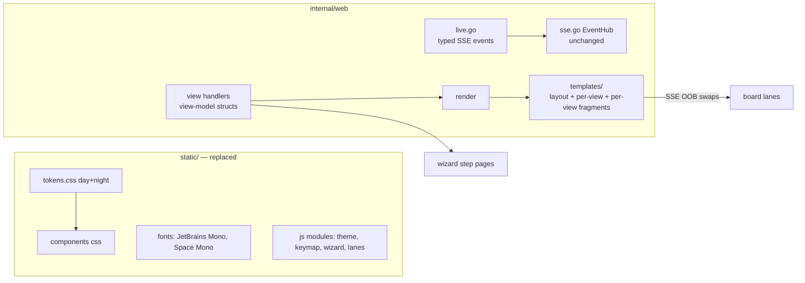

# Design: Operator Board v2 (Charm-Web)

## Context

The full-surface redesign of switchboard's human UI in the charm-web language (ADR-0018),
superseding the Operator/brass board (SPEC-0013). Source of truth for visuals: the 2026-07 Claude
Design package ("Redesign with Bubbletea TUI" — board direction **1a patch panel** per the checked
screenshots, plus the full six-view build-out with wizards and the OAuth consent screen). The
codebase seam is favorable: handlers build plain view structs and render embedded templates;
CSS/JS/fonts live in `static/`; the SSE hub is view-agnostic.

## Goals / Non-Goals

### Goals

- One coherent, keyboard-first language across all six views, both themes, and every wizard.
- The board reads as the product metaphor: lines in, verified, patched through — live.
- Contain the rewrite: view logic and backend contracts change minimally; templates, tokens,
  view-model structs, and `sb.js` carry the change.

### Non-Goals

- No SPA, no build step, no CSS framework — ADR-0001's spine stands.
- No backend changes to ingestion, todo queue, personas, or friending beyond what wizards surface
  (lifetime lands via SPEC-0016; providers via SPEC-0017).
- No mouse-first affordances; mouse works, keyboard leads.

## Decisions

### Replace tokens wholesale, keep the token architecture

**Choice**: New `tokens.css` (both themes) + rewritten component CSS under the existing `sb-*` /
`data-sb-*` conventions; port the contrast and font tests to the new sets.
**Rationale**: The architecture was validated under ADR-0016; only the language changes. Tests are
the transferable asset — the contrast gate is what makes a two-theme system honest.
**Alternatives considered**:
- Incremental restyle view-by-view: two design languages live simultaneously; every screenshot lies
  until the end. Rejected — nobody is using this; land tokens first, then views.

### Received lane is ephemeral by design

**Choice**: The received lane renders SSE-only in-flight cards emitted by ingest instrumentation;
no new persisted state. Verified = durable todo exists; patched through = claimed or beyond.
**Rationale**: Unverified payloads are rejected and never stored (SPEC-0001 doctrine — storing
them would invert the trust model). The lane's job is legibility of the *moment of verification*,
not a new queue. A quiet system shows an empty received lane; that is truthful.

### Wizards are pages with server-side step state

**Choice**: Each wizard step is a routed page (`/vend/step/2`-style), state carried server-side;
HTMX enhances transitions; no-JS completes identically.
**Rationale**: The current modal/fragment machinery can't hold multi-step state, and the codebase's
no-JS-fallback discipline is worth keeping. Full pages also give the consent screen (SPEC-0016) a
shared pattern.

### Fragment split and JS modularization are the first story

**Choice**: Split `fragments.html` (~30 blocks, 624 lines) into per-view fragment files and split
`sb.js` into feature modules (multiple `<script defer>` files, still no build step) as part of the
foundation story, before view rewrites begin.
**Rationale**: The audit identified both as serialization forcers — one shared file every story
edits. Splitting first converts a serial queue into parallel work.

## Architecture

Key seams (from the audit): `internal/web/templates/*` (869 LOC) + `static/*.css` (2,597) +
`static/sb.js` (375) rewrite; `sse.go` untouched; `live.go` rewrites against new fragment names;
view handlers keep logic, swap view models; `server.go#newRouter` gains wizard routes (hotspot —
serialize route-touching stories).

## Test strategy

Keep the proven pattern: parse-fail-fast, fragment render + `html.Parse` DOM assertions keyed on
`data-sb-*`/ids (not classes), adversarial escaping tests, SSE frame-shape tests. Port
`tokens_contrast_test.go` and `fonts_test.go` on day one. New: keymap-registry contract test
(footer hints derive from the registry), wizard step-state tests per handler, theme-boot contract
(`data-theme` set pre-paint). ~4.3k LOC of DOM-coupled tests are expected casualties and are
rewritten alongside their views, not deferred.

## Key files

`internal/web/templates/` (all), `static/tokens.css`, `static/switchboard.css`, `static/sb.js`,
`static/fonts/`, `static/icons/`, `internal/web/web.go` (view models, template glob),
`internal/web/live.go`, `internal/server/server.go` (routes, CSP), `docs-site/` token decoupling.
