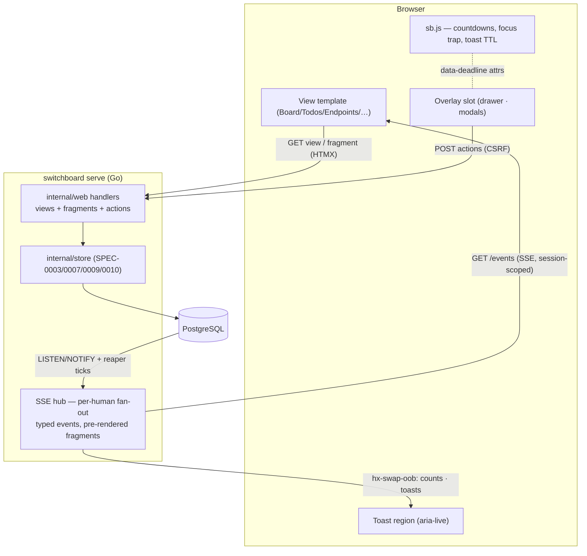

# Design: Operator Board

## Context

SPEC-0013 realizes [ADR-0016](../../../adrs/ADR-0016-operator-design-language.md) — the "Operator"
(brass & bakelite) design language selected from the Claude Design hero-journey package — as
switchboard's five-view human surface, replacing the minimal dashboard/agent/vended screens of
[SPEC-0012](../web-ui/spec.md). SPEC-0012 remains the baseline for everything beneath the pixels:
OIDC sessions, CSRF, security headers, embedded assets via `embed.FS`, SSE plumbing over
`http.Flusher`, error-handling posture, and WCAG 2.1 AA. This spec is the *what the operator sees*
layer: the Board's live incoming-lines feed, the durable-queue Todos table and detail drawer, the
Endpoints vend/revoke lifecycle, and — as their capabilities land — Personas and Friends.

The authoritative interaction reference is the design package's full build-out
(`Switchboard.dc.html`, direction 1a); its component inventory and token values are distilled in the
docs site's Design section. Data semantics come from the governing specs: todo lifecycle from
[SPEC-0003](../todo-queue/spec.md), vending from [SPEC-0007](../vended-endpoints/spec.md), personas
from [SPEC-0009](../personas/spec.md), friending from [SPEC-0010](../friending/spec.md), and agent
connectivity from [SPEC-0014](../mcp-transport/spec.md).

## Goals / Non-Goals

### Goals

- One coherent operator surface where every queue-lifecycle transition is *visible live* (SSE) and
  every human action (claim/complete/fail/extend/release, vend/revoke, approve/decline) is one or two
  interactions away.
- Encode the trust model and the durable-queue semantics in the visual vocabulary (trust badges,
  lease countdowns, dedup badges, lifecycle timeline) so the UI teaches the system's guarantees.
- Ship the design language as owned, documented tokens shared with the docs site.
- Stay within ADR-0001's operational envelope: server-rendered, HTMX fragment swaps, no bundler, all
  assets embedded, strict same-origin CSP.

### Non-Goals

- A SPA or client-side state store — the server renders truth; SSE nudges the DOM.
- Mock-parity animation fidelity (the design canvas simulates traffic; production animates only real
  transitions).
- Multi-operator/admin views, theming beyond the two ADR-0016 themes, or mobile-first layouts (the
  rail collapses, but the board is a desk tool).
- Re-specifying queue/vend/persona/friend semantics — those live in their own specs.

## Decisions

### Server-rendered views + HTMX fragments + a thin vanilla-JS layer

**Choice**: Each view is a full server-rendered template; live regions are HTMX `sse-swap` targets
fed by the `/events` stream; the drawer and modals are HTMX-fetched fragments; a small vanilla JS
file (embedded, CSP-clean) handles purely presentational timers (lease countdown, retry countdown,
toast auto-dismiss) driven by `data-*` attributes the server stamps.
**Rationale**: Countdown ticking and focus trapping are the only behaviors HTMX cannot express;
everything stateful stays server-side per ADR-0001. The JS layer never mutates domain state — it
animates toward server-stamped deadlines and re-syncs on every SSE swap.
**Alternatives considered**:
- Alpine.js: another vendored dependency and an expression DSL in markup for two timers — rejected.
- Pure HTMX polling for countdowns: 1-second polls per open drawer are needless load — rejected.

### One authenticated UI SSE stream with typed, human-scoped events

**Choice**: A single `GET /events` stream per session carries named SSE events
(`event_received`, `todo_created`, `todo_claimed`, `todo_completed`, `todo_failed`,
`todo_resurfaced`, `endpoint_seen`, `counts`) whose payloads are pre-rendered HTML fragments plus
out-of-band swaps for count pills and toasts (`hx-swap-oob`).
**Rationale**: Pre-rendered fragments keep all templating server-side (no client templates), let one
event update multiple regions (row + pill + toast) atomically, and reuse the existing lossy `Hub`
fan-out pattern. Named events let each view subscribe only to what it shows.
**Alternatives considered**:
- JSON events + client rendering: duplicates templates client-side — rejected.
- Per-view streams: N streams per tab multiplies connections for no isolation win — rejected.

### The drawer and modals are overlays over live views, not routes

**Choice**: The todo drawer (`GET /todos/{id}`) and the vend/persona/friend modals render as overlay
fragments swapped into a dedicated overlay slot in the layout; the underlying view keeps its SSE
subscriptions. Overlay open/close is also reachable by full-page fallback (the fragment endpoint
renders a standalone page when not requested via HTMX) so deep links and no-JS degrade sanely.
**Rationale**: Matches the designs (drawer slides over the queue; toasts continue), preserves
progressive enhancement, and keeps URLs meaningful.

### Counts, filters, and search are server-computed

**Choice**: Filter pills, todo counts, and search execute as normal GETs with query params
(`?filter=failed&q=stripe`) returning the table fragment; SSE `counts` events keep pill numbers live
between interactions.
**Rationale**: The store already answers these queries with indexed SQL; client-side filtering would
require shipping the dataset.

### Design tokens split from components; fonts vendored

**Choice**: `static/tokens.css` = custom properties only (palette, type scale, radii, shadows,
motion, both themes); `static/switchboard.css` = `.sb-*` component classes consuming tokens;
`static/fonts/` = woff2 subsets of Zilla Slab (500–700), IBM Plex Sans (400–600), IBM Plex Mono
(400–600) with OFL texts, `font-display: swap`.
**Rationale**: Per ADR-0016 — the docs site imports tokens without dragging app component styles;
the `--pico-*` block is deleted with Pico.

### Capability gating for Personas and Friends

**Choice**: The rail renders Personas/Friends entries only when their capabilities are enabled
(feature detection at the server: personas store + well-known routes registered; friending store
registered). Direct GETs to gated views return 404 while disabled.
**Rationale**: The board ships before SPEC-0009/0010 land; hidden-not-broken is the only state that
respects both the designs and the build order.

## Architecture

Live-update flow: store mutation → `pg_notify` / hub publish → hub renders the fragment set for each
subscribed human → named SSE event → HTMX swaps row, pills (`oob`), and toast (`oob`). Reloads always
re-render from PostgreSQL, so a dropped frame costs freshness, never correctness.

## Risks / Trade-offs

- **Owned CSS a11y burden** (no framework baseline) → the component layer ships with an axe-based
  template test pass and contrast checks for both themes in CI.
- **SSE fan-out cost** as views multiply → one stream per session, named events, fragments rendered
  once per event per human (not per region); slow consumers are dropped per the lossy-hub baseline.
- **CSRF over HTMX** — every state-changing swap must carry the token → a single `hx-headers`
  declaration on `<body>` injects it uniformly; a template test asserts its presence.
- **Client countdown drift** vs server truth → countdowns are cosmetic; server stamps absolute
  deadlines and every SSE update re-syncs; actions validate server-side regardless of what the timer
  showed.
- **Capability gating drift** (Personas/Friends arriving later) → gating is feature-detected from
  registered stores/routes, not config flags that can lie.

## Migration Plan

1. Land tokens + components + fonts (`tokens.css` rewrite, `switchboard.css`, `static/fonts/`) and
   restyle the existing four screens minimally — no route changes yet.
2. Ship the layout shell (top bar, rail, overlay slot, toast region) + the UI SSE stream.
3. Ship Board, then Todos + drawer (both depend only on existing store capabilities).
4. Ship Endpoints view + vend modal, folding SPEC-0012's dashboard/agent/vended screens into it;
   retire those templates and their routes (`/agents`, `/agents/{id}` → redirects to `/endpoints`).
5. Personas and Friends views land inside their capability epics, gated until then.
6. Update SPEC-0012 cross-references (screen-set + styling requirements marked superseded by this
   spec) in the same change that retires the old screens.

## Open Questions

- Whether the operator "Claim" action claims as a distinguished operator identity (`@you · ops`) or
  requires selecting one of the human's agents — the designs show the former; the store API accepts
  an arbitrary claimant label either way.
- Whether `endpoint_seen` events are worth per-request hub traffic or should be coalesced to a
  30-second tick.
